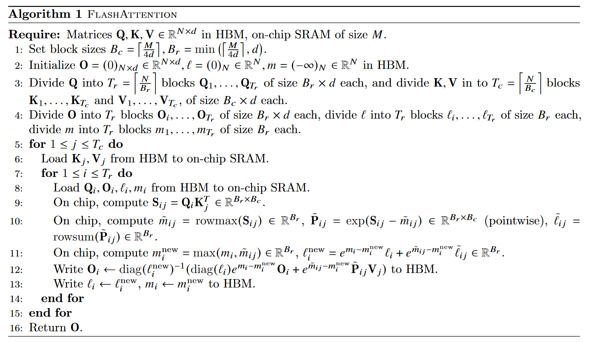

# Blogs

- [flashattention 1 vs 2](https://zhuanlan.zhihu.com/p/692038399) 

# 1 Flash Attention

https://arxiv.org/pdf/2205.14135

## Keywords

* Fast
* Memory-Efficient
* IO-Awareness

## 1.1 Overview

* Problem: **Long Sequences**
  * time/memory complexity
* Relative Work
  * drawback: trading off model quality
  * status: not achieve wall-clock speedup
* Solution
  * **Principle: making attention algorithms IO-aware**
    * accounting for reads and writes between levels of GPU memory
  * **Method: Tailing**
    * **reduce** the number of memory reads/writes between GPU high bandwidth memory (**HBM**) and GPU on-chip SRAM
  * Extension
    * Block-sparse Attention

## 1.2 Background

* GPU Memory Hierarchy/ Execution Model
* Performance characteristics
  * Compute-bound
    * matrix multiply with large inner dimension
    * convolution with large number of channels
  * Memory-bound
    * elementwise (e.g., activation, dropout)
    * reduction (e.g., sum, softmax, batch norm, layer norm)
  * Kernel fusion
    * definition
      * if there are multiple operations applied to the same input, the input can be loaded once from HBM, instead of multiple times for each operation
    * limitation
      * in the context of model training, the intermediate values still need to be written to HBM to save for the backward pass, reducing the effectiveness of naive kernel fusion

## 1.3 Implementation

- Tiling + Recomputation

  

# 2 Flash Attention v2

FlashAttention-2: Faster Attention with Better Parallelism and Work Partitioning

https://arxiv.org/pdf/2307.08691
