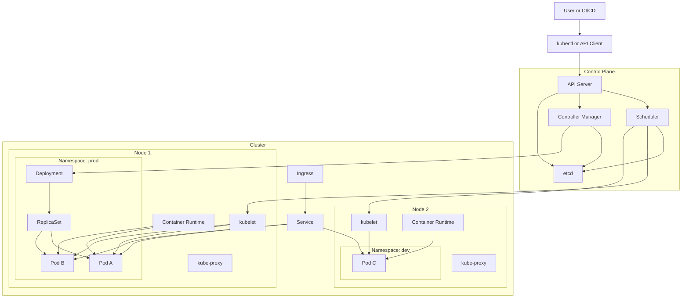

# Kubernetes 核心概念概览指南

这份文档不是命令速查，而是一个 Kubernetes 概念地图，帮助你先建立整体框架，再去理解 `kubectl`、部署流程和排障路径。

如果把 Kubernetes 看成一个分布式操作系统，那么它主要解决三类问题：

- 如何在一组机器上运行容器化应用。
- 如何让应用具备弹性伸缩、自愈、发布和服务发现能力。
- 如何把资源隔离、权限控制和流量入口统一起来。

## 1. 先看整体：Kubernetes 架构图

这张图表达的是 Kubernetes 的主线：

- 用户通过 `kubectl` 或 CI/CD 系统把期望状态提交给 API Server。
- Control Plane 负责记录、调度、协调和纠偏。
- 工作节点 Node 负责真正运行 Pod。
- 流量通常从 Ingress 进入，再转到 Service，最终落到 Pod。
- Namespace 用来做逻辑隔离，Node 用来承载实际工作负载。

## 2. 用一句话理解 Kubernetes

Kubernetes 的核心思想不是“执行命令”，而是“声明期望状态，然后由控制器不断把现实状态拉回期望状态”。

例如你声明：

- 我要 3 个 Pod。
- 我要它们暴露成一个 Service。
- 我要从外部通过域名访问它。

Kubernetes 会持续检查当前状态是否满足这些条件，不满足就自动调度、重建、替换或回滚。

## 3. 最重要的概念分层

理解 Kubernetes，建议按下面这三层来记。

### 3.1 物理和基础设施层

- `Cluster`：一个 Kubernetes 集群，是所有资源和节点的整体。
- `Node`：集群中的一台机器，可以是虚拟机或物理机，负责真正运行 Pod。
- `Container Runtime`：例如 containerd，负责拉镜像、启动容器、停止容器。

### 3.2 集群控制层

- `API Server`：集群统一入口，所有操作最终都要经过它。
- `etcd`：保存集群状态的键值数据库。
- `Scheduler`：决定 Pod 应该被调度到哪个 Node 上。
- `Controller Manager`：运行各种控制器，持续把当前状态修正为目标状态。
- `kubelet`：运行在每个 Node 上，负责把该节点上的 Pod 真实拉起来。
- `kube-proxy`：处理 Service 转发和集群网络规则。

### 3.3 应用对象层

- `Namespace`：资源逻辑隔离边界。
- `Pod`：Kubernetes 中最小的调度单元，通常承载一个或多个容器。
- `Deployment`：管理无状态应用的发布和滚动升级。
- `ReplicaSet`：保证指定数量的 Pod 副本持续存在。
- `Service`：为一组 Pod 提供稳定访问入口。
- `Ingress`：把集群外的 HTTP/HTTPS 请求路由到集群内部 Service。
- `ConfigMap`：保存普通配置。
- `Secret`：保存敏感信息。
- `Volume`：为 Pod 提供持久或共享存储。

## 4. 必须理解的几个核心对象

## 4.1 Namespace

`Namespace` 不是物理隔离，而是逻辑隔离。它最常用于：

- 区分环境，例如 `dev`、`test`、`prod`。
- 区分团队或项目。
- 配合 RBAC、ResourceQuota 做权限和资源限制。

可以把它理解成“集群里的项目空间”。很多资源名称在不同 namespace 中可以重复。

典型例子：

- `prod` namespace 里有一个 `web` Deployment。
- `dev` namespace 里也可以有一个同名的 `web` Deployment。

## 4.2 Node

`Node` 是集群里的工作机器。Pod 最终必须运行在某个 Node 上。

Node 上通常有几个关键组件：

- `kubelet`：接收控制面的指令并启动 Pod。
- `kube-proxy`：维护 Service 访问规则。
- `containerd` 等运行时：真正管理容器生命周期。

Node 关注的是“算力和承载”，例如：

- CPU、内存是否够。
- 是否有 GPU。
- 是否带有某些标签。
- 是否允许被调度。

## 4.3 Pod

`Pod` 是 Kubernetes 最小的调度和部署单位，不是容器本身，但它通常包裹一个或多个紧密协作的容器。

Pod 的关键特点：

- Pod 内的容器共享网络命名空间。
- Pod 内的容器可以通过 localhost 通信。
- Pod 有自己的 IP，但这个 IP 通常不稳定。
- Pod 是易失的，坏了就重建，不是手工长期维护对象。

实际理解时可以近似认为：

- 容器是进程。
- Pod 是这组进程的运行上下文。

## 4.4 Deployment

`Deployment` 是最常见的应用发布对象，适用于无状态服务。

它不直接创建 Pod，而是通过 `ReplicaSet` 管理 Pod。它的主要作用：

- 指定镜像版本。
- 指定副本数。
- 执行滚动升级。
- 支持回滚。

常见关系是：

`Deployment -> ReplicaSet -> Pod`

## 4.5 Service

Pod 会重建，IP 会变，所以不能直接把 Pod IP 当作稳定服务地址。

`Service` 的作用就是给一组符合 label 条件的 Pod 提供一个稳定入口。

它通常负责：

- 服务发现。
- 负载均衡。
- 屏蔽后端 Pod 的动态变化。

你可以把它理解成“集群内的稳定虚拟服务地址”。

## 4.6 Ingress

`Ingress` 主要解决“如何从集群外访问集群内 HTTP/HTTPS 服务”的问题。

它通常定义：

- 域名。
- 路径路由规则。
- TLS 证书终止。
- 把哪类请求转发给哪个 Service。

需要注意：

- Ingress 本身只是规则对象。
- 真正执行这些路由规则的是 Ingress Controller，例如 NGINX Ingress Controller。

可以把关系简单理解成：

`外部请求 -> Ingress -> Service -> Pod`

## 5. 这些概念之间到底是什么关系

这是理解 Kubernetes 的关键部分。

### 5.1 从部署角度看

一次典型部署路径：

1. 你创建一个 Deployment。
2. Deployment 创建 ReplicaSet。
3. ReplicaSet 创建多个 Pod。
4. Scheduler 为 Pod 选择 Node。
5. 目标 Node 上的 kubelet 启动 Pod。

所以：

- Deployment 负责应用版本和副本管理。
- Pod 负责实际运行。
- Node 负责承载运行。

### 5.2 从访问流量角度看

一次典型访问路径：

1. 用户访问域名，例如 `app.example.com`。
2. 请求进入 Ingress Controller。
3. Ingress 规则把请求转给某个 Service。
4. Service 再把流量转发到后端某个 Pod。

所以：

- Ingress 面向集群外部入口。
- Service 面向集群内部稳定访问。
- Pod 是真正处理业务逻辑的地方。

### 5.3 从资源隔离角度看

Namespace 贯穿大多数对象：

- Pod 属于某个 Namespace。
- Service 属于某个 Namespace。
- Deployment 属于某个 Namespace。
- Ingress 通常也属于某个 Namespace。

但 Node 不属于某个 Namespace。Node 是集群级资源。

这是很多初学者容易混淆的一点：

- `Namespace` 是逻辑隔离域。
- `Node` 是物理或虚拟机器资源。

## 6. 控制面和数据面的区别

可以用这个方法快速记忆：

- `Control Plane` 负责“决策和协调”。
- `Data Plane` 负责“实际运行和转发”。

通常来说：

- API Server、Scheduler、Controller Manager、etcd 属于控制面。
- Node、kubelet、kube-proxy、容器运行时、Pod 属于工作运行面。

这也是为什么控制面异常时会影响调度和管理，而节点异常时更直接影响业务实例运行。

## 7. 一张简化心智图

如果你只想记住最主干的关系，可以记这一串：

`Namespace` 用来分组资源。

`Deployment` 管理应用副本和升级。

`Pod` 是应用真正运行的最小单元。

`Node` 是 Pod 最终运行的机器。

`Service` 给 Pod 提供稳定访问地址。

`Ingress` 把集群外流量导入到 Service。

## 8. 初学者最容易混淆的点

### 8.1 Pod 和 Container 不是一回事

- Container 是运行进程的镜像实例。
- Pod 是 Kubernetes 调度的最小单位。
- 一个 Pod 可以有一个容器，也可以有多个容器。

### 8.2 Service 不是 Pod

- Pod 会变，Service 尽量保持稳定。
- Service 不处理业务逻辑，只做稳定访问抽象和转发。

### 8.3 Ingress 不是四层负载均衡器本体

- Ingress 是规则定义。
- Ingress Controller 才是实际处理七层流量的实现。

### 8.4 Namespace 不是 Node 分区

- Namespace 不是把机器切开。
- 同一个 Node 上可以同时运行多个不同 Namespace 的 Pod。

## 9. 一个最小业务示例

假设你部署一个 Web 应用：

- 这个应用放在 `prod` namespace。
- 你创建一个 `web` Deployment，副本数 3。
- 这 3 个 Pod 可能被调度到 2 台不同 Node 上。
- 你创建一个 `web` Service，把流量稳定转发到这 3 个 Pod。
- 你创建一个 Ingress，把 `www.example.com` 路由到 `web` Service。

这时：

- Namespace 解决环境和资源隔离。
- Node 提供承载能力。
- Pod 运行你的容器。
- Service 提供稳定入口。
- Ingress 暴露外部访问路径。

## 10. 学习顺序建议

如果你刚开始接触 Kubernetes，建议按这个顺序理解：

1. 先理解 Pod、Node、Namespace。
2. 再理解 Deployment、ReplicaSet、Service。
3. 然后理解 Ingress、ConfigMap、Secret、Volume。
4. 最后再深入调度、网络、存储、权限和控制器原理。

这个顺序更符合实际使用路径，因为大多数人第一次排障和发布应用，最先碰到的就是这些对象。

## 11. 与终端命令文档配合阅读

如果你要把这些概念和实际操作结合起来，可以继续看命令速查文档：

- [Kubernetes 终端交互常用命令指南](./quickstart.md)

推荐的结合方式是：

- 先用这篇文档建立对象关系。
- 再回到命令文档，用 `get`、`describe`、`logs`、`exec` 去观察这些对象在真实集群中的状态。