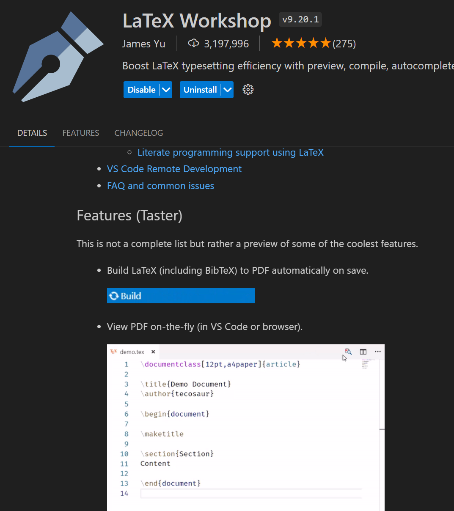

# Quickstart Latex on windows

## 1 Install MikTex

- https://mg.readthedocs.io/latexmk.html#installation
- https://miktex.org/download
- https://miktex.org/howto/install-miktex


```
download pkg from page, install as guided
```

# 2 Install Perl

https://strawberryperl.com/

```
download pkg.msi, install as guided
```

# 2 Install Vscode Extention


