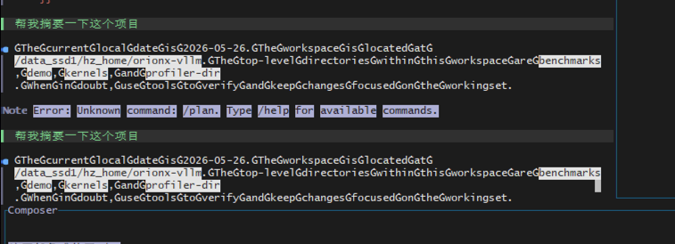
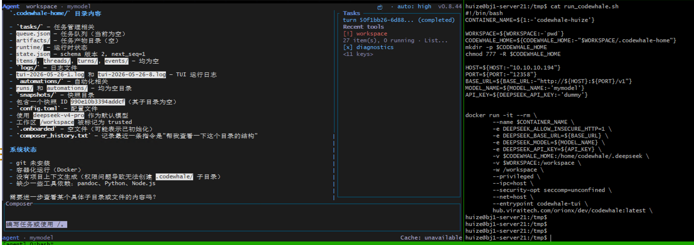

# CodeWhale + Deepseek
self-host deepseek api for codewhale
## Trail-1
### 1.1 model api
```
- [x] deepseek-coder-v2-lite-instruct
    - vllm ... --enable-auto-tool-choice --tool-call-parser deepseek_v3
```

### 1.2 deploy codewhale

```bash
docker volume create codewhale-home

docker run --rm -it \
  -e DEEPSEEK_API_KEY="$DEEPSEEK_API_KEY" \
  -v codewhale-home:/home/codewhale/.deepseek \
  -v "$PWD:/workspace" \
  -w /workspace \
  ghcr.io/hmbown/codewhale:latest
```

- deploy codewhale with local api service
    - https://github.com/Hmbown/CodeWhale/issues/574
```bash
export DEEPSEEK_BASE_URL=http://172.24.1.43:8005/v1
export DEEPSEEK_MODEL=VLLM-MODEL
export DEEPSEEK_API_KEY=dummy
export DEEPSEEK_ALLOW_INSECURE_HTTP=1
deepseek-tui
```

### 1.3 test record


- not working!
    - model tool call parser not relavent to model/request

## Trail-2
### 2.1 model api
```
- [o] qwen3-coder-next
    - vllm ... --enable-auto-tool-choice --tool-call-parser qwen3_coder
```

### 2.2 deploy codewhale
- same to 1.2 codewhale

### 2.3 test record


- test okay


## Trail-3
### 3.1 model api
```
- [] Deepseek-V4-Flash
    - vllm ... --enable-auto-tool-choice --tool-call-parser deepseek_v4 --kv-cache-dtype fp8 
    - resouce consumption: 
        - model weights: 148.66G 
        - --max-model-len 1048576
        - H20-96G x 4 -> 6x max concurrency
```
### 3.2 deploy codewhale
- same to 1.2 codewhale

### 3.3 test record
- test okay