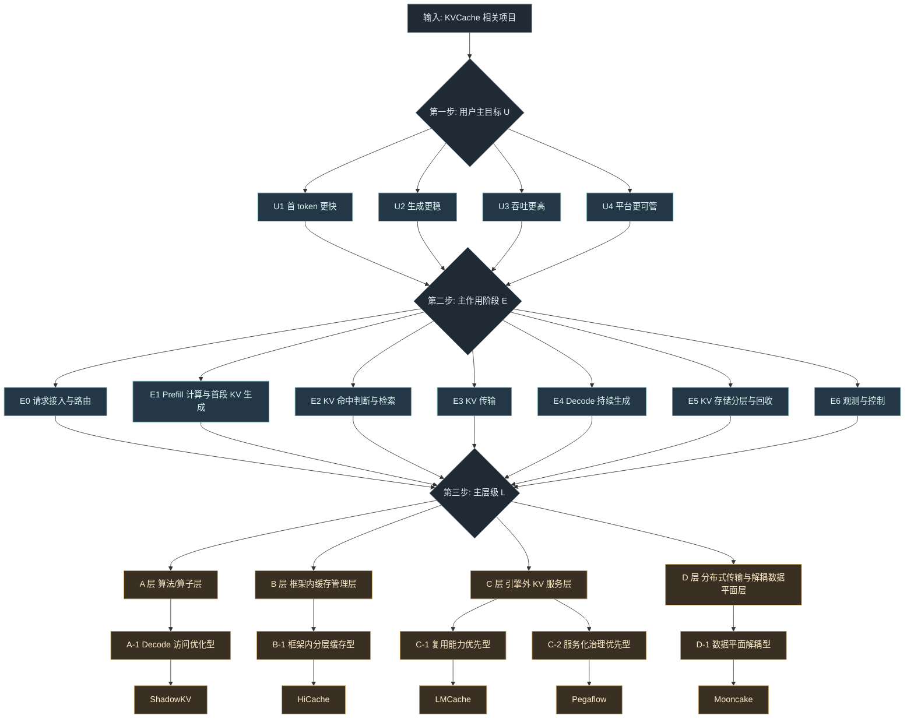

# KVCache Architecture 统一分类标准

> 目标：解决“分类维度混用导致匹配不上”的问题。  
> 原则：先按用户交互逻辑划分，再按执行流程定位，最后再做项目层级归并。  
> 约束：次级分类只用于同层级内能力细分，不改变主层级归属。

---

## 0. 分类总览图

图示规则：
1. 主层级只允许唯一归属（A/B/C/D 只能选一个）。
2. 次级分类只在同层内部细分，不用于跨层重排。
3. 若项目覆盖多个目标或阶段，仅保留一个主目标和一个主阶段，其他标记为次作用。

---

## 1. 分类总原则（先后顺序）

统一采用三段式：

1. 用户交互逻辑（User Intent）
- 用户最先感知的是 TTFT、稳定性、吞吐、成本和可运维性。
- 所以第一步按“用户想解决什么问题”分类，而不是按实现技术名词分类。

2. 执行流程位置（Execution Stage）
- 明确一个项目主要作用在请求链路的哪个阶段。
- 只记录“主作用阶段”，避免一个项目被多处重复归类。

3. 项目层级分层（Project Layer）
- 用 A/B/C/D 表示系统定位（主层级，唯一归属）。
- 用次级分类表示同层项目差异（可多标签，但不改主层）。

---

## 2. 用户交互逻辑分组（第一优先）

从用户视角，KVCache 相关诉求可归并为 4 类：

1. `U1 首 token 更快`（TTFT 导向）
- 典型场景：长前缀、多轮对话、RAG 命中。

2. `U2 生成更稳`（TPOT/ITL 尾延迟导向）
- 典型场景：在线 API、SLA 严格、并发波动大。

3. `U3 吞吐更高`（资源利用率导向）
- 典型场景：批量推理、服务密度提升、成本优化。

4. `U4 平台更可管`（运维与演进导向）
- 典型场景：多机多卡、跨节点、独立扩缩容、可观测闭环。

说明：一个项目可覆盖多个 U 目标，但必须标注“主目标”。

---

## 3. 执行流程分段（第二优先）

将一次请求的 KV 相关执行流程抽象为 E0-E6：

1. `E0 请求接入与路由`
- 网关、Router、Proxy，决定请求发往哪类节点。

2. `E1 Prefill 计算与首段 KV 生成`
- Prompt 处理、初始 KV 产生。

3. `E2 KV 命中判断与检索`
- Prefix 匹配、索引查询、块级定位。

4. `E3 KV 传输`
- NIXL/RDMA/IPC 等跨进程或跨节点迁移。

5. `E4 Decode 持续生成`
- token-by-token 阶段，关注 TPOT/ITL。

6. `E5 KV 存储分层与回收`
- GPU/CPU/SSD/对象存储，多层缓存与淘汰。

7. `E6 观测与控制`
- 指标、追踪、元数据、服务发现、治理策略。

分类规则：
- 每个项目只标注一个“主作用阶段”。
- 其他阶段仅记录为“次作用阶段”。

---

## 4. 项目主层级（第三优先，唯一归属）

### 4.1 A/B/C/D 定义

1. `A 层：算法/算子层`
- 以注意力访问、算子路径、推理内核策略为核心。

2. `B 层：框架内缓存管理层`
- 在推理框架内部做 KV 复用、分层、调度协同。

3. `C 层：引擎外 KV 服务层`
- 通过 connector/sidecar/service 形成独立 KV 能力层。

4. `D 层：分布式传输与解耦数据平面层`
- 以跨节点高性能传输、P/D 解耦、数据平面治理为核心。

### 4.2 当前项目主层级归并（唯一）

1. ShadowKV -> A
2. HiCache -> B
3. LMCache -> C
4. Pegaflow -> C
5. Mooncake -> D

---

## 5. 次级分类（仅用于同层细分）

注意：次级分类只能在同一主层内部做对比，不能跨层重排。

### 5.1 A 层次级分类

1. `A-1 Decode 访问优化型`
- 代表：ShadowKV
- 关注点：长上下文 decode 的访存与计算路径优化。

### 5.2 B 层次级分类

1. `B-1 框架内分层缓存型`
- 代表：HiCache
- 关注点：框架内命中率、复用策略、局部调度协同。

### 5.3 C 层次级分类（重点）

1. `C-1 复用能力优先型`
- 代表：LMCache
- 关注点：connector + 多层存储 + 跨实例 KV 复用收益。

2. `C-2 服务化治理优先型`
- 代表：Pegaflow
- 关注点：sidecar/server 形态、RDMA 路径、观测与控制面延展。

### 5.4 D 层次级分类

1. `D-1 数据平面解耦型`
- 代表：Mooncake
- 关注点：PD/xPyD、高性能传输平面、跨节点扩展上限。

---

## 6. 最终归并总表（可直接复用）

| 项目 | 主层级 | 次级分类 | 用户主目标 | 主作用阶段 | 次作用阶段 | 备注 |
|---|---|---|---|---|---|---|
| ShadowKV | A | A-1 Decode 访问优化型 | U1/U3 | E4 | E5 | 偏算法增益，不是完整平台层 |
| HiCache | B | B-1 框架内分层缓存型 | U1/U3 | E2 | E5 | 框架绑定更强，平台外延有限 |
| LMCache | C | C-1 复用能力优先型 | U1/U3 | E5 | E2/E3 | 强在复用与分层缓存 |
| Pegaflow | C | C-2 服务化治理优先型 | U2/U4 | E5 | E3/E6 | 强在服务化数据层与治理能力 |
| Mooncake | D | D-1 数据平面解耦型 | U2/U4 | E3 | E0/E6 | 强在解耦与跨节点传输平面 |

---

## 7. 使用说明（避免再次混乱）

后续新增项目时，按下面 4 步落位：

1. 先判断用户主目标（U1-U4）。
2. 再确定主作用阶段（E0-E6 只能选一个主阶段）。
3. 再确定主层级（A/B/C/D 只能选一个）。
4. 最后在同层里选次级分类（A-1/B-1/C-1/C-2/D-1）。

禁止做法：

1. 用技术关键词直接决定层级（会忽略用户价值链）。
2. 一个项目同时放进多个主层级（会导致归并失真）。
3. 把次级分类当主层级使用（会导致“同层不可比”）。

---

## 8. 与现有文档的对齐建议

建议将以下文档统一引用本标准：

1. `kvcache_arena.md`：保留 A/B/C/D 主层展示，补充“按 U/E/L 的判定口径”。
2. `kvcache_arena.html`：在项目归属表里显示“用户主目标 + 主作用阶段”。
3. `lmcache_vs_pegaflow.md`：在 C 层内按 C-1/C-2 比较，不再跨层比较。

这样可以保证：
- 对外展示时口径统一。
- 对内评审时结论可追溯。
- 新项目加入时不需要重写分类体系。

