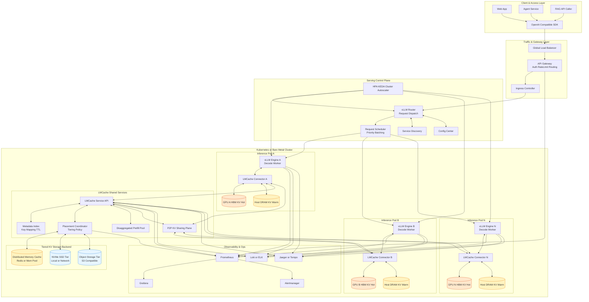

# LMCache 项目摘要

- Project Link: https://github.com/LMCache/LMCache/
- Docs: https://docs.lmcache.ai/

## 一句话摘要

LMCache 是一个面向推理引擎的 KV Cache 基础层（cache layer），核心目标是降低 TTFT、提升长上下文场景吞吐，并支持跨实例复用可重用文本的 KV（不局限于严格前缀命中）。

## LMCache 在做什么

从官方定位看，LMCache 更像是“LLM Serving 的 KV 数据层与加速层”，而不是单独的推理引擎。

它重点提供：

1. KV Cache 分层存储与卸载
- 支持 CPU、Disk 等多级后端。
- 面向长上下文场景缓解 GPU 显存压力。

2. 引擎集成能力
- 与 vLLM（尤其 v1 生态）深度集成。
- 支持与 SGLang 的 KV offloading 集成。

3. 跨实例 KV 共享
- 支持多个 serving 实例之间共享可复用 KV。
- 适合多副本部署下减少重复 prefill。

4. 面向性能的传输路径优化
- 包含零拷贝、GDS、NIXL 等加速能力（依赖部署环境）。
- 目标是把 KV 传输和恢复成本压低。

## 功能边界（做什么 / 不做什么）

### 做什么

1. 做 KV 生命周期管理
- 包括缓存、卸载、回填、跨实例复用等。

2. 做 KV 数据路径优化
- 围绕 TTFT、GPU 周期利用率、长上下文吞吐进行系统优化。

3. 作为中间层接入现有 serving engine
- 通过配置和插件方式接入，不要求重写模型。

### 不做什么

1. 不替代推理引擎本身
- LMCache 不是 vLLM/SGLang 的替代品，仍需要底层引擎完成调度与解码。

2. 不直接提升模型能力
- 不改变模型参数、推理精度或知识边界，核心是系统性能优化。

3. 不等价于完整“LLM 平台”
- 认证、业务编排、应用层治理、审计等平台能力不在其核心职责内。

4. 对环境有要求
- 官方主路径偏 Linux + NVIDIA GPU 生态，具体特性受硬件与依赖版本约束。

## LMCache 重点关注的场景

1. 多轮对话（会话上下文重复）
- 同一会话反复带上历史，KV 复用收益高。

2. RAG 与知识问答
- 固定或高频知识片段反复被检索与拼接，缓存命中概率高。

3. 多实例 / 多副本在线服务
- 同模型多实例部署时，跨实例共享 KV 可以减少重复 prefill。

4. 长上下文推理
- context 越长，prefill 成本越高，缓存命中带来的 TTFT 改善越明显。

## 项目擅长的特点

1. 工程可落地性强
- 不是纯论文方案，提供文档、示例、容器化路径与社区实践。

2. 生态适配度高
- 与主流开源 serving 生态联动紧密（尤其 vLLM 方向）。

3. 数据路径优化深入
- 不只“存 KV”，还关注跨层存储、传输路径和实例协同。

4. 业务价值明确
- 典型收益体现在 TTFT 下降、GPU 重复计算减少、单位资源吞吐提升。

## 选型时的注意点

1. 业务是否有“可复用上下文”
- 如果请求几乎都完全随机且复用率低，收益会被稀释。

2. 关注端到端而非单点指标
- 需要同时看 TTFT、TBT、吞吐、尾延迟和稳定性。

3. 评估存储后端与网络拓扑
- Disk/CPU/远端共享层的带宽和延迟决定实际收益上限。

4. 引擎和依赖版本匹配
- 与 vLLM、Torch、CUDA 等版本需严格对齐，避免集成摩擦。

## 一个实用判断

如果你的服务满足“长上下文 + 高复用 + 多实例”三者中的至少两个，LMCache 往往值得优先评估；
如果是“短上下文 + 低复用 + 单实例”，则应先验证收益再决定是否引入。

## LMCache + vLLM 完整态部署架构图

