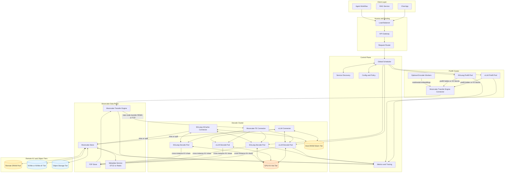

# Mooncake 项目摘要

- Project Link: https://github.com/kvcache-ai/Mooncake
- Docs: https://kvcache-ai.github.io/Mooncake/
- Paper (FAST'25): https://www.usenix.org/system/files/fast25-qin.pdf

## 一句话摘要

Mooncake 是一个以 KVCache 为中心的解耦式 LLM Serving 架构与基础设施项目，核心目标是把 Prefill 与 Decode 分离、把 KV 从单机显存扩展到分布式池化存储，并通过高性能传输平面提升长上下文场景下的吞吐与时延表现。

## Mooncake 在做什么

从官方定位看，Mooncake 是“KVCache-centric 的分布式推理底座”，不是单一算法优化点。

它重点提供：

1. KVCache-centric 解耦架构
- 支持 Prefill/Decode 解耦（PD 或 xPyD 场景）。
- 将 KV 管理从“本地显存问题”升级为“跨节点资源编排问题”。

2. 高性能传输内核（Transfer Engine, TE）
- 统一 DRAM/VRAM/NVMe 等数据传输接口。
- 支持 TCP、RDMA、NVMe-oF、CXL、EFA 及多种异构加速器路径。
- 强调拓扑感知路径选择、多网卡带宽聚合、失败路径回退。

3. 两类存储/共享组件
- P2P Store: 面向临时对象（如 checkpoint）跨节点快速分发。
- Mooncake Store: 面向分布式 KVCache 池化与多副本访问。

4. 生态集成
- 与 vLLM、SGLang、LMCache、TensorRT-LLM 等生态有对接。
- 在多引擎解耦推理与分层缓存场景中充当远端 KV 或传输后端。

## 功能边界（做什么 / 不做什么）

### 做什么

1. 做“跨节点 KV 与张量数据平面”
- 把跨设备、跨主机的数据搬运做成可复用能力层。

2. 做“分布式 KVCache 池化”
- 通过 Mooncake Store 支持远端 KV 管理、多副本与并行 I/O。

3. 做“解耦推理架构支撑”
- 为 Prefill/Decode 分离、层级缓存、跨实例共享提供底层能力。

### 不做什么

1. 不替代上层推理引擎
- 不是 vLLM/SGLang 的替代，仍需上层负责请求调度、采样与执行。

2. 不直接提升模型能力
- 不改变模型参数、知识边界与任务能力，重点是系统性能与扩展性。

3. 不是“开箱即用的全托管平台”
- 对网络与系统环境要求较高，尤其在 RDMA/多网卡/异构硬件场景。

4. 不是所有场景都能显著收益
- 在短上下文、低复用、单机单卡下，复杂度可能大于收益。

## Mooncake 重点关注的场景

1. 长上下文在线推理
- Prefill 成本高，KV 远端化与复用可明显减少重复计算。

2. 大规模分布式部署
- 多机多卡、多副本、多租户服务中，数据平面成为瓶颈。

3. Prefill/Decode 解耦服务
- 需要跨节点传递 KV 或中间张量，默认通信栈（如纯 TCP）不够高效。

4. 多模态或专家并行等复杂拓扑
- 需要弹性、容错与高吞吐的跨节点张量流转能力。

## 项目擅长的特点

1. 数据平面能力强
- 传输引擎能力完整，覆盖多协议、多硬件与拓扑感知优化。

2. 面向生产级高负载
- 公开信息显示其在大规模生产推理中有落地验证。

3. 架构级扩展性
- 不是仅优化某一段内核，而是支撑整套“解耦 + 分层缓存 + 跨实例共享”路径。

4. 生态连接面广
- 与主流推理框架和缓存系统均有对接，适合作为“底层传输和远端 KV 能力层”。

## 选型时的注意点

1. 先判断是否需要“跨节点 KV/张量传输”
- 如果主要是单机推理，Mooncake 的优势难以完全发挥。

2. 评估网络与硬件条件
- Mooncake 支持 TCP，但高收益通常依赖 RDMA 与合适的系统配置。

3. 关注运维复杂度
- 涉及协议栈、元数据服务、存储层和多组件联动，建议分阶段引入。

4. 与上层引擎协同验证
- 重点看端到端指标：TTFT、吞吐、尾延迟、稳定性，而非只看带宽峰值。

## 一个实用判断

如果你的系统满足“长上下文 + 多机多卡 + 解耦推理/跨实例 KV 共享”中的至少两个，Mooncake 往往值得优先评估；
如果是“单机为主 + 请求复用低 + 网络普通 TCP-only”，建议先小规模 PoC 验证收益再决策。

## Mooncake + vLLM/SGLang 部署架构图

