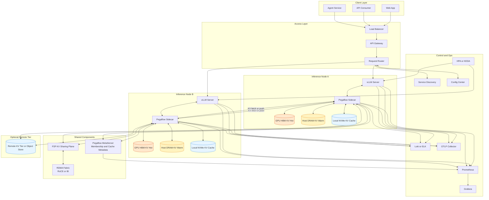

# Pegaflow 项目摘要

- Project Link: https://github.com/novitalabs/pegaflow
- Docs: https://github.com/novitalabs/pegaflow/tree/master/docs
- PyPI: https://pypi.org/project/pegaflow-llm/

## 一句话摘要

Pegaflow 是一个面向 LLM 推理的高性能 KV 缓存存储引擎，以独立 sidecar 方式提供 GPU KV offload、SSD 缓存与跨节点 RDMA 共享能力，核心目标是降低 TTFT 并提升多实例复用效率。

## Pegaflow 在做什么

从官方 README 看，Pegaflow 更像是“KV 数据层与传输层”，不是推理执行引擎本身。

它重点提供：

1. KV offload 与分层缓存
- 将 KV 从 GPU 卸载到主机内存或 SSD。
- 支持冷热分层，降低显存压力。

2. 跨节点 KV 共享
- 基于 RDMA 做节点间 KV 传输与复用。
- 面向多实例部署减少重复 prefill 成本。

3. 独立生命周期与可插拔接入
- 作为独立服务运行，和推理进程解耦。
- 当前对 vLLM 提供 drop-in connector。

4. 传输与系统优化
- NUMA 感知 pinned memory + layer-wise DMA。
- 强调接近 PCIe 带宽上限的数据路径利用。

5. 可观测性
- 内置 Prometheus 与 OTLP 指标导出。

## 功能边界（做什么 / 不做什么）

### 做什么

1. 做 KV 生命周期与存储管理
- 包含保存、回填、跨请求复用、跨节点共享。

2. 做 KV 数据平面加速
- 优化本地与跨节点 KV 传输路径。

3. 作为中间层增强现有推理框架
- 在不改模型的前提下提升缓存复用收益。

### 不做什么

1. 不替代推理引擎
- 不是 vLLM/SGLang 的替代，推理调度与解码仍由上层引擎负责。

2. 不直接提升模型能力
- 不改变模型质量上限，主要优化系统性能与资源效率。

3. 不是完整平台产品
- 鉴权、编排、业务治理与多租户策略不在核心职责内。

4. 依赖系统环境质量
- 高收益路径通常依赖 RDMA、NUMA、驱动和版本对齐。

## Pegaflow 重点关注的场景

1. 长上下文与高复用请求
- 同类上下文重复出现时，warm path 能显著降低 TTFT。

2. 多实例推理服务
- 需要 KV 在实例间共享，减少重复 prefill。

3. 显存紧张的在线服务
- 通过 host/SSD 分层扩展有效 KV 容量。

4. 追求可观测与可运维的数据层
- 希望对缓存命中、传输、分层命中进行指标化管理。

## 项目擅长的特点

1. Sidecar 解耦架构
- 缓存层可独立扩缩容，且引擎重启后 KV 可继续复用。

2. 工程实现偏生产化
- Rust 核心、无 GIL 热路径、指标体系完整。

3. vLLM 接入路径清晰
- Quick Start 提供可直接运行的连接配置。

4. Warm 路径收益明确
- 官方基准示例显示 warm TTFT 相对 cold 明显下降。

## 选型时的注意点

1. 优先评估 warm-hit 率
- 如果上下文复用率低，收益会被显著稀释。

2. 评估基础设施成熟度
- RDMA、NUMA、内存与存储调优能力会直接影响结果。

3. 先做端到端对比
- 建议同时看 TTFT、p99、吞吐与资源占用，而非只看单一平均值。

4. 框架兼容性按版本确认
- 官方当前“ready”状态以 vLLM 为主，其他框架需结合最新文档和分支验证。

## 一个实用判断

如果你的业务满足“长上下文 + 高复用 + 多实例服务”中的至少两个，Pegaflow 值得优先 PoC；
如果主要是短上下文、低复用、单实例部署，建议先小规模压测再决定是否引入。

## Pegaflow 部署架构图

