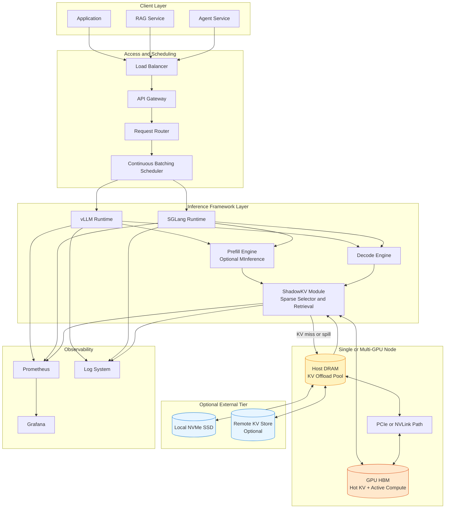

# ShadowKV 项目摘要

- Project Link: https://github.com/ByteDance-Seed/ShadowKV
- Paper: https://arxiv.org/abs/2410.21465
- Blog: https://bytedance-seed.github.io/ShadowKV/

## 一句话摘要

ShadowKV 是一种 training-free 的长上下文推理方案，通过稀疏选择 + CPU 侧 KV 存储与按需回取来降低显存压力与解码开销，目标是在保持精度的前提下提升长上下文吞吐。

## ShadowKV 在做什么

从项目与论文定位看，ShadowKV 更偏“推理时 KV 管理算法 + 系统实现”，不是完整 serving 平台。

它重点提供：

1. 稀疏化的 KV 访问机制
- 在解码时只选择关键 KV 子集参与注意力。
- 通过可控的 sparse budget 平衡速度与精度。

2. CPU-Offload 友好的 KV 管理
- 通过主机侧缓存与按需拉取减少 GPU 常驻 KV 体积。
- 面向超长 context 下降低显存瓶颈。

3. 与预填充加速方案兼容
- 官方明确支持与 MInference 叠加。
- 适合“prefill 加速 + decode 稀疏”组合优化路径。

4. 研究复现实验代码
- 提供 RULER 等精度评测与端到端效率脚本。
- 支持多种长上下文模型进行验证。

## 功能边界（做什么 / 不做什么）

### 做什么

1. 做长上下文解码阶段的 KV 计算与访问优化
- 重点提升 decode 阶段效率，减少不必要的 KV 参与。

2. 做 KV 的显存外扩（CPU 维度）
- 在不依赖训练改造的前提下支持更长上下文推理。

3. 做研究与工程验证
- 提供可复现脚本、参数和评测流程。

### 不做什么

1. 不替代完整推理框架
- 不是 vLLM/SGLang/LMDeploy 的全功能替代。

2. 不提供完整分布式 KV 平台能力
- 官方仓库重点在算法与单机/实验复现，不是 Mooncake/LMCache 那种平台级数据层。

3. 不改变模型能力边界
- 不提升模型知识或推理能力，核心是系统效率与资源利用率。

4. 非“零运维开箱平台”
- 对环境依赖较多（CUDA、flash-attn、flashinfer、内核编译等），更偏研究工程栈。

## ShadowKV 重点关注的场景

1. 长上下文问答与检索增强
- 输入非常长，full attention 代价高。

2. 显存受限但希望保精度
- 不希望激进压缩 KV 到明显影响结果。

3. 已有预填充优化链路
- 可叠加 MInference 等 prefill 优化，组合提升整体时延。

4. 研究型或性能验证型团队
- 需要可复现、可调参、可对比 full attention 的实验路径。

## 项目擅长的特点

1. Training-free
- 不依赖再训练或蒸馏，工程接入门槛相对低于训练改造方案。

2. 长上下文导向明确
- 设计目标就是高吞吐长上下文推理。

3. 与现有 prefill 加速可协同
- 对现实系统更实用，能形成组合优化。

4. 学术与工程结合
- ICML 2025 Spotlight，且有完整代码与评测脚本。

## 选型时的注意点

1. 先确认业务是否“长上下文高占比”
- 如果多数请求是短文本，收益会明显下降。

2. 建立精度-性能联合评估
- 不要只看吞吐，需同时跟踪任务质量指标。

3. 评估环境复杂度
- 依赖较多，建议容器化并固定版本。

4. 与 serving 框架的集成方式要提前设计
- 在 vLLM/SGLang 中通常作为“注意力与 KV 管理插件层”接入。

## 一个实用判断

如果你的服务满足“长上下文 + 显存压力大 + 可接受稀疏近似”三者中的至少两个，ShadowKV 值得优先 PoC；
如果业务以短上下文为主或对每个 token 都极端精确敏感，应先小流量验证再逐步放量。

## ShadowKV 集成推理框架部署架构图

