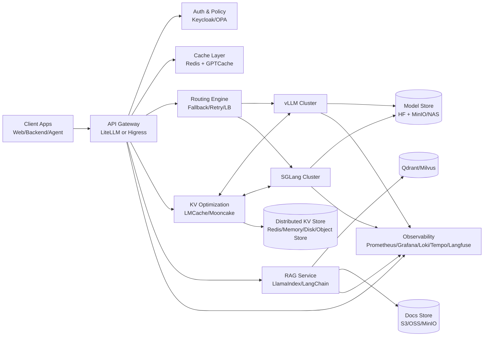

# 基于开源项目的可部署 MaaS 架构（参考实现）

> 基于 [maas_features.md](maas_features.md) 的 11 类能力，整理一套可实际落地、可演进的开源 MaaS 架构。
>
> 目标：先可用，再扩展，最终支持多模型、多租户、可观测、可治理。

---

## 1. 设计目标

1. **统一入口**：对外只暴露一套 OpenAI 兼容 API。
2. **可替换推理后端**：vLLM/SGLang/TGI 可并存。
3. **生产可观测**：指标、日志、链路追踪、成本统计可闭环。
4. **安全可治理**：鉴权、限流、内容审核、审计日志。
5. **低门槛上线**：支持单机起步，平滑升级到 K8s 多节点。

---

## 2. 参考技术栈（全开源优先）

| 能力层 | 推荐组件 | 作用 |
|---|---|---|
| API 统一与路由 | LiteLLM Proxy 或 Higress AI Gateway | 统一协议、模型路由、失败重试、Fallback |
| 推理引擎 | vLLM（主）、SGLang（可选） | 高吞吐推理、KV 管理、流式输出 |
| 服务配置与控制平面 | AIConfigurator（ai-dynamo/aiconfigurator） | 离线优化分离式推理图和关键运行参数，降低调参与发布风险 |
| KV 存储优化 | LMCache / Mooncake（可选） | 跨实例 KV 复用、预填充结果复用、降低 TTFT |
| 模型管理 | Hugging Face Hub + 本地模型仓库（MinIO/NAS） | 模型版本管理与分发 |
| RAG 编排 | LlamaIndex 或 LangChain | 检索链路与业务编排 |
| 向量数据库 | Qdrant / Milvus | 语义检索与知识库 |
| 可观测性 | Prometheus + Grafana + Loki + Tempo + Langfuse | 指标、日志、链路、LLM 质量追踪 |
| 安全治理 | Keycloak + OPA（可选）+ LlamaGuard | 鉴权、策略、内容安全 |
| 成本与缓存 | GPTCache（语义缓存）+ Redis（精确缓存） | 降低重复调用成本 |
| 工作流/Agent | Dify 或 Flowise（可选） | 低代码 Agent 与工作流 |
| 容器编排 | Kubernetes + Helm + Argo CD（可选） | 生产级部署与持续交付 |

---

## 3. 可部署架构图（逻辑）

---

## 4. 部署拓扑（K8s 生产版）

### 4.1 命名空间建议

- `maas-gateway`：LiteLLM/Higress
- `maas-inference`：vLLM/SGLang
- `maas-kvopt`：LMCache/Mooncake 控制面与数据面
- `maas-rag`：LlamaIndex/LangChain 服务
- `maas-data`：Qdrant/Milvus、Redis、MinIO
- `maas-observability`：Prometheus/Grafana/Loki/Tempo/Langfuse
- `maas-security`：Keycloak、OPA

### 4.2 节点分层建议

1. **GPU 节点池**：仅跑推理引擎（vLLM/SGLang）。
2. **CPU 节点池**：网关、RAG、缓存、鉴权、观测组件。
3. **存储节点池**：向量库、对象存储、日志存储（可托管）。

### 4.3 关键部署参数（最低建议）

- vLLM：开启 `--enable-prefix-caching`，根据模型设置 `--tensor-parallel-size`。
- LMCache/Mooncake：优先从只读旁路模式接入（不拦截主链路），验证命中率后再切换读写模式。
- LMCache/Mooncake：按模型、租户、会话维度设计 KV key，避免跨模型污染与越权复用。
- LiteLLM：开启 fallback/retry、按模型配置 rate limit。
- Qdrant：至少 3 副本（生产），开启持久化卷。
- Prometheus：保留 15-30 天指标；Loki 日志分级留存。

---

## 5. 请求路径（在线推理）

1. 客户端调用统一 API（`/v1/chat/completions`）。
2. 网关完成认证、配额校验、限流。
3. 查询缓存层（精确缓存 -> 语义缓存）。
4. 若业务允许，查询 KV 存储优化层（LMCache/Mooncake）进行前缀或块级 KV 复用。
5. 命中则减少预填充开销；未命中则进入路由策略。
6. 路由器选择目标引擎（vLLM/SGLang）并执行推理。
7. 结果返回并写入缓存、KV 层、日志、指标、trace。

---

## 6. 与 maas_features.md 的对应关系

| 功能分类 | 本架构实现 |
|---|---|
| 1 API 统一 | LiteLLM/Higress 提供统一 OpenAI 兼容入口 |
| 2 推理优化 | vLLM/SGLang + GPU 节点池 + LMCache/Mooncake（跨实例 KV 复用与低 TTFT 优化） |
| 3 路由可靠性 | 网关内置 fallback/retry/LB |
| 4 安全合规 | Keycloak + OPA + LlamaGuard |
| 5 可观测性 | Prometheus/Grafana/Loki/Tempo/Langfuse |
| 6 成本缓存 | Redis + GPTCache + 模型降级策略 |
| 7 模型微调 | 外挂 LLaMA-Factory/Unsloth 流水线 |
| 8 RAG | LlamaIndex/LangChain + Qdrant/Milvus |
| 9 Agent 工作流 | Dify/Flowise（按需接入） |
| 10 多模态 | 升级到支持多模态模型的推理引擎实例 |
| 11 部署灵活性 | 单机 Docker -> K8s 多环境 |

---

## 7. 三阶段落地路线

### Phase 1：MVP（1-2 周）

- 组件：LiteLLM + vLLM + Redis + Prometheus/Grafana。
- 目标：统一 API、可调用、可监控、可缓存。

### Phase 2：生产化（2-6 周）

- 增加：Keycloak、Loki、Langfuse、Qdrant、RAG 服务、LMCache 或 Mooncake（旁路模式）、AIConfigurator（离线配置优化）。
- 目标：多租户、审计可追踪、知识库问答上线、热点请求 TTFT 下降。

### Phase 3：企业级（持续演进）

- 增加：多引擎路由（vLLM + SGLang）、OPA 策略治理、GitOps、灰度发布、KV 层读写一致性与配额治理。
- 目标：跨模型策略优化、成本治理、SLO 驱动运维、KV 命中率驱动的容量优化。

---

## 8. 最小可用部署清单（Checklist）

1. 网关：统一 API、鉴权、限流、fallback 已配置。
2. 推理：至少 1 个主模型 + 1 个降级模型可用。
3. 缓存：Redis 生效，命中率指标可见。
4. KV 优化（可选）：LMCache/Mooncake 命中率、回源率、失败率可观测。
5. 监控：TTFT、吞吐、错误率、Token 成本可视化。
6. 日志：请求 ID 全链路可追踪。
7. RAG（可选）：文档入库 -> 检索 -> 引用回传闭环可跑通。

---

## 9. 组件替换建议

- 若已有 API 网关体系（Envoy/Nginx Ingress），可保留网关，仅接入 LiteLLM 作为 AI 路由层。
- 若侧重中文生态与高吞吐，可将 SGLang 作为主引擎，vLLM 作为通用回退引擎。
- 若团队偏低代码业务交付，可将 Dify 提前到 Phase 2。
- 若需要系统化调参与发布前离线优化，可在推理层前引入 AIConfigurator 作为控制平面增强模块。

---

## 10. 风险与注意事项

1. **不要一次性上全家桶**：优先保证推理主链路与观测闭环。
2. **GPU 与缓存要协同压测**：仅看 QPS 不看 TTFT/ITL 会误判。
3. **向量库先定 schema 与分片策略**：后改成本高。
4. **路由策略要有灰度**：先做只读观测路由，再逐步切流。
5. **KV 复用要做隔离策略**：至少按模型版本和租户隔离，避免脏读与数据泄露。

## 11. LMCache/Mooncake 接入步骤（建议顺序）

1. 在 `maas-kvopt` 部署独立服务，先使用旁路只读模式，不阻塞主推理链路。
2. 在 vLLM/SGLang 侧只打开读取插件与观测埋点，先不打开写回。
3. 建立最小指标看板：KV 命中率、回源率、命中延迟、失败率、TTFT 改善值。
4. 对热点流量做灰度：5% -> 20% -> 50% -> 100%，每个阶段观察 24-48 小时。
5. 指标稳定后打开写回路径，补齐租户级配额和 key 生命周期策略（TTL/淘汰策略）。
6. 将 KV 层纳入故障演练：KV 不可用时自动降级为“仅引擎本地缓存”。

---

## 12. 参考

- [maas_features.md](maas_features.md)
- [maas_projects.md](maas_projects.md)
- [vLLM](https://github.com/vllm-project/vllm)
- [SGLang](https://github.com/sgl-project/sglang)
- [AIConfigurator](https://github.com/ai-dynamo/aiconfigurator)
- [LMCache](https://github.com/LMCache/LMCache)
- [Mooncake](https://github.com/kvcache-ai/mooncake)
- [LiteLLM](https://github.com/BerriAI/litellm)
- [Dify](https://github.com/langgenius/dify)
- [Langfuse](https://github.com/langfuse/langfuse)
