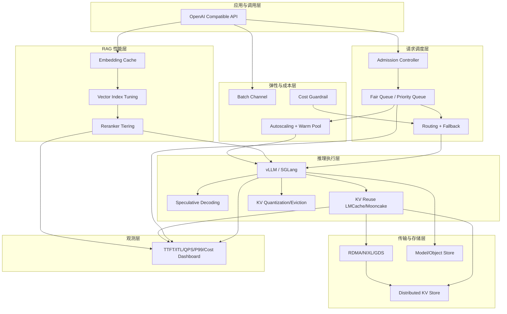

# MaaS 性能优化缺失模块广度调研（2026）

> 目标：识别当前 [maas_opensource.md](maas_opensource.md) 之外，仍可显著提升 TTFT、吞吐、P99、成本的优化模块。
>
> 范围：开源优先，兼容 vLLM / SGLang / Kubernetes。

---

## 1. 调研结论（先看）

当前架构已经覆盖：
- API 网关路由
- 推理引擎（vLLM/SGLang）
- 通用缓存（Redis/GPTCache）
- KV 存储优化（LMCache/Mooncake）
- 观测、安全、RAG 基础栈

仍有明显增益空间的模块主要在 8 个方向：
1. 请求级调度与准入控制（Admission + Queueing）
2. 投机解码与推测执行（Speculative Decoding）
3. KV 压缩与选择性保留（KV Quantization / Eviction）
4. 预填充-解码分离调度（Disaggregated P/D Scheduler）
5. 推理内核与编译优化（Kernel + Runtime Compiler）
6. 弹性伸缩与负载预测（Autoscaling + Predictive Scaling）
7. 网络/存储传输优化（RDMA/NIXL/GDS）
8. RAG 检索链路性能优化（Rerank/Embedding/Indexing）

---

## 2. 缺失模块清单（广度）

| 模块方向 | 解决瓶颈 | 典型开源方案 | 预期收益 | 接入复杂度 |
|---|---|---|---|---|
| 请求级准入与排队 | 高峰队列雪崩、P99 爆炸 | Envoy Rate Limit, KEDA + Queue, 自研 admission controller | P99 稳定、失败率下降 | 中 |
| Speculative Decoding | 解码慢、ITL 高 | vLLM Spec Decode, SGLang draft-target 方案 | tokens/s 提升、ITL 下降 | 中 |
| KV 量化/压缩 | KV 占显存大、长上下文受限 | FP8 KV, INT8/INT4 KV, CacheGen 类方案 | 容量提升、TTFT/吞吐提升 | 中-高 |
| 选择性 KV 驱逐 | 长上下文时显存挤压 | H2O/SnapKV/PyramidKV 类策略 | 长上下文稳定性更好 | 高 |
| P/D 分离调度 | Prefill 与 Decode 资源冲突 | Mooncake / MemServe 思路 + 引擎插件 | 吞吐显著提升 | 高 |
| 内核/编译优化 | 算子效率不足 | TensorRT-LLM, FlashInfer, CUDA Graph | 单机性能提升 | 中-高 |
| 弹性伸缩控制器 | GPU 空转或过载 | KEDA, VPA/HPA, 预测扩缩容 | 成本降低、SLO 稳定 | 中 |
| 传输栈优化 | KV 传输与 offload 开销大 | RDMA, NIXL, GPUDirect Storage | TTFT 下降、吞吐提升 | 高 |
| RAG 检索链路优化 | 检索和重排变慢拖慢端到端 | BGE Reranker, FastEmbed, Qdrant HNSW tuning | E2E 延迟下降 | 中 |
| 批处理离线通道 | 在线任务被批量任务挤压 | 独立 Batch Queue + Worker 池 | 在线 SLO 稳定 | 低-中 |

---

## 3. 各模块说明与落地建议

### 3.1 请求级准入与排队（高优先）

缺口：当前架构有限流和 fallback，但缺少“按资源状态动态准入”的队列控制。

建议能力：
- 按模型维度设置并发令牌（concurrency token）
- 区分短请求/长请求队列（short-job-first）
- 过载时早拒绝（early rejection）而非无限排队
- 每租户公平队列（避免大租户挤占）

优先指标：
- Queue wait p95/p99
- Admission reject rate
- SLO violation ratio

### 3.2 Speculative Decoding（高优先）

缺口：当前文档未将“草稿模型 + 目标模型验证”纳入标准性能模块。

建议能力：
- 为热门模型配对小草稿模型
- 先在长输出场景灰度（代码生成、长回答）
- 使用接受率监控（accept ratio）动态调参

优先指标：
- ITL（inter-token latency）
- Draft acceptance ratio
- Tokens/s

### 3.3 KV 量化 + 选择性驱逐（高优先）

缺口：已引入 KV 复用，但未显式引入 KV 体积控制策略。

建议能力：
- 先启用 FP8 KV（低风险）
- 再评估 INT8/INT4（需要质量回归）
- 长上下文业务再引入选择性驱逐策略

优先指标：
- KV memory per request
- OOM rate
- Quality delta（自动评测）

### 3.4 P/D 分离调度（中高优先）

缺口：已有 KV 层，但尚未把 prefill/decode 的异构调度作为平台能力。

建议能力：
- Prefill GPU 池与 Decode GPU 池拆分
- 引入请求分类（prefill-heavy / decode-heavy）
- 使用 KV 传输 SLA（超时回退本地推理）

优先指标：
- Prefill queue delay
- Decode queue delay
- Cross-node KV transfer latency

### 3.5 内核和编译时优化（中优先）

缺口：架构层强调组件，但没把“引擎内部算子优化”作为独立演进项。

建议能力：
- 按模型族建立 runtime profile（vLLM/SGLang/TensorRT-LLM）
- 对核心模型使用 CUDA Graph + fused kernels
- 结合硬件代际（A100/H100/H200）做差异配置

优先指标：
- GPU SM occupancy
- Kernel time breakdown
- Tokens/Joule（能效）

### 3.6 弹性伸缩与负载预测（中优先）

缺口：文档有 K8s 拓扑，但缺少“GPU 负载预测 + warm pool”策略。

建议能力：
- 基于队列长度 + TTFT 双指标扩容
- 高峰前预热实例（warm pool）
- 将冷启动时间纳入扩容预算

优先指标：
- Scale-up latency
- Cold-start ratio
- GPU idle ratio

### 3.7 网络/存储传输优化（中高优先）

缺口：已提 KV 存储优化，但未系统定义传输层能力。

建议能力：
- RDMA 优先用于 KV 热路径
- 引入 GDS 减少 CPU copy
- 传输层与引擎层分离，便于替换

优先指标：
- KV transfer throughput
- P2P transfer p99
- CPU utilization during transfer

### 3.8 RAG 链路性能模块（中优先）

缺口：已有 RAG 功能，但对检索/重排性能优化描述不足。

建议能力：
- Embedding 批量化与缓存
- HNSW/IVF 参数调优
- 重排器分级（轻重两级）

优先指标：
- Retrieval latency p95
- Rerank latency p95
- End-to-end latency with RAG

---

## 4. 增补后的性能分层架构（建议）

---

## 5. 实施优先级（90 天）

### P0（立即）
- Admission + Queueing
- Speculative Decoding
- FP8 KV + KV 观测指标

### P1（1-2 月）
- P/D 分离试点
- Autoscaling（队列+TTFT 双触发）
- RAG 检索与重排性能调优

### P2（2-3 月）
- RDMA/NIXL/GDS 传输优化
- 选择性 KV 驱逐
- 模型级 runtime 编译优化（TensorRT-LLM 等）

---

## 6. 最小新增指标集（建议立刻补）

1. 请求侧：queue_wait_ms_p95/p99、admission_reject_rate
2. 解码侧：itl_ms_p95、spec_accept_ratio
3. KV 侧：kv_hit_ratio、kv_fallback_ratio、kv_transfer_p99
4. 资源侧：gpu_idle_ratio、scaleup_latency_s
5. RAG 侧：retrieval_ms_p95、rerank_ms_p95

---

## 7. 与现有文档关系

- 主架构基线： [maas_opensource.md](maas_opensource.md)
- 功能全景： [maas_features.md](maas_features.md)
- KV 专题： [maas_kvcache.md](maas_kvcache.md)

该文档用于补齐“性能优化模块广度”，避免只聚焦单一 KV 方案。
