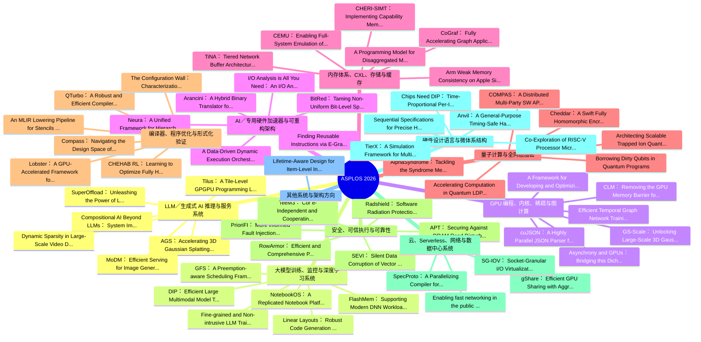

# ASPLOS 2026 Proceedings 中文知识地图（基于 Volume 1/2 PDF）

整理日期：2026-07-11

## 数据来源与覆盖范围

- `source_pdfs/asplos2026.volume1.3760250.pdf`
- `source_pdfs/asplos2026.volume2.3779212.pdf`
- 从两卷 PDF 中抽取到 152 篇 research paper，均包含 DOI 和摘要。
- 本版为中文精简版：论文题名保留英文原题，便于检索；摘要被压缩为中文要点，不保留英文长摘要。
- 注：官网 program 页面列出更多 session paper；本文件严格基于当前两卷 PDF，不等同于官网 program 的最终全量校验。

## 方向总览

| 方向 | 数量 | 关注问题 |
|---|---:|---|
| LLM/生成式 AI 推理与服务系统 | 48 | 围绕 LLM/生成式模型的推理吞吐、延迟、KV cache、prefill/decode、MoE、扩散模型和服务调度。 |
| 大模型训练、监控与深度学习系统 | 9 | 关注训练效率、GPU 集群、DNN profiling、框架监控、通信和调度。 |
| GPU 编程、内核、稀疏与图计算 | 8 | 覆盖 GPU kernel、SIMT 编程、稀疏/图计算、并行解析和运行时优化。 |
| AI/专用硬件加速器与可重构架构 | 7 | 关注 PIM/CIM/FPGA/CGRA/近存储计算、专用 AI 加速器和软硬件协同设计。 |
| 内存体系、CXL、存储与缓存 | 26 | 覆盖 CXL、分层/解耦内存、缓存、预取、存储和内存一致性。 |
| 量子计算与全同态加密 | 13 | 关注量子编译、QEC、FHE/TFHE、隐私计算和相关硬件/系统支持。 |
| 编译器、程序优化与形式化验证 | 23 | 覆盖 MLIR、代码生成、优化搜索、形式化验证、测试和 fuzzing。 |
| 安全、可信执行与可靠性 | 8 | 关注 TEE、机密计算、DRAM/硬件可靠性、故障注入和系统恢复。 |
| 云、Serverless、网络与数据中心系统 | 4 | 覆盖 serverless、云网络、SmartNIC、容器网络和数据中心应用。 |
| 硬件设计语言与微体系结构 | 5 | 关注 HDL/RTL、处理器微架构、弱内存模型、硬件接口和异常语义。 |
| 其他系统与架构方向 | 1 | 暂未被关键词规则稳定归入上述方向的论文。 |

## 知识地图

## 阅读路线建议

1. 关注 LLM inference sharing / serving：先看“LLM/生成式 AI 推理与服务系统”，再看“内存体系、CXL、存储与缓存”和“GPU 编程、内核、稀疏与图计算”。
2. 关注系统实现和部署：优先看“大模型训练、监控与深度学习系统”“云、Serverless、网络与数据中心系统”。
3. 关注硬件协同设计：优先看“AI/专用硬件加速器与可重构架构”“硬件设计语言与微体系结构”。
4. 关注安全与可靠性：优先看“安全、可信执行与可靠性”，再横向看内存安全和形式化验证。

## LLM/生成式 AI 推理与服务系统

围绕 LLM/生成式模型的推理吞吐、延迟、KV cache、prefill/decode、MoE、扩散模型和服务调度。

### AGS: Accelerating 3D Gaussian Splatting SLAM via CODEC-Assisted Frame Covisibility Detection

- 来源：Volume 1，PDF 第 35 页
- DOI：https://doi.org/10.1145/3760250.3762229
- 中文摘要：聚焦GPU、硬件设计、加速器，目标是提升大模型/生成式模型服务的吞吐、延迟和资源效率。

### Compositional AI Beyond LLMs: System Implications of Neuro-Symbolic-Probabilistic Architectures

- 来源：Volume 1，PDF 第 82 页
- DOI：https://doi.org/10.1145/3760250.3762235
- 中文摘要：聚焦内存体系、GPU、内核，目标是提升大模型/生成式模型服务的吞吐、延迟和资源效率。

### Dynamic Sparsity in Large-Scale Video DiT Training

- 来源：Volume 1，PDF 第 116 页
- DOI：https://doi.org/10.1145/3760250.3762216
- 中文摘要：聚焦attention/注意力、GPU、内核，目标是提升大模型/生成式模型服务的吞吐、延迟和资源效率。

### MoDM: Efficient Serving for Image Generation via Mixture-of-Diffusion Models

- 来源：Volume 1，PDF 第 178 页
- DOI：https://doi.org/10.1145/3760250.3762220
- 中文摘要：聚焦缓存、GPU、扩散模型，目标是提升大模型/生成式模型服务的吞吐、延迟和资源效率。

### SuperOffload: Unleashing the Power of Large-Scale LLM Training on Superchips

- 来源：Volume 1，PDF 第 264 页
- DOI：https://doi.org/10.1145/3760250.3762217
- 中文摘要：聚焦投机解码/投机执行、offloading/卸载、GPU，目标是提升大模型/生成式模型服务的吞吐、延迟和资源效率。

### Tilus: A Tile-Level GPGPU Programming Language for Low-Precision Computation

- 来源：Volume 1，PDF 第 296 页
- DOI：https://doi.org/10.1145/3760250.3762219
- 中文摘要：聚焦内存体系、GPU、内核，目标是提升大模型/生成式模型服务的吞吐、延迟和资源效率。

### XY-Serve: End-to-End Versatile Production Serving for Dynamic LLM Workloads

- 来源：Volume 1，PDF 第 329 页
- DOI：https://doi.org/10.1145/3760250.3762228
- 中文摘要：聚焦attention/注意力、内核、硬件设计，目标是提升大模型/生成式模型服务的吞吐、延迟和资源效率。

### A Cost-Effective Near-Storage Processing Solution for Offline Inference of Long-Context LLMs

- 来源：Volume 2，PDF 第 38 页
- DOI：https://doi.org/10.1145/3779212.3790119
- 中文摘要：聚焦KV cache、attention/注意力、长上下文，目标是提升大模型/生成式模型服务的吞吐、延迟和资源效率。

### BAT: Efficient Generative Recommender Serving with Bipartite Attention

- 来源：Volume 2，PDF 第 256 页
- DOI：https://doi.org/10.1145/3779212.3790131
- 中文摘要：聚焦KV cache、prefill、attention/注意力，目标是提升大模型/生成式模型服务的吞吐、延迟和资源效率。

### BlendServe: Optimizing Offline Inference with Resource-Aware Batching

- 来源：Volume 2，PDF 第 288 页
- DOI：https://doi.org/10.1145/3779212.3790133
- 中文摘要：聚焦内存体系，目标是提升大模型/生成式模型服务的吞吐、延迟和资源效率。

### Bullet: Boosting GPU Utilization for LLM Serving via Dynamic Spatial-Temporal Orchestration

- 来源：Volume 2，PDF 第 323 页
- DOI：https://doi.org/10.1145/3779212.3790135
- 中文摘要：聚焦prefill、decode、attention/注意力，目标是提升大模型/生成式模型服务的吞吐、延迟和资源效率。

### CacheMind: From Miss Rates to Why – Natural-Language, Trace-Grounded Reasoning for Cache Replacement

- 来源：Volume 2，PDF 第 340 页
- DOI：https://doi.org/10.1145/3779212.3790136
- 中文摘要：聚焦内存体系、缓存，目标是提升大模型/生成式模型服务的吞吐、延迟和资源效率。

### CREATE: Cross-Layer Resilience Characterization and Optimization for Efficient yet Reliable Embodied AI Systems

- 来源：Volume 2，PDF 第 526 页
- DOI：https://doi.org/10.1145/3779212.3790147
- 中文摘要：聚焦attention/注意力、可靠性，目标是提升大模型/生成式模型服务的吞吐、延迟和资源效率。

### DARTH-PUM: A Hybrid Processing-Using-Memory Architecture

- 来源：Volume 2，PDF 第 596 页
- DOI：https://doi.org/10.1145/3779212.3790151
- 中文摘要：聚焦内存体系、内核、硬件设计，目标是提升大模型/生成式模型服务的吞吐、延迟和资源效率。

### DFVG: A Heterogeneous Architecture for Speculative Decoding with D raft-on-FPGA and Verify-on-GPU Shaoqiang Lu∗

- 来源：Volume 2，PDF 第 635 页
- DOI：https://doi.org/10.1145/3779212.3790153
- 中文摘要：聚焦投机解码/投机执行、offloading/卸载、GPU，目标是提升大模型/生成式模型服务的吞吐、延迟和资源效率。

### EARTH: An Efficient MoE Accelerator with Entropy-Aware Speculative Prefetch and Pattern Reuse Fangxin Liu∗

- 来源：Volume 2，PDF 第 666 页
- DOI：https://doi.org/10.1145/3779212.3790155
- 中文摘要：聚焦投机解码/投机执行、MoE、offloading/卸载，目标是提升大模型/生成式模型服务的吞吐、延迟和资源效率。

### FastTTS: Accelerating Test-Time Scaling for Edge LLM Reasoning

- 来源：Volume 2，PDF 第 765 页
- DOI：https://doi.org/10.1145/3779212.3790161
- 中文摘要：聚焦投机解码/投机执行、内存体系、缓存，目标是提升大模型/生成式模型服务的吞吐、延迟和资源效率。

### Hardwired-Neuron Language Processing Units as General-Purpose Cognitive Substrates

- 来源：Volume 2，PDF 第 909 页
- DOI：https://doi.org/10.1145/3779212.3790169
- 中文摘要：聚焦LLM 系统，目标是提升大模型/生成式模型服务的吞吐、延迟和资源效率。

### HEPIC: Private Inference over Homomorphic Encr yption with Client Intervention Kevin Nam Dept. of ECE & ISRC,

- 来源：Volume 2，PDF 第 929 页
- DOI：https://doi.org/10.1145/3779212.3790170
- 中文摘要：聚焦缓存、全同态加密，目标是提升大模型/生成式模型服务的吞吐、延迟和资源效率。

### History Doesn’t Repeat Itself but Rollouts Rhyme: Accelerating Reinforcement Learning with RhymeRL Jingkai He

- 来源：Volume 2，PDF 第 962 页
- DOI：https://doi.org/10.1145/3779212.3790172
- 中文摘要：聚焦投机解码/投机执行、GPU、训练系统，目标是提升大模型/生成式模型服务的吞吐、延迟和资源效率。

### It Takes Two to Entangle

- 来源：Volume 2，PDF 第 1055 页
- DOI：https://doi.org/10.1145/3779212.3790178
- 中文摘要：聚焦内存体系、GPU、训练系统，目标是提升大模型/生成式模型服务的吞吐、延迟和资源效率。

### LAER-MoE: Load-Adaptive Expert Re-layout for Efficient Mixture-of-Experts Training

- 来源：Volume 2，PDF 第 1088 页
- DOI：https://doi.org/10.1145/3779212.3790180
- 中文摘要：聚焦MoE、硬件设计、训练系统，目标是提升大模型/生成式模型服务的吞吐、延迟和资源效率。

### LAIKA: Machine Learning-Assisted In-Kernel APU Acceleration

- 来源：Volume 2，PDF 第 1106 页
- DOI：https://doi.org/10.1145/3779212.3790181
- 中文摘要：聚焦offloading/卸载、内存体系、GPU，目标是提升大模型/生成式模型服务的吞吐、延迟和资源效率。

### LOOPRAG: Enhancing Loop Transformation Optimization with Retrieval-Augmented Large Language Models

- 来源：Volume 2，PDF 第 1146 页
- DOI：https://doi.org/10.1145/3779212.3790183
- 中文摘要：聚焦编译器，目标是提升大模型/生成式模型服务的吞吐、延迟和资源效率。

### M2XFP: A Metadata-Augmented Microscaling Data Format for Efficient Low-bit Quantization

- 来源：Volume 2，PDF 第 1184 页
- DOI：https://doi.org/10.1145/3779212.3790185
- 中文摘要：聚焦硬件设计、加速器，目标是提升大模型/生成式模型服务的吞吐、延迟和资源效率。

### MoE-APEX: An Efficient MoE Inference System with Adaptive Precision Expert Offloading

- 来源：Volume 2，PDF 第 1218 页
- DOI：https://doi.org/10.1145/3779212.3790187
- 中文摘要：聚焦MoE、offloading/卸载、内存体系，目标是提升大模型/生成式模型服务的吞吐、延迟和资源效率。

### MSCCL++: Rethinking GPU Communication Abstractions for AI Inference

- 来源：Volume 2，PDF 第 1234 页
- DOI：https://doi.org/10.1145/3779212.3790188
- 中文摘要：聚焦GPU、内核、硬件设计，目标是提升大模型/生成式模型服务的吞吐、延迟和资源效率。

### Mugi: Value Level Parallelism For Efficient LLMs

- 来源：Volume 2，PDF 第 1249 页
- DOI：https://doi.org/10.1145/3779212.3790189
- 中文摘要：聚焦attention/注意力、缓存，目标是提升大模型/生成式模型服务的吞吐、延迟和资源效率。

### Nebula: Infinite-Scale 3D Gaussian Splatting in VR via Collaborative Rendering and Accelerated Stereo Rasterization

- 来源：Volume 2，PDF 第 1268 页
- DOI：https://doi.org/10.1145/3779212.3790190
- 中文摘要：聚焦attention/注意力、内存体系、硬件设计，目标是提升大模型/生成式模型服务的吞吐、延迟和资源效率。

### oFFN: Outlier and Neuron-aware Structured FFN for Fast yet Accurate LLM Inference

- 来源：Volume 2，PDF 第 1334 页
- DOI：https://doi.org/10.1145/3779212.3790194
- 中文摘要：聚焦attention/注意力、内存体系、稀疏计算，目标是提升大模型/生成式模型服务的吞吐、延迟和资源效率。

### Ouroboros: Wafer-Scale SRAM CIM with Token-Grained Pipelining for Large Language Model Inference

- 来源：Volume 2，PDF 第 1382 页
- DOI：https://doi.org/10.1145/3779212.3790197
- 中文摘要：聚焦内存体系、CIM，目标是提升大模型/生成式模型服务的吞吐、延迟和资源效率。

### Parameterized Hardware Design with Latency-Abstract Interfaces

- 来源：Volume 2，PDF 第 1415 页
- DOI：https://doi.org/10.1145/3779212.3790199
- 中文摘要：聚焦TEE、硬件设计，目标是提升大模型/生成式模型服务的吞吐、延迟和资源效率。

### PAT: Accelerating LLM Decoding via P refix-Aware Attention with Resource Efficient Multi-Tile Kernel Jinjun Yi†

- 来源：Volume 2，PDF 第 1429 页
- DOI：https://doi.org/10.1145/3779212.3790200
- 中文摘要：聚焦KV cache、decode、attention/注意力，目标是提升大模型/生成式模型服务的吞吐、延迟和资源效率。

### QoServe: Breaking the Silos of LLM Inference Serving

- 来源：Volume 2，PDF 第 1525 页
- DOI：https://doi.org/10.1145/3779212.3790206
- 中文摘要：聚焦TEE，目标是提升大模型/生成式模型服务的吞吐、延迟和资源效率。

### REPA: Reconfigurable PIM for the Joint A cceleration of KV Cache Offloading and Processing Yang Hong

- 来源：Volume 2，PDF 第 1655 页
- DOI：https://doi.org/10.1145/3779212.3790212
- 中文摘要：聚焦KV cache、offloading/卸载、内存体系，目标是提升大模型/生成式模型服务的吞吐、延迟和资源效率。

### Shift Parallelism: Low-Latency, High-Throughput LLM Inference for Dynamic Workloads

- 来源：Volume 2，PDF 第 1782 页
- DOI：https://doi.org/10.1145/3779212.3790219
- 中文摘要：聚焦KV cache、缓存、GPU，目标是提升大模型/生成式模型服务的吞吐、延迟和资源效率。

### SNIP: An Adaptive Mixed Precision Framework for Subbyte Large Language Model Training

- 来源：Volume 2，PDF 第 1848 页
- DOI：https://doi.org/10.1145/3779212.3790223
- 中文摘要：聚焦GPU、训练系统，目标是提升大模型/生成式模型服务的吞吐、延迟和资源效率。

### SpeContext: Enabling Efficient Long-context Reasoning with Speculative Context Sparsity in LLMs

- 来源：Volume 2，PDF 第 1865 页
- DOI：https://doi.org/10.1145/3779212.3790224
- 中文摘要：聚焦KV cache、投机解码/投机执行、长上下文，目标是提升大模型/生成式模型服务的吞吐、延迟和资源效率。

### STARC: Selective Token Access with Remapping and Clustering for Efficient LLM Decoding on PIM Systems

- 来源：Volume 2，PDF 第 1896 页
- DOI：https://doi.org/10.1145/3779212.3790226
- 中文摘要：聚焦KV cache、attention/注意力、内存体系，目标是提升大模型/生成式模型服务的吞吐、延迟和资源效率。

### Streaming Tensor Program: A streaming abstraction for dynamic parallelism

- 来源：Volume 2，PDF 第 1945 页
- DOI：https://doi.org/10.1145/3779212.3790229
- 中文摘要：聚焦内存体系、加速器，目标是提升大模型/生成式模型服务的吞吐、延迟和资源效率。

### Taming the Long-Tail: Efficient Reasoning RL Training with Adaptive Drafter

- 来源：Volume 2，PDF 第 1966 页
- DOI：https://doi.org/10.1145/3779212.3790231
- 中文摘要：聚焦投机解码/投机执行、内存体系、GPU，目标是提升大模型/生成式模型服务的吞吐、延迟和资源效率。

### TetriServe: Efficiently Serving Mixed DiT Workloads

- 来源：Volume 2，PDF 第 2015 页
- DOI：https://doi.org/10.1145/3779212.3790233
- 中文摘要：聚焦GPU、扩散模型，目标是提升大模型/生成式模型服务的吞吐、延迟和资源效率。

### Towards High-Goodput LLM Serving with Prefill-decode Multiplexing

- 来源：Volume 2，PDF 第 2063 页
- DOI：https://doi.org/10.1145/3779212.3790236
- 中文摘要：聚焦prefill、decode、内存体系，目标是提升大模型/生成式模型服务的吞吐、延迟和资源效率。

### TPLA: Tensor Parallel Latent Attention for Efficient Disaggregated Prefill & Decode Inference

- 来源：Volume 2，PDF 第 2081 页
- DOI：https://doi.org/10.1145/3779212.3790237
- 中文摘要：聚焦prefill、decode、attention/注意力，目标是提升大模型/生成式模型服务的吞吐、延迟和资源效率。

### Trinity: Three-Dimensional Tensor Program Optimization via Tile-level Equality Saturation

- 来源：Volume 2，PDF 第 2112 页
- DOI：https://doi.org/10.1145/3779212.3790240
- 中文摘要：聚焦attention/注意力、内存体系、内核，目标是提升大模型/生成式模型服务的吞吐、延迟和资源效率。

### SwiftSpec: Disaggregated Speculative Decoding and Fused Kernels for Low-Latency LLM Inference

- 来源：Volume 2，PDF 第 2230 页
- DOI：https://doi.org/10.1145/3779212.3790246
- 中文摘要：聚焦投机解码/投机执行、attention/注意力、缓存，目标是提升大模型/生成式模型服务的吞吐、延迟和资源效率。

### W ave: Leveraging Architecture Observation for Privacy-Preserving Model Oversight Haoxuan Xu*

- 来源：Volume 2，PDF 第 2245 页
- DOI：https://doi.org/10.1145/3779212.3790247
- 中文摘要：聚焦内存体系、GPU、硬件设计，目标是提升大模型/生成式模型服务的吞吐、延迟和资源效率。

### ZipServ: Fast and Memory-Efficient LLM Inference with Hardware-Aware Lossless Compression

- 来源：Volume 2，PDF 第 2297 页
- DOI：https://doi.org/10.1145/3779212.3790250
- 中文摘要：聚焦内存体系、GPU、内核，目标是提升大模型/生成式模型服务的吞吐、延迟和资源效率。

## 大模型训练、监控与深度学习系统

关注训练效率、GPU 集群、DNN profiling、框架监控、通信和调度。

### GFS: A Preemption-aware Scheduling Framework for GPU Clusters with Predictive Spot Instance Management

- 来源：Volume 1，PDF 第 132 页
- DOI：https://doi.org/10.1145/3760250.3762231
- 中文摘要：聚焦GPU，目标是提升训练、监控或深度学习系统的可扩展性与运行效率。

### Linear Layouts: Robust Code Generation of Efficient Tensor Computation Using F2

- 来源：Volume 1，PDF 第 147 页
- DOI：https://doi.org/10.1145/3760250.3762221
- 中文摘要：聚焦内核、硬件设计，目标是提升训练、监控或深度学习系统的可扩展性与运行效率。

### NotebookOS: A Replicated Notebook Platform for Interactive Training with On-Demand GPUs

- 来源：Volume 1，PDF 第 198 页
- DOI：https://doi.org/10.1145/3760250.3762230
- 中文摘要：聚焦GPU、内核、训练系统，目标是提升训练、监控或深度学习系统的可扩展性与运行效率。

### DIP: Efficient Large Multimodal Model Training with Dynamic Interleaved Pipeline

- 来源：Volume 2，PDF 第 651 页
- DOI：https://doi.org/10.1145/3779212.3790154
- 中文摘要：聚焦训练系统，目标是提升训练、监控或深度学习系统的可扩展性与运行效率。

### Fine-grained and Non-intrusive LLM Training Monitoring via Microsecond-level Traffic Measurement

- 来源：Volume 2，PDF 第 797 页
- DOI：https://doi.org/10.1145/3779212.3790163
- 中文摘要：聚焦GPU、训练系统，目标是提升训练、监控或深度学习系统的可扩展性与运行效率。

### FlashMem: Supporting Modern DNN Workloads on Mobile with GPU Memory Hierarchy Optimizations

- 来源：Volume 2，PDF 第 816 页
- DOI：https://doi.org/10.1145/3779212.3790164
- 中文摘要：聚焦内存体系、GPU，目标是提升训练、监控或深度学习系统的可扩展性与运行效率。

### Segment Only Where You Look: Leveraging Human Gaze Behavior for Efficient Computer Vision Applications in Augmented Reality

- 来源：Volume 2，PDF 第 1726 页
- DOI：https://doi.org/10.1145/3779212.3790216
- 中文摘要：聚焦硬件设计、加速器，目标是提升训练、监控或深度学习系统的可扩展性与运行效率。

### T-Control: An Efficient Dynamic Tensor Rematerialization System for DNN Training

- 来源：Volume 2，PDF 第 1982 页
- DOI：https://doi.org/10.1145/3779212.3790230
- 中文摘要：聚焦内存体系、图计算、训练系统，目标是提升训练、监控或深度学习系统的可扩展性与运行效率。

### Triton-Sanitizer: A Fast and Device-Agnostic Memory Sanitizer for Triton with Rich Diagnostic Context

- 来源：Volume 2，PDF 第 2141 页
- DOI：https://doi.org/10.1145/3779212.3790241
- 中文摘要：聚焦内存体系、GPU、内核，目标是提升训练、监控或深度学习系统的可扩展性与运行效率。

## GPU 编程、内核、稀疏与图计算

覆盖 GPU kernel、SIMT 编程、稀疏/图计算、并行解析和运行时优化。

### cuJSON: A Highly Parallel JSON Parser for GPUs

- 来源：Volume 1，PDF 第 100 页
- DOI：https://doi.org/10.1145/3760250.3762222
- 中文摘要：聚焦offloading/卸载、GPU，通过内核、运行时或并行编程优化提升计算效率。

### A Framework for Developing and Optimizing Fully Homomorphic Encryption Programs on GPUs

- 来源：Volume 2，PDF 第 58 页
- DOI：https://doi.org/10.1145/3779212.3790120
- 中文摘要：聚焦内存体系、GPU、内核，通过内核、运行时或并行编程优化提升计算效率。

### Asynchrony and GPUs: Bridging this Dichotomy for I/O with AGIO

- 来源：Volume 2，PDF 第 241 页
- DOI：https://doi.org/10.1145/3779212.3790130
- 中文摘要：聚焦GPU、硬件设计，通过内核、运行时或并行编程优化提升计算效率。

### CLM: Removing the GPU Memory Barrier for 3D Gaussian Splatting

- 来源：Volume 2，PDF 第 410 页
- DOI：https://doi.org/10.1145/3779212.3790140
- 中文摘要：聚焦offloading/卸载、内存体系、GPU，通过内核、运行时或并行编程优化提升计算效率。

### Efficient Temporal Graph Network Training via Unified Redundancy Elimination

- 来源：Volume 2，PDF 第 695 页
- DOI：https://doi.org/10.1145/3779212.3790157
- 中文摘要：聚焦内存体系、GPU、图计算，通过内核、运行时或并行编程优化提升计算效率。

### GS-Scale: Unlocking Large-Scale 3D Gaussian Splatting Training via Host Offloading

- 来源：Volume 2，PDF 第 893 页
- DOI：https://doi.org/10.1145/3779212.3790167
- 中文摘要：聚焦offloading/卸载、内存体系、GPU，通过内核、运行时或并行编程优化提升计算效率。

### Insum: Sparse GPU Kernels Simplified and Optimized with Indirect Einsums

- 来源：Volume 2，PDF 第 1026 页
- DOI：https://doi.org/10.1145/3779212.3790176
- 中文摘要：聚焦GPU、内核、稀疏计算，通过内核、运行时或并行编程优化提升计算效率。

### SLAWS: Spatial Locality Analysis and Workload Orchestration for Sparse Matrix Multiplication

- 来源：Volume 2，PDF 第 1833 页
- DOI：https://doi.org/10.1145/3779212.3790222
- 中文摘要：聚焦内存体系、稀疏计算、图计算，通过内核、运行时或并行编程优化提升计算效率。

## AI/专用硬件加速器与可重构架构

关注 PIM/CIM/FPGA/CGRA/近存储计算、专用 AI 加速器和软硬件协同设计。

### A Data-Driven Dynamic Execution Orchestration Architecture

- 来源：Volume 1，PDF 第 16 页
- DOI：https://doi.org/10.1145/3760250.3762226
- 中文摘要：聚焦GPU、内核、稀疏计算，探索专用硬件或软硬件协同设计以提升性能/能效。

### Arancini: A Hybrid Binary Translator for Weak Memory Model Architectures

- 来源：Volume 2，PDF 第 190 页
- DOI：https://doi.org/10.1145/3779212.3790127
- 中文摘要：聚焦内存体系、RISC-V，探索专用硬件或软硬件协同设计以提升性能/能效。

### BitRed: Taming Non-Uniform Bit-Level Sparsity with a Programmable RISC-V ISA for DNN Acceleration

- 来源：Volume 2，PDF 第 272 页
- DOI：https://doi.org/10.1145/3779212.3790132
- 中文摘要：聚焦稀疏计算、硬件设计、加速器，探索专用硬件或软硬件协同设计以提升性能/能效。

### Finding Reusable Instructions via E-Graph Anti-Unification

- 来源：Volume 2，PDF 第 782 页
- DOI：https://doi.org/10.1145/3779212.3790162
- 中文摘要：聚焦图计算、硬件设计、加速器，探索专用硬件或软硬件协同设计以提升性能/能效。

### I/O Analysis is All You Need: An I/O Analysis for Long-Sequence Attention

- 来源：Volume 2，PDF 第 995 页
- DOI：https://doi.org/10.1145/3779212.3790174
- 中文摘要：聚焦attention/注意力、内存体系、GPU，探索专用硬件或软硬件协同设计以提升性能/能效。

### Neura: A Unified Framework for Hierarchical and Adaptive CGRAs

- 来源：Volume 2，PDF 第 1318 页
- DOI：https://doi.org/10.1145/3779212.3790193
- 中文摘要：聚焦内存体系、内核、CGRA，探索专用硬件或软硬件协同设计以提升性能/能效。

### Transforming Torus Fabrics for Efficient Multi-tenant ML

- 来源：Volume 2，PDF 第 1580 页
- DOI：https://doi.org/10.1145/3779212.3790238
- 中文摘要：聚焦硬件设计、加速器，探索专用硬件或软硬件协同设计以提升性能/能效。

## 内存体系、CXL、存储与缓存

覆盖 CXL、分层/解耦内存、缓存、预取、存储和内存一致性。

### CHERI-SIMT: Implementing Capability Memory Protection in GPUs Matthew Naylor

- 来源：Volume 1，PDF 第 65 页
- DOI：https://doi.org/10.1145/3760250.3762234
- 中文摘要：聚焦内存体系、GPU、硬件设计，解决内存、缓存、CXL 或存储路径上的性能与可扩展性瓶颈。

### TiNA: Tiered Network Buffer Architecture for Fast Networking in Chiplet-based CPU

- 来源：Volume 1，PDF 第 313 页
- DOI：https://doi.org/10.1145/3760250.3762224
- 中文摘要：聚焦内存体系、缓存、容错/故障，解决内存、缓存、CXL 或存储路径上的性能与可扩展性瓶颈。

### A Programming Model for Disaggregated Memory over CXL

- 来源：Volume 2，PDF 第 74 页
- DOI：https://doi.org/10.1145/3779212.3790121
- 中文摘要：聚焦CXL、内存体系、缓存，解决内存、缓存、CXL 或存储路径上的性能与可扩展性瓶颈。

### Arm Weak Memory Consistency on Apple Silicon: What Is It Good For?

- 来源：Volume 2，PDF 第 224 页
- DOI：https://doi.org/10.1145/3779212.3790129
- 中文摘要：聚焦内存体系，解决内存、缓存、CXL 或存储路径上的性能与可扩展性瓶颈。

### CEMU: Enabling Full-System Emulation of Computational Storage beyond Hardware Limits

- 来源：Volume 2，PDF 第 356 页
- DOI：https://doi.org/10.1145/3779212.3790137
- 中文摘要：聚焦硬件设计，解决内存、缓存、CXL 或存储路径上的性能与可扩展性瓶颈。

### CoGraf: Fully Accelerating Graph Applications with Fine-Grained PIM

- 来源：Volume 2，PDF 第 442 页
- DOI：https://doi.org/10.1145/3779212.3790142
- 中文摘要：聚焦内存体系、缓存、图计算，解决内存、缓存、CXL 或存储路径上的性能与可扩展性瓶颈。

### CounterPoint: Using Hardware Event Counters to Refute and Refine Microarchitectural Assumptions

- 来源：Volume 2，PDF 第 492 页
- DOI：https://doi.org/10.1145/3779212.3790145
- 中文摘要：聚焦内存体系、硬件设计，解决内存、缓存、CXL 或存储路径上的性能与可扩展性瓶颈。

### CPU-Oblivious Offloading of Failure-Atomic Transactions for Disaggregated Memory

- 来源：Volume 2，PDF 第 509 页
- DOI：https://doi.org/10.1145/3779212.3790146
- 中文摘要：聚焦offloading/卸载、内存体系、可靠性，解决内存、缓存、CXL 或存储路径上的性能与可扩展性瓶颈。

### CREST: High-Performance Contention Resolution for Disaggregated Transactions

- 来源：Volume 2，PDF 第 544 页
- DOI：https://doi.org/10.1145/3779212.3790148
- 中文摘要：聚焦内存体系，解决内存、缓存、CXL 或存储路径上的性能与可扩展性瓶颈。

### Cxlalloc: Safe and Efficient Memory Allocation for a CXL Pod

- 来源：Volume 2，PDF 第 561 页
- DOI：https://doi.org/10.1145/3779212.3790149
- 中文摘要：聚焦CXL、内存体系、缓存，解决内存、缓存、CXL 或存储路径上的性能与可扩展性瓶颈。

### CXLMC: Model Checking CXL Shared Memory Programs

- 来源：Volume 2，PDF 第 579 页
- DOI：https://doi.org/10.1145/3779212.3790150
- 中文摘要：聚焦CXL、内存体系、缓存，解决内存、缓存、CXL 或存储路径上的性能与可扩展性瓶颈。

### Efficient Remote Memory Ordering for Non-Coherent Interconnects Wei Siew Liew∗

- 来源：Volume 2，PDF 第 680 页
- DOI：https://doi.org/10.1145/3779212.3790156
- 中文摘要：聚焦内存体系、内核、硬件设计，解决内存、缓存、CXL 或存储路径上的性能与可扩展性瓶颈。

### Hitchhike: Efficient Request Submission via Deferred Enforcement of Address Contiguity

- 来源：Volume 2，PDF 第 979 页
- DOI：https://doi.org/10.1145/3779212.3790173
- 中文摘要：聚焦内核，解决内存、缓存、CXL 或存储路径上的性能与可扩展性瓶颈。

### ICARUS: Criticality and Reuse based Instruction Caching for Datacenter Applications

- 来源：Volume 2，PDF 第 1011 页
- DOI：https://doi.org/10.1145/3779212.3790175
- 中文摘要：聚焦decode、缓存、硬件设计，解决内存、缓存、CXL 或存储路径上的性能与可扩展性瓶颈。

### Nemo: A Low-Write-Amplification Cache for Tiny Objects on Log-Structured Flash Devices

- 来源：Volume 2，PDF 第 1284 页
- DOI：https://doi.org/10.1145/3779212.3790191
- 中文摘要：聚焦内存体系、缓存，解决内存、缓存、CXL 或存储路径上的性能与可扩展性瓶颈。

### Neo: Real-Time On-Device 3D Gaussian Splatting with Reuse-and-Update Sorting Acceleration

- 来源：Volume 2，PDF 第 1301 页
- DOI：https://doi.org/10.1145/3779212.3790192
- 中文摘要：聚焦内存体系、GPU、硬件设计，解决内存、缓存、CXL 或存储路径上的性能与可扩展性瓶颈。

### PACT: A Criticality-First Design for Tiered Memory

- 来源：Volume 2，PDF 第 1399 页
- DOI：https://doi.org/10.1145/3779212.3790198
- 中文摘要：聚焦内存体系、硬件设计、性能分析，解决内存、缓存、CXL 或存储路径上的性能与可扩展性瓶颈。

### Performance Predictability in Heterogeneous Memory

- 来源：Volume 2，PDF 第 1446 页
- DOI：https://doi.org/10.1145/3779212.3790201
- 中文摘要：聚焦CXL、内存体系、缓存，解决内存、缓存、CXL 或存储路径上的性能与可扩展性瓶颈。

### PF-LLM: Large Language Model Hinted Hardware Prefetching

- 来源：Volume 2，PDF 第 1463 页
- DOI：https://doi.org/10.1145/3779212.3790202
- 中文摘要：聚焦内存体系、硬件设计，解决内存、缓存、CXL 或存储路径上的性能与可扩展性瓶颈。

### PIPM: Partial and Incremental Page Migration for Multi-host CXL Disaggregated Shared Memory

- 来源：Volume 2，PDF 第 1478 页
- DOI：https://doi.org/10.1145/3779212.3790203
- 中文摘要：聚焦CXL、内存体系、缓存，解决内存、缓存、CXL 或存储路径上的性能与可扩展性瓶颈。

### Static Analysis for Efficient Streaming Tokenization

- 来源：Volume 2，PDF 第 1913 页
- DOI：https://doi.org/10.1145/3779212.3790227
- 中文摘要：聚焦内存体系，解决内存、缓存、CXL 或存储路径上的性能与可扩展性瓶颈。

### STRA W: Stress-Aware WL-Based Read Disturbance Management for High-Density NAND Flash Memory Myoungjun Chun

- 来源：Volume 2，PDF 第 1930 页
- DOI：https://doi.org/10.1145/3779212.3790228
- 中文摘要：聚焦内存体系、可靠性，解决内存、缓存、CXL 或存储路径上的性能与可扩展性瓶颈。

### Toasty: Speeding up network I/O with cache-warm buffers

- 来源：Volume 2，PDF 第 2048 页
- DOI：https://doi.org/10.1145/3779212.3790235
- 中文摘要：聚焦内存体系、缓存、内核，解决内存、缓存、CXL 或存储路径上的性能与可扩展性瓶颈。

### Understanding and Optimizing Database Pushdown on Disaggregated Storage

- 来源：Volume 2，PDF 第 2174 页
- DOI：https://doi.org/10.1145/3779212.3790243
- 中文摘要：聚焦内存体系，解决内存、缓存、CXL 或存储路径上的性能与可扩展性瓶颈。

### vCXLGen: Automated Synthesis and Verification of CXL Bridges for Heterogeneous Architectures

- 来源：Volume 2，PDF 第 2210 页
- DOI：https://doi.org/10.1145/3779212.3790245
- 中文摘要：聚焦CXL、内存体系、缓存，解决内存、缓存、CXL 或存储路径上的性能与可扩展性瓶颈。

### W ax: Optimizing Data Center Applications With Stale Profile Tawhid Bhuiyan

- 来源：Volume 2，PDF 第 2265 页
- DOI：https://doi.org/10.1145/3779212.3790248
- 中文摘要：聚焦缓存、性能分析，解决内存、缓存、CXL 或存储路径上的性能与可扩展性瓶颈。

## 量子计算与全同态加密

关注量子编译、QEC、FHE/TFHE、隐私计算和相关硬件/系统支持。

### Cheddar: A Swift Fully Homomorphic Encryption Library Designed for GPU Architectures

- 来源：Volume 1，PDF 第 50 页
- DOI：https://doi.org/10.1145/3760250.3762223
- 中文摘要：聚焦内存体系、GPU、内核，为量子计算或同态加密提供更高效的编译、执行或硬件支持。

### Accelerating Computation in Quantum LDPC Code

- 来源：Volume 2，PDF 第 92 页
- DOI：https://doi.org/10.1145/3779212.3790122
- 中文摘要：聚焦量子计算、量子纠错、容错/故障，为量子计算或同态加密提供更高效的编译、执行或硬件支持。

### AlphaSyndrome: Tackling the Syndrome Measurement Circuit Scheduling Problem for QEC Codes

- 来源：Volume 2，PDF 第 110 页
- DOI：https://doi.org/10.1145/3779212.3790123
- 中文摘要：聚焦decode、量子计算、量子纠错，为量子计算或同态加密提供更高效的编译、执行或硬件支持。

### Architecting Scalable Trapped Ion Quantum Computers using Surface Codes

- 来源：Volume 2，PDF 第 208 页
- DOI：https://doi.org/10.1145/3779212.3790128
- 中文摘要：聚焦编译器、量子计算、量子纠错，为量子计算或同态加密提供更高效的编译、执行或硬件支持。

### Borrowing Dirty Qubits in Quantum Programs

- 来源：Volume 2，PDF 第 307 页
- DOI：https://doi.org/10.1145/3779212.3790134
- 中文摘要：聚焦量子计算，为量子计算或同态加密提供更高效的编译、执行或硬件支持。

### COMPAS: A Distributed Multi-Party SW AP Test for Parallel Quantum Algorithms Brayden Goldstein-Gelb∗

- 来源：Volume 2，PDF 第 459 页
- DOI：https://doi.org/10.1145/3779212.3790143
- 中文摘要：聚焦量子计算、硬件设计，为量子计算或同态加密提供更高效的编译、执行或硬件支持。

### Falcon: Algorithm-Hardware Co-Design for Efficient Fully Homomorphic Encryption Accelerator

- 来源：Volume 2，PDF 第 748 页
- DOI：https://doi.org/10.1145/3779212.3790160
- 中文摘要：聚焦内存体系、图计算、全同态加密，为量子计算或同态加密提供更高效的编译、执行或硬件支持。

### iSwitch: QEC on Demand via In-Situ Encoding of Bare Qubits for Ion Trap Architectures

- 来源：Volume 2，PDF 第 1040 页
- DOI：https://doi.org/10.1145/3779212.3790177
- 中文摘要：聚焦编译器、量子计算、量子纠错，为量子计算或同态加密提供更高效的编译、执行或硬件支持。

### Maverick: Rethinking TFHE Bootstrapping on GPUs via Algorithm-Hardware Co-Design

- 来源：Volume 2，PDF 第 1201 页
- DOI：https://doi.org/10.1145/3779212.3790186
- 中文摘要：聚焦GPU、全同态加密、FHE，为量子计算或同态加密提供更高效的编译、执行或硬件支持。

### PropHunt: Automated Optimization of Quantum Syndrome Measurement Circuits

- 来源：Volume 2，PDF 第 1509 页
- DOI：https://doi.org/10.1145/3779212.3790205
- 中文摘要：聚焦量子计算、量子纠错、容错/故障，为量子计算或同态加密提供更高效的编译、执行或硬件支持。

### Reducing T Gates with Unitary Synthesis

- 来源：Volume 2，PDF 第 1622 页
- DOI：https://doi.org/10.1145/3779212.3790210
- 中文摘要：聚焦量子计算、容错/故障，为量子计算或同态加密提供更高效的编译、执行或硬件支持。

### ReliaFHE: Resilient Design for Fully Homomorphic Encryption Accelerators

- 来源：Volume 2，PDF 第 1638 页
- DOI：https://doi.org/10.1145/3779212.3790211
- 中文摘要：聚焦内核、全同态加密、FHE，为量子计算或同态加密提供更高效的编译、执行或硬件支持。

### TreeVQA: A Tree-Structured Execution Framework for Shot Reduction in Variational Quantum Algorithms

- 来源：Volume 2，PDF 第 2096 页
- DOI：https://doi.org/10.1145/3779212.3790239
- 中文摘要：聚焦量子计算，为量子计算或同态加密提供更高效的编译、执行或硬件支持。

## 编译器、程序优化与形式化验证

覆盖 MLIR、代码生成、优化搜索、形式化验证、测试和 fuzzing。

### Lobster: A GPU-Accelerated Framework for Neurosymbolic Programming

- 来源：Volume 1，PDF 第 162 页
- DOI：https://doi.org/10.1145/3760250.3762232
- 中文摘要：聚焦GPU、硬件设计，改进代码生成、优化搜索、测试或形式化验证流程。

### QTurbo: A Robust and Efficient Compiler for Analog Quantum Simulation

- 来源：Volume 1，PDF 第 218 页
- DOI：https://doi.org/10.1145/3760250.3762227
- 中文摘要：聚焦编译器、量子计算、可靠性，改进代码生成、优化搜索、测试或形式化验证流程。

### The Configuration Wall: Characterization and Elimination of Accelerator Configuration Overhead

- 来源：Volume 1，PDF 第 280 页
- DOI：https://doi.org/10.1145/3760250.3762225
- 中文摘要：聚焦offloading/卸载、内核、编译器，改进代码生成、优化搜索、测试或形式化验证流程。

### An MLIR Lowering Pipeline for Stencils at Wafer-Scale

- 来源：Volume 2，PDF 第 127 页
- DOI：https://doi.org/10.1145/3779212.3790124
- 中文摘要：聚焦编译器、MLIR，改进代码生成、优化搜索、测试或形式化验证流程。

### CHEHAB RL: Learning to Optimize Fully Homomorphic Encryption Computations

- 来源：Volume 2，PDF 第 375 页
- DOI：https://doi.org/10.1145/3779212.3790138
- 中文摘要：聚焦图计算、编译器、全同态加密，改进代码生成、优化搜索、测试或形式化验证流程。

### Compass: Navigating the Design Space of Taint Schemes for RTL Security Verification

- 来源：Volume 2，PDF 第 475 页
- DOI：https://doi.org/10.1145/3779212.3790144
- 中文摘要：聚焦投机解码/投机执行、验证、硬件设计，改进代码生成、优化搜索、测试或形式化验证流程。

### Detecting Inconsistencies in ARM CCA’s Formally Verified Specification

- 来源：Volume 2，PDF 第 616 页
- DOI：https://doi.org/10.1145/3779212.3790152
- 中文摘要：聚焦验证、TEE，改进代码生成、优化搜索、测试或形式化验证流程。

### Evaluating Compiler Optimization Impacts on zkVM Performance

- 来源：Volume 2，PDF 第 730 页
- DOI：https://doi.org/10.1145/3779212.3790159
- 中文摘要：聚焦缓存、图计算、编译器，改进代码生成、优化搜索、测试或形式化验证流程。

### FuseFlow: A Fusion-Centric Compilation Framework for Sparse Deep Learning on Streaming Dataflow

- 来源：Volume 2，PDF 第 831 页
- DOI：https://doi.org/10.1145/3779212.3790165
- 中文摘要：聚焦attention/注意力、内核、稀疏计算，改进代码生成、优化搜索、测试或形式化验证流程。

### Graphiti: Formally Verified Out-of-Order Execution in Dataflow Circuits

- 来源：Volume 2，PDF 第 854 页
- DOI：https://doi.org/10.1145/3779212.3790166
- 中文摘要：聚焦图计算、编译器、硬件设计，改进代码生成、优化搜索、测试或形式化验证流程。

### Highly Automated Verification of Security Properties for Unmodified System Software

- 来源：Volume 2，PDF 第 945 页
- DOI：https://doi.org/10.1145/3779212.3790171
- 中文摘要：聚焦验证，改进代码生成、优化搜索、测试或形式化验证流程。

### JOSer: Just-In-Time Object Serialization for Heavy Java Serialization Workloads

- 来源：Volume 2，PDF 第 1073 页
- DOI：https://doi.org/10.1145/3779212.3790179
- 中文摘要：聚焦内存体系、编译器，改进代码生成、优化搜索、测试或形式化验证流程。

### LPO: Discovering Missed Peephole Optimizations with Large Language Models

- 来源：Volume 2，PDF 第 1169 页
- DOI：https://doi.org/10.1145/3779212.3790184
- 中文摘要：聚焦编译器、验证、TEE，改进代码生成、优化搜索、测试或形式化验证流程。

### Once4All: Skeleton-Guided SMT Solver Fuzzing with LLM-Synthesized Generators Maolin Sun State Key Laboratory for Novel Software Technology, Nanjing

- 来源：Volume 2，PDF 第 1349 页
- DOI：https://doi.org/10.1145/3779212.3790195
- 中文摘要：聚焦验证、fuzzing，改进代码生成、优化搜索、测试或形式化验证流程。

### Optimizer-Friendly Instrumentation for Event Quantification with PRUE Algorithm

- 来源：Volume 2，PDF 第 1366 页
- DOI：https://doi.org/10.1145/3779212.3790196
- 中文摘要：聚焦编译器、可靠性，改进代码生成、优化搜索、测试或形式化验证流程。

### Rage Against the State Machine: Type-Stated Hardware Peripherals for Increased Driver Correctness

- 来源：Volume 2，PDF 第 1541 页
- DOI：https://doi.org/10.1145/3779212.3790207
- 中文摘要：聚焦硬件设计，改进代码生成、优化搜索、测试或形式化验证流程。

### Reconfigurable Quantum Instruction Set Computers for High Performance Attainable on Hardware

- 来源：Volume 2，PDF 第 1556 页
- DOI：https://doi.org/10.1145/3779212.3790208
- 中文摘要：聚焦编译器、量子计算、硬件设计，改进代码生成、优化搜索、测试或形式化验证流程。

### RedFuser: An Automatic Operator Fusion Framework for Cascaded Reductions on AI Accelerators

- 来源：Volume 2，PDF 第 1599 页
- DOI：https://doi.org/10.1145/3779212.3790209
- 中文摘要：聚焦attention/注意力、内核、编译器，改进代码生成、优化搜索、测试或形式化验证流程。

### RTeAAL Sim: Using Tensor Algebra to Represent and Accelerate RTL Simulation

- 来源：Volume 2，PDF 第 1693 页
- DOI：https://doi.org/10.1145/3779212.3790214
- 中文摘要：聚焦缓存、内核、稀疏计算，改进代码生成、优化搜索、测试或形式化验证流程。

### Scaling Automated Database System Testing

- 来源：Volume 2，PDF 第 1710 页
- DOI：https://doi.org/10.1145/3779212.3790215
- 中文摘要：聚焦编译与验证，改进代码生成、优化搜索、测试或形式化验证流程。

### Signal Breaker: Fuzzing Digital Signal Processors

- 来源：Volume 2，PDF 第 1797 页
- DOI：https://doi.org/10.1145/3779212.3790220
- 中文摘要：聚焦fuzzing、硬件设计，改进代码生成、优化搜索、测试或形式化验证流程。

### Skyler: Static Analysis for Predicting API-Driven Costs in Serverless Applications

- 来源：Volume 2，PDF 第 1813 页
- DOI：https://doi.org/10.1145/3779212.3790221
- 中文摘要：聚焦serverless、性能分析，改进代码生成、优化搜索、测试或形式化验证流程。

### Understanding Query Optimization Bugs in Graph Database Systems

- 来源：Volume 2，PDF 第 2192 页
- DOI：https://doi.org/10.1145/3779212.3790244
- 中文摘要：聚焦图计算、编译器，改进代码生成、优化搜索、测试或形式化验证流程。

## 安全、可信执行与可靠性

关注 TEE、机密计算、DRAM/硬件可靠性、故障注入和系统恢复。

### Radshield: Software Radiation Protection for Commodity Hardware in Space

- 来源：Volume 1，PDF 第 234 页
- DOI：https://doi.org/10.1145/3760250.3762218
- 中文摘要：聚焦内存体系、缓存、容错/故障，提升系统在可信执行、可靠性或故障场景下的稳健性。

### APT: Securing Against DRAM Read Disturbance via Adaptive Probabilistic In-DRAM Trackers

- 来源：Volume 2，PDF 第 170 页
- DOI：https://doi.org/10.1145/3779212.3790126
- 中文摘要：聚焦安全、可信执行与可靠性，提升系统在可信执行、可靠性或故障场景下的稳健性。

### PrioriFI: More Informed Fault Injection for Edge Neural Networks

- 来源：Volume 2，PDF 第 1494 页
- DOI：https://doi.org/10.1145/3779212.3790204
- 中文摘要：聚焦内存体系、容错/故障、硬件设计，提升系统在可信执行、可靠性或故障场景下的稳健性。

### RowArmor: Efficient and Comprehensive Protection Against DRAM Disturbance Errors

- 来源：Volume 2，PDF 第 1673 页
- DOI：https://doi.org/10.1145/3779212.3790213
- 中文摘要：聚焦安全、可信执行与可靠性，提升系统在可信执行、可靠性或故障场景下的稳健性。

### SEVI: Silent Data Corruption of Vector Instructions in Hyper-Scale Datacenters

- 来源：Volume 2，PDF 第 1744 页
- DOI：https://doi.org/10.1145/3779212.3790217
- 中文摘要：聚焦容错/故障、可靠性，提升系统在可信执行、可靠性或故障场景下的稳健性。

### TeeM3: Cor e-Independent and Cooperating Trusted Execution Environments Nils Asmussen Barkhausen Institut Dresden, Germany Sebastian Haas Barkhausen Institut

- 来源：Volume 2，PDF 第 1999 页
- DOI：https://doi.org/10.1145/3779212.3790232
- 中文摘要：聚焦内核、TEE、可信执行，提升系统在可信执行、可靠性或故障场景下的稳健性。

### Trust-V: Toward Secure and Reliable Storage for Trusted Execution Environments

- 来源：Volume 2，PDF 第 2158 页
- DOI：https://doi.org/10.1145/3779212.3790242
- 中文摘要：聚焦TEE、可信执行、enclave，提升系统在可信执行、可靠性或故障场景下的稳健性。

### WorksetEnclave: Towards Optimizing Cold Starts in Confidential Serverless with Workset-Based Enclave Restore

- 来源：Volume 2，PDF 第 2282 页
- DOI：https://doi.org/10.1145/3779212.3790249
- 中文摘要：聚焦内存体系、缓存、serverless，提升系统在可信执行、可靠性或故障场景下的稳健性。

## 云、Serverless、网络与数据中心系统

覆盖 serverless、云网络、SmartNIC、容器网络和数据中心应用。

### Enabling fast networking in the public cloud

- 来源：Volume 2，PDF 第 712 页
- DOI：https://doi.org/10.1145/3779212.3790158
- 中文摘要：聚焦内核、TEE，优化云、网络、serverless 或数据中心系统的成本与性能。

### gShare: Efficient GPU Sharing with Aggressive Scheduling in Multi-tenant FaaS platform

- 来源：Volume 2，PDF 第 871 页
- DOI：https://doi.org/10.1145/3779212.3790168
- 中文摘要：聚焦GPU、serverless，优化云、网络、serverless 或数据中心系统的成本与性能。

### SG-IOV: Socket-Granular I/O Virtualization for SmartNIC-Based Container Networks

- 来源：Volume 2，PDF 第 1760 页
- DOI：https://doi.org/10.1145/3779212.3790218
- 中文摘要：聚焦offloading/卸载、SmartNIC、硬件设计，优化云、网络、serverless 或数据中心系统的成本与性能。

### SpecProto: A Parallelizing Compiler for Speculative Decoding of Large Protocol Buffers Data

- 来源：Volume 2，PDF 第 1881 页
- DOI：https://doi.org/10.1145/3779212.3790225
- 中文摘要：聚焦decode、投机解码/投机执行、编译器，优化云、网络、serverless 或数据中心系统的成本与性能。

## 硬件设计语言与微体系结构

关注 HDL/RTL、处理器微架构、弱内存模型、硬件接口和异常语义。

### Sequential Specifications for Precise Hardware Exceptions

- 来源：Volume 1，PDF 第 249 页
- DOI：https://doi.org/10.1145/3760250.3762233
- 中文摘要：聚焦硬件设计、RISC-V，改进硬件设计语言、微体系结构或处理器接口抽象。

### Anvil: A General-Purpose Timing-Safe Hardware Description Language

- 来源：Volume 2，PDF 第 143 页
- DOI：https://doi.org/10.1145/3779212.3790125
- 中文摘要：聚焦TEE、硬件设计，改进硬件设计语言、微体系结构或处理器接口抽象。

### Chips Need DIP: Time-Proportional Per-Instruction Cycle Stacks at Dispatch

- 来源：Volume 2，PDF 第 394 页
- DOI：https://doi.org/10.1145/3779212.3790139
- 中文摘要：聚焦加速器、性能分析，改进硬件设计语言、微体系结构或处理器接口抽象。

### Co-Exploration of RISC-V Processor Microarchitectures and FreeRTOS Extensions for Lower Context Switch Latency

- 来源：Volume 2，PDF 第 427 页
- DOI：https://doi.org/10.1145/3779212.3790141
- 中文摘要：聚焦可靠性、硬件设计、RISC-V，改进硬件设计语言、微体系结构或处理器接口抽象。

### TierX: A Simulation Framework for Multi-tier BCI System Design Evaluation and Exploration

- 来源：Volume 2，PDF 第 2031 页
- DOI：https://doi.org/10.1145/3779212.3790234
- 中文摘要：聚焦硬件设计语言与微体系结构，改进硬件设计语言、微体系结构或处理器接口抽象。

## 其他系统与架构方向

暂未被关键词规则稳定归入上述方向的论文。

### Lifetime-Aware Design for Item-Level Intelligence at the Extreme Edge

- 来源：Volume 2，PDF 第 1122 页
- DOI：https://doi.org/10.1145/3779212.3790182
- 中文摘要：聚焦其他系统与架构方向，从系统与架构角度优化性能、效率或可用性。
