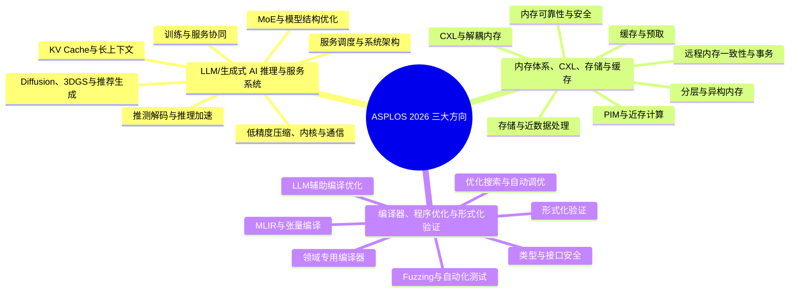

# ASPLOS 2026 三大重点方向梳理

整理日期：2026-07-13

## 1. 范围与说明

本文基于 ASPLOS 2026 Volume 1/2 两卷论文集抽取的 152 篇 research paper，聚焦以下三个高密度方向：

| 方向 | 论文数 | 占 152 篇比例 | 核心矛盾 |
|---|---:|---:|---|
| LLM/生成式 AI 推理与服务系统 | 48 | 31.6% | 模型规模、动态负载与算力/内存成本之间的矛盾 |
| 内存体系、CXL、存储与缓存 | 26 | 17.1% | 容量扩展、访问延迟、一致性与可编程性之间的矛盾 |
| 编译器、程序优化与形式化验证 | 23 | 15.1% | 硬件复杂度、优化空间与软件正确性之间的矛盾 |

三个方向合计 97 篇，占当前论文集的 63.8%。主方向计数互斥；下文的子方向用于知识组织，允许一篇论文跨多个子方向出现。

数据来源：

- [ASPLOS 2026 官网](https://www.asplos-conference.org/asplos2026/)
- [参考文章](https://mp.weixin.qq.com/s/8ehUK45IhEvWCW9Rattfjw)
- [完整中文知识地图](./asplos2026_pdf_knowledge_map.md)
- [Volume 1 PDF](./source_pdfs/asplos2026.volume1.3760250.pdf)
- [Volume 2 PDF](./source_pdfs/asplos2026.volume2.3779212.pdf)

## 2. 知识地图

## 3. LLM/生成式 AI 推理与服务系统（48）

### 3.1 服务调度与端到端系统架构

核心问题：在请求长度、到达率和 SLO 持续变化时，同时提高吞吐、GPU 利用率和服务稳定性。

常见路线：动态批处理、时空复用、prefill/decode 解耦或复用、资源感知调度、跨模型资源共享。

代表论文：

- [XY-Serve: End-to-End Versatile Production Serving for Dynamic LLM Workloads](https://doi.org/10.1145/3760250.3762228)：面向动态生产负载的一体化 LLM serving 系统。
- [Bullet: Boosting GPU Utilization for LLM Serving via Dynamic Spatial-Temporal Orchestration](https://doi.org/10.1145/3779212.3790135)：通过时空协同编排提高 GPU 利用率。
- [Towards High-Goodput LLM Serving with Prefill-decode Multiplexing](https://doi.org/10.1145/3779212.3790236)：围绕 prefill/decode 复用提升满足 SLO 的有效吞吐。

### 3.2 推测解码、长链推理与 Test-Time Scaling

核心问题：推理链变长后，如何降低逐 token 解码和反复 rollout 的延迟与成本。

常见路线：draft/verify 解耦、异构推测解码、上下文稀疏、边缘侧 test-time scaling、强化学习 rollout 复用。

代表论文：

- [SwiftSpec: Disaggregated Speculative Decoding and Fused Kernels for Low-Latency LLM Inference](https://doi.org/10.1145/3779212.3790246)：结合解耦式推测解码与融合内核降低推理延迟。
- [SpeContext: Enabling Efficient Long-context Reasoning with Speculative Context Sparsity in LLMs](https://doi.org/10.1145/3779212.3790224)：利用推测式上下文稀疏加速长上下文推理。
- [FastTTS: Accelerating Test-Time Scaling for Edge LLM Reasoning](https://doi.org/10.1145/3779212.3790161)：关注边缘设备上的推理时扩展效率。

### 3.3 KV Cache、长上下文与内存卸载

核心问题：上下文增长使 KV Cache 成为容量、带宽与能耗瓶颈，限制并发规模。

常见路线：KV Cache 卸载与近存处理、token 选择、注意力重映射、前缀感知计算、分布式 prefill/decode。

代表论文：

- [REPA: Reconfigurable PIM for the Joint Acceleration of KV Cache Offloading and Processing](https://doi.org/10.1145/3779212.3790212)：用可重构 PIM 协同处理 KV Cache 卸载和计算。
- [STARC: Selective Token Access with Remapping and Clustering for Efficient LLM Decoding on PIM Systems](https://doi.org/10.1145/3779212.3790226)：通过 token 选择、重映射和聚类优化 PIM 解码。
- [A Cost-Effective Near-Storage Processing Solution for Offline Inference of Long-Context LLMs](https://doi.org/10.1145/3779212.3790119)：以近存计算降低长上下文离线推理成本。

### 3.4 MoE 与模型结构级优化

核心问题：MoE 降低单 token 计算量的同时，引入专家负载不均、跨设备通信和权重容量问题。

常见路线：专家重布局、投机预取、模式复用、自适应精度、专家卸载、混合扩散模型。

代表论文：

- [MoE-APEX: An Efficient MoE Inference System with Adaptive Precision Expert Offloading](https://doi.org/10.1145/3779212.3790187)：结合自适应精度与专家卸载优化 MoE 推理。
- [EARTH: An Efficient MoE Accelerator with Entropy-Aware Speculative Prefetch and Pattern Reuse](https://doi.org/10.1145/3779212.3790155)：以熵感知预取和模式复用加速 MoE。
- [LAER-MoE: Load-Adaptive Expert Re-layout for Efficient Mixture-of-Experts Training](https://doi.org/10.1145/3779212.3790180)：按负载动态重排专家，缓解训练中的不均衡。

### 3.5 低精度、压缩、算子内核与通信

核心问题：在精度可接受的前提下，减少模型存储、显存带宽、算子开销和多 GPU 通信成本。

常见路线：低比特数据格式、结构化 FFN、无损压缩、tile 级内核、推理专用通信抽象。

代表论文：

- [M2XFP: A Metadata-Augmented Microscaling Data Format for Efficient Low-bit Quantization](https://doi.org/10.1145/3779212.3790185)：通过带元数据的 microscaling 格式支持高效低比特量化。
- [oFFN: Outlier and Neuron-aware Structured FFN for Fast yet Accurate LLM Inference](https://doi.org/10.1145/3779212.3790194)：依据异常值和神经元特征构造高效 FFN。
- [MSCCL++: Rethinking GPU Communication Abstractions for AI Inference](https://doi.org/10.1145/3779212.3790188)：重新设计面向 AI 推理的 GPU 通信抽象。

### 3.6 非 LLM 生成式服务：Diffusion、3DGS 与推荐

核心问题：生成式 AI 服务正在从文本扩展到图像、视频、3D 场景和生成式推荐，工作负载更加异构。

常见路线：混合扩散模型、DiT 混部调度、3DGS 协同渲染、推荐注意力结构优化。

代表论文：

- [MoDM: Efficient Serving for Image Generation via Mixture-of-Diffusion Models](https://doi.org/10.1145/3760250.3762220)：以 Mixture-of-Diffusion 架构优化图像生成服务。
- [TetriServe: Efficiently Serving Mixed DiT Workloads](https://doi.org/10.1145/3779212.3790233)：面向混合 DiT 工作负载进行高效服务调度。
- [BAT: Efficient Generative Recommender Serving with Bipartite Attention](https://doi.org/10.1145/3779212.3790131)：以二部注意力优化生成式推荐服务。

### 3.7 训练与服务边界协同

核心问题：训练、强化学习、推理服务不再是完全独立的阶段，数据与资源调度需要跨阶段协同。

常见路线：训练卸载、稀疏训练、推理 rollout 复用、训练/服务统一资源管理。

代表论文：

- [SuperOffload: Unleashing the Power of Large-Scale LLM Training on Superchips](https://doi.org/10.1145/3760250.3762217)：探索 Superchip 环境下的大模型训练卸载。
- [Dynamic Sparsity in Large-Scale Video DiT Training](https://doi.org/10.1145/3760250.3762216)：利用动态稀疏降低大规模视频 DiT 训练成本。
- [History Doesn't Repeat Itself but Rollouts Rhyme: Accelerating Reinforcement Learning with RhymeRL](https://doi.org/10.1145/3779212.3790172)：利用 rollout 相似性加速强化学习流程。

## 4. 内存体系、CXL、存储与缓存（26）

### 4.1 CXL 与解耦内存的编程和资源管理

核心问题：CXL 扩展了内存容量和共享范围，但暴露出分配、隔离、迁移和编程接口问题。

常见路线：CXL 编程模型、pod 级内存分配、多主机共享、页迁移与软硬件协同。

代表论文：

- [A Programming Model for Disaggregated Memory over CXL](https://doi.org/10.1145/3779212.3790121)：为 CXL 解耦内存提供可用的编程抽象。
- [Cxlalloc: Safe and Efficient Memory Allocation for a CXL Pod](https://doi.org/10.1145/3779212.3790149)：解决 CXL pod 内的安全高效内存分配。
- [PIPM: Partial and Incremental Page Migration for Multi-host CXL Disaggregated Shared Memory](https://doi.org/10.1145/3779212.3790203)：以局部、增量页迁移优化多主机 CXL 共享内存。

### 4.2 远程内存一致性、顺序与事务

核心问题：解耦系统跨越非一致互连后，如何兼顾正确性、事务原子性与低延迟。

常见路线：远程内存顺序、failure-atomic 事务卸载、竞争控制、共享内存模型检查。

代表论文：

- [CXLMC: Model Checking CXL Shared Memory Programs](https://doi.org/10.1145/3779212.3790150)：对 CXL 共享内存程序进行模型检查。
- [Efficient Remote Memory Ordering for Non-Coherent Interconnects](https://doi.org/10.1145/3779212.3790156)：优化非一致互连上的远程内存顺序。
- [CPU-Oblivious Offloading of Failure-Atomic Transactions for Disaggregated Memory](https://doi.org/10.1145/3779212.3790146)：将 failure-atomic 事务从 CPU 路径中卸载。

### 4.3 分层内存与异构内存

核心问题：DRAM、CXL 内存和其他容量层的性能差异大，静态放置很难保持稳定收益。

常见路线：关键性优先放置、性能预测、细粒度迁移、访问热度和重用感知。

代表论文：

- [PACT: A Criticality-First Design for Tiered Memory](https://doi.org/10.1145/3779212.3790198)：按访问关键性设计分层内存策略。
- [Performance Predictability in Heterogeneous Memory](https://doi.org/10.1145/3779212.3790201)：关注异构内存系统的可预测性能。
- [PIPM](https://doi.org/10.1145/3779212.3790203)：从迁移粒度角度减少多层内存的数据搬运开销。

### 4.4 存储系统与近数据处理

核心问题：数据处理逐步下沉到 SSD、计算存储和解耦存储，需要重新划分计算与 I/O 边界。

常见路线：计算存储仿真、数据库 pushdown、近存推理、面向闪存写放大的缓存设计。

代表论文：

- [CEMU: Enabling Full-System Emulation of Computational Storage beyond Hardware Limits](https://doi.org/10.1145/3779212.3790137)：提供突破真实硬件容量限制的计算存储全系统仿真。
- [Understanding and Optimizing Database Pushdown on Disaggregated Storage](https://doi.org/10.1145/3779212.3790243)：分析并优化解耦存储中的数据库计算下推。
- [Nemo: A Low-Write-Amplification Cache for Tiny Objects on Log-Structured Flash Devices](https://doi.org/10.1145/3779212.3790191)：降低日志结构闪存上小对象缓存的写放大。

### 4.5 缓存、预取与数据复用

核心问题：通用缓存策略越来越难适配数据中心、网络和 AI 的不规则访问模式。

常见路线：关键性感知指令缓存、LLM 提示硬件预取、缓存热度保持、旧 profile 鲁棒优化。

代表论文：

- [ICARUS: Criticality and Reuse based Instruction Caching for Datacenter Applications](https://doi.org/10.1145/3779212.3790175)：结合关键性和重用特征优化数据中心指令缓存。
- [PF-LLM: Large Language Model Hinted Hardware Prefetching](https://doi.org/10.1145/3779212.3790202)：用 LLM 提示辅助硬件预取决策。
- [Toasty: Speeding up Network I/O with Cache-Warm Buffers](https://doi.org/10.1145/3779212.3790235)：利用 cache-warm buffer 降低网络 I/O 开销。

### 4.6 PIM 与近存计算

核心问题：数据搬运成本超过计算本身后，应把哪些计算放进内存、如何保持通用性成为关键。

常见路线：细粒度 PIM、可重构 PIM、图计算近存加速、KV Cache 近存处理。

代表论文：

- [CoGraf: Fully Accelerating Graph Applications with Fine-Grained PIM](https://doi.org/10.1145/3779212.3790142)：以细粒度 PIM 完整加速图应用。
- [REPA](https://doi.org/10.1145/3779212.3790212)：展示 PIM 与 LLM KV Cache 协同的交叉方向。
- [STARC](https://doi.org/10.1145/3779212.3790226)：展示 PIM 上选择性 token 访问和数据布局优化。

### 4.7 内存可靠性、安全与自动验证

核心问题：内存扩展、共享和高密度存储增加了隔离、读扰动与硬件接口验证风险。

常见路线：能力内存保护、NAND 读扰动管理、CXL bridge 自动综合与验证。

代表论文：

- [CHERI-SIMT: Implementing Capability Memory Protection in GPUs](https://doi.org/10.1145/3760250.3762234)：将 capability memory protection 引入 GPU/SIMT 环境。
- [STRAW: Stress-Aware WL-Based Read Disturbance Management for High-Density NAND Flash Memory](https://doi.org/10.1145/3779212.3790228)：面向高密度 NAND 的读扰动管理。
- [vCXLGen: Automated Synthesis and Verification of CXL Bridges for Heterogeneous Architectures](https://doi.org/10.1145/3779212.3790245)：自动生成并验证异构架构中的 CXL bridge。

## 5. 编译器、程序优化与形式化验证（23）

### 5.1 MLIR、Lowering 与张量编译

核心问题：如何把高层张量/领域程序稳定地下沉到 GPU、晶圆级、流式数据流和 AI 加速器。

常见路线：MLIR lowering、算子融合、稀疏数据流编译、张量代数中间表示。

代表论文：

- [An MLIR Lowering Pipeline for Stencils at Wafer-Scale](https://doi.org/10.1145/3779212.3790124)：构建面向晶圆级 stencil 计算的 MLIR lowering 流水线。
- [FuseFlow: A Fusion-Centric Compilation Framework for Sparse Deep Learning on Streaming Dataflow](https://doi.org/10.1145/3779212.3790165)：以融合为中心编译稀疏深度学习数据流。
- [RedFuser: An Automatic Operator Fusion Framework for Cascaded Reductions on AI Accelerators](https://doi.org/10.1145/3779212.3790209)：自动融合 AI 加速器上的级联 reduction。

### 5.2 优化搜索、自动调优与配置开销

核心问题：优化空间和硬件配置组合迅速膨胀，人工规则难以覆盖全部架构和工作负载。

常见路线：强化学习、等式饱和、自动算子融合、配置搜索与性能反馈。

代表论文：

- [CHEHAB RL: Learning to Optimize Fully Homomorphic Encryption Computations](https://doi.org/10.1145/3779212.3790138)：用强化学习优化全同态加密计算。
- [The Configuration Wall: Characterization and Elimination of Accelerator Configuration Overhead](https://doi.org/10.1145/3760250.3762225)：刻画并消除加速器配置开销。
- [Trinity: Three-Dimensional Tensor Program Optimization via Tile-level Equality Saturation](https://doi.org/10.1145/3779212.3790240)：以 tile 级等式饱和优化三维张量程序。

### 5.3 LLM 辅助编译器优化

核心问题：LLM 能生成优化候选，但需要可验证反馈、检索知识和搜索约束来保证有效性。

常见路线：peephole 优化发现、检索增强循环变换、LLM 生成测试器或搜索器。

代表论文：

- [LPO: Discovering Missed Peephole Optimizations with Large Language Models](https://doi.org/10.1145/3779212.3790184)：用 LLM 发现传统编译器遗漏的 peephole 优化。
- [LOOPRAG: Enhancing Loop Transformation Optimization with Retrieval-Augmented Large Language Models](https://doi.org/10.1145/3779212.3790183)：通过检索增强 LLM 改进循环变换优化。
- [Once4All: Skeleton-Guided SMT Solver Fuzzing with LLM-Synthesized Generators](https://doi.org/10.1145/3779212.3790195)：由 LLM 合成生成器，服务于 SMT solver fuzzing。

### 5.4 形式化验证与硬件正确性

核心问题：复杂硬件、可信执行环境和系统软件的状态空间巨大，验证规范本身也可能存在缺陷。

常见路线：模型检查、机器证明、规范一致性检测、RTL 污点方案设计、数据流电路验证。

代表论文：

- [Detecting Inconsistencies in ARM CCA's Formally Verified Specification](https://doi.org/10.1145/3779212.3790152)：检查形式化验证过的 ARM CCA 规范中的不一致。
- [Graphiti: Formally Verified Out-of-Order Execution in Dataflow Circuits](https://doi.org/10.1145/3779212.3790166)：形式化验证数据流电路中的乱序执行。
- [Compass: Navigating the Design Space of Taint Schemes for RTL Security Verification](https://doi.org/10.1145/3779212.3790144)：系统探索 RTL 安全验证的 taint 方案设计空间。

### 5.5 Fuzzing 与自动化系统测试

核心问题：数据库、DSP、SMT solver 等系统输入空间巨大，手工测试难以发现深层缺陷。

常见路线：结构化输入生成、状态覆盖、差分测试、LLM 合成生成器、规模化测试基础设施。

代表论文：

- [Signal Breaker: Fuzzing Digital Signal Processors](https://doi.org/10.1145/3779212.3790220)：面向数字信号处理器设计 fuzzing 方法。
- [Scaling Automated Database System Testing](https://doi.org/10.1145/3779212.3790215)：研究数据库自动化测试的规模扩展。
- [Understanding Query Optimization Bugs in Graph Database Systems](https://doi.org/10.1145/3779212.3790244)：分析图数据库查询优化缺陷及其触发模式。

### 5.6 类型系统、接口与程序安全

核心问题：许多系统错误来自接口状态、时序假设和资源成本在类型或 API 中表达不足。

常见路线：typestate、延迟抽象接口、静态成本分析、优化器友好的 instrumentation。

代表论文：

- [Rage Against the State Machine: Type-Stated Hardware Peripherals for Increased Driver Correctness](https://doi.org/10.1145/3779212.3790207)：用 typestate 表达硬件外设状态，提高驱动正确性。
- [Parameterized Hardware Design with Latency-Abstract Interfaces](https://doi.org/10.1145/3779212.3790199)：以延迟抽象接口支持参数化硬件设计。
- [Skyler: Static Analysis for Predicting API-Driven Costs in Serverless Applications](https://doi.org/10.1145/3779212.3790221)：静态预测 API 驱动的 serverless 成本。

### 5.7 领域专用编译器

核心问题：量子、FHE、zkVM 和神经符号计算具有特殊语义与成本模型，通用编译器难以直接适配。

常见路线：量子指令集与模拟编译、FHE 优化、zkVM 编译评估、神经符号 GPU 编译。

代表论文：

- [QTurbo: A Robust and Efficient Compiler for Analog Quantum Simulation](https://doi.org/10.1145/3760250.3762227)：面向模拟量子仿真的鲁棒高效编译器。
- [Evaluating Compiler Optimization Impacts on zkVM Performance](https://doi.org/10.1145/3779212.3790159)：评估编译器优化对 zkVM 性能的影响。
- [Lobster: A GPU-Accelerated Framework for Neurosymbolic Programming](https://doi.org/10.1145/3760250.3762232)：为神经符号程序提供 GPU 加速框架。

## 6. 三个方向之间的交叉关系

| 交叉点 | 典型问题 | 代表论文 |
|---|---|---|
| LLM × 内存 | KV Cache 容量、带宽、卸载和近存处理 | REPA、STARC、Near-Storage Long-Context Inference |
| LLM × 编译器 | 自动发现优化、循环变换、张量程序优化 | LPO、LOOPRAG、Trinity |
| 内存 × 编译器/验证 | CXL 编程模型、一致性验证、bridge 自动生成 | CXLMC、vCXLGen、Cxlalloc |
| 三者交汇 | 面向异构硬件的模型压缩、编译映射、运行时调度与内存放置协同 | M2XFP、MoE-APEX、MSCCL++ |

整体趋势可以概括为：**优化目标正在从单算子峰值性能，转向跨模型结构、编译器、运行时、内存和互连的端到端协同。**

## 7. 建议阅读路线

### 路线 A：LLM Serving 系统

1. XY-Serve：建立动态生产 serving 的整体视角。
2. High-Goodput Prefill-decode Multiplexing：理解 goodput 与 P/D 资源组织。
3. SwiftSpec：补充推测解码和低延迟内核。
4. REPA / STARC：进入 KV Cache 与 PIM 的交叉问题。
5. MoE-APEX：扩展到 MoE 权重容量和专家卸载。

### 路线 B：CXL 与分层内存

1. A Programming Model for Disaggregated Memory over CXL：理解编程抽象。
2. Cxlalloc：理解共享资源管理与安全分配。
3. CXLMC：理解共享内存正确性。
4. PIPM：理解迁移粒度和性能权衡。
5. PACT：扩展到通用分层内存策略。

### 路线 C：编译优化与验证

1. MLIR Lowering Pipeline for Stencils at Wafer-Scale：理解 lowering 主线。
2. FuseFlow / RedFuser：理解算子融合与硬件映射。
3. LPO / LOOPRAG：观察 LLM 如何进入优化搜索。
4. Graphiti：理解硬件形式化验证。
5. Once4All / Signal Breaker：扩展到生成式 fuzzing 和自动化测试。

## 8. 结论

- **LLM 系统方向**的主线已从“更快的单次推理”转向“动态负载下更高的 goodput、更低的单位成本和更稳定的 SLO”。
- **内存方向**的主线是 CXL/解耦内存落地后的系统化补课，包括编程接口、一致性、迁移、事务、可预测性和安全。
- **编译与验证方向**正在形成两股互补趋势：一边用 MLIR、自动搜索和 LLM 扩大优化能力，另一边用形式化验证和 fuzzing 控制复杂度带来的正确性风险。
- 最值得持续跟踪的交叉主题是 **KV Cache + PIM/CXL**、**LLM + 编译优化搜索**、**CXL + 形式化验证**。
