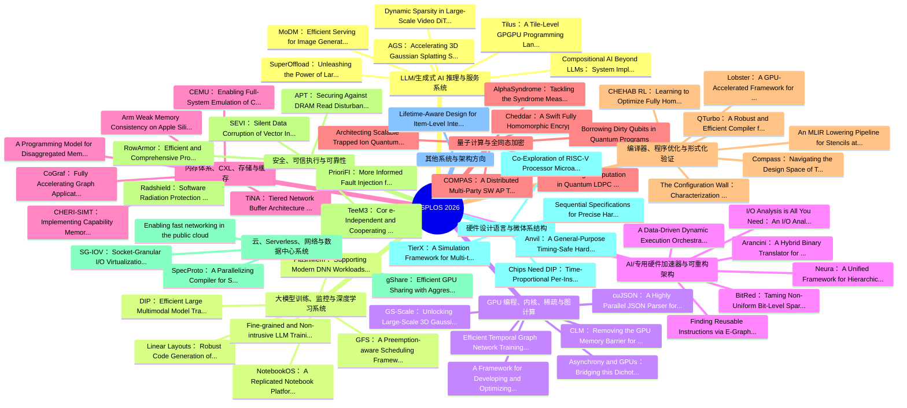

# ASPLOS 2026 Proceedings 知识地图（基于 Volume 1/2 PDF）

整理日期：2026-07-11

## 数据来源与覆盖范围

- `source_pdfs/asplos2026.volume1.3760250.pdf`
- `source_pdfs/asplos2026.volume2.3779212.pdf`
- 从 PDF 首页稳定抽取到 152 条带 DOI 和摘要的条目。
- 注：官网 program 页面列出更多 session paper；本文件严格基于当前两卷 PDF，可作为 proceedings 主源，但不是对官网 program 的最终全量校验。

## 总览

| 方向 | 数量 | 关注问题 |
|---|---:|---|
| LLM/生成式 AI 推理与服务系统 | 48 | 推理吞吐/延迟、prefill/decode、KV cache、MoE、生成式模型服务 |
| 大模型训练、监控与深度学习系统 | 9 | 训练效率、GPU 集群、DNN profiling、框架和内核诊断 |
| GPU 编程、内核、稀疏与图计算 | 8 | GPU kernel、稀疏/图计算、SIMT/数据并行、解析与 runtime |
| AI/专用硬件加速器与可重构架构 | 7 | PIM/CIM/FPGA/CGRA/近存储计算、专用 AI 加速 |
| 内存体系、CXL、存储与缓存 | 26 | CXL、分层/解耦内存、缓存、预取、存储系统 |
| 量子计算与全同态加密 | 13 | 量子编译/QEC/FHE/隐私计算的架构与系统支持 |
| 编译器、程序优化与形式化验证 | 23 | MLIR、代码生成、优化搜索、验证、测试与 fuzzing |
| 安全、可信执行与可靠性 | 8 | TEE、机密计算、DRAM/硬件可靠性、故障注入与恢复 |
| 云、Serverless、网络与数据中心系统 | 4 | serverless、云网络、SmartNIC、数据中心 workload |
| 硬件设计语言与微体系结构 | 5 | HDL/RTL、处理器、弱内存模型、微架构分析 |
| 其他系统与架构方向 | 1 | 跨方向或关键词不足以自动归类的条目 |

## 知识地图

## 阅读路线建议

1. 如果关注 LLM inference sharing / serving，优先读 LLM/生成式 AI 推理与服务系统，其次读内存体系、AI 加速器、GPU 内核三类。
2. 如果关注系统实现和部署，优先读 GPU/深度学习系统、云与数据中心、内存/CXL。
3. 如果关注架构和硬件协同设计，优先读 AI 加速器、硬件设计语言、量子/FHE。
4. 如果关注可靠性与安全，优先读 TEE/可靠性，再横向看内存安全和形式化验证。

## LLM/生成式 AI 推理与服务系统

### AGS: Accelerating 3D Gaussian Splatting SLAM via CODEC-Assisted Frame Covisibility Detection

- 来源：Volume 1，PDF 第 35 页
- DOI：https://doi.org/10.1145/3760250.3762229
- 摘要要点：Simultaneous Localization and Mapping (SLAM) is a critical task that enables autonomous vehicles to construct maps and localize themselves in unknown environments.
- 英文摘要：Simultaneous Localization and Mapping (SLAM) is a critical task that enables autonomous vehicles to construct maps and localize themselves in unknown environments. Recent breakthroughs combine SLAM with 3D Gaussian Splatting (3DGS) to achieve exceptional reconstruction fidelity. However, existing 3DGS-SLAM systems provide insufficient throughput due to the need for multiple training iterations per frame and the vast number of Gaussians. In this paper, we propose AGS, an algorithm-hardware co-design framework to boost the efficiency of 3DGS-SLAM based on the intuition that SLAM systems process frames in a streaming manner, where adjacent frames exhibit high similarity that can be utilized for acceleration. On the software level: 1) We propose a coarse-then-fine-grained pose tracking method with respect to the robot’s movement. 2) We avoid redundant computations of Gaussians by sharing their contribution information across frames. On the hardware level, we propose a frame covisibility detection engine to extract intermediate data from the video CODEC. We also implement a pose tracking engine and a mapping engine with workload schedulers to efficiently deploy the AGS algorithm. Our evaluation shows that AGS achieves up to17.12×, 6.71×, and 5.41× speedups against the mobile and high-end GPUs, and a state-of-the-art 3DGS accelerator, GSCore.

### Compositional AI Beyond LLMs: System Implications of Neuro-Symbolic-Probabilistic Architectures

- 来源：Volume 1，PDF 第 82 页
- DOI：https://doi.org/10.1145/3760250.3762235
- 摘要要点：Large Language Models (LLMs) have driven remarkable progress in artificial intelligence (AI), but their rapid growth faces challenges of unsustainable computation, limited robustness, and poor explainability.
- 英文摘要：Large Language Models (LLMs) have driven remarkable progress in artificial intelligence (AI), but their rapid growth faces challenges of unsustainable computation, limited robustness, and poor explainability. Compositional AI, which integrates LLMs with symbolic reasoning and probabilistic inference, has emerged as a promising paradigm to enable interpretability, robustness, trustworthiness, and dataefficient learning. Recent neuro-symbolic-probabilistic systems demonstrate strong potential in agentic applications, advancing reasoning and cognitive capabilities toward humanlike intelligence. In this paper, we aim to understand the system implications of neuro-symbolic-probabilistic architectures. We first develop a taxonomy and analyze the scaling efficiency of neuro-symbolic-probabilistic models. We then perform a detailed characterization across CPUs and GPUs, evaluating their runtime, memory, compute operators, dataflow, scalability, communication, and system behaviors. Our studies reveal that compositional models suffer from inefficiencies on offthe-shelf hardware, constrained by heterogeneous compute kernels, irregular memory access, complex flow control, data dependencies, and high data movement. Guided by these insights, we present several software- and system-level optimizations to demonstrate the potential for improving the performance, efficiency, and scalability of neuro-symbolic∗Corresponding email: zishenwan@gatech.edu

### Dynamic Sparsity in Large-Scale Video DiT Training

- 来源：Volume 1，PDF 第 116 页
- DOI：https://doi.org/10.1145/3760250.3762216
- 摘要要点：Diffusion Transformers (DiTs) have shown remarkable performance in generating high-quality videos.
- 英文摘要：Diffusion Transformers (DiTs) have shown remarkable performance in generating high-quality videos. However, the quadratic complexity of 3D full attention remains a bottleneck in scaling DiT training, especially with high-definition, lengthy videos, where it can consume up to 95% of processing time and demand specialized context parallelism. This paper introduces DSV to accelerate video DiT training by leveraging the dynamic attention sparsity we empirically observe. DSV uses a two-stage algorithm to capture the dynamic sparsity patterns via low-rank based approximation of the original query and key. It employs custom kernels to efficiently identify critical key-value pairs and compute the sparse attention. To accommodate the new sparsity dimension, DSV adopts a hybrid sparsity-aware context parallelism that re-balances the skewed workload across attention heads and blocks due to sparsity heterogeneity. DSV achieves up to 3.02× higher training throughput, scaling to 128 GPUs and 520k token lengths, while maintaining model quality comparable to full attention schemes.

### MoDM: Efficient Serving for Image Generation via Mixture-of-Diffusion Models

- 来源：Volume 1，PDF 第 178 页
- DOI：https://doi.org/10.1145/3760250.3762220
- 摘要要点：Diffusion-based text-to-image generation models trade latency for quality: small models are fast but generate lower quality images, while large models produce better images but are slow.
- 英文摘要：Diffusion-based text-to-image generation models trade latency for quality: small models are fast but generate lower quality images, while large models produce better images but are slow. We presentMoDM, a novel caching-based serving system for diffusion models that dynamically balances latency and quality through a mixture of diffusion models. Unlike prior approaches that rely on model-specific internal features, MoDM caches final images, allowing seamless retrieval and reuse across multiple diffusion model families. This design enables adaptive serving by dynamically balancing latency and image quality : using smaller models for cache-hit requests to reduce latency while reserving larger models for cache-miss requests to maintain quality. Small model image quality is preserved using retrieved cached images. We design a global monitor that optimally allocates GPU resources and balances inference workload, ensuring high throughput while meeting Service-Level Objectives (SLOs) under varying request rates. Our evaluations show that MoDM significantly reduces an average serving time by 2.5× while retaining image quality, making it a practical solution for scalable and resource-efficient model deployment. Code is available at: https://github.com/stsxxx/MoDM.

### SuperOffload: Unleashing the Power of Large-Scale LLM Training on Superchips

- 来源：Volume 1，PDF 第 264 页
- DOI：https://doi.org/10.1145/3760250.3762217
- 摘要要点：The emergence of Superchips represents a significant advancement in next-generation AI hardware.
- 英文摘要：The emergence of Superchips represents a significant advancement in next-generation AI hardware. These Superchips employ a tightly coupled heterogeneous architecture that integrates GPU and CPU on the same package, which offers unprecedented computational power. However, there has been scant research investigating how LLM training benefits from this new architecture. In this work, for the first time, we study LLM training solutions based on offloading for Superchips. We observe important differences between Superchips and traditional loosely-coupled GPU-CPU architecture, which necessitate revisiting prevailing assumptions about offloading. Based on that, we present SuperOffload, a Superchip-centric offloading system that simultaneously uses Hopper GPU, Grace CPU, and NVLink-C2C interconnect more efficiently. SuperOffload accomplishes this via a combination of techniques, such as adaptive weight offloading, bucketization repartitioning, Superchip-aware casting, speculative execution, and a highly optimized Adam optimizer for Grace CPUs. Our evaluation of SuperOffload on NVIDIA GH200 demonstrates up to 2.5 × throughput improvement compared to state-of-the-art offloading-based systems, enabling training of up to 25B model on a single Superchip while achieving high training throughput. We also extend SuperOffload with ZeRO-style data parallelism and DeepSpeed-Ulysses sequence parallelism, enabling training of 13B model with sequence lengths up to 1 million tokens on 8 GH200 while achieving 55% MFU.

### Tilus: A Tile-Level GPGPU Programming Language for Low-Precision Computation

- 来源：Volume 1，PDF 第 296 页
- DOI：https://doi.org/10.1145/3760250.3762219
- 摘要要点：Serving Large Language Models (LLMs) is critical for AIpowered applications, yet it demands substantial computational resources, particularly in memory bandwidth and computational throughput.
- 英文摘要：Serving Large Language Models (LLMs) is critical for AIpowered applications, yet it demands substantial computational resources, particularly in memory bandwidth and computational throughput. Low-precision computation has emerged as a key technique to improve efficiency while reducing resource consumption. Existing approaches for generating low-precision kernels are limited to weight bit widths that are powers of two and suffer from suboptimal performance because of high-level GPU programming abstractions. These abstractions restrict critical optimizations, such as fine-grained register management and optimized memory access patterns, that are essential for efficient lowprecision computations. In this paper, we introduce Tilus, a domain-specific language designed for General-Purpose GPU (GPGPU) computing that supports low-precision data types with arbitrary bit widths from 1 to 8 while maintaining GPU programmability. Tilus features a thread-block-level programming model, a hierarchical memory space, a novel algebraic layout system, and extensive support for diverse low-precision data types. Tilus programs are compiled into ∗Also with NVIDIA. †Also with Vector Institute.

### XY-Serve: End-to-End Versatile Production Serving for Dynamic LLM Workloads

- 来源：Volume 1，PDF 第 329 页
- DOI：https://doi.org/10.1145/3760250.3762228
- 摘要要点：Meeting growing demands for low latency and cost efficiency in production-grade large language model (LLM) serving systems requires integrating advanced optimization techniques.
- 英文摘要：Meeting growing demands for low latency and cost efficiency in production-grade large language model (LLM) serving systems requires integrating advanced optimization techniques. However, dynamic and unpredictable input-output lengths of LLM, compounded by these optimizations, exacerbate the issues of workload variability, making it difficult to maintain high efficiency on AI accelerators, especially DSAs with tile-based programming models. To address this challenge, we introduce XY-Serve, a versatile, Ascend NPU native, end-to-end production LLM-serving system. The core idea is an abstraction mechanism that smooths out the workload variability by decomposing computations into unified, hardware-friendly, fine-grained meta primitives. Then, kernels can efficiently execute without concerning the irregularity of workload. After this abstraction mechanism, for Attention, we propose a meta-kernel that computes the basic ∗Both authors contributed equally to this research. †Corresponding author

### A Cost-Effective Near-Storage Processing Solution for Offline Inference of Long-Context LLMs

- 来源：Volume 2，PDF 第 38 页
- DOI：https://doi.org/10.1145/3779212.3790119
- 摘要要点：The computational and memory demands of large language models for generative inference present significant challenges for practical deployment.
- 英文摘要：The computational and memory demands of large language models for generative inference present significant challenges for practical deployment. One promising solution targeting offline inference is offloading-based batched inference, which extends the GPU’s memory hierarchy with host memory and storage. However, it often suffers from substantial I/O overhead, primarily due to the large KV cache sizes that scale with batch size and context window length. In this paper, we introduceHILOS, a framework that boosts offline inference throughput using near-storage processing. The core of HILOS is attention near storage, which offloads memory-intensive attention operations to near-storage accelerators, reducing traffic across the system interconnect. Building on attention near storage, HILOS incorporates three additional optimizations. First,cooperative X-cache minimizes KV cache I/O by exploiting available host resources after offloading. Second, delayed KV cache writeback hides storage write latency and mitigates storage write amplification. Finally, a memory-efficient attention accelerator sustains high throughput for long sequences within the resource constraints of NSP devices. We implemented and evaluated HILOS on a real system equipped with 16 SmartSSDs. Compared to state-of-the-art offloading-based inference frameworks, HILOS achieves up to 7.86× throughput while reducing energy consumption by up to 85%. The source code for HILOS is available at https://github.com/hongsunjang/HILOS.

### BAT: Efficient Generative Recommender Serving with Bipartite Attention

- 来源：Volume 2，PDF 第 256 页
- DOI：https://doi.org/10.1145/3779212.3790131
- 摘要要点：Generative Recommenders (GRs) have recently emerged as promising alternatives to traditional Deep Learning Recommendation Models (DLRMs).
- 英文摘要：Generative Recommenders (GRs) have recently emerged as promising alternatives to traditional Deep Learning Recommendation Models (DLRMs). Despite their potential, GRs remain computationally expensive in inference, exhibiting compute-bound characteristics similar to the prefill stage of Large Language Model (LLM) inference. Prefix caching can reduce redundant computation by reusing previously constructed KV caches. However, the unique properties of GRs, i.e., highly personalized user profiles and real-time item retrieval, make cache reuse across queries challenging, resulting in limited computational savings. To address these challenges, we present Bat, an efficient serving system for GRs. The key observation is that the semantics between user and item tokens are permutationinvariant. Building on this, we propose Bipartite Attention, a novel attention mechanism that enables adaptive selection of either the user or the item as the prompt prefix without compromising accuracy, thereby unlocking new opportunities ∗Equal Contribution.

### BlendServe: Optimizing Offline Inference with Resource-Aware Batching

- 来源：Volume 2，PDF 第 288 页
- DOI：https://doi.org/10.1145/3779212.3790133
- 摘要要点：Offline batch inference is gaining popularity as a cost-effective solution for latency-insensitive tasks, such as model evaluation and data curation.
- 英文摘要：Offline batch inference is gaining popularity as a cost-effective solution for latency-insensitive tasks, such as model evaluation and data curation. As the latency objective is highly relaxed, maximizing throughput becomes the primary goal in offline inference. Previous studies focused solely on optimizing throughput within a batch. However, the diverse resource demands (compute-intensive vs. memory-intensive) across a wide range of applications make these approaches less effective, as imbalanced resource demands between batches restrict optimization opportunities. Our insight for achieving optimal throughput is to reorder requests into batches that mix compute- and memoryintensive workloads to maximize resource overlap. However, such a request schedule can conflict with the schedule that maximizes prefix sharing, a widely-used performance optimization, causing suboptimal inference throughput. In this paper, we first build a performance model to analyze request resource demands. Based on it, we design BlendServe, which harmonizes both resource overlapping and prefix sharing to maximize throughput. BlendServe organizes all requests using a resource-aware prefix tree and proposes a dual scanning algorithm to obtain the request schedule. Our evaluation on various models and workloads shows that BlendServe can achieve up to 90% of the optimal throughput. ∗Both authors contributed equally to this work.

### Bullet: Boosting GPU Utilization for LLM Serving via Dynamic Spatial-Temporal Orchestration

- 来源：Volume 2，PDF 第 323 页
- DOI：https://doi.org/10.1145/3779212.3790135
- 摘要要点：Modern large language model (LLM) serving systems confront inefficient GPU utilization due to the fundamental mismatch between compute-intensive prefill phase and memorybound decode phase.
- 英文摘要：Modern large language model (LLM) serving systems confront inefficient GPU utilization due to the fundamental mismatch between compute-intensive prefill phase and memorybound decode phase. While current practices attempt to address this by organizing these phases into hybrid batches, such solutions create an inefficient tradeoff that sacrifices either throughput or latency, leaving substantial GPU resources underutilized. For this, we identify two key root causes: 1) the prefill phase suffers from suboptimal compute utilization due to wave quantization and attention bottlenecks, and 2) hybrid batching disproportionately prioritizes latency over throughput, wasting both compute resources and memory bandwidth. To mitigate the issues, we present Bullet , a novel spatial-temporal orchestration system that eliminates these inefficiencies through fine-grained phase coordination. Bullet enables concurrent execution of prefill and decode requests, while dynamically provisioning GPU resources based on real-time performance modeling. By integrating SLO-aware scheduling and adaptive resource allocation, Bullet maximizes GPU utilization without compromising latency targets. Experimental evaluations on real-world workloads demonstrate that Bullet delivers 1.26× average throughput gains (up to 1.55×) over state-of-the-arts, while consistently meeting latency constraints.

### CacheMind: From Miss Rates to Why – Natural-Language, Trace-Grounded Reasoning for Cache Replacement

- 来源：Volume 2，PDF 第 340 页
- DOI：https://doi.org/10.1145/3779212.3790136
- 摘要要点：Cache replacement remains a challenging problem in CPU microarchitecture, often addressed using hand-crafted heuristics that limit cache performance.
- 英文摘要：Cache replacement remains a challenging problem in CPU microarchitecture, often addressed using hand-crafted heuristics that limit cache performance. Cache data analysis requires parsing millions of trace entries with manual filtering, making the process slow and non-interactive. To address this, we introduce CacheMind, a conversational tool that uses Retrieval-Augmented Generation (RAG) and Large Language Models (LLMs) to enable semantic reasoning over cache traces. Architects can now ask natural language questions like, "Why is the memory access associated with PC X causing more evictions ?", and receive tracegrounded, human-readable answers linked to program semantics for the first time. To evaluate CacheMind, we present CacheMindBench, the first verified benchmark suite for LLM-based reasoning for the cache replacement problem. Using theSieve retriever, CacheMind achieves 66.67% on 75 unseen trace-grounded questions and 84.80% on 25 unseen policy-specific reasoning tasks; with Ranger, it achieves 89.33% and 64.80% on the same evaluations. Additionally, with Ranger, CacheMind achieves 100% accuracy on 4 out of 6 categories in the trace-grounded tier of CacheMindBench. Compared to LlamaIndex (10% retrieval success), Sieve achieves 60% and Ranger achieves 90%, demonstrating that existing RetrievalAugmented Generation (RAGs) are insufficient for precise, trace-grounded microarchitectural reasoning.

### CREATE: Cross-Layer Resilience Characterization and Optimization for Efficient yet Reliable Embodied AI Systems

- 来源：Volume 2，PDF 第 526 页
- DOI：https://doi.org/10.1145/3779212.3790147
- 摘要要点：Embodied Artificial Intelligence (AI) has recently attracted significant attention as it bridges AI with the physical world.
- 英文摘要：Embodied Artificial Intelligence (AI) has recently attracted significant attention as it bridges AI with the physical world. Modern embodied AI systems often combine a Large Language Model (LLM)-based planner for high-level task planning and a reinforcement learning (RL)-based controller for low-level action generation, enabling embodied agents to tackle complex tasks in real-world environments. However, deploying embodied agents remains challenging due to their high computation requirements, especially for batterypowered local devices. Although techniques like lowering operating voltage can improve energy efficiency, they can introduce bit errors and result in task failures. ∗Corresponding author

### DARTH-PUM: A Hybrid Processing-Using-Memory Architecture

- 来源：Volume 2，PDF 第 596 页
- DOI：https://doi.org/10.1145/3779212.3790151
- 摘要要点：Analog processing-using-memory (PUM; a.k.a.
- 英文摘要：Analog processing-using-memory (PUM; a.k.a. in-memory computing) makes use of electrical interactions inside memory arrays to perform bulkmatrix–vector multiplication (MVM) operations. However, many popular matrix-based kernels need to execute non-MVM operations, which analog PUM cannot directly perform. To retain its energy efficiency, analog PUM architectures augment memory arrays with CMOSbased domain-specific fixed-function hardware to provide complete kernel functionality, but the difficulty of integrating such specialized CMOS logic with memory arrays has largely limited analog PUM to being an accelerator for machine learning inference, or for closely related kernels. An opportunity exists to harness analog PUM for general-purpose computation: recent works have shown that memory arrays can also perform Boolean PUM operations, albeit with very different supporting hardware and electrical signals than analog PUM. We proposeDARTH-PUM, a general-purpose hybrid PUM architecture that tackles key hardware and software challenges to integrating analog PUM and digital PUM. We propose optimized peripheral circuitry, coordinating hardware to manage and interface between both types of PUM, an easy-touse programming interface, and low-cost support for flexible data widths. These design elements allow us to build a practical PUM architecture that can execute kernels fully in memory, and can scale easily to cater to domains ranging from embedded applications to large-scale data-driven computing. We show how three popular applications (AES encryption, convolutional neural networks, large-language models) can map to and benefit from DARTH-PUM, with speedups of 59.4×, 14.8×, and 40.8×over an analog+CPU baseline.

### DFVG: A Heterogeneous Architecture for Speculative Decoding with D raft-on-FPGA and Verify-on-GPU Shaoqiang Lu∗

- 来源：Volume 2，PDF 第 635 页
- DOI：https://doi.org/10.1145/3779212.3790153
- 摘要要点：Speculative decoding is a promising paradigm that accelerates LLM inference by generating drafts and performing verification.
- 英文摘要：Speculative decoding is a promising paradigm that accelerates LLM inference by generating drafts and performing verification. However, such systems still face three major challenges: (1) The imbalance in resource requirements between draft and verification models result in low utilization and energy inefficiency when deployed together. (2) Fixed-pattern token trees produce many candidates but few valid paths, resulting in redundant drafts due to the lack of full leverage of the inherent confidence in dynamic generation. (3) Asynchronous execution with frequent alternation between the two stages suffers from idle waiting and rollback overhead. To address these issues, we propose DFVG, a heterogeneous speculative decoding architecture that offloads draft generation to FPGAs and verification to GPUs, exploiting their complementary strengths. We introduce three key contributions: ∗Contributed equally to this work. †Corresponding author.

### EARTH: An Efficient MoE Accelerator with Entropy-Aware Speculative Prefetch and Pattern Reuse Fangxin Liu∗

- 来源：Volume 2，PDF 第 666 页
- DOI：https://doi.org/10.1145/3779212.3790155
- 摘要要点：Mixture-of-Experts (MoE) models significantly reduce computation in large language models by activating only a subset of experts per input token, but they introduce severe memory bottlenecks due to the large...
- 英文摘要：Mixture-of-Experts (MoE) models significantly reduce computation in large language models by activating only a subset of experts per input token, but they introduce severe memory bottlenecks due to the large number of expert parameters. Existing offloading and prefetching strategies either incur accuracy loss, prohibitively high memory traffic, or high decoding overhead, limiting deployment on resourceconstrained hardware. In this work, we present EARTH, a hardware–software co-design that addresses these challenges through three key innovations. First, we propose a dual-entropy encoding scheme that decomposes each expert into a high-information base and a delta component, enabling compact storage while preserving accuracy via adaptive precision management. Second, we introduce a deltaaware speculative prefetching and reuse mechanism that preloads base components of predicted experts and selectively fetches deltas, reusing previously computed delta patterns to reduce memory traffic and redundant computation. Third, we design a hardware accelerator that is co-designed ∗Both authors contributed equally to the paper. †Corresponding authors.

### FastTTS: Accelerating Test-Time Scaling for Edge LLM Reasoning

- 来源：Volume 2，PDF 第 765 页
- DOI：https://doi.org/10.1145/3779212.3790161
- 摘要要点：Recent advances in reasoning Large Language Models (LLMs) are driving the emergence of agentic AI systems.
- 英文摘要：Recent advances in reasoning Large Language Models (LLMs) are driving the emergence of agentic AI systems. Edge deployment of LLM agents near end users is increasingly necessary to protect data privacy, enable offline use, and provide responsive interaction with local context. However, strict memory constraints on edge devices limit deployment to smaller LLMs, whose reasoning capabilities are much weaker than those of large cloud models, hindering practical deployment of edge agentic AI. Test-Time Scaling (TTS) offers a promising solution by allocating more compute during inference to enhance the reasoning capability of edge LLMs. However, current TTS methods introduce heavy hardware performance overhead on resource-constrained devices, making them impractical for real applications. To address this challenge, we present FastTTS, a serving system that enables fast and efficient TTS for memory-constrained LLM reasoning. After analyzing common patterns across various TTS methods and identifying their performance bottlenecks, we introduce three novel techniques: i) Speculative Beam Extension, which mitigates system stragglers caused by irregular reasoning paths, ii) Asymmetric Multi-Model Memory Allocation, which dynamically balances memory usage between token generation and reasoning-step verification, and iii) Dynamic Prefix-Aware Scheduling, which optimizes reasoning execution to maximize KV-cache reuse

### Hardwired-Neuron Language Processing Units as General-Purpose Cognitive Substrates

- 来源：Volume 2，PDF 第 909 页
- DOI：https://doi.org/10.1145/3779212.3790169
- 摘要要点：The rapid advancement of Large Language Models (LLMs) has established language as a core general-purpose cognitive substrate, driving the demand for specialized Language Processing Units (LPUs) tailored for...
- 英文摘要：The rapid advancement of Large Language Models (LLMs) has established language as a core general-purpose cognitive substrate, driving the demand for specialized Language Processing Units (LPUs) tailored for LLM inference. To overcome the growing energy consumption of LLM inference systems, this paper proposes a Hardwired-Neurons Language Processing Unit (HNLPU), which physically hardwires LLM weight parameters into the computational fabric, achieving several orders of magnitude computational efficiency improvement by extreme specialization. However, a significant challenge ∗Corresponding Author

### HEPIC: Private Inference over Homomorphic Encr yption with Client Intervention Kevin Nam Dept. of ECE & ISRC,

- 来源：Volume 2，PDF 第 929 页
- DOI：https://doi.org/10.1145/3779212.3790170
- 摘要要点：Homomorphic Encryption (HE) enables Private Inference (PI) in Machine Learning as a Service (MLaaS), protecting both client inputs and server-side neural network (NN) parameters.
- 英文摘要：Homomorphic Encryption (HE) enables Private Inference (PI) in Machine Learning as a Service (MLaaS), protecting both client inputs and server-side neural network (NN) parameters. Existing PI techniques are predominantly implemented as either HE-based /f_ire-and-forget methods or MPCbased interactive methods. Recent HE-based PI systems improve the accuracy–performance trade-off via a layer-wise scheme and parameter switching, yet remain bottlenecked by /f_ire-and-forget execution in which the server alone performs costly ciphertext management (e.g., bootstrapping and scheme/parameter conversions). We present HEPIC, an HEbased PI system that explores a different design point by leveraging client interventions for ciphertext managements. In a sense, HEPIC shares a common ground with MPC-based PI of being interactive with the client, but differs in that the client only intervenes for ciphertext managements required in HE operations. Because ciphertext management has identical semantics on the client and the server, HEPIC lets developers decide where and how often to execute it, enabling /f_ine-grained trade-offs among computation, communication, and ciphertext con/f_iguration. HEPIC makes such execution practical by overlapping client re-encryption, server computation, and communication via dependency-aware pipelining and streaming-based transfers. We further enhance the performance with a cache-aware task allocator (CATA) and a cost-aware client intervention scheduler (CACIS) to exploit ciphertext-level parallelism and to mitigate stalls under ∗co-corr esponding authors

### History Doesn’t Repeat Itself but Rollouts Rhyme: Accelerating Reinforcement Learning with RhymeRL Jingkai He

- 来源：Volume 2，PDF 第 962 页
- DOI：https://doi.org/10.1145/3779212.3790172
- 摘要要点：With the rapid advancement of large language models (LLMs), reinforcement learning (RL) has emerged as a pivotal methodology for enhancing the reasoning capabilities of LLMs.
- 英文摘要：With the rapid advancement of large language models (LLMs), reinforcement learning (RL) has emerged as a pivotal methodology for enhancing the reasoning capabilities of LLMs. Unlike traditional pre-training approaches, RL encompasses multiple stages: rollout, reward, and training, which necessitates collaboration among various worker types. However, current RL systems continue to grapple with substantial GPU underutilization, due to two primary factors: (1) The rollout stage dominates the overall RL process due to test-time scaling; (2) Imbalances in rollout lengths (within the same batch) result in GPU bubbles. While prior solutions like asynchronous execution and truncation offer partial relief, they may compromise training accuracy for efficiency. Our key insight stems from a previously overlooked observation: rollout responses exhibit remarkable similarity across adjacent training epochs. Based on the insight, we introduce RhymeRL, an LLM RL system designed to accelerate RL training with two key innovations. First, to enhance rollout generation, we present HistoSpec, a speculative decoding inference engine that utilizes the similarity of historical rollout token sequences to obtain accurate drafts. Second, to tackle rollout bubbles, we introduce HistoPipe, a two-tier scheduling strategy that leverages the similarity of historical rollout distributions to balance workload among rollout workers. Experimental results demonstrate that RhymeRL achieves up to a 2.6x performance improvement over existing methods, without compromising accuracy or modifying the RL paradigm.

### It Takes Two to Entangle

- 来源：Volume 2，PDF 第 1055 页
- DOI：https://doi.org/10.1145/3779212.3790178
- 摘要要点：Distributed machine learning training and inference is common today because today’s large models require more memory and compute than can be provided by a single GPU.
- 英文摘要：Distributed machine learning training and inference is common today because today’s large models require more memory and compute than can be provided by a single GPU. Distributed models are generally produced by programmers who take a sequential model specification and apply several distribution strategies to distribute state and computation across GPUs. Unfortunately, bugs can be introduced in the process, and a distributed model implementation’s outputs might differ from the sequential model’s outputs. In this paper, we describe an approach to statically identify such bugs by checking model refinement, that is, can the sequential model’s outputs be reconstructed from the distributed model’s outputs? Our approach, implemented inEntangle, uses iterative rewriting to prove model refinement. Our approach can scale to today’s large models and deployments: we evaluate it using GPT and Llama-3. Further, it provides actionable outputs that aids in bug localization.

### LAER-MoE: Load-Adaptive Expert Re-layout for Efficient Mixture-of-Experts Training

- 来源：Volume 2，PDF 第 1088 页
- DOI：https://doi.org/10.1145/3779212.3790180
- 摘要要点：Expert parallelism is vital for effectively training Mixtureof-Experts (MoE) models, enabling different devices to host distinct experts, with each device processing different input data.
- 英文摘要：Expert parallelism is vital for effectively training Mixtureof-Experts (MoE) models, enabling different devices to host distinct experts, with each device processing different input data. However, during expert parallel training, dynamic routing results in significant load imbalance among experts: a handful of overloaded experts hinder overall iteration, emerging as a training bottleneck. In this paper, we introduce LAER-MoE, an efficient MoE training framework. The core of LAER-MoE is a novel parallel paradigm, Fully Sharded Expert Parallel (FSEP), which fully partitions each expert parameter by the number of devices and restores partial experts at expert granularity through All-to-All communication during training. This allows for flexible re-layout of expert parameters during training to enhance load balancing. In particular, we perform fine-grained scheduling of communication operations to minimize communication overhead. Additionally, we develop a load balancing planner to formulate re-layout strategies of experts and routing schemes for tokens during training. We perform experiments on an A100 cluster, and the results indicate that our system achieves up to 1.69x acceleration compared to the current state-of-the-art training systems. Source code available at https://github.com/PKUDAIR/Hetu-Galvatron/tree/laer-moe. ∗School of Computer Science & Beijing Key Laboratory of Software and Hardware Cooperative Artificial Intelligence Systems, Peking University †School of Artificial Intelligence, Shanghai Jiao Tong University ‡Institute of Computational Social Science, Peking University (Qingdao)

### LAIKA: Machine Learning-Assisted In-Kernel APU Acceleration

- 来源：Volume 2，PDF 第 1106 页
- DOI：https://doi.org/10.1145/3779212.3790181
- 摘要要点：The integration of machine learning (ML) into OS kernels is severely hampered by the high latency of offloading to discrete GPUs (dGPUs), where data transfers across the PCIe bus can consume over 93% of the...
- 英文摘要：The integration of machine learning (ML) into OS kernels is severely hampered by the high latency of offloading to discrete GPUs (dGPUs), where data transfers across the PCIe bus can consume over 93% of the total execution time. This paper argues that for many latency-sensitive kernel tasks, the solution is not a more powerful dGPU but a fundamental shift to an I/O-efficient architecture: the integrated GPU (iGPU) found in modern APUs. We present LAIKA, a kernel-space acceleration framework that fully exploits the APU’s unified memory. LAIKA combines three key mechanisms: a lightweight API proxy (AProxy) to safely bridge the kernel-user boundary, a tridomain shared memory manager (AShm) for true zero-copy data exchange, and APU Persistent Kernel (APK) to eliminate control-path overhead. Across a suite of representative kernel workloads, our evaluation shows that by eliminating the I/O bottleneck, LAIKA slashes end-to-end inference latency by up to 9.7 × and reduces total system power to as little as 28.9% of an optimized dGPU baseline. Our work identifies iGPUs as a practical and highly efficient alternative for machine learning acceleration within OS kernels.

### LOOPRAG: Enhancing Loop Transformation Optimization with Retrieval-Augmented Large Language Models

- 来源：Volume 2，PDF 第 1146 页
- DOI：https://doi.org/10.1145/3779212.3790183
- 摘要要点：Loop transformations are semantics-preserving optimization techniques applied at the source level, widely used in compilers to maximize objectives such as vectorization and parallelism.
- 英文摘要：Loop transformations are semantics-preserving optimization techniques applied at the source level, widely used in compilers to maximize objectives such as vectorization and parallelism. Despite decades of research, applying the optimal composition of loop transformations remains challenging due to inherent complexities, including dependency analysis and cost modeling for optimization objectives. Recent studies have explored the potential of Large Language Models (LLMs) for code optimization. However, our key observation is that LLMs often struggle with effective loop transformation optimization, frequently leading to errors or suboptimal optimization, thereby missing significant opportunities for performance improvements. To bridge this gap, we propose LOOPRAG, a novel retrievalaugmented generation framework designed to guide LLMs in performing effective loop optimization on Static Control Part (SCoP). We introduce a parameter-driven method to harness loop properties, which trigger various loop transformations, and generate diverse yet legal example codes serving as a demonstration source. To effectively obtain the most informative demonstrations, we propose a loop-aware ∗Corresponding author: Ming Cai (cm@zju.edu.cn).

### M2XFP: A Metadata-Augmented Microscaling Data Format for Efficient Low-bit Quantization

- 来源：Volume 2，PDF 第 1184 页
- DOI：https://doi.org/10.1145/3779212.3790185
- 摘要要点：Existing low-bit Microscaling (MX) formats, such as MXFP4, often suffer from substantial accuracy degradation due to the use of a shared scaling factor with the Power-of-Two format.
- 英文摘要：Existing low-bit Microscaling (MX) formats, such as MXFP4, often suffer from substantial accuracy degradation due to the use of a shared scaling factor with the Power-of-Two format. In this work, we explore strategies that introduce minimal metadata to recover accuracy lost during quantization while maintaining high bit efficiency across a wide range of large language models. We propose a complete algorithmhardware co-design based on flexible metadata, featuring an online quantization with simple encoding. To support the proposed method efficiently, we implement a lightweight hardware unit and integrate it into the accelerator. Evaluation results demonstrate that our method substantially narrows the accuracy gap, achieving on average a 70.63% reduction in accuracy loss compared to MXFP4 and a 37.30% reduction relative to the latest NVFP4 on LLM benchmarks. ∗Corresponding authors.

### MoE-APEX: An Efficient MoE Inference System with Adaptive Precision Expert Offloading

- 来源：Volume 2，PDF 第 1218 页
- DOI：https://doi.org/10.1145/3779212.3790187
- 摘要要点：Mixture-of-experts (MoE) architectures enable scalable Large Language Models (LLMs) with reduced computational overhead, yet their deployment on memory-constrained edge devices is hindered by substantial mem...
- 英文摘要：Mixture-of-experts (MoE) architectures enable scalable Large Language Models (LLMs) with reduced computational overhead, yet their deployment on memory-constrained edge devices is hindered by substantial memory demands. Traditional expert-offloading techniques mitigate memory constraints but often significantly increase inference latency. We introduce MoE-APEX, anAdaptive Precision EXpert offloading system that optimizes MoE inference for edge architectures by dynamically managing expert precision. Our core innovation is to replace less critical cache-miss experts with low-precision variants, reducing loading latency while maintaining accuracy. MoE-APEX introduces three innovative techniques that map the natural hierarchy of MoE computation: (1) a token-level dynamic expert loading mechanism, (2) a layer-level adaptive expert prefetching technique, and (3) a sequence-level cost-aware expert caching policy. These innovations enable MoE-APEX to leverage the benefits of mixed-precision expert inference fully. Implemented atop Llama.cpp, MoE-APEX achieves decoding speedups ranging from 1.34 × to 9.75× compared to state-of-the-art MoE offloading systems across diverse edge devices, offering a robust solution for efficient MoE deployment in resourceconstrained environments. ∗Both authors contributed equally to this research. †Co-corresponding authors.

### MSCCL++: Rethinking GPU Communication Abstractions for AI Inference

- 来源：Volume 2，PDF 第 1234 页
- DOI：https://doi.org/10.1145/3779212.3790188
- 摘要要点：AI applications increasingly run on fast-evolving, heterogeneous hardware to maximize performance, but generalpurpose libraries lag in supporting these features.
- 英文摘要：AI applications increasingly run on fast-evolving, heterogeneous hardware to maximize performance, but generalpurpose libraries lag in supporting these features. Performanceminded programmers often build custom communication stacks that are fast but error-prone and non-portable. This paper introduces MSCCL++, a design methodology for developing high-performance, portable communication kernels. It provides (1) a low-level, performance-preserving primitive interface that exposes minimal hardware abstractions while hiding the complexities of synchronization and consistency, (2) a higher-level DSL for application developers to implement workload-specific communication algorithms, and (3) a library of efficient algorithms implementing the standard collective API, enabling adoption by users with minimal expertise. Compared to state-of-the-art baselines, MSCCL++ achieves geomean speedups of 1.7× (up to 5.4×) for collective communication and 1.2× (up to 1.38×) for AI inference workloads. MSCCL++ is in production of multiple AI services ∗Now at xAI. †Now at Apple.

### Mugi: Value Level Parallelism For Efficient LLMs

- 来源：Volume 2，PDF 第 1249 页
- DOI：https://doi.org/10.1145/3779212.3790189
- 摘要要点：Value level parallelism (VLP) has been proposed to improve the efficiency of large-batch, low-precision general matrix multiply (GEMM) between symmetric activations and weights.
- 英文摘要：Value level parallelism (VLP) has been proposed to improve the efficiency of large-batch, low-precision general matrix multiply (GEMM) between symmetric activations and weights. In transformer based large language models (LLMs), there exist more sophisticated operations beyond activation-weight GEMM. In this paper, we explore how VLP benefits LLMs. First, we generalize VLP for nonlinear approximations, outperforming existing nonlinear approximations in end-toend LLM accuracy, performance, and efficiency. Our VLP approximation follows a value-centric approach, where important values are assigned with greater accuracy. Second, we optimize VLP for small-batch GEMMs with asymmetric inputs efficiently, which leverages timely LLM optimizations, including weight-only quantization, key-value (KV) cache quantization, and group query attention. Finally, we design a new VLP architecture, Mugi, to encapsulate the innovations above and support full LLM workloads, while providing better performance, efficiency and sustainability. Our experimental results show that Mugi can offer significant improvements on throughput and energy efficiency, up to 45× and 668× for nonlinear softmax operations, and 2.07× and 3.11× for LLMs, and also decrease operational carbon for LLM operation by 1.45× and embodied carbon by 1.48×.

### Nebula: Infinite-Scale 3D Gaussian Splatting in VR via Collaborative Rendering and Accelerated Stereo Rasterization

- 来源：Volume 2，PDF 第 1268 页
- DOI：https://doi.org/10.1145/3779212.3790190
- 摘要要点：3D Gaussian splatting (3DGS) has drawn significant attention in the architectural community recently.
- 英文摘要：3D Gaussian splatting (3DGS) has drawn significant attention in the architectural community recently. However, current architectural designs often overlook the 3DGS scalability, making them fragile for extremely large-scale 3DGS. Meanwhile, the VR bandwidth requirement makes it impossible to deliver high-fidelity and smooth VR content from the cloud. We present Nebula, a coherent acceleration framework for large-scale 3DGS collaborative rendering. Instead of streaming videos, Nebula streams intermediate results after the LoD search, reducing 1925% data communication between the cloud and the client. To further enhance the motionto-photon experience, we introduce a temporal-aware LoD search in the cloud that tames the irregular memory access and reduces redundant data access by exploiting temporal coherence across frames. On the client side, we propose a novel stereo rasterization that enables two eyes to share most computations during the stereo rendering with bit-accurate quality. With minimal hardware augmentations, Nebula achieves 2.7× motion-to-photon speedup and reduces 1925% bandwidth over lossy video streaming. ∗Corresponding Authors.

### oFFN: Outlier and Neuron-aware Structured FFN for Fast yet Accurate LLM Inference

- 来源：Volume 2，PDF 第 1334 页
- DOI：https://doi.org/10.1145/3779212.3790194
- 摘要要点：With the advent of large-scale language models (LLMs), various optimization techniques have been proposed to enable efficient inference.
- 英文摘要：With the advent of large-scale language models (LLMs), various optimization techniques have been proposed to enable efficient inference. Among these, methods that aggressively exploit output activation sparsity have attracted significant attention, which leverage ReLU-fied LLMs and skip the entire memory accesses as well as the computation for the output element if it was predicted as sparse. Achieving fast and accurate prediction of output activation sparsity is crucial to enhancing inference efficiency. However, in practice, phenomena such as activation outliers and hot and cold neurons, which significantly affect the exploitation of sparsity during LLM inference, have either been addressed individually or not structurally integrated in existing work. In this paper, we reveal that these two phenomena are closely related and propose a novel FFN architecture called oFFN (Outlier-aware Structured FFN) that effectively exploits them simultaneously. The proposed method rearranges the FFN weights in both row and column dimensions to enable efficient and accurate prediction of output sparsity, considering outliers, and to enable separation of hot and cold neurons, computing them with respective optimal operations. The proposed method allows for the optimal computation path for each neuron, even when the batch size dynamically changes. Compared to existing sparsity prediction techniques, our method achieves the fastest speed with negligible accuracy loss. Experimental results show that it delivers up to 2.01× faster end-to-end inference speed compared to dense inference, and up to 5.46× acceleration in FFN layers under autoregressive decoding in ReLU-fied LLMs.

### Ouroboros: Wafer-Scale SRAM CIM with Token-Grained Pipelining for Large Language Model Inference

- 来源：Volume 2，PDF 第 1382 页
- DOI：https://doi.org/10.1145/3779212.3790197
- 摘要要点：Large language model (LLM) inference demands vast memory capacity and hierarchical memory structures, but conventional architectures suffer from excessive energy and latency costs due to frequent data moveme...
- 英文摘要：Large language model (LLM) inference demands vast memory capacity and hierarchical memory structures, but conventional architectures suffer from excessive energy and latency costs due to frequent data movement across deep memory tiers. To address this, we propose a wafer-scale SRAM-based Computing-in-Memory (CIM) architecture that performs all LLM operations in situ within the first-level SRAM, eliminating off-chip data migration and achieving unprecedented energy efficiency. However, wafer-scale SRAM CIM presents ∗Equal contribution. †Corresponding authors.

### Parameterized Hardware Design with Latency-Abstract Interfaces

- 来源：Volume 2，PDF 第 1415 页
- DOI：https://doi.org/10.1145/3779212.3790199
- 摘要要点：Interfaces Rachit Nigam MIT CSAIL Cambridge, USA Ethan Gabizon∗ Cornell University Ithaca, USA Edmund Lam∗ Cornell University Ithaca, USA Carolyn Zech MIT CSAIL Cambridge, USA Jonathan Balkind UC Santa Barba...
- 英文摘要：Interfaces Rachit Nigam MIT CSAIL Cambridge, USA Ethan Gabizon∗ Cornell University Ithaca, USA Edmund Lam∗ Cornell University Ithaca, USA Carolyn Zech MIT CSAIL Cambridge, USA Jonathan Balkind UC Santa Barbara Santa Barbara, USA Adrian Sampson Cornell University Ithaca, USA Abstract Hardware designs must use latency-insensitive (LI) interfaces when timing is input-dependent. When timing is inputindependent, designs should use latency-sensitive (LS) interfaces for maximum performance. However, designs commonly use LI interfaces to integrate with externally generated LS modules–from, e.g., IP generators, high-level synthesis, or domain specific languages. In every fully integrated design, such uses of LI represent pure overhead . The challenge is that generators can dramatically change timing interfaces of the modules to meet performance objectives, and LI interfaces act as a usefuldesign abstraction and enable timing adaptation. We define latency-abstract (LA) interfaces, a new design abstraction, which provide the timing adaptability of LI interfaces at design-time and the efficient integration of LS interfaces. LA interfaces useoutput parameters, a novel compiletime mechanism for child modules to return values parent modules, to abstract and encapsulate timing behaviors at design time. During design elaboration, LA interfaces are compiled into efficient LS interfaces based on parameter values. While an attractive option, LA interfaces inherit the complexities of parameterized hardware design: the user must reason how parameters influence timing behaviors of modules and ensure that designs adapt to interface changes. To address this challenge and demonstrate the utility of LA interfaces, we design Lilac, a parameterized HDL that uses a type system track the influence of parameters on timing behaviors and formally guarantee thatevery parameterization of an LA design results in a circuit without structural ∗Equal contribution. This work is licensed under a Creative Commons AttributionNonCommercial-NoDerivatives 4.0 International License. ASPLOS ’26, Pittsburgh, PA, USA © 2026 Copyright held by the owner/author(s). ACM ISBN 979-8-4007-2359-9/2026/03 https://doi.org/10.1145/3779212.3790199 hazards. We demonstrate Lilac’s efficacy by using it to implement parameterized designs and integrate designs generated from external tools. We show that LA designs use26– 33% fewer chip resources and achieve6.8% better maximum frequencies than comparable LI implementations.

### PAT: Accelerating LLM Decoding via P refix-Aware Attention with Resource Efficient Multi-Tile Kernel Jinjun Yi†

- 来源：Volume 2，PDF 第 1429 页
- DOI：https://doi.org/10.1145/3779212.3790200
- 摘要要点：LLM serving is increasingly dominated by decode attention, which is a memory-bound operation due to massive KV cache loading from global memory.
- 英文摘要：LLM serving is increasingly dominated by decode attention, which is a memory-bound operation due to massive KV cache loading from global memory. Meanwhile, real-world workloads exhibit substantial, hierarchical shared prefixes across requests (e.g., system prompts, tools/templates, RAG). Existing attention implementations fail to fully exploit prefix sharing: one-query-per-CTA execution repeatedly loads shared prefix KV cache, while one-size-fits-all tiling leaves on-chip resources idle and exacerbates bubbles for uneven KV lengths. These choices amplify memory bandwidth pressure and stall memory-bound decode attention. This paper introduces PAT, a prefix-aware attention kernel implementation for LLM decoding that organizes execution with a pack-forward-merge paradigm. PAT packs queries by shared prefix to reduce repeated memory accesses, runs a customized multi-tile kernel to achieve high resource efficiency. It further applies practical multi-stream forwarding and KV splitting to reduce resource bubbles. The final merge performs online softmax with negligible overhead. We implement PAT as an off-the-shelf plugin for vLLM. Evaluation on both real-world and synthetic workloads shows that PAT reduces attention latency by 53.5% on average and TPOT †Both authors contributed equally to this work. ∗Corresponding author.

### QoServe: Breaking the Silos of LLM Inference Serving

- 来源：Volume 2，PDF 第 1525 页
- DOI：https://doi.org/10.1145/3779212.3790206
- 摘要要点：The widespread adoption of Large Language Models (LLMs) has enabled diverse applications with very different latency requirements.
- 英文摘要：The widespread adoption of Large Language Models (LLMs) has enabled diverse applications with very different latency requirements. Existing LLM serving frameworks rely on siloed infrastructure with coarse-grained workload segregation — interactive and batch — leading to inefficient resource utilization and limited support for fine-grained Quality-ofService (QoS) differentiation. We present QoServe, a novel QoS-driven inference serving system that enables efficient co-scheduling of diverse workloads on shared infrastructure. QoServe introduces fine-grained QoS classification allowing applications to specify precise latency requirements, and dynamically adapts scheduling decisions based on real-time system state. Leveraging the predictable execution characteristics of LLM inference, QoServe implements dynamic chunking to improve overall throughput while maintaining strict QoS guarantees. Additionally, QoServe introduces hybrid prioritization to balance fairness and efficiency, and employs selective request relegation for graceful service degradation during overloads. Our evaluation demonstrates that QoServe increases serving capacity by 23% compared to current siloed deployments, while maintaining QoS guarantees on an A100 cluster, and improves per-replica goodput by up to 2.4x compared to Sarathi on a shared cluster. Notably, under extreme load, our system reduces SLO violations by an order of magnitude compared to current strategies.

### REPA: Reconfigurable PIM for the Joint A cceleration of KV Cache Offloading and Processing Yang Hong

- 来源：Volume 2，PDF 第 1655 页
- DOI：https://doi.org/10.1145/3779212.3790212
- 摘要要点：The use of KV cache in LLM inference leads to large memory footprint and sub-optimal decoding performance.
- 英文摘要：The use of KV cache in LLM inference leads to large memory footprint and sub-optimal decoding performance. Prior studies typically address one of these two limitations by either offloading or stage-split inference. In this paper, we explore and reveal the possibility of a joint solution, and propose REPA, a GPU-PIM hybrid system to prototype this idea. We leverage reconfigurable ReRAM PIM to achieve fast KV cache persistence, and balance the requirement of processing speed and memory capacity. To fully unleash the parallelization potential of REPA, we propose optimizations in (1) architecture, (2) data mapping and (3) pipelining: (1) We propose bulk-wise memory instructions and multi-level controllers to enable finer-grained parallelism in the PIM device. (2) We proposelocality-aware data mapping to make the best of the aforementioned architectural optimization, and reduce long-range data transfer on chip. (3) We adopt subbatch pipelining to reduce idleness in batches, and propose transfer overlapping to shadow the KV cache transfer by computation. Experimental results show that REPA exhibits high inference speed, energy efficiency and integratability. It is 1.5–6.5× faster, and 8–10× more efficient than NVIDIA A100. It also outperforms state-of-the-art DRAM PIM systems by up to 1.4× for long context inference. When integrated into existing offloading systems, REPA achieves 1.4–2.0× offloading speed, and 1.2–1.4× end-to-end speedup, showcasing its high potential for fast KV cache offloading and processing.

### Shift Parallelism: Low-Latency, High-Throughput LLM Inference for Dynamic Workloads

- 来源：Volume 2，PDF 第 1782 页
- DOI：https://doi.org/10.1145/3779212.3790219
- 摘要要点：Efficient parallelism is necessary for achieving low-latency, high-throughput inference with large language models (LLMs).
- 英文摘要：Efficient parallelism is necessary for achieving low-latency, high-throughput inference with large language models (LLMs). Tensor parallelism (TP) is the state-of-the-art method for reducing LLM response latency, however GPU communications reduces combined token throughput. On the other hand, data parallelism (DP) obtains a higher throughput yet is slow in response latency. Best of both worlds does not exist, and it is not possible to combine TP and DP because of the KV cache variance across the parallelisms. We notice Sequence Parallelism (SP—Ulysses in training) has similar properties as DP but with KV cache invariance. We adapt SP to inference, and combine it with TP to get the best of both worlds. Our solution: Shift Parallelism. Shift Parallelism dynamically switches across TP and SP, and minimizes latency in low traffic without losing throughput in high traffic. The efficient GPU communications of Shift Parallelism yields up to i) 1.51× faster response in interactive workloads and ii) 50% higher throughput in batch workloads, compared to a TP-only solution. We evaluate Shift Parallelism with real-world production traces with dynamic traffic patterns as well as synthetic benchmarking patterns across models, context sizes, and arrival rates. All results affirm the same: Shift Parallelism has a better latency vs. throughput tradeoff than TP or DP, and hence obtains low latency without degrading throughput in dynamic workloads.

### SNIP: An Adaptive Mixed Precision Framework for Subbyte Large Language Model Training

- 来源：Volume 2，PDF 第 1848 页
- DOI：https://doi.org/10.1145/3779212.3790223
- 摘要要点：Training large language models (LLMs) efficiently while preserving model quality poses significant challenges, particularly with subbyte precision supported by state-of-the-art GPUs.
- 英文摘要：Training large language models (LLMs) efficiently while preserving model quality poses significant challenges, particularly with subbyte precision supported by state-of-the-art GPUs. Current mixed-precision training approaches either apply uniform precision to all GEMM operations or rely on heuristic-based methods that fail to generalize during training, leading to suboptimal convergence and instability. To address these challenges, this paper introduces SNIP, a fine-grained adaptive mixed-precision training framework for LLM pretraining that supports subbyte precision. SNIP periodically collects statistics on activations, gradients, and optimizer states to assess the precision loss impact on model quality. We define two key metrics: loss divergence in the forward pass, caused by quantization-induced increases in training loss, and weight divergence in the backward pass, which measures error propagation through gradients affecting model updates. These metrics guide an Integer Linear Programming (ILP) problem that systematically optimizes layerwise precision to minimize overall quality loss while meeting efficiency targets. Experiments on 1B, 3B, 7B and 70B Llama-like models demonstrate that SNIP consistently outperforms existing baselines, reducing FLOPs by up to 80% while preserving model quality across different model sizes and training phases with minimal computational overhead.

### SpeContext: Enabling Efficient Long-context Reasoning with Speculative Context Sparsity in LLMs

- 来源：Volume 2，PDF 第 1865 页
- DOI：https://doi.org/10.1145/3779212.3790224
- 摘要要点：As test-time scaling in large language model(LLM) reasoning has been proven effective in enhancing the model performance through step-by-step generation, this long-context generation incurs substantial Key-V...
- 英文摘要：As test-time scaling in large language model(LLM) reasoning has been proven effective in enhancing the model performance through step-by-step generation, this long-context generation incurs substantial Key-Value(KV) cache, posing a critical bottleneck for practical applications deployment(e.g., Agents). While recent KV cache optimizations perform well in the long-context input scenario, the following problems remain unsolved if directly applied to long-context reasoning. (1) Time-consuming layer-wise retrieval operation. The retrieval operation, which selects the important KV pairs in each layer, brings the synchronization overhead that scales with model depth due to the data dependency, resulting in up to 60% latency overhead. (2) Complete retention of the newly generated KV cache. Existing works designed for long-context input choose to retain the KV pair of newly generated tokens to avoid repeated, time-consuming processing on the KV cache, rendering them ineffective in long-context reasoning. (3) Performance degradation with a tiny increase in sequence length. Existing offloading strategies determined before inference cannot adapt to the increasing sequence length, resulting in > 80% performance degradation with a tiny increase in sequence length. ∗Corresponding Author

### STARC: Selective Token Access with Remapping and Clustering for Efficient LLM Decoding on PIM Systems

- 来源：Volume 2，PDF 第 1896 页
- DOI：https://doi.org/10.1145/3779212.3790226
- 摘要要点：Serving large language models (LLMs) places significant pressure on memory systems due to frequent accesses and growing key–value (KV) caches as context lengths increase.
- 英文摘要：Serving large language models (LLMs) places significant pressure on memory systems due to frequent accesses and growing key–value (KV) caches as context lengths increase. Processing-in-memory (PIM) architectures offer high internal bandwidth and near-data compute parallelism, but current designs target dense attention and perform poorly under the irregular access patterns of dynamic KV cache sparsity. To mitigate this limitation, we propose STARC, a sparsityoptimized data mapping scheme for efficient LLM decoding on PIM. STARC clusters semantically similar KV pairs and co-locates them contiguously within PIM banks, enabling retrieval at cluster granularity by matching queries against precomputed centroids. This bridges the gap between finegrained sparse attention and row-level PIM operations, improving utilization while minimizing overhead. On a simulated HBM-PIM system, under constrained KV budgets, STARC achieves up to 78% and 65% reductions in attentionlayer latency and energy over token-wise sparsity methods, and up to 93% and 92% reductions relative to full attention, while preserving model accuracy.

### Streaming Tensor Program: A streaming abstraction for dynamic parallelism

- 来源：Volume 2，PDF 第 1945 页
- DOI：https://doi.org/10.1145/3779212.3790229
- 摘要要点：Dynamic behaviors are becoming prevalent in tensor applications, like machine learning, where many widely used models contain data-dependent tensor shapes and control flow.
- 英文摘要：Dynamic behaviors are becoming prevalent in tensor applications, like machine learning, where many widely used models contain data-dependent tensor shapes and control flow. However, the limited expressiveness of prior programming abstractions for spatial dataflow accelerators (SDAs) forces these dynamic behaviors to be implemented statically and/or unoptimized. To address these challenges, we present Streaming Tensor Programs (STeP), a streaming abstraction that enables dynamic tensor workloads to run efficiently on SDAs. STeP introduces flexible routing operators, an explicit memory hierarchy, and symbolic-shape semantics that expose dynamic data rates and tensor dimensions. These capabilities unlock new optimizations, like dynamic tiling, dynamic parallelization, and configuration time-multiplexing, that adapt SDA execution to dynamic behaviors while preserving dataflow efficiency. Using a cycle-approximate simulator on representative LLM layers and a full model with real-world traces, STeP enables: dynamic tiling that breaks the Paretooptimal frontier from prior work, dynamic parallelization that improves latency by ∼2.72x, and configuration timemultiplexing that increases compute utilization by ∼2.64x over prior SDA abstractions and their implementations.

### Taming the Long-Tail: Efficient Reasoning RL Training with Adaptive Drafter

- 来源：Volume 2，PDF 第 1966 页
- DOI：https://doi.org/10.1145/3779212.3790231
- 摘要要点：The emergence of Large Language Models (LLMs) with strong reasoning capabilities marks a significant milestone, unlocking new frontiers in complex problem-solving.
- 英文摘要：The emergence of Large Language Models (LLMs) with strong reasoning capabilities marks a significant milestone, unlocking new frontiers in complex problem-solving. However, training these reasoning models, typically using Reinforcement Learning (RL), encounters critical efficiency bottlenecks: response generation during RL training exhibits a persistent long-tail distribution, where a few very long responses dominate execution time, wasting resources and inflating costs. To address this, we propose TLT, a system that accelerates reasoning RL training losslessly by integrating adaptive speculative decoding. Applying speculative decoding in RL is challenging due to the dynamic workloads, evolving target model, and draft model training overhead. TLT overcomes these obstacles with two synergistic components: (1) Adaptive Drafter, a lightweight draft model trained continuously on idle GPUs during long-tail generation to maintain alignment with the target model at no extra cost; and (2) Adaptive Rollout Engine, which maintains a memoryefficient pool of pre-captured CUDAGraphs and adaptively select suitable SD strategies for each input batch. Evaluations demonstrate that TLT achieves over 1.7× end-to-end RL training speedup over state-of-the-art systems, preserves the model accuracy, and yields a high-quality draft model as a free byproduct suitable for efficient deployment. Code is released at https://github.com/mit-han-lab/fastrl.

### TetriServe: Efficiently Serving Mixed DiT Workloads

- 来源：Volume 2，PDF 第 2015 页
- DOI：https://doi.org/10.1145/3779212.3790233
- 摘要要点：Diffusion Transformer (DiT) models excel at generating highquality images through iterative denoising steps, but serving them under strict Service Level Objectives (SLOs) is challenging due to their high com...
- 英文摘要：Diffusion Transformer (DiT) models excel at generating highquality images through iterative denoising steps, but serving them under strict Service Level Objectives (SLOs) is challenging due to their high computational cost, particularly at larger resolutions. Existing serving systems use fixed-degree sequence parallelism, which is inefficient for heterogeneous workloads with mixed resolutions and deadlines, leading to poor GPU utilization and low SLO attainment. In this paper, we propose step-level sequence parallelism to dynamically adjust the degree of parallelism of individual requests according to their deadlines. We present TetriServe 1, a DiT serving system that implements this strategy for highly efficient image generation. Specifically, TetriServe introduces a novel round-based scheduling mechanism that improves SLO attainment by (1) discretizing time into fixed rounds to make deadline-aware scheduling tractable, (2) adapting parallelism at the step level and minimizing GPU hour consumption, and (3) jointly packing requests to minimize late completions. Extensive evaluation on stateof-the-art DiT models shows that TetriServe achieves up to 32% higher SLO attainment compared to existing solutions without degrading image quality.

### Towards High-Goodput LLM Serving with Prefill-decode Multiplexing

- 来源：Volume 2，PDF 第 2063 页
- DOI：https://doi.org/10.1145/3779212.3790236
- 摘要要点：Large Language Model (LLM) serving must meet stringent Service Level Objectives (SLOs) for both the prefill and decode phases.
- 英文摘要：Large Language Model (LLM) serving must meet stringent Service Level Objectives (SLOs) for both the prefill and decode phases. Some existing solutions disaggregate the two phases, causing potential resource idleness or compute redundancy. Others split the prefill phase into chunks and fuse it with decode iteration, creating a dilemma between SLO compliance and high utilization. To address these issues, an efficient serving system should dynamically adapt compute allocation, decouple compute from memory management, and execute prefill and decode independently. We present MuxWise, an LLM serving framework that adopts a new paradigm, intra-GPU prefill-decode multiplexing, to meet these requirements. To fully exploit the paradigm, MuxWise integrates a bubble-less multiplex engine, a contention-tolerant estimator, and an SLO-aware dispatcher. Evaluation shows ∗Equal contribution. †Corresponding author.

### TPLA: Tensor Parallel Latent Attention for Efficient Disaggregated Prefill & Decode Inference

- 来源：Volume 2，PDF 第 2081 页
- DOI：https://doi.org/10.1145/3779212.3790237
- 摘要要点：Multi-Head Latent Attention (MLA), introduced in DeepSeekV2, compresses key–value states into a low-rank latent vector cKV, caching only this vector to reduce memory.
- 英文摘要：Multi-Head Latent Attention (MLA), introduced in DeepSeekV2, compresses key–value states into a low-rank latent vector cKV, caching only this vector to reduce memory. In tensor parallelism (TP), however, attention heads are computed across ∗Both authors contributed equally to this research. †Corresponding author.

### Trinity: Three-Dimensional Tensor Program Optimization via Tile-level Equality Saturation

- 来源：Volume 2，PDF 第 2112 页
- DOI：https://doi.org/10.1145/3779212.3790240
- 摘要要点：Modern tensor program optimizers operate at two separate levels: graph-level optimizations (operator fusion, algebraic rewrites) and operator-level scheduling (tiling, parallelization).
- 英文摘要：Modern tensor program optimizers operate at two separate levels: graph-level optimizations (operator fusion, algebraic rewrites) and operator-level scheduling (tiling, parallelization). This separation prevents them from discovering crossoperator, tile-level optimizations that make hand-tuned kernels like FlashAttention effective. We present Trinity, the first tensor program optimizer that achieves scalable joint optimization through tile-level equality saturation. Our key insight is that optimal performance requires simultaneously optimizing three interdependent dimensions — algebraic equivalence, memory I/O, and compute orchestration. To enable this, Trinity introduces a novel fine-grained IR that exposes all three axes as firstclass, rewritable entities and applies equality saturation to perform scalable joint optimization. As a result, Trinity automatically discovers complex optimizations that require coordinated reasoning across all three dimensions. Across diverse Transformer variants, Trinity achieves up to 2.09× speedup over TensorRT and 2.35× over TorchInductor, both state-of-the-art production compilers.

### SwiftSpec: Disaggregated Speculative Decoding and Fused Kernels for Low-Latency LLM Inference

- 来源：Volume 2，PDF 第 2230 页
- DOI：https://doi.org/10.1145/3779212.3790246
- 摘要要点：Low-latency, single-request decoding of large language models is critical for interactive systems with tight SLA demands.
- 英文摘要：Low-latency, single-request decoding of large language models is critical for interactive systems with tight SLA demands. Prior work reduces latency through speculative decoding (combining a small draft model with a larger target model), but the draft model remains on the critical path, and communication overhead limits scaling across GPUs due to the small batch size associated with single-request decoding. To address these limitations, this paper introduces SwiftSpec: a system architecture that disaggregates draft and target models across homogeneous GPUs within a single node and utilizes NCCL-low-latency primitives directly to improve the performance of core GEMM and attention kernels. Our implementation includes 3k lines of custom CUDA for fused kernels and an evolving tree cache for KV-cache consistency and maximized reuse between draft and target models. On a single 8×H800 GPU node, SwiftSpec achieves 347 tokens/s for Llama-3-70B—1.3 × faster than NVIDIA’s own benchmarks on a higher-performance 8×H200 setup—and averages 1.75× faster decoding than state-of-the-art speculative decoding across five model families and six datasets. Specifically, we find that for Llama-3-70B SwiftSpec is significantly faster across all 480 tested queries, showing 1.7× ∗Work partially done at University of Chicago

### W ave: Leveraging Architecture Observation for Privacy-Preserving Model Oversight Haoxuan Xu*

- 来源：Volume 2，PDF 第 2245 页
- DOI：https://doi.org/10.1145/3779212.3790247
- 摘要要点：Large Language Models (LLMs) inference increasingly require mechanisms that provide runtime visibility into what is actually executing, without exposing model weights or code.
- 英文摘要：Large Language Models (LLMs) inference increasingly require mechanisms that provide runtime visibility into what is actually executing, without exposing model weights or code. We present WAVE, a hardware-grounded monitoring framework that leverages GPU performance counters (PMCs) to observe LLM inference. WAVE is built on the insight that legitimate executions of a given model must satisfy hardwareconstrained invariants, such as memory accesses, instruction mix, and tensor-core utilization, induced by the model’s linear-algebraic structure. WAVE collects lightweight PMC traces and applies a two-stage pipeline: (1) inferring architectural properties (e.g., parameter count, layer depth, hidden dimension, batch size) from the observed traces; and (2) using an SMT-based consistency checker to assess whether the execution aligns with the provisioned compute and the claimed model’s constraints. We evaluate WAVE on common opensource LLM architectures, such as LLaMA, GPT, and Qwen, across multiple GPU architectures, including NVIDIA Ada Lovelace, Hopper, and Blackwell. Results show that WAVE recovers key model parameters with an average error of 6.8% and identifies disguised executions under realistic perturbations. By grounding oversight in hardware invariants, WAVE provides a practical avenue for continuous, privacypreserving runtime monitoring of LLM services.

### ZipServ: Fast and Memory-Efficient LLM Inference with Hardware-Aware Lossless Compression

- 来源：Volume 2，PDF 第 2297 页
- DOI：https://doi.org/10.1145/3779212.3790250
- 摘要要点：Lossless model compression holds tremendous promise for alleviating the memory and bandwidth bottlenecks in bitexact Large Language Model (LLM) serving.
- 英文摘要：Lossless model compression holds tremendous promise for alleviating the memory and bandwidth bottlenecks in bitexact Large Language Model (LLM) serving. However, existing approaches often result in substantial inference slowdowns due to fundamental design mismatches with GPU architectures: at the kernel level, variable-length bitstreams produced by traditional entropy codecs break SIMT parallelism; at the system level, decoupled pipelines lead to redundant memory traffic. We present ZipServ, a lossless compression framework co-designed for efficient LLM inference. ZipServ introduces Tensor-Core-A ware Triple Bitmap Encoding (TCA-TBE), a novel fixed-length format that enables constant-time, parallel decoding, together with a fused decompression-GEMM (ZipGEMM) kernel that decompresses weights on-the-fly directly into Tensor Core registers. This "load-compressed, compute-decompressed" design eliminates intermediate buffers and maximizes compute intensity. Experiments show that ZipServ reduces the model size by up to 30%, achieves up to 2.21× kernel-level speedup over NVIDIA’s cuBLAS, and expedites end-to-end inference by

## 大模型训练、监控与深度学习系统

### GFS: A Preemption-aware Scheduling Framework for GPU Clusters with Predictive Spot Instance Management

- 来源：Volume 1，PDF 第 132 页
- DOI：https://doi.org/10.1145/3760250.3762231
- 摘要要点：The surge in large language models (LLMs) has fundamentally reshaped the landscape of GPU usage patterns, creating an urgent need for more efficient management strategies.
- 英文摘要：The surge in large language models (LLMs) has fundamentally reshaped the landscape of GPU usage patterns, creating an urgent need for more efficient management strategies. While cloud providers employ spot instances to reduce costs for low-priority (LP) tasks, existing schedulers still grapple with high eviction rates and lengthy queuing times. To address these limitations, we present GFS, a novel preemptive scheduling framework that enhances service-level objective (SLO) compliance for high-priority (HP) tasks while minimizing preemptions to LP tasks. Firstly, GFS utilizes a lightweight forecasting model that predicts GPU demand among ∗Both authors were interns at Alibaba Group. †Corresponding authors: qshiyou@sjtu.edu.cn, yangdingyu@zju.edu.cn

### Linear Layouts: Robust Code Generation of Efficient Tensor Computation Using F2

- 来源：Volume 1，PDF 第 147 页
- DOI：https://doi.org/10.1145/3760250.3762221
- 摘要要点：Efficient tensor computation is a cornerstone of modern deep learning (DL) workloads, yet existing approaches struggle to achieve flexible and performant design and implementation of tensor layouts—mappings...
- 英文摘要：Efficient tensor computation is a cornerstone of modern deep learning (DL) workloads, yet existing approaches struggle to achieve flexible and performant design and implementation of tensor layouts—mappings between logical tensors and hardware resources. The increasing complexity of DL algorithms and hardware demands a generic and systematic approach to handling tensor layouts. In this work, we introduce Linear Layouts, a novel approach that models tensor layouts using linear algebra over F2. By representing tensor layouts as binary matrices acting on the bits of the hardware representation, our approach enables a generic layout definition—as opposed to the classical case-by-case approach—and allows for generic layout-to-layout conversions, eliminating the quadratic explosion that plagues existing solutions. We integrate linear layouts with Triton and demonstrate their effectiveness in optimizing individual Triton operators as well as kernels written in Triton. We also show that linear ∗The authors contributed equally to this research.

### NotebookOS: A Replicated Notebook Platform for Interactive Training with On-Demand GPUs

- 来源：Volume 1，PDF 第 198 页
- DOI：https://doi.org/10.1145/3760250.3762230
- 摘要要点：Interactive notebook programming is universal in modern ML and AI workflows, with interactive deep learning training (IDLT) emerging as a dominant use case.
- 英文摘要：Interactive notebook programming is universal in modern ML and AI workflows, with interactive deep learning training (IDLT) emerging as a dominant use case. To ensure responsiveness, platforms like Jupyter and Colab reserve GPUs for long-running notebook sessions, despite their intermittent and sporadic GPU usage, leading to extremely low GPU utilization and prohibitively high costs. In this paper, we introduce NotebookOS, a GPU-efficient notebook platform tailored for the unique requirements of IDLT. NotebookOS employs replicated notebook kernels with Raft-synchronized replicas distributed across GPU servers. To optimize GPU utilization, NotebookOS oversubscribes server resources, leveraging high inter-arrival times in IDLT workloads, and allocates GPUs only during active cell execution. It also supports replica migration and automatic cluster scaling under high load. Altogether, this design enables interactive training with minimal delay. In evaluation on production workloads, NotebookOS saved over 1,187 GPU hours in 17.5 hours of real-world IDLT, while significantly improving interactivity.

### DIP: Efficient Large Multimodal Model Training with Dynamic Interleaved Pipeline

- 来源：Volume 2，PDF 第 651 页
- DOI：https://doi.org/10.1145/3779212.3790154
- 摘要要点：Large multimodal models (LMMs) have demonstrated excellent capabilities in both understanding and generation tasks with various modalities.
- 英文摘要：Large multimodal models (LMMs) have demonstrated excellent capabilities in both understanding and generation tasks with various modalities. While these models can accept flexible combinations of input data, their training efficiency suffers from two major issues: pipeline stage imbalance caused by heterogeneous model architectures, and training data dynamicity stemming from the diversity of multimodal data. In this paper, we present DIP, a dynamic and modalityaware pipeline scheduling framework designed for LMM training. DIP tackles the challenge of dynamic imbalance via two key techniques: (1) separating computations of different modalities into dedicated pipeline segments to balance workloads within a continuous set of stages; (2) dynamically

### Fine-grained and Non-intrusive LLM Training Monitoring via Microsecond-level Traffic Measurement

- 来源：Volume 2，PDF 第 797 页
- DOI：https://doi.org/10.1145/3779212.3790163
- 摘要要点：Large language model (LLM) training is prone to anomalies due to its long duration and large scale, which can lead to significant performance degradation or even training crashes.
- 英文摘要：Large language model (LLM) training is prone to anomalies due to its long duration and large scale, which can lead to significant performance degradation or even training crashes. Due to the synchronization nature of LLM training, anomalies exhibit the cascading effect, making their diagnosis challenging. Existing approaches rely on collecting communication operator information via code instrumentation, which yields only coarse-grained monitoring data and requires modifications to training code or communication libraries. We propose Pulse, a fine-grained, non-intrusive, and easyto-deploy monitoring system. Our key idea is to enable finegrained monitoring via traffic measurement. Pulse conducts microsecond-level RDMA traffic measurement on NICs, and transforms flow-level measurements into communication operator measurements, thereby enabling fine-grained and non-intrusive monitoring. We deploy Pulse on a testbed with 64 H200 GPUs and evaluate its anomaly localization capability under common failure scenarios. Pulse achieves machine-level localization in 10 out of 12 scenarios, while existing methods succeed in only 4 and even misdiagnose 2 of the remaining scenarios. Additionally, Pulse achieves ∗corresponding author

### FlashMem: Supporting Modern DNN Workloads on Mobile with GPU Memory Hierarchy Optimizations

- 来源：Volume 2，PDF 第 816 页
- DOI：https://doi.org/10.1145/3779212.3790164
- 摘要要点：The increasing size and complexity of modern deep neural networks (DNNs) pose significant challenges for on-device inference on mobile GPUs, with limited memory and computational resources.
- 英文摘要：The increasing size and complexity of modern deep neural networks (DNNs) pose significant challenges for on-device inference on mobile GPUs, with limited memory and computational resources. Existing DNN acceleration frameworks primarily deploy a weight preloading strategy, where all model parameters are loaded into memory before execution on mobile GPUs. We posit that this approach is not adequate for modern DNN workloads that comprise very large model(s) and possibly execution of several distinct models in succession. In this work, we introduce FlashMem, a memory streaming framework designed to efficiently execute large-scale modern DNNs and multi-DNN workloads while minimizing memory consumption and reducing inference latency. Instead of fully preloading weights, FlashMem statically determines model loading schedules and dynamically streams them on demand, leveraging 2.5D texture memory to minimize data transformations and improve execution efficiency. Experimental results on 11 models demonstrate that FlashMem achieves 2.0×to 8.4×memory reduction and 1.7× to 75.0×speedup compared to existing frameworks, enabling efficient execution of large-scale models and multi-DNN support on resource-constrained mobile GPUs.

### Segment Only Where You Look: Leveraging Human Gaze Behavior for Efficient Computer Vision Applications in Augmented Reality

- 来源：Volume 2，PDF 第 1726 页
- DOI：https://doi.org/10.1145/3779212.3790216
- 摘要要点：Augmented reality (AR) comprises groundbreaking technologies that are reshaping the landscape of human interaction.
- 英文摘要：Augmented reality (AR) comprises groundbreaking technologies that are reshaping the landscape of human interaction. Image segmentation, which divides a user front-scene frame into more manageable parts for analysis, is of paramount importance since this technique enables AR systems to extract digital information precisely from the real world by identifying and isolating specific objects in the user’s surroundings. Despite its importance, the segmentation task imposes substantial computational demands and processing delays on AR devices, significantly degrading the user experience. In this work, we aim to reduce the high computational costs of the segmentation task in AR by leveraging natural human eye dynamics and focusing on segmenting only where you look (SOLO). This involves co-optimizing image segmentation algorithms with underlying hardware for greater efficiency. We introduce SOLO algorithm, an efficient deep learning framework that takes high-resolution input images and user eye images to effectively segment only the instance of interest. Integrated with the saliency-based sensing (SBS) and SOLO accelerator as a plug-in for SoCs of the AR device, SOLO significantly lowers the computational costs for image segmentation, achieving up to a 12× reduction in end-to-end latency compared to other baselines.

### T-Control: An Efficient Dynamic Tensor Rematerialization System for DNN Training

- 来源：Volume 2，PDF 第 1982 页
- DOI：https://doi.org/10.1145/3779212.3790230
- 摘要要点：With the continuous growth of model and batch sizes, DNN model training increasingly suffers from excessive memory consumption.
- 英文摘要：With the continuous growth of model and batch sizes, DNN model training increasingly suffers from excessive memory consumption. Tensor rematerialization has emerged as an effective technique to enable training under limited memory constraints. However, dynamic rematerialization methods often underperform static approaches, primarily due to their greedy tensor eviction schedules and runtime overhead. In this work, we develop T-Control, a dynamic tensor rematerialization system for DNN model training. T-Control integrates the topology of the traced tensor dependency graph with real-time memory usage to make informed, adaptive tensor retention decisions, preserving critical tensors and reducing eviction-induced recomputation. Furthermore, by extending PyTorch’s native memory manager with our finegrained memory management strategy, T-control effectively improves memory utilization, thereby reducing unnecessary tensor eviction. Experimental results demonstrate that TControl boosts throughput by up to 1.58 × and 1.91× over state-of-the-art static and dynamic tensor rematerialization systems. ∗Junmin Xiao and Guangming Tan are corresponding authors.

### Triton-Sanitizer: A Fast and Device-Agnostic Memory Sanitizer for Triton with Rich Diagnostic Context

- 来源：Volume 2，PDF 第 2141 页
- DOI：https://doi.org/10.1145/3779212.3790241
- 摘要要点：Memory access errors remain one of the most pervasive bugs in GPU programming.
- 英文摘要：Memory access errors remain one of the most pervasive bugs in GPU programming. Existing GPU sanitizers such as compute-sanitizer detect memory access errors by instrumenting every memory instruction in low-level IRs or binaries, which imposes high overhead and provides minimal memory access error diagnostic context for fixing problems. We present Triton-Sanitizer, the first device-agnostic memory sanitizer designed for Triton, a domain-specific language for developing portable, efficient GPU kernels for deep learning workloads. Triton-Sanitizer leverages Triton’s tile-oriented semantics to construct symbolic expressions for memory addresses and masks, verifies them with an SMT solver, and selectively falls back to eager simulation for indirect accesses. This hybrid analysis enables precise detection of memory access errors without false positives while avoiding the cost of per-access instrumentation. Beyond detection, Triton-Sanitizer generates rich diagnostic reports that attribute violations to the tensors nearest to the violated addresses, track the complete call path, and expose the symbolic operations responsible for incorrect addresses. Evaluated on seven widely used open-source repositories of Triton kernels, Triton-Sanitizer uncovered 24 previously unknown memory access errors, of which 8 have already been fixed and upstreamed by us. Compared to compute-sanitizer, Triton-Sanitizer achieves speedups ranging from 1.07 × to

## GPU 编程、内核、稀疏与图计算

### cuJSON: A Highly Parallel JSON Parser for GPUs

- 来源：Volume 1，PDF 第 100 页
- DOI：https://doi.org/10.1145/3760250.3762222
- 摘要要点：JSON (JavaScript Object Notation) data is widely used in modern computing, yet its parsing performance can be a major bottleneck.
- 英文摘要：JSON (JavaScript Object Notation) data is widely used in modern computing, yet its parsing performance can be a major bottleneck. Conventional wisdom suggests that GPUs are ill-suited for parsing due to the branch-heavy nature of parsing algorithms. This work challenges that notion by presenting cuJSON, a novel JSON parser built on a new parsing algorithm, specifically tailored for GPU architectures with minimal branching and maximal parallelism. cuJSON offloads three main phases of JSON parsing to the GPU, including (i) UTF validation, (ii) tokenization, and (iii) nesting structure recognition. Each phase is powered by a parallel algorithm optimized for GPUs, leveraging intrinsic GPU functions and high-performance CUDA libraries for acceleration. To maximize parsing speed, cuJSON’s output format is also designed to facilitate parallel construction. Finally, cuJSON can break key dependencies in the parsing process, enabling parallel parsing of a single large JSON file effectively. Evaluation shows that cuJSON not only outperforms highly optimized CPU-based parsers like simdjson and Pison but also surpasses existing GPU-based parsers like cuDF and GPJSON, in terms of both functionality and performance. The source code of cuJSON is available at https://github.com/AutomataLab/cuJSON.

### A Framework for Developing and Optimizing Fully Homomorphic Encryption Programs on GPUs

- 来源：Volume 2，PDF 第 58 页
- DOI：https://doi.org/10.1145/3779212.3790120
- 摘要要点：In sensitive domains such as healthcare and finance, machine learning increasingly employs Fully Homomorphic Encryption (FHE) to secure both user data and models.
- 英文摘要：In sensitive domains such as healthcare and finance, machine learning increasingly employs Fully Homomorphic Encryption (FHE) to secure both user data and models. Although FHE’s intrinsic parallelism naturally aligns with GPU architectures, optimizing GPU kernels alone remains insufficient for efficient end-to-end FHE application development. The inherent complexity of FHE schemes and intricate GPUspecific details impede developers from focusing on highlevel program logic. Additionally, FHE’s high memory requirements, fine-grained memory operations, and redundant computations introduce further optimization challenges, resulting in inefficiencies even when GPU kernels are individually optimized. This paper introduces EasyFHE, a framework designed to simplify the development and optimization of GPU-accelerated FHE applications. Similar to PyTorch, EasyFHE provides high-level interfaces for defining computational logic while automatically handling low-level tasks, such as implementation selection and memory management. Furthermore, it incorporates an optimization framework that systematically addresses performance bottlenecks by applying tailored optimization passes during the lowering from high-level FHE programs to GPU kernels. Compared to stateof-the-art open-source GPU FHE libraries,EasyFHE uniquely ∗Corresponding Author: Zhuoran Ji. †Also with State Key Laboratory of Cryptography and Digital Economy Security, Jinan, China.

### Asynchrony and GPUs: Bridging this Dichotomy for I/O with AGIO

- 来源：Volume 2，PDF 第 241 页
- DOI：https://doi.org/10.1145/3779212.3790130
- 摘要要点：GPUs rely on a largely synchronous programming and execution model.
- 英文摘要：GPUs rely on a largely synchronous programming and execution model. With increasing need to access data residing on SSDs, GPU threads can incur significant latencies for such accesses when using blocking/synchronous I/O mechanisms. There is little hardware/systems support today to perform non-blocking/asynchronous operations from GPU threads directly to tolerate microsecond level latencies incurred in SSD accesses. To fix this dichotomy, this paper presents the design, implementation and evaluation of AGIO, which provides APIs and a runtime environment for GPU threads to directly perform asynchronous I/O operations (fully GPUorchestrated without CPU involvement). AGIO decouples, both in time and space, the I/O initiation from its completion, to allow useful computation in-between, in order to hide much of the I/O latency. This is particularly useful in applications with access patterns known at compile time, where similar to prefetching, AGIO I/Os can be introduced ahead of need, to yield 65% better performance than its synchronous counterpart. A non-intuitive benefit of AGIO, particularly in applications with data dependent accesses, is the ability to allow threads to proceed beyond I/O initiation, towards initiating more I/O, even if there is little compute to overlap. Such pro-active I/O issuance increases the I/O parallelism to more fully utilize underlying bandwidths, yielding 32% better performance than the synchronous alternative in data dependent executions. Decoupling initiation from completion makes AGIO more adaptive to dataset characteristics, with the programmer not needing a priori knowledge of inputs for effective performance. We also show that AGIO can meet (or better) the performance using a GPU with fewer than half the compute engines of its synchronous counterparts.

### CLM: Removing the GPU Memory Barrier for 3D Gaussian Splatting

- 来源：Volume 2，PDF 第 410 页
- DOI：https://doi.org/10.1145/3779212.3790140
- 摘要要点：3D Gaussian Splatting (3DGS) is an increasingly popular novel view synthesis approach due to its fast rendering time, and high-quality output.
- 英文摘要：3D Gaussian Splatting (3DGS) is an increasingly popular novel view synthesis approach due to its fast rendering time, and high-quality output. However, scaling 3DGS to large (or intricate) scenes is challenging due to its substantial memory requirement, which exceeds the memory capacity of most GPUs. In this paper, we describe CLM, a system that allows 3DGS to render large scenes using a single consumer-grade GPU, e.g., RTX4090. It does so by offloading Gaussians to CPU memory, and loading them into GPU memory only when necessary. To improve performance and reduce communication overheads, CLM uses a novel offloading strategy based on insights into 3DGS’s memory access patterns. This strategy enables efficient pipelining, which overlaps GPU-to-CPU communication, GPU computation and CPU computation. Furthermore, CLM exploits these access patterns to reduce communication volume. Our evaluation shows that the resulting implementation can render a large scene that requires 102 million Gaussians on a single RTX4090 and achieve stateof-the-art reconstruction quality. The code is open-sourced at: https://github.com/nyu-systems/CLM-GS ∗Hexu and Xiwen contributed equally.

### Efficient Temporal Graph Network Training via Unified Redundancy Elimination

- 来源：Volume 2，PDF 第 695 页
- DOI：https://doi.org/10.1145/3779212.3790157
- 摘要要点：Temporal Graph Network (TGN) is increasingly adopted to model evolving relationships in dynamic graphs.
- 英文摘要：Temporal Graph Network (TGN) is increasingly adopted to model evolving relationships in dynamic graphs. However, the training pipeline is plagued by pervasive redundancy in computation, storage, and data loading. These redundancies harm computational efficiency, exacerbate memory pressure, and induce excessive CPU-GPU data transfers. We present PULSE, an end-to-end TGN training framework that systematically eliminates redundancies guided by a unified minimal-unit principle. To realize such principle, PULSE defines three synergetic units: 1) the Minimal Input Unit (MIU) for component-wise deduplication and operator-level reconstruction of redundant computations, 2) the Minimal Storage Unit (MSU) for dependency-guided message reconstruction, only preserving irreproducible entries while enabling on-demand recovery of others, and 3) the Minimal Reuse Unit (MRU) for GPU memory management, combining a BlockPool-based buffer allocator with a bipartite temporal ∗Corresponding author

### GS-Scale: Unlocking Large-Scale 3D Gaussian Splatting Training via Host Offloading

- 来源：Volume 2，PDF 第 893 页
- DOI：https://doi.org/10.1145/3779212.3790167
- 摘要要点：The advent of 3D Gaussian Splatting has revolutionized graphics rendering by delivering high visual quality and fast rendering speeds.
- 英文摘要：The advent of 3D Gaussian Splatting has revolutionized graphics rendering by delivering high visual quality and fast rendering speeds. However, training large-scale scenes at high quality remains challenging due to the substantial memory demands required to store parameters, gradients, and optimizer states, which can quickly overwhelm GPU memory. To address these limitations, we propose GS-Scale, a fast and memory-efficient training system for 3D Gaussian Splatting. GS-Scale stores all Gaussians in host memory, transferring only a subset to the GPU on demand for each forward and backward pass. While this dramatically reduces GPU memory usage, it requires frustum culling and optimizer updates to be executed on the CPU, introducing slowdowns due to CPU’s limited compute and memory bandwidth. To mitigate this, GS-Scale employs three system-level optimizations: (1) selective offloading of geometric parameters for fast frustum culling, (2) parameter forwarding to pipeline CPU optimizer updates with GPU computation, and (3) deferred optimizer update to minimize unnecessary memory accesses for Gaussians with zero gradients. Our extensive evaluations on large-scale datasets demonstrate that GS-Scale significantly lowers GPU memory demands by 3.3-5.6 ×, while achieving training speeds comparable to GPU without host offloading. This enables large-scale 3D Gaussian Splatting training on consumer-grade GPUs; for instance, GS-Scale can scale the number of Gaussians from 4 million to 18 million on an RTX 4070 Mobile GPU, leading to 23-35% LPIPS (learned perceptual image patch similarity) improvement.

### Insum: Sparse GPU Kernels Simplified and Optimized with Indirect Einsums

- 来源：Volume 2，PDF 第 1026 页
- DOI：https://doi.org/10.1145/3779212.3790176
- 摘要要点：Programming high-performance sparse GPU kernels is notoriously difficult, requiring both substantial effort and deep expertise.
- 英文摘要：Programming high-performance sparse GPU kernels is notoriously difficult, requiring both substantial effort and deep expertise. Sparse compilers aim to simplify this process, but existing systems fall short in two key ways. First, they are primarily designed for CPUs and rarely produce highperformance GPU code. Second, when computations involve both sparse and dense regions, these compilers often fail to optimize the dense portions effectively. In this paper, we propose a new approach for expressing sparse computations. We start from format-agnostic Einsums over sparse tensors and rewrite them into format-conscious indirect Einsums, which explicitly encode format information by mapping sparse data and metadata onto dense tensor operations through indirect indexing. To execute indirect Einsums, we introduce the Insum compiler, which generates efficient GPU code for these Einsums by lowering to the PyTorch compiler, extended to better support Tensor Core–enabled indirect Einsums. We also present two fixed-length sparse formats, GroupCOO and BlockGroupCOO, designed to fit naturally with indirect Einsums. Our approach achieves 1.14×–3.81× speedups across a range of sparse GPU applications while reducing lines of code by 202×–4491× compared to hand-written implementations. The source code for Insum is publicly available at https://github.com/nullplay/IndirectEinsum.

### SLAWS: Spatial Locality Analysis and Workload Orchestration for Sparse Matrix Multiplication

- 来源：Volume 2，PDF 第 1833 页
- DOI：https://doi.org/10.1145/3779212.3790222
- 摘要要点：Sparse matrix-sparse matrix multiplication (SpMSpM) is widely used in modern scientific applications, including highperformance computing, linear algebra, and graph processing.
- 英文摘要：Sparse matrix-sparse matrix multiplication (SpMSpM) is widely used in modern scientific applications, including highperformance computing, linear algebra, and graph processing. However, the highly variable distribution of nonzero elements in these matrices presents a significant challenge to computational efficiency. While existing sparse matrix accelerators often rely on specialized architectures tailored for specific dataflow, these designs sacrifice generality and fail to fully exploit potential data reuse opportunities. In this paper, we propose Slaws, an efficient and generalpurpose accelerator architecture for SpMSpM. This design accelerates computation by analyzing distinct sparsity patterns and leveraging various data reuse opportunities. We introduce two key strategies to address the challenges of different matrix operand positions. For the left multiplicand, we present a Pass-A warestrategy to analyze matrix structures, identify unique sparsity patterns, and optimize memory access. For the right multiplicand, we introduce aShuffleCompare strategy to dynamically balance the multiplication ∗These authors contributed equally to this work. †Corresponding author.

## AI/专用硬件加速器与可重构架构

### A Data-Driven Dynamic Execution Orchestration Architecture

- 来源：Volume 1，PDF 第 16 页
- DOI：https://doi.org/10.1145/3760250.3762226
- 摘要要点：Domain-specific accelerators deliver exceptional performance on their target workloads through fabrication-time orchestrated datapaths.
- 英文摘要：Domain-specific accelerators deliver exceptional performance on their target workloads through fabrication-time orchestrated datapaths. However, such specialized architectures often exhibit performance fragility when exposed to new kernels or irregular input patterns. In contrast, programmable architectures like FPGAs, CGRAs, and GPUs rely on compiletime orchestration to support a broader range of applications; but they are typically less efficient under irregular or sparse data. Pushing the boundaries of programmable architectures requires designs that can achieve efficiency and high-performance on par with specialized accelerators while retaining the agility of general-purpose architectures. We introduce Canon, a parallel architecture that bridges the gap between specialized and general purpose architectures. Canon exploits data-level and instruction-level parallelism through its novel design. First, it employs a novel dynamic data-driven orchestration mechanism using programmable Finite State Machines (FSMs). These FSMs are programmed at compile time to encode high-level dataflow per state and translate incoming meta-information (e.g., sparse coordinates) into control instructions at runtime. Second, ∗Both authors contributed equally to this research. †Corresponding author

### Arancini: A Hybrid Binary Translator for Weak Memory Model Architectures

- 来源：Volume 2，PDF 第 190 页
- DOI：https://doi.org/10.1145/3779212.3790127
- 摘要要点：Binary translation is a powerful approach to support crossarchitecture emulation of unmodified binaries in increasingly heterogeneous computing environments.
- 英文摘要：Binary translation is a powerful approach to support crossarchitecture emulation of unmodified binaries in increasingly heterogeneous computing environments. However, binary translation systems face correctness issues, due to the strong-on-weak memory model mismatch (e.g., from x86-64 to Arm/RISC-V) for concurrent programs. Besides, the current landscape of binary translation systems is fundamentally limited in terms of completeness for static systems and performance for dynamic ones. To address these limitations, we propose Arancini, a hybrid binary translator system designed and implemented from the ground up that strives for correct, complete, and efficient emulation for weak memory model architectures. Our system makes three foundational contributions to achieve these design goals: ArancinIR, a unified intermediate representation for static and dynamic binary translators; a formalization of ArancinIR’s memory model and formally verified mapping schemes from x86-64 to Arm and RISC-V, to ensure strong-on-weak correctness; and Arancini, a complete ∗Both authors contributed equally to the paper. †Work done while the author was at TU Delft. ‡Work done while the author was at the University of Edinburgh. §Jointly led the project.

### BitRed: Taming Non-Uniform Bit-Level Sparsity with a Programmable RISC-V ISA for DNN Acceleration

- 来源：Volume 2，PDF 第 272 页
- DOI：https://doi.org/10.1145/3779212.3790132
- 摘要要点：The non-uniform and dynamic nature of Bit-Level Sparsity (BLS) poses a critical load-imbalance challenge for parallel hardware accelerators.
- 英文摘要：The non-uniform and dynamic nature of Bit-Level Sparsity (BLS) poses a critical load-imbalance challenge for parallel hardware accelerators. While the Bit-Interleaving paradigm, represented by state-of-the-art accelerators like Bitlet, shows promise, it is fundamentally constrained by a rigid datapath and severe inter-channel load imbalance. This paper introduces BitRed, an accelerator that embodies a new “programmable adaptive bit-interleaving” philosophy. Rather than a monolithic design, BitRed’s core is an Adaptive-Sparse ∗Corresponding author.

### Finding Reusable Instructions via E-Graph Anti-Unification

- 来源：Volume 2，PDF 第 782 页
- DOI：https://doi.org/10.1145/3779212.3790162
- 摘要要点：Domain-specific accelerators provide an increasingly valuable source of performance for diverse applications.
- 英文摘要：Domain-specific accelerators provide an increasingly valuable source of performance for diverse applications. Custom instructions that trigger the execution of dedicated hardware units or accelerators for common application functions become key building blocks in modern computing systems, balancing performance and cost effectiveness. RISC-V, the open and extensible instruction set architecture, is increasingly popularizing this trend. However, exploring custom instructions for an application domain remains challenging. Existing automated approaches suffer from poor reusability and limited performance. They can only identify or merge syntactically similar, scalar instruction sequences while missing semantically equivalent patterns. We present ISAMORE, an end-to-end framework for discovering reusable custom instructions from domain applications.ISAMORE encodes general applications in an e-graph by constructing a structured domain-specific language. Its core methodology, reusable instruction identification (RII), leverages e-graph anti-unification (AU) to identify semantically equivalent common patterns across diverse applications, fully unleashing the potential of custom instructions. RII employs a phase-oriented iterative process with smart heuristics to enhance the scalability when dealing with realworld codebases. Besides,RII introduces the novel pattern vectorization technique, packing common operations from scalar programs into lanes of vectorized custom instructions to exploit data-level parallelism. Moreover, RII’s Paretooptimal pattern selection balances performance gains with ∗Corresponding author.

### I/O Analysis is All You Need: An I/O Analysis for Long-Sequence Attention

- 来源：Volume 2，PDF 第 995 页
- DOI：https://doi.org/10.1145/3779212.3790174
- 摘要要点：As GPUs and other accelerators become increasingly popular, optimizing I/O operations between on-chip and off-chip memory is increasingly critical.
- 英文摘要：As GPUs and other accelerators become increasingly popular, optimizing I/O operations between on-chip and off-chip memory is increasingly critical. I/O analysis, however, is complex, requiring a deep understanding of application dataflow and memory hierarchy. Developing a practical I/O analysis methodology remains a timely challenge. Self-attention is employed extensively in transformer models, but its quadratic memory complexity poses significant challenges to modern memory systems. In this study, we explore how to use I/O analysis to develop optimal solutions for accelerating exact long-sequence self-attention. We first introduce a novel I/O analysis for tall-and-skinny matrix-matrix multiplication, which captures the dominant data movement behavior of long-sequence self-attention. Guided by systematic I/O analysis, we develop AttenIO, an I/O-driven accelerator for exact long-sequence self-attention with three key optimizations: (1) an analytically derived I/O-optimal tiling and scheduling to minimize I/O operations, (2) fine-grained three-level communication-computation overlapping to hide I/O stalls, and (3) parallel execution patterns for efficient softmax. Our evaluation shows that AttenIO achieves a 1.6×8.8× speedup over the state-of-the-art solutions. Although AttenIO is designed for self-attention, it also highlights the ∗Both authors contributed equally to this work. †Corresponding authors.

### Neura: A Unified Framework for Hierarchical and Adaptive CGRAs

- 来源：Volume 2，PDF 第 1318 页
- DOI：https://doi.org/10.1145/3779212.3790193
- 摘要要点：Coarse-Grained Reconfigurable Arrays (CGRAs) are a promising solution for energy-efficient acceleration across multiple application domains.
- 英文摘要：Coarse-Grained Reconfigurable Arrays (CGRAs) are a promising solution for energy-efficient acceleration across multiple application domains. Yet, CGRAs face significant scalability challenges that hinder their widespread adoption, stemming from three main concerns: (1) Mapping Scalability — existing mapping algorithms struggle to find feasible and optimal solutions as the design complexity grows; (2) Architectural Limitations — rigid mapping granularity and memory access restrict flexibility and performance; and (3) Dynamic Multi-Kernel Support — dynamic and simultaneous execution of multiple kernels are not thoroughly explored, limiting the applicability of CGRAs in complex multi-kernel scenarios. In this paper, we propose Neura, an open-source unified framework towards scalable CGRAs to address these challenges. Neura introduces a novel hierarchical spatialtemporal CGRA architecture combined with a migrationaware mapping algorithm. This combination uniquely enables dynamic resource allocation and kernel migration, addressing key scalability and utilization challenges in multikernel scenarios. Our experimental results demonstrate that Neura achieves a throughput improvement of 1.64× to 3.85× and significant higher utilization, across different scenarios over a conventional CGRA at the same scale.

### Transforming Torus Fabrics for Efficient Multi-tenant ML

- 来源：Volume 2，PDF 第 1580 页
- DOI：https://doi.org/10.1145/3779212.3790238
- 摘要要点：We develop Morphlux, a server-scale programmable photonic fabric to interconnect accelerators within servers.
- 英文摘要：We develop Morphlux, a server-scale programmable photonic fabric to interconnect accelerators within servers. We show that augmenting state-of-the-art torus-based ML datacenters with Morphlux can improve the bandwidth of tenant compute allocations by up to 66%, reduce compute fragmentation by up to 70%, and minimize the blast radius of accelerator failures. We develop a novel end-to-end hardware prototype of Morphlux to demonstrate these performance benefits which translate to 1.72× improvement in finetuning throughput of ML models. By rapidly programming the server-scale fabric in our hardware testbed, Morphlux can replace a failed accelerator with a healthy one in 1.2 seconds.

## 内存体系、CXL、存储与缓存

### CHERI-SIMT: Implementing Capability Memory Protection in GPUs Matthew Naylor

- 来源：Volume 1，PDF 第 65 页
- DOI：https://doi.org/10.1145/3760250.3762234
- 摘要要点：Governments are increasingly advising software manufacturers to employ memory-safe languages and technologies to combat adversarial attacks on modern computing infrastructure.
- 英文摘要：Governments are increasingly advising software manufacturers to employ memory-safe languages and technologies to combat adversarial attacks on modern computing infrastructure. This introduces pressures across the entire computing industry, including GPU vendors who provide implementations of unsafe C/C++-based languages, such as CUDA and OpenCL, for programming the devices they produce. One of the memory-safety technologies being recommended is Capability Hardware Enhanced RISC Instructions (CHERI). CHERI builds strong and efficient memory safety into underlying instruction-set architectures allowing continued, but memory-safe, use of C/C++-based languages on top. In this paper, we evaluate the feasibility of incorporating CHERI into GPU architectures by extending a prototype, open-source, synthesisable, SIMT core and CUDA-like programming environment with support for CHERI. We present techniques to considerably ameliorate the costs of CHERI in SIMT designs, reducing register-file storage overheads from 103% to 7%, logic-area overheads by 44% to a cost comparable to one additional multiplier per vector lane, and execution-time overheads to 1.6%. With the proposed techniques, CHERI offers a viable path to strong and efficient GPU memory safety, while avoiding the need to replace established programming practices.

### TiNA: Tiered Network Buffer Architecture for Fast Networking in Chiplet-based CPU

- 来源：Volume 1，PDF 第 313 页
- DOI：https://doi.org/10.1145/3760250.3762224
- 摘要要点：To manufacture a large CPU cost-effectively, the industry has begun exploiting emerging packaging technologies that integrate multiple chiplets—each comprising a subset of cores and/or memory and I/O subsyst...
- 英文摘要：To manufacture a large CPU cost-effectively, the industry has begun exploiting emerging packaging technologies that integrate multiple chiplets—each comprising a subset of cores and/or memory and I/O subsystems—into a single package. However, such a CPU experiences longer memory access latency with more pronounced variance, especially when its cores in one chiplet access LLC slices 1 or DRAM controllers in other chiplets. This creates unique challenges in µs-scale networking, which is highly sensitive to memory access latency. In this work, we start by proposing exploiting a little-known mode, known as Sub-NUMA Clustering (SNC), in the latest chiplet-based CPUs. As it restricts receiving and processing packets to a particular chiplet unless explicitly specified otherwise, it offers shorter memory access latency and, consequently, lower networking latency than the default mode (non-SNC). Nonetheless, when receiving long bursts of packets 2, SNC incurs higher networking latency than non-SNC, as it provides less LLC capacity for CPU cores processing the packets, making Direct Cache Access (DCA)— a commonly used CPU feature to reduce memory access latency for packet processing—ineffective. To address this ∗Both authors contributed equally to this research. 1A slice is a subset of the LLC directly connected with a CPU core. The CPU core can access the LLC slices of other CPU cores through interconnects but at longer latency than its own LLC slice. 2A burst is defined as the period during which the NIC receives packets at line rate, and bursts lasting hundreds of microseconds frequently occur in datacenter network traffic [43]

### A Programming Model for Disaggregated Memory over CXL

- 来源：Volume 2，PDF 第 74 页
- DOI：https://doi.org/10.1145/3779212.3790121
- 摘要要点：CXL (Compute Express Link) is an emerging open industrystandard interconnect between processing and memory devices that is expected to revolutionize the way systems are designed.
- 英文摘要：CXL (Compute Express Link) is an emerging open industrystandard interconnect between processing and memory devices that is expected to revolutionize the way systems are designed. It enables cache-coherent, shared memory pools in a disaggregated fashion at unprecedented scales, allowing algorithms to interact with various storage devices using simple loads and stores. While CXL unleashes unique opportunities, it also introduces challenges of data management and crash consistency. For example, CXL currently lacks an adequate programming model, making it impossible to reason about the correctness and behavior of systems on top. In this work, we present CXL0, the first programming model for concurrent programs over CXL. We propose a high-level abstraction for memory accesses and formally define operational semantics. We demonstrate that CXL0 captures a wide range of current and future CXL setups and perform initial measurements on real hardware. To illustrate the usefulness of CXL0, we present a general transformation that enhances any linearizable concurrent algorithm with durability in a distributed partial-crash setting. We believe that this work will serve as a stepping stone for systems design and programming on top of CXL.

### Arm Weak Memory Consistency on Apple Silicon: What Is It Good For?

- 来源：Volume 2，PDF 第 224 页
- DOI：https://doi.org/10.1145/3779212.3790129
- 摘要要点：Weak memory models such as the Arm model are perceived as enabling higher performance than strong models such as TSO.
- 英文摘要：Weak memory models such as the Arm model are perceived as enabling higher performance than strong models such as TSO. We critically test this perception on Apple silicon CPUs, whose runtime-configurable TSO mode enables a direct comparison with native Arm mode. We find that Apple silicon TSO mode preserves Arm weak-memory optimizations, typically yielding execution times within 3% of Arm mode across modern applications and classic benchmarks. Although some applications experience higher TSO slowdowns, we trace these to artifacts of Apple’s TSO implementation rather than inherent TSO ordering constraints. Our results challenge the perception that the Arm memory model offers a significant performance advantage over TSO in Apple silicon.

### CEMU: Enabling Full-System Emulation of Computational Storage beyond Hardware Limits

- 来源：Volume 2，PDF 第 356 页
- DOI：https://doi.org/10.1145/3779212.3790137
- 摘要要点：Computational storage drives (CSDs) present a promising approach to improve system performance through near data processing in SSDs.
- 英文摘要：Computational storage drives (CSDs) present a promising approach to improve system performance through near data processing in SSDs. However, current research platforms are fragmented and inadequate to explore the full design space of CSD systems. Existing hardware and emulator platforms are constrained by physical compute resources, while simulators lack full-system fidelity. To address the problems, we introduce CEMU, a new software-based CSD emulation platform that enables full-system research. It consists of a CSD device emulator and a CSD-oriented software stack. Through a novel virtual machine freezing mechanism, CSD emulation achieves high configurability. While the CSD can utilize the host CPU to physically perform computation to preserve full-system behaviors, the computational delay can be modeled separately to emulate CSDs with CPU-unbounded high computing power. The software stack is designed with two principles, adhering to recent industry CSD standards and being compatible with the existing I/O stack, which is achieved via a newly developed file system FDMFS. We verify CEMU’s emulation fidelity across a range of applications by benchmarking against actual CSD hardware, demonstrating average end-to-end performance accuracy of 95% or higher. ∗Both authors contributed equally to this research. †Corresponding authors: You Zhou, Kai Lu, and Tao Lu.

### CoGraf: Fully Accelerating Graph Applications with Fine-Grained PIM

- 来源：Volume 2，PDF 第 442 页
- DOI：https://doi.org/10.1145/3779212.3790142
- 摘要要点：Processing-in-Memory (PIM) delivers enormous performance by taking advantage of internal DRAM bandwidth and parallelism.
- 英文摘要：Processing-in-Memory (PIM) delivers enormous performance by taking advantage of internal DRAM bandwidth and parallelism. However, graph applications are difficult to adapt to PIM due to their irregular access patterns. We present the first Fine-Grained PIM (FGPIM) design that fully accelerates vertex-centric push-based graph applications by accelerating both their update (computing vertex updates) and apply (summing up the updates) phases. For the update phase, we design a tuple-based LLC that can coalesce at different granularities to group graph updates together and propose multi-DRAM column processing FGPIM instructions to match the cache coalescing to the row-level parallelism of the FGPIM. With this acceleration, the apply phase becomes the bottleneck, and we propose bank-parallel FGPIM instructions with predicates to allow FGPIM to accelerate the conditional updates as well. We achieve an average speedup in the region of interest of 1.8×/3× compared to naive FGPIM and 4.4×/9.8× compared to state-of-the-art non-PIM baseline (HBM2/DDR4), and DRAM energy reduction of 67%/86% and 88%/94%. These results show the importance of providing a complete solution that accelerates both the update and apply phases.

### CounterPoint: Using Hardware Event Counters to Refute and Refine Microarchitectural Assumptions

- 来源：Volume 2，PDF 第 492 页
- DOI：https://doi.org/10.1145/3779212.3790145
- 摘要要点：Hardware event counters offer the potential to reveal not only performance bottlenecks but also detailed microarchitectural behavior.
- 英文摘要：Hardware event counters offer the potential to reveal not only performance bottlenecks but also detailed microarchitectural behavior. In practice, this promise is undermined by their vague specifications, opaque designs, and multiplexing noise, making event counter data hard to interpret. We introduce CounterPoint, a framework that tests userspecified microarchitectural models—expressed as 𝜇path Decision Diagrams—for consistency with performance counter data. When mismatches occur, CounterPoint pinpoints plausible microarchitectural features that could explain them, using multi-dimensional counter confidence regions to mitigate multiplexing noise. We apply CounterPoint to the Haswell Memory Management Unit as a case study, shedding light on multiple undocumented and underdocumented microarchitectural behaviors. These include a load–store queue-side TLB prefetcher, merging page table walkers, abortable page table walks, and more. Overall, CounterPoint helps experts reconcile noisy hardware performance counter measurements with their mental model of the microarchitecture— uncovering subtle, previously hidden hardware features along the way.

### CPU-Oblivious Offloading of Failure-Atomic Transactions for Disaggregated Memory

- 来源：Volume 2，PDF 第 509 页
- DOI：https://doi.org/10.1145/3779212.3790146
- 摘要要点：Memory disaggregation introduces new challenges for application reliability, as compute server or interconnection failures can interrupt execution and lead to data inconsistency in the memory server.
- 英文摘要：Memory disaggregation introduces new challenges for application reliability, as compute server or interconnection failures can interrupt execution and lead to data inconsistency in the memory server. This paper presents Fanmem, a novel failure-atomic transaction system designed specifically for disaggregated memory architectures. Fanmem ensures data consistency in the presence of failures, drawing inspiration from persistent memory transactions while tailored for memory disaggregation. The key innovations of Fanmem include an asynchronous transaction model and the integration of a processing unit within the switch, enabling the offloading of time-consuming log persistency operations to the switch processing unit and significantly reducing the overhead on the compute servers. Evaluation confirms the effectiveness of Fanmem on two representative memory-disaggregated architectures. Compared to the state-of-the-art persistent memory transaction system, Fanmem achieves an average ∗Chencheng Ye is the corresponding author. Cheng Chen, Chencheng Ye, Xiaofei Liao, Hai Jin, and Wenbin Jiang are with National Engineering Research Center for Big Data Technology and System, Services Computing Technology and System Lab, Cluster and Grid Computing Lab, School of Computer Science and Technology, Huazhong University of Science and Technology, Wuhan, China.

### CREST: High-Performance Contention Resolution for Disaggregated Transactions

- 来源：Volume 2，PDF 第 544 页
- DOI：https://doi.org/10.1145/3779212.3790148
- 摘要要点：Distributed transaction systems can leverage memory disaggregation for efficient resource scaling, yet they experience significant performance degradation under high-contention workloads.
- 英文摘要：Distributed transaction systems can leverage memory disaggregation for efficient resource scaling, yet they experience significant performance degradation under high-contention workloads. We present CREST, a disaggregated transaction system that efficiently manages high-contention transaction workloads in disaggregated memory architectures via three key techniques: (i) cell-level concurrency control, which achieves more fine-grained transaction concurrency than existing record-level approaches and reduces remote access latencies using a metadata-aggregated record structure; (ii) localized execution, which allows compute nodes to operate on local uncommitted results to reduce blocking time; and (iii) parallel commits, which parallelize commit operations under transaction dependencies. Evaluation shows that CREST achieves a throughput gain of up to 1.92× over state-of-the-art systems under high-contention workloads.

### Cxlalloc: Safe and Efficient Memory Allocation for a CXL Pod

- 来源：Volume 2，PDF 第 561 页
- DOI：https://doi.org/10.1145/3779212.3790149
- 摘要要点：A Compute Express Link (CXL) pod is a group of hosts that share CXL-attached memory.
- 英文摘要：A Compute Express Link (CXL) pod is a group of hosts that share CXL-attached memory. A memory allocator for a CXL pod faces novel challenges: (1) CXL devices may not fully support inter-host hardware cache coherence (HWcc), (2) the allocator may be concurrently accessed from different processes, and (3) with more hosts, failures become more likely. We present cxlalloc, a user-space memory allocator that addresses these challenges through careful metadata layout and new protocols to maintain cache coherence in software, coordinate memory mappings across processes, and recover from crashes. Cxlalloc uses compare-and-swap (CAS) for efficient synchronization; to support CXL devices with no HWcc, we present a memory-based CAS (mCAS) primitive implemented in an FPGA. Experiments with in-memory key-value store workloads demonstrate that cxlalloc retains competitive performance while enabling new use-cases. Experiments with a commercial CXL device show that cxlalloc can achieve 80% of its maximum allocation throughput using mCAS.

### CXLMC: Model Checking CXL Shared Memory Programs

- 来源：Volume 2，PDF 第 579 页
- DOI：https://doi.org/10.1145/3779212.3790150
- 摘要要点：Compute Express Link (CXL) shared memory is an emerging industry standard that will allow for cache coherent sharing of remote memory between many machines.
- 英文摘要：Compute Express Link (CXL) shared memory is an emerging industry standard that will allow for cache coherent sharing of remote memory between many machines. Memory devices will contain large amounts of DRAM that can be shared by many machines in a CXL cluster. This will enable software running on clusters of computers to use shared memory to communicate more efficiently and to share important data between these machines. As CXL clusters grow larger, machine failures will become a significant risk. Software will need to tolerate machine failures. A key challenge is that CXL uses caching of remote memory to hide latency. If a machine fails before it has flushed dirty cache lines back to the CXL shared memory device, the latest stores to those cache lines will be lost. Data structures have been developed that combine crash-consistent designs with flush and fence instructions to ensure that the data structures remain consistent even in the presence of failures. However, developing such crash-consistent data structures is error prone. It is easy to make a design or implementation error. Such crash consistency errors are hard to detect with testing. We propose CXLMC, a model checker that systematically explores crashing executions for the x86-CXL shared memory platform. We have evaluated CXLMC and found 24 bugs in 8 applications including 7 new bugs.

### Efficient Remote Memory Ordering for Non-Coherent Interconnects Wei Siew Liew∗

- 来源：Volume 2，PDF 第 680 页
- DOI：https://doi.org/10.1145/3779212.3790156
- 摘要要点：Software using non-coherent interconnects like PCI Express requires fine-grained memory ordering, but current hardware mandates the use of costly source-side serialization.
- 英文摘要：Software using non-coherent interconnects like PCI Express requires fine-grained memory ordering, but current hardware mandates the use of costly source-side serialization. We show that this architectural mismatch severely limits the performance of two critical applications: (1) the transmission of network packets from a CPU to a NIC (requiring write-to-write ordering) and (2) key-value store lookups by an RDMA-enabled NIC (requiring read-to-read ordering). We address this by proposing a new destination-based ordering model and the hardware-software co-design comprising PCIe extensions and ISA extensions that allow software to express ordering intent efficiently. Novel microarchitecture at the Root Complex enforces these expressed semantics, eliminating source-side stalls. Our approach significantly improves the throughput of these application kernels and enables new, simpler protocols that outperform the state-ofthe-art.

### Hitchhike: Efficient Request Submission via Deferred Enforcement of Address Contiguity

- 来源：Volume 2，PDF 第 979 页
- DOI：https://doi.org/10.1145/3779212.3790173
- 摘要要点：Modern storage systems operate under high concurrency, making large volumes of outstanding I/Os the norm.
- 英文摘要：Modern storage systems operate under high concurrency, making large volumes of outstanding I/Os the norm. However, current I/O submission logic requires requests assigned to the same CPU core to be processed in a serialized manner, turning the software stack into a bottleneck due to high per-request overhead. We argue that the primary cause of this inefficiency lies in the end-to-end enforcement of the strict address contiguity validation—the constraint that each I/O request must access a contiguous range of addresses (e.g., file offsets, sectors, and logical block addresses). Through system-level analysis, we find that while the address contiguity requirement is crucial at the device level as defined by the NVMe protocol, it is unnecessarily enforced throughout the entire I/O stack. Based on this insight, we proposeHitchhike, an efficient request submission logic that defers address contiguity validation to the device driver. Unlike solutions that resort to kernel-bypass or aggressive polling for performance, Hitchhike achieves high efficiency within the standard OS stack by allowing a single request to encapsulate multiple non-contiguous address ranges. This mechanism drastically reduces the number of ∗Corresponding author.

### ICARUS: Criticality and Reuse based Instruction Caching for Datacenter Applications

- 来源：Volume 2，PDF 第 1011 页
- DOI：https://doi.org/10.1145/3779212.3790175
- 摘要要点：Datacenter applications with huge code footprints suffer from front-end CPU bottlenecks even with a decoupled frontend.
- 英文摘要：Datacenter applications with huge code footprints suffer from front-end CPU bottlenecks even with a decoupled frontend. These applications are composed of complex system stacks with subtle interdependencies. One of the primary contributors to the front-end bottleneck is instruction misses at L2, which cause decode starvation. State-of-the-art L2 cache replacement policies, such as EMISSARY, utilize frontend criticality to identify instruction lines that cause decode starvation and attempt to keep those critical lines in L2. We observe that only 28.32% of the critical lines retain their criticality behavior, and a significant fraction of the critical instruction lines show dynamic behavior. We propose ICARUS, an L2 replacement policy that incorporates branch history as context information to improve critical instruction line detection. We observe that the reuse distance of instruction lines varies based on the branch history that led to the instruction fetch. Next, we enhance the L2 replacement policy by considering both criticality and the reuse of instruction lines at L2, as we observe that the reuse behavior of critical lines differs from that of non-critical lines. On average, across 12 datacenter applications, ICARUS outperforms Tree-based Pseudo LRU (TPLRU) by 5.6% and as high as 51%. The state-of-the-art replacement policy, EMISSARY, on the other hand, provides an improvement of 2.2% over TPLRU. We demonstrate the robustness of ICARUS across various L1I and L2 cache sizes, as well as its effectiveness in the presence of hardware prefetchers.

### Nemo: A Low-Write-Amplification Cache for Tiny Objects on Log-Structured Flash Devices

- 来源：Volume 2，PDF 第 1284 页
- DOI：https://doi.org/10.1145/3779212.3790191
- 摘要要点：Modern storage systems predominantly use flash-based SSDs as a cache layer due to their favorable performance and cost efficiency.
- 英文摘要：Modern storage systems predominantly use flash-based SSDs as a cache layer due to their favorable performance and cost efficiency. However, in tiny-object workloads, existing flash cache designs still suffer from high write amplification. Even when deploying advanced log-structured flash devices (e.g., Zoned Namespace SSDs and Flexible Data Placement SSDs) with low device-level write amplification, applicationlevel write amplification still dominates. This work proposes Nemo, which enhances set-associative cache design by increasing hash collision probability to improve set fill rate, thereby reducing application-level write amplification. To satisfy caching requirements, including high memory efficiency and low miss ratio, we introduce a bloom filter-based indexing mechanism that significantly reduces memory overhead, and adopt a hybrid hotness tracking to achieve low miss ratio without losing memory efficiency. Experimental results show that Nemo simultaneously

### Neo: Real-Time On-Device 3D Gaussian Splatting with Reuse-and-Update Sorting Acceleration

- 来源：Volume 2，PDF 第 1301 页
- DOI：https://doi.org/10.1145/3779212.3790192
- 摘要要点：While 3D Gaussian Splatting (3DGS) has emerged as a promising technique for immersive AR/VR experiences, its practical adoption critically depends on whether real-time rendering can be achieved on resource-c...
- 英文摘要：While 3D Gaussian Splatting (3DGS) has emerged as a promising technique for immersive AR/VR experiences, its practical adoption critically depends on whether real-time rendering can be achieved on resource-constrained devices, such as Meta Ray-Ban Display and Google Android XR Glasses. However, existing solutions struggle to achieve high frame rates, especially for high-resolution rendering. Our analysis identifies the sorting stage in the 3DGS rendering pipeline as the major bottleneck due to its high memory bandwidth demand. This paper presents Neo, which introduces a reuseand-update sorting algorithm that exploits temporal redundancy in Gaussian ordering across consecutive frames and devises a hardware accelerator optimized for this algorithm. By efficiently tracking and updating Gaussian depth ordering instead of re-sorting from scratch, Neo significantly reduces redundant computations and memory bandwidth pressure. Experimental results show that Neo achieves up to 12.4× and 5.5× higher throughput than state-of-the-art edge GPU and ASIC solution, respectively, while reducing DRAM traffic by 94.6% and 81.4%. These improvements make high-quality and low-latency on-device 3D rendering more practical.

### PACT: A Criticality-First Design for Tiered Memory

- 来源：Volume 2，PDF 第 1399 页
- DOI：https://doi.org/10.1145/3779212.3790198
- 摘要要点：Tiered memory systems typically place pages based on access frequency (hotness), yet frequency alone fails to capture the true performance impact.
- 英文摘要：Tiered memory systems typically place pages based on access frequency (hotness), yet frequency alone fails to capture the true performance impact. We present PACT, an online, pagegranular tiered memory design that elevates performance criticality to a first-class design principle. At its core is Per-page Access Criticality (PAC), a fine-grained metric that quantifies each page’s contribution to application performance rather than merely counting accesses. PACT profiles PAC online using a lightweight analytical model that uniquely decomposes per-tier memory-level parallelism via hardware queue occupancy counters, enabling direct CPU stall attribution to individual pages. To handle highly skewed PAC distributions, PACT employs PAC-centric migration policies: eager demotion and adaptive promotion, to dynamically place performance-critical pages in DRAM. Across 13 workloads, PACT achieves up to 61% performance improvement over the best of 7 state-of-the-art tiering designs with up to 50× fewer migrations.

### Performance Predictability in Heterogeneous Memory

- 来源：Volume 2，PDF 第 1446 页
- DOI：https://doi.org/10.1145/3779212.3790201
- 摘要要点：Heterogeneous memory combining DRAM and CXL exhibits variable performance, yet existing metrics correlate weakly with actual slowdown.
- 英文摘要：Heterogeneous memory combining DRAM and CXL exhibits variable performance, yet existing metrics correlate weakly with actual slowdown. We present Camp, a principled framework for predicting CXL-induced slowdown. Our key insight is that a DRAM run (plus a CXL run for bandwidth-bound workloads) exposes the causal microarchitectural pressure points where CXL latency translates into additional processor stall cycles. Camp captures these signals using 12 performance counters to analytically decompose slowdown into three orthogonal components: demand reads, cache/prefetching, and stores. Camp also introduces a closed-form model for software-based weighted interleaving that predicts performance across DRAM– CXL ratios. Across 265 workloads on NUMA and three CXL devices, Camp achieves 91–97% prediction accuracy within 10% absolute error. We demonstrate that these models enable practical system policies, including “Best-shot” interleaving and colocated workload placement, improving performance by up to 21% and 23% over existing tiering and colocation approaches.

### PF-LLM: Large Language Model Hinted Hardware Prefetching

- 来源：Volume 2，PDF 第 1463 页
- DOI：https://doi.org/10.1145/3779212.3790202
- 摘要要点：Hardware data prefetching is a critical technique for mitigating memory latency in modern processors.
- 英文摘要：Hardware data prefetching is a critical technique for mitigating memory latency in modern processors. While sophisticated hardware prefetching algorithms exist, their exclusive reliance on runtime information limits their ability to adapt quickly and comprehend broader program context. Our key insight is that the optimal prefetching strategy for a load instruction is often discernible from its static code context—a task at which experienced developers excel. This motivates our central question: can a Large Language Model (LLM) be trained to perform this analysis automatically? We introduce PF-LLM, an LLM fine-tuned to analyze the assembly context surrounding a load instruction and generate prefetching hints. These offline-generated hints are consumed at runtime by LMHint Prefetcher, a lightweight hardware prefetcher ensemble designed to leverage this static guidance. Our approach boosts the performance of the on-chip hardware prefetcher by moving the hard “when, how, and how aggressively to prefetch” decisions out of the runtime hardware and into an offline LLM-powered analysis. This ∗Both authors contributed equally to this research. †Corresponding author.

### PIPM: Partial and Incremental Page Migration for Multi-host CXL Disaggregated Shared Memory

- 来源：Volume 2，PDF 第 1478 页
- DOI：https://doi.org/10.1145/3779212.3790203
- 摘要要点：The emerging Compute Express Link (CXL) interconnect supports multi-host cache-coherent disaggregated shared memory (CXL-DSM).
- 英文摘要：The emerging Compute Express Link (CXL) interconnect supports multi-host cache-coherent disaggregated shared memory (CXL-DSM). However, existing page migration approaches, designed primarily for single-host systems, are inefficient in multi-host CXL-DSM scenarios. To address this, we propose Partial and Incremental Page Migration (PIPM), a hardware-based solution that transparently leverages host-side local memory. PIPM is co-designed with the CXL multi-host coherence protocol, enabling coherent access to data residing in local DRAM. To overcome limitations of existing migration methods, PIPM supports fine-grained data migration and integrates hardware-based monitoring and decision-making mechanisms to optimize data placement. Evaluation results demonstrate that PIPM delivers performance improvements of up to 2.54×(1.86× on average) over the default multi-host CXL-DSM configuration.

### Static Analysis for Efficient Streaming Tokenization

- 来源：Volume 2，PDF 第 1913 页
- DOI：https://doi.org/10.1145/3779212.3790227
- 摘要要点：Tokenization, also referred to as lexing or scanning, is the computational task of partitioning an input text into a sequence of substrings called tokens.
- 英文摘要：Tokenization, also referred to as lexing or scanning, is the computational task of partitioning an input text into a sequence of substrings called tokens. Tokenization is one of the first stages of program compilation, it is used in natural language processing, and it is also useful for processing unstructured text or semi-structured data such as JSON, CSV, and XML. A tokenizer is typically specified as a list of regular expressions, which is called a tokenization grammar. Each regular expression describes a class of tokens (e.g., integer, floating-point number, variable identifier, string literal). The semantics of tokenization employs the longest match policy to disambiguate among the possible choices. This policy says that we should prefer a longer token over a shorter one. It is also known as the maximal munch policy. Tokenization is an important computational task when processing semi-structured data, as it often precedes parsing, querying, or data transformations. Due to the abundance of large-scale semi-structured data, which can be too large to load in memory, it is desirable to perform tokenization in a streaming fashion with a small memory footprint. First, we observe that some tokenization grammars are inherently more difficult to deal with than others, and we provide a static analysis algorithm for recognizing them. We continue to propose the StreamTok algorithm, which relies on this analysis to enable efficient tokenization. StreamTok is asymptotically better than the standard algorithm of flex. Our experimental results show that our implementation of StreamTok outperforms state-of-the-art tools for tokenization.

### STRA W: Stress-Aware WL-Based Read Disturbance Management for High-Density NAND Flash Memory Myoungjun Chun

- 来源：Volume 2，PDF 第 1930 页
- DOI：https://doi.org/10.1145/3779212.3790228
- 摘要要点：While NAND flash memory has continuously increased its storage density over decades, this progress has exacerbated the read-disturbance problem.
- 英文摘要：While NAND flash memory has continuously increased its storage density over decades, this progress has exacerbated the read-disturbance problem. In this work, we identify two fundamental limitations of existing read-disturbance management techniques that trigger read reclaim (RR) at the block granularity: (i) they overlook the heterogeneous reliability impact of read disturbance across individual wordlines (WLs), leading to unnecessary RR in many cases; and (ii) they address read disturbance only after disturbanceinduced errors have already accumulated, which forces substantial RR-induced copy overheads in read-disturbanceprone modern NAND flash memory. To address these limitations, we propose STRAW (STRess-Aware Wordline-based read-disturbance management), a new technique that minimizes RR overheads through two key ideas: (i) stress-aware WL-based read reclaim, which monitors the accumulated read-disturbance effect on each WL and reclaims only heavily disturbed WLs, and (ii) stress-reduced read, which mitigates disturbance on valid WLs during each read operation by scaling pass-through voltages based on WL validity. Our experimental results using a modern SSD emulator show that STRAW reduces RR-induced page-copy overhead by 88.6% on average compared with the state-of-the-art technique.

### Toasty: Speeding up network I/O with cache-warm buffers

- 来源：Volume 2，PDF 第 2048 页
- DOI：https://doi.org/10.1145/3779212.3790235
- 摘要要点：Modern NICs DMA packets directly to the LLC using technologies like DDIO, reducing access latencies for networking applications.
- 英文摘要：Modern NICs DMA packets directly to the LLC using technologies like DDIO, reducing access latencies for networking applications. Prior work has observed several performance issues with DDIO when the working set of packet buffers does not fit into LLC. For example, the leaky DMA problem arises when incoming packets evict older packets that have not yet been processed by the application from LLC, causing them to be fetched again from main memory. While using a smaller pool of packet buffers that fits in cache is an obvious solution, this may result in the NIC running out of buffers to DMA packets into when a burst of packets arrives. This paper proposes Toasty, a system that mitigates this tradeoff between high throughput and resilience to packet loss that arises when sizing the network packet buffer pool. While prior work has proposed hardware-based solutions to this problem, Toasty is a software-only solution that can be deployed on commodity NIC hardware. Toasty manages the packet buffer pool as a LIFO stack instead of a FIFO queue, and adapts the number of buffers populated into the NIC hardware RX ring based on incoming packet load and application processing rate. Together, these changes enable Toasty to recirculate a small working set of cache-warm buffers in steady state, while falling back to a larger pool of buffers during traffic bursts. We implement Toasty over the AF_XDP kernel bypass framework, and our evaluation shows that Toasty improves network throughput for a variety of network functions by up to 78% over the default buffer pool implementation of AF_XDP. We also show that Toasty matches the performance of a small buffer pool that fits in cache, while being more resilient to traffic bursts.

### Understanding and Optimizing Database Pushdown on Disaggregated Storage

- 来源：Volume 2，PDF 第 2174 页
- DOI：https://doi.org/10.1145/3779212.3790243
- 摘要要点：Database pushdown is a widely adopted technique under compute-storage disaggregation.
- 英文摘要：Database pushdown is a widely adopted technique under compute-storage disaggregation. The rising network and I/O speeds, coupled with stagnated compute and memory subsystems of a disaggregated storage architecture in the past decade, render state-of-the-art policy-driven pushdown designs ineffective. This is because the query performance bottleneck has shifted from network and I/O to compute, where computing power at the storage layer becomes scarce. This paper rethinks pushdown database design via a systematic characterization and identifies three root causes, i.e., table structure agnostic, lower interference tolerance, and lack of operator scheduling. Based on the gathered insights, we build TapDB, a new pushdown database that targets emerging storage disaggregation. Driven by two key ideas (i.e., lazy evaluation and trading network and I/O for compute), TapDB introduces four new mechanisms: a table-aware operator cost estimator based on in-situ meta-learning and cardinality estimation, an admission control scheme to limit execution concurrency, a ballooning-based DRAM-SSD hybrid table, and a critical path-driven operator scheduler. Our prototype shows 1.3–2.3 × speedups compared with prior solutions when running SSB and TPCH benchmarks.

### vCXLGen: Automated Synthesis and Verification of CXL Bridges for Heterogeneous Architectures

- 来源：Volume 2，PDF 第 2210 页
- DOI：https://doi.org/10.1145/3779212.3790245
- 摘要要点：Compute Express Link (CXL) offers byte-addressable, cachecoherent remote memory accesses across multiple hosts.
- 英文摘要：Compute Express Link (CXL) offers byte-addressable, cachecoherent remote memory accesses across multiple hosts. Unfortunately, the CXL specification lacks mechanisms to ensure safe interoperability betweenheterogeneous host architectures with diverse cache coherence (CC) protocols and memory consistency models (MCMs). This semantic gap poses fundamental challenges and a significant barrier to adopting CXL in modern heterogeneous data centers. We propose CXL bridges, an abstraction that interposes between hosts and CXL to reconcile differences in CC protocols and MCMs. We presentvCXLGen, the first system that automatically synthesizes and verifies these CXL bridges. We make two core contributions: (1) a fully automated approach to synthesize CXL bridges from machine-readable CC protocol specifications, and (2) a compositional formal verification approach for scalable model-checking of liveness properties. Our evaluation shows thatvCXLGen is general, i.e., it supports diverse protocols (both SWMR and relaxed consistency) and is easily extensible when integrating new protocols, such as CXL.mem. Our performance evaluations indicate that synthesised bridges achieve comparable results to manually designed homogeneous protocols. Finally, forcorrectness, our formal verification rigorously proves the safety and liveness of synthesized bridges, all while achieving significant scalability in liveness verification of complex heterogeneous systems.

### W ax: Optimizing Data Center Applications With Stale Profile Tawhid Bhuiyan

- 来源：Volume 2，PDF 第 2265 页
- DOI：https://doi.org/10.1145/3779212.3790248
- 摘要要点：Data center applications’ large instruction footprints cause frequent front-end stalls by overwhelming on-chip microarchitectural structures such as instruction cache (I-cache), instruction translation look-...
- 英文摘要：Data center applications’ large instruction footprints cause frequent front-end stalls by overwhelming on-chip microarchitectural structures such as instruction cache (I-cache), instruction translation look-aside buffer (iTLB), and branch target buffer (BTB). To reduce pressure on these structures, data center providers leverage profile-guided optimizations by reordering binary layout along a relatively small number of hot code paths. Such reordering provides the highest benefit if profile collection and optimization happen on the same version of the binary. In practice, companies have to optimize and deploy a fresh version of the binary with a profile from a previous version, making a large fraction of the profile stale. In this paper, we propose W ax1, a novel technique to optimize data center applications with stale profiles. W ax’s key insight is to leverage the debug and source code information while optimizing fresh binaries with stale profiles. We evaluate W axfor 5 data center applications to show that W ax provides significant (5.76%-26.46%) performance speedups. W axachieves 1.20%-7.86% greater speedups than the state of the art, obtaining 65%-93% of fresh profiles’ benefits.

## 量子计算与全同态加密

### Cheddar: A Swift Fully Homomorphic Encryption Library Designed for GPU Architectures

- 来源：Volume 1，PDF 第 50 页
- DOI：https://doi.org/10.1145/3760250.3762223
- 摘要要点：Fully homomorphic encryption (FHE) frees cloud computing from privacy concerns by enabling secure computation on encrypted data.
- 英文摘要：Fully homomorphic encryption (FHE) frees cloud computing from privacy concerns by enabling secure computation on encrypted data. However, its substantial computational and memory overhead results in significantly slower performance compared to unencrypted processing. To mitigate this overhead, we present Cheddar, a high-performance FHE library for GPUs, achieving substantial speedups over previous GPU implementations. We systematically enable 32-bit FHE execution, leveraging the 32-bit integer datapath within GPUs. We optimize GPU kernels using efficient low-level primitives and algorithms tailored to specific GPU architectures. Further, we alleviate the memory bandwidth burden by adjusting common FHE operational sequences and extensively applying kernel fusion. Cheddar delivers performance improvements of 2.18–4.45× for representative FHE workloads compared to state-of-the-art GPU implementations.

### Accelerating Computation in Quantum LDPC Code

- 来源：Volume 2，PDF 第 92 页
- DOI：https://doi.org/10.1145/3779212.3790122
- 摘要要点：Fault-tolerant quantum computing (FTQC) uses quantum error correction (QEC) codes to execute large-scale quantum programs on noisy quantum computers.
- 英文摘要：Fault-tolerant quantum computing (FTQC) uses quantum error correction (QEC) codes to execute large-scale quantum programs on noisy quantum computers. Quantum lowdensity parity-check (qLDPC) codes are promising as they use an order of magnitude fewer qubits than widely used surface codes. However, as qLDPC codes support only a limited set of operations, they require programs to be decomposed into many qLDPC-supported operations. This prohibitively increases the execution time of FTQC applications to tens of days, hindering the practical viability of qLDPC codes. In this paper, we propose ACQC, a software–hardware codesign approach to accelerate computation in qLDPC codes, realizing the practical use of qLDPC codes for FTQC. To achieve this goal, we first introduce a novel decomposition– layout co-design that significantly reduces execution time at the cost of qubit overhead. Then, we reduce the qubit overhead by exploiting characteristics of qLDPC codes and our decomposition technique. Lastly, we reduce the qubit overhead of magic state distillation by designing an optimal qLDPC code layout. As there is currently no available hardware for qLDPC codes, we evaluate ACQC with a comprehensive simulation. The results show that ACQC achieves 4.4× speedup over the baseline qLDPC code FTQC and 18.3× qubit reduction over the surface code FTQC on average.

### AlphaSyndrome: Tackling the Syndrome Measurement Circuit Scheduling Problem for QEC Codes

- 来源：Volume 2，PDF 第 110 页
- DOI：https://doi.org/10.1145/3779212.3790123
- 摘要要点：Quantum error correction (QEC) is essential for scalable quantum computing, yet repeated syndrome-measurement cycles dominate its spacetime and hardware cost.
- 英文摘要：Quantum error correction (QEC) is essential for scalable quantum computing, yet repeated syndrome-measurement cycles dominate its spacetime and hardware cost. Although stabilizers commute and admit many valid execution orders, different schedules induce distinct error-propagation paths under realistic noise, leading to large variations in logical error rate. Outside of surface codes, effective syndromemeasurement scheduling remains largely unexplored. We present AlphaSyndrome, an automated synthesis framework for scheduling syndrome-measurement circuits in general commuting-stabilizer codes under minimal assumptions: mutually commuting stabilizers and a heuristic decoder. AlphaSyndrome formulates scheduling as an optimization problem that shapes error propagation to (i) avoid patterns close to logical operators and (ii) remain within the decoder’s correctable region. The framework uses Monte Carlo Tree Search (MCTS) to explore ordering and parallelism, guided by code structure and decoder feedback. Across diverse code families, sizes, and decoders, AlphaSyndrome reduces logical error rates by 80.6% on average (up to 96.2%) relative

### Architecting Scalable Trapped Ion Quantum Computers using Surface Codes

- 来源：Volume 2，PDF 第 208 页
- DOI：https://doi.org/10.1145/3779212.3790128
- 摘要要点：Trapped ion (TI) qubits are a leading quantum computing platform.
- 英文摘要：Trapped ion (TI) qubits are a leading quantum computing platform. Current TI systems have less than 60 qubits, but a modular architecture known as the Quantum Charge-Coupled Device (QCCD) is a promising path to scale up devices. There is a large gap between the error rates of near-term systems (10−3 to 10−4) and the requirements of practical applications (below 10−9). To bridge this gap, we require Quantum Error Correction (QEC) to build logical qubits that are composed of multiple physical qubits. While logical qubits have been demonstrated on TI qubits, these demonstrations are restricted to small codes and systems. There is no clarity on how QCCD systems should be designed to implement practical-scale QEC. This paper studies how surface codes, a standard QEC scheme, can be implemented efficiently on QCCD-based systems. To examine how architectural parameters of a QCCD system can be tuned for surface codes, we develop a near-optimal topology-aware compilation method that outperforms existing QCCD compilers by an average of 3.8X in terms of logical clock speed. We use this compiler to examine how hardware trap capacity, connectivity and electrode wiring choices can be optimised for surface code implementation. In particular, we demonstrate that small traps of two ions are surprisingly ideal from both a performance-optimal and hardware-efficiency standpoint. This result runs counter to prior intuition that larger traps (20-30 ions) would be preferable, and has the potential to inform design choices for upcoming systems.

### Borrowing Dirty Qubits in Quantum Programs

- 来源：Volume 2，PDF 第 307 页
- DOI：https://doi.org/10.1145/3779212.3790134
- 摘要要点：Dirty qubits are ancillary qubits that can be borrowed from idle parts of a computation, enabling qubit reuse and reducing the demand for fresh, clean qubits—a resource that is typically scarce in practice.
- 英文摘要：Dirty qubits are ancillary qubits that can be borrowed from idle parts of a computation, enabling qubit reuse and reducing the demand for fresh, clean qubits—a resource that is typically scarce in practice. For such reuse to be valid, the initial states of the dirty qubits must not affect the functionality of the quantum circuits in which they are employed. Moreover, their original states, including any entanglement they possess, must be fully restored after use—a requirement commonly known as safe uncomputation. In this paper, we formally define the semantics of dirtyqubit borrowing as a feature in quantum programming languages, and introduce a notion of safe uncomputation for dirty qubits in quantum programs. We also present an efficient algorithm, along with experimental results, for verifying safe uncomputation of dirty qubits in certain quantum circuits.

### COMPAS: A Distributed Multi-Party SW AP Test for Parallel Quantum Algorithms Brayden Goldstein-Gelb∗

- 来源：Volume 2，PDF 第 459 页
- DOI：https://doi.org/10.1145/3779212.3790143
- 摘要要点：The limited number of qubits per chip remains a critical bottleneck in quantum computing, motivating the use of distributed architectures that interconnect multiple quantum processing units (QPUs).
- 英文摘要：The limited number of qubits per chip remains a critical bottleneck in quantum computing, motivating the use of distributed architectures that interconnect multiple quantum processing units (QPUs). However, executing quantum algorithms across distributed systems requires careful co-design of algorithmic primitives and hardware architectures to manage circuit depth and entanglement overhead. We identify multivariate trace estimation as a key subroutine that is naturally suited for distribution, and broadly useful in tasks such as estimating Rényi entropies, virtual cooling and distillation, and certain applications of quantum signal processing. In this work, we introduce COMPAS, an architecture that realizes multivariate trace estimation across a multi-party network of interconnected modular and distributed QPUs by leveraging pre-shared entangled Bell pairs as resources. COMPAS adds only a constant depth overhead and consumes Bell pairs at a rate linear in circuit width, making it suitable for near-term hardware. Unlike other schemes, which must choose between asymptotic optimality in circuit depth or GHZ width, COMPAS achieves both at once. Additionally, we analyze network-level errors and simulate the effects of circuit-level noise on the architecture.1

### Falcon: Algorithm-Hardware Co-Design for Efficient Fully Homomorphic Encryption Accelerator

- 来源：Volume 2，PDF 第 748 页
- DOI：https://doi.org/10.1145/3779212.3790160
- 摘要要点：Fully homomorphic encryption (FHE) enables computation on encrypted data without compromising privacy, positioning it as a promising solution for secure cloud computing.
- 英文摘要：Fully homomorphic encryption (FHE) enables computation on encrypted data without compromising privacy, positioning it as a promising solution for secure cloud computing. However, its substantial computational overhead impedes practical deployment, prompting the development of dedicated hardware accelerators. In practice, when deploying cryptographic algorithm optimizations on FHE accelerators, hardware constraints typically such as limited memory capacity, often lead to a disparity between theoretical algorithmic advantage and achievable hardware efficiency. We present Falcon, an algorithm-hardware co-design for efficient FHE acceleration. We first conduct computational analysis of the prevalent minimum key-switching method, and propose hardware-oriented algorithmic optimizations that substantially reduce computational overhead. We then ∗Mingzhe Zhang and Shoumeng Yan are corresponding authors.

### iSwitch: QEC on Demand via In-Situ Encoding of Bare Qubits for Ion Trap Architectures

- 来源：Volume 2，PDF 第 1040 页
- DOI：https://doi.org/10.1145/3779212.3790177
- 摘要要点：Recent advances in quantum hardware and error correction have paved the way for early fault-tolerant (EFT) quantum computing.
- 英文摘要：Recent advances in quantum hardware and error correction have paved the way for early fault-tolerant (EFT) quantum computing. We propose iSwitch, a hybrid system architecture for trapped-ion quantum computers (TIQC) that exploits ultra-high-fidelity single-qubit gates and efficient logical CNOTs enabled by ion shuttling. iSwitch employs bare qubits for single-qubit operations and QEC-encoded logical qubits for two-qubit gates, avoiding full logical encoding, gate synthesis, and magic state distillation. To enable this selective encoding, we develop a low-noise conversion protocol between bare and logical qubits, a hybrid instruction set tailored to two-dimensional (2D) TIQC layouts, and a compiler that minimizes conversion overhead and optimizes scheduling. Evaluations on variational quantum algorithm benchmarks show that iSwitch achieves comparable fidelity to conventional QEC methods, while reducing qubit and operation counts by roughly 33–50%, offering a practical, resource-efficient path toward EFT quantum computing.

### Maverick: Rethinking TFHE Bootstrapping on GPUs via Algorithm-Hardware Co-Design

- 来源：Volume 2，PDF 第 1201 页
- DOI：https://doi.org/10.1145/3779212.3790186
- 摘要要点：Fully homomorphic encryption (FHE) enables arbitrary computation over encrypted data (ciphertext) without compromising confidentiality.
- 英文摘要：Fully homomorphic encryption (FHE) enables arbitrary computation over encrypted data (ciphertext) without compromising confidentiality. Within this family, TFHE features versatile bootstrapping mechanisms that is attractive for security-critical applications. However, its prohibitive computational cost severely limits practical deployment. While hardware acceleration is promising, mere compute scaling fails to overcome the inherent barriers. In particular, the combination of limited algorithmic parallelism and inadequate understanding of hardware behaviors prevents full exploitation of the available performance headroom. In this paper, we present Maverick, a GPU-based solution that rethinks TFHE bootstrapping acceleration through joint algorithm–hardware co-design. At the algorithmic level, we reconstruct blind rotation by shifting test vectors from pre-loading to post-injection. This reformulation turns the original length-𝑛 single chain into a multi-chain structure with √𝑛 sub-chains of depth √𝑛, raising external-product (EP) parallelism from 1 to the theoretical bound of√𝑛. At the hardware level, we introduce a partial-domain transformation strategy that terminates the NTT early in a stage-aware ∗Corresponding authors.

### PropHunt: Automated Optimization of Quantum Syndrome Measurement Circuits

- 来源：Volume 2，PDF 第 1509 页
- DOI：https://doi.org/10.1145/3779212.3790205
- 摘要要点：Fault-Tolerant Quantum Computing (FTQC) relies on Quantum Error Correction (QEC) codes to reach error rates necessary for large scale quantum applications.
- 英文摘要：Fault-Tolerant Quantum Computing (FTQC) relies on Quantum Error Correction (QEC) codes to reach error rates necessary for large scale quantum applications. At a physical level, QEC codes perform parity checks on data qubits, producing syndrome information, through Syndrome Measurement (SM) circuits. These circuits define a code’s logical error rate and must be run repeatedly throughout the entire program. The performance of SM circuits is therefore critical to the success of a FTQC system. While ultimately implemented as physical circuits, SM circuits have challenges that are not addressed by existing circuit optimization tools. Importantly, inside SM circuits themselves errors are expected to occur, and how errors propagate through SM circuits directly impacts which errors are detectable and correctable, defining the code’s logical error rate. This is not modeled in NISQ-era tools, which instead optimize for targets such as gate depth or gate count to mitigate the chance that any error occurs. This gap leaves key questions unanswered about the expected real-world effectiveness of QEC codes. In this work we address this gap and present PropHunt, an automated tool for optimizing SM circuits for CSS codes. We evaluate PropHunt on a suite of relevant QEC codes and demonstrate PropHunt’s ability to iteratively improve performance and recover existing hand-designed circuits automatically. We also propose a near-term QEC application, Hook-ZNE, which leverages PropHunt’s fine-grained control over logical error rate to improve Zero-Noise Extrapolation (ZNE), a promising error mitigation strategy.

### Reducing T Gates with Unitary Synthesis

- 来源：Volume 2，PDF 第 1622 页
- DOI：https://doi.org/10.1145/3779212.3790210
- 摘要要点：Quantum error correction is essential for achieving practical quantum computing but has a significant computational overhead.
- 英文摘要：Quantum error correction is essential for achieving practical quantum computing but has a significant computational overhead. Among fault-tolerant (FT) gate operations, nonClifford gates, such as 𝑇 , are particularly expensive due to their reliance on magic state distillation. These costly𝑇 gates appear frequently in FT circuits as many quantum algorithms require arbitrary single-qubit rotations, such as 𝑅𝑥 and 𝑅𝑧 gates, which must be decomposed into a sequence of 𝑇 and Clifford gates. In many quantum circuits, 𝑅𝑥 and 𝑅𝑧 gates can be fused to form a single 𝑈 3 unitary. However, existing synthesis methods, such as gridsynth, rely on indirect decompositions, requiring separate 𝑅𝑧 decompositions that result in a threefold increase in 𝑇 count. This work presents TensoR-based Arbitrary unitary SYNthesis (trasyn), a novel FT synthesis algorithm that directly synthesizes arbitrary single-qubit unitaries, avoiding the overhead of separate 𝑅𝑧 decompositions. By leveraging tensor network-based search, our approach enables native 𝑈 3 synthesis, reducing the 𝑇 count, Clifford gate count, and approximation error. Compared to gridsynth-based circuit synthesis, for 187 representative benchmarks, our design reduces the T count by up to 3.5×, and Clifford gates by 7×, resulting in up to4× improvement in overall circuit infidelity.

### ReliaFHE: Resilient Design for Fully Homomorphic Encryption Accelerators

- 来源：Volume 2，PDF 第 1638 页
- DOI：https://doi.org/10.1145/3779212.3790211
- 摘要要点：The significant computational complexity of Fully Homomorphic Encryption (FHE) has prompted numerous accelerator designs.
- 英文摘要：The significant computational complexity of Fully Homomorphic Encryption (FHE) has prompted numerous accelerator designs. However, existing FHE accelerators often implicitly assume that all computations are executed reliably, overlooking the fact that modern FHE schemes can be highly vulnerable to hardware faults: even a single-bit error in a ciphertext can cascade into widespread plaintext corruption. In this paper, we present ReliaFHE, a resilient framework that integrates both storage- and computation-oriented protection for FHE accelerators. It leverages the large ciphertext polynomials inherent in FHE and employs lightweight, checksum-based schemes to construct efficient codewords. ReliaFHE is tailored to the three dominant arithmetic kernels: number theoretic transform, base conversion, and elementwise operations. Our evaluation shows that ReliaFHE improves reliability by more than 104 (in terms of primitive operations), with either ∼1.5% performance overhead or ∼1.9% area overhead. The parity storage overhead is below 1%.

### TreeVQA: A Tree-Structured Execution Framework for Shot Reduction in Variational Quantum Algorithms

- 来源：Volume 2，PDF 第 2096 页
- DOI：https://doi.org/10.1145/3779212.3790239
- 摘要要点：Variational Quantum Algorithms (VQAs) are promising for near- and intermediate-term quantum computing, but their execution cost is substantial.
- 英文摘要：Variational Quantum Algorithms (VQAs) are promising for near- and intermediate-term quantum computing, but their execution cost is substantial. Each task requires many iterations and numerous circuits per iteration, and real-world applications often involve multiple tasks, scaling with the precision needed to explore the application’s energy landscape. This demands an enormous number of execution shots, making practical use prohibitively expensive. We observe that VQA costs can be significantly reduced by exploiting execution similarities across an application’s tasks. Based on this insight, we propose TreeVQA, a treebased execution framework that begins by executing tasks jointly and progressively branches only as their quantum executions diverge. Implemented as a VQA wrapper, TreeVQA integrates with typical VQA applications. Evaluations on scientific and combinatorial benchmarks show shot count reductions of 25.9× on average and over 100× for large-scale problems at the same target accuracy. The benefits grow further with increasing problem size and precision requirements.

## 编译器、程序优化与形式化验证

### Lobster: A GPU-Accelerated Framework for Neurosymbolic Programming

- 来源：Volume 1，PDF 第 162 页
- DOI：https://doi.org/10.1145/3760250.3762232
- 摘要要点：Neurosymbolic programs combine deep learning with symbolic reasoning to achieve better data efficiency, interpretability, and generalizability compared to standalone deep learning approaches.
- 英文摘要：Neurosymbolic programs combine deep learning with symbolic reasoning to achieve better data efficiency, interpretability, and generalizability compared to standalone deep learning approaches. However, existing neurosymbolic learning frameworks implement an uneasy marriage between a highly scalable, GPU-accelerated neural component and a slower symbolic component that runs on CPUs. We propose Lobster, a unified framework for harnessing GPUs in an end-to-end manner for neurosymbolic learning. Lobster maps a general neurosymbolic language based on Datalog to the GPU programming paradigm. This mapping is implemented via compilation to a new intermediate language called APM. The extra abstraction provided by apm allows Lobster to be both flexible, supporting discrete, probabilistic, and differentiable modes of reasoning on GPU hardware with a library of provenance semirings, and performant, implementing new optimization passes. We demonstrate that Lobster programs can solve interesting problems spanning the domains of natural language processing, image processing, program reasoning, bioinformatics, and planning. On a suite of 9 applications, Lobster achieves an average speedup of 3.9x over Scallop, a stateof-the-art neurosymbolic framework, and enables scaling of neurosymbolic solutions to previously infeasible tasks.

### QTurbo: A Robust and Efficient Compiler for Analog Quantum Simulation

- 来源：Volume 1，PDF 第 218 页
- DOI：https://doi.org/10.1145/3760250.3762227
- 摘要要点：Analog quantum simulation leverages native hardware dynamics to emulate complex quantum systems with great efficiency by bypassing the quantum circuit abstraction.
- 英文摘要：Analog quantum simulation leverages native hardware dynamics to emulate complex quantum systems with great efficiency by bypassing the quantum circuit abstraction. However, conventional compilation methods for analog simulators are typically labor-intensive, prone to errors, and computationally demanding. This paper introduces QTurbo, a powerful analog quantum simulation compiler designed to significantly enhance compilation efficiency and optimize hardware execution time. By generating precise and noiseresilient pulse schedules, our approach ensures greater accuracy and reliability, outperforming the existing state-of-theart approach.

### The Configuration Wall: Characterization and Elimination of Accelerator Configuration Overhead

- 来源：Volume 1，PDF 第 280 页
- DOI：https://doi.org/10.1145/3760250.3762225
- 摘要要点：Contemporary compute platforms increasingly offload compute kernels from CPU to integrated hardware accelerators to reach maximum performance per Watt.
- 英文摘要：Contemporary compute platforms increasingly offload compute kernels from CPU to integrated hardware accelerators to reach maximum performance per Watt. Unfortunately, the time the CPU spends on setup control and synchronization has increased with growing accelerator complexity. For systems with complex accelerators, this means that performance can be configuration-bound. Faster accelerators are more severely impacted by this overlooked performance drop, which we call the configuration wall. Prior work evidences this wall and proposes ad-hoc solutions to reduce configuration overhead. However, these solutions are not universally applicable, nor do they offer comprehensive insights into the underlying causes of performance degradation. In this work, we first introduce a widely-applicable variant of the well-known roofline model to quantify when system performance is configuration-bound. To move systems out of the performance-bound region, we subsequently propose a domain-specific compiler abstraction and associated optimization passes. We implement the abstraction and passes in the MLIR compiler framework to run optimized binaries on open-source architectures to prove its effectiveness and generality. Experiments demonstrate a geomean performance boost of 2x on the open-source OpenGeMM system, by eliminating redundant configuration cycles and by automatically ∗Contributed equally to the paper

### An MLIR Lowering Pipeline for Stencils at Wafer-Scale

- 来源：Volume 2，PDF 第 127 页
- DOI：https://doi.org/10.1145/3779212.3790124
- 摘要要点：The Cerebras Wafer-Scale Engine (WSE) delivers performance at an unprecedented scale of over 900,000 compute units, all connected via a single-wafer on-chip interconnect.
- 英文摘要：The Cerebras Wafer-Scale Engine (WSE) delivers performance at an unprecedented scale of over 900,000 compute units, all connected via a single-wafer on-chip interconnect. Initially designed for AI, the WSE architecture is also wellsuited for High Performance Computing (HPC). However, its distributed asynchronous programming model diverges significantly from the simple sequential or bulk-synchronous programs that one would typically derive for a given mathematical program description. Targeting the WSE requires a bespoke re-implementation when porting existing code. The absence of WSE support in compilers such as MLIR, meant that there was little hope for automating this process. Stencils are ubiquitous in HPC, and in this paper we explore the hypothesis that domain specific information about ∗Both authors contributed equally to this work †Affiliation at the time of contribution Authors’ Contact Information:Nicolai Stawinoga, Technische Universität Berlin, Berlin, Germany, nicolai@aes.tu-berlin.de; David Katz, EPCC, University of Edinburgh, Edinburgh, United Kingdom, d.kacs@sms.ed.ac.uk; Anton Lydike, School of Informatics, University of Edinburgh, Edinburgh, United Kingdom, anton.lydike@ed.ac.uk; Justs Zarins, EPCC, University of Edinburgh, Edinburgh, United Kingdom, j.zarins@epcc.ed.ac.uk; Nick Brown, EPCC, University of Edinburgh, Edinburgh, United Kingdom, nick.brown@ed.ac.uk; George Bisbas, Imperial College London, London, United Kingdom, georgios.a.bisbas@gmail.com; Tobias Grosser, University of Cambridge, Cambridge, United Kingdom, tobias.grosser@cst.cam.ac.uk.

### CHEHAB RL: Learning to Optimize Fully Homomorphic Encryption Computations

- 来源：Volume 2，PDF 第 375 页
- DOI：https://doi.org/10.1145/3779212.3790138
- 摘要要点：Fully Homomorphic Encryption (FHE) enables computations directly on encrypted data, but its high computational cost remains a significant barrier.
- 英文摘要：Fully Homomorphic Encryption (FHE) enables computations directly on encrypted data, but its high computational cost remains a significant barrier. Writing efficient FHE code is a complex task requiring cryptographic expertise, and finding the optimal sequence of program transformations is often intractable. In this paper, we propose CHEHAB RL, a novel framework that leverages deep reinforcement learning (RL) to automate FHE code optimization. Instead of relying on predefined heuristics or combinatorial search, our method trains an RL agent to learn an effective policy for applying a sequence of rewriting rules to automatically vectorize scalar FHE code while reducing instruction latency and noise growth. The proposed approach supports the optimization of both structured and unstructured code. To train the agent, we synthesize a diverse dataset of computations using a large language model (LLM). We integrate our proposed approach into the CHEHAB FHE compiler and evaluate it on a suite of benchmarks, comparing its performance against Coyote, a state-of-the-art vectorizing FHE compiler. The results show that our approach generates code that is 5.3× faster in execution, accumulates 2.54× less noise, while the compilation process itself is 27.9× faster than Coyote (geometric means).

### Compass: Navigating the Design Space of Taint Schemes for RTL Security Verification

- 来源：Volume 2，PDF 第 475 页
- DOI：https://doi.org/10.1145/3779212.3790144
- 摘要要点：Hardware information flow tracking (IFT) using taint analysis provides a methodology to check whether a hardware design satisfies certain security properties.
- 英文摘要：Hardware information flow tracking (IFT) using taint analysis provides a methodology to check whether a hardware design satisfies certain security properties. Previous work has shown a broad trade-off space between precision and complexity when using different taint analysis schemes. A careful investigation of this space has led to the insight that applying different taint schemes to different components of a hardware design can improve overall efficiency. We present Compass, a systematic framework to guide users in designing appropriate taint schemes that are as lightweight as possible while still sufficient to accomplish their security verification goals. We first establish a unified terminology to comprehensively capture existing taint schemes. We then apply counterexample-guided abstraction refinement (CEGAR) for taint refinement to iteratively improve the taint scheme. We evaluatedCompass on a set of open-source RISCV processors to verify the information flow properties for speculative execution vulnerabilities, and demonstrate that Compass significantly improves both simulation speed and formal-verification scalability of taint analysis.

### Detecting Inconsistencies in ARM CCA’s Formally Verified Specification

- 来源：Volume 2，PDF 第 616 页
- DOI：https://doi.org/10.1145/3779212.3790152
- 摘要要点：Formal verification offers strong guarantees of correctness, robustness, and security.
- 英文摘要：Formal verification offers strong guarantees of correctness, robustness, and security. However, these guarantees depend on specification correctness, and even minor flaws can invalidate proofs and introduce critical vulnerabilities. We present Scope, an automated system that identifies specification inconsistencies by combining formal modeling with rule-based consistency checking. Unlike traditional approaches that rely on implementations, Scope treats the specification as the sole ground truth. It translates the specification into a machine-verifiable model using Verus and SMT solvers, then detects inconsistencies in success/failure conditions, dependency rules, and state transitions. We applyScope to the Realm Management Monitor (RMM) specifications for Arm’s Confidential Compute Architecture (CCA), uncovering 35 previously unknown bugs—including security-critical flaws in ABI semantics and missing state transitions—all confirmed by Arm. Compared to modern LLM-based tools, Scope improves inconsistency-detection precision by 7× over GPT-o1 and up to 40× over leading chat models (LLaMA 3.1, GPT-4o, Claude 3.7).

### Evaluating Compiler Optimization Impacts on zkVM Performance

- 来源：Volume 2，PDF 第 730 页
- DOI：https://doi.org/10.1145/3779212.3790159
- 摘要要点：Zero-knowledge proofs (ZKPs) are the cornerstone of programmable cryptography.
- 英文摘要：Zero-knowledge proofs (ZKPs) are the cornerstone of programmable cryptography. They enable (1) privacypreserving and verifiable computation across blockchains, and (2) an expanding range of off-chain applications such as credential schemes. Zero-knowledge virtual machines (zkVMs) lower the barrier by turning ZKPs into a drop-in backend for standard compilation pipelines. This lets developers write proof-generating programs in conventional languages (e.g., Rust or C++) instead of hand-crafting arithmetic circuits. However, these VMs inherit compiler infrastructures tuned for traditional architectures rather than for proof systems. In particular, standard compiler optimizations assume features that are absent in zkVMs, including cache locality, branch prediction, or instruction-level parallelism. Therefore, their impact on proof generation is questionable. We present the first systematic study of the impact of compiler optimizations on zkVMs. We evaluate 64 LLVM passes, six standard optimization levels, and an unoptimized baseline across 58 benchmarks on two RISC-V–based zkVMs (RISC Zero and SP1). While standard LLVM optimization levels do improve zkVM performance (over 40%), their impact is far smaller than on traditional CPUs, since their decisions rely on hardware features rather than proof constraints. Guided by a performance impact analysis, we slightly refine a small set of LLVM passes to be zkVM-aware, improving zkVM execution time by up to 45% (average +4.6% on RISC Zero, +1% on SP1) and achieving consistent proving-time gains.

### FuseFlow: A Fusion-Centric Compilation Framework for Sparse Deep Learning on Streaming Dataflow

- 来源：Volume 2，PDF 第 831 页
- DOI：https://doi.org/10.1145/3779212.3790165
- 摘要要点：As deep learning models scale, sparse deep learning (DL) models that exploit sparsity in weights, activations, or inputs and specialized dataflow hardware have emerged as powerful solutions to address effici...
- 英文摘要：As deep learning models scale, sparse deep learning (DL) models that exploit sparsity in weights, activations, or inputs and specialized dataflow hardware have emerged as powerful solutions to address efficiency. We propose FuseFlow, a compiler that converts sparse machine learning models written in PyTorch to fused sparse dataflow graphs for reconfigurable dataflow architectures (RDAs). FuseFlow is the first compiler to support general cross-expression fusion of sparse operations. In addition to fusion across kernels (expressions), FuseFlow also supports optimizations like parallelization, dataflow ordering, and sparsity blocking. It targets a cycle-accurate dataflow simulator for microarchitectural analysis of fusion strategies. We use FuseFlow for design-space exploration across four real-world machine learning applications with sparsity, showing that full fusion (entire cross-expression fusion across all computation in an end-to-end model) is not always optimal for sparse models—fusion granularity depends on the model itself. FuseFlow also provides a heuristic to identify and prune suboptimal configurations. Using FuseFlow, we achieve performance improvements, including a ∼2.7x speedup over an unfused baseline for GPT-3 with BigBird block-sparse attention.

### Graphiti: Formally Verified Out-of-Order Execution in Dataflow Circuits

- 来源：Volume 2，PDF 第 854 页
- DOI：https://doi.org/10.1145/3779212.3790166
- 摘要要点：High-level synthesis (HLS) tools automatically synthesise hardware from imperative programs and have seen a significant rise in adoption in both industry and academia.
- 英文摘要：High-level synthesis (HLS) tools automatically synthesise hardware from imperative programs and have seen a significant rise in adoption in both industry and academia. To deliver high-quality hardware designs for increasingly general purpose programs, HLS compilers have to become more aggressive. For the most irregular programs, HLS tools generating dataflow circuits show promising performance by adapting and specializing key ideas from processor architectures, like out-of-order execution and speculation. However, the complexity of these transformations makes them difficult to reason about, increasing the risk of subtle bugs and potentially delaying their adoption in a conservative industry where bugs can be extremely costly. This paper introduces Graphiti, a framework embedded in the Lean 4 proof assistant designed to formally reason about and manipulate dataflow circuits at the core of these HLS tools. We develop a metatheory of graph refinement that allows us to verify a general-purpose dataflow circuit rewriting algorithm. Using this framework, we formally verify a loop rewrite that introduces out-of-order execution into a dataflow circuit. Our evaluation shows that the resulting verified optimization pipeline achieves a 2.1× speedup over the in-order HLS flow and a 5.8× speedup over a verified HLS tool generating a static state machine. We also show that it achieves the same performance compared to an existingunverified approach which introduces out-of-order execution. Graphiti is a step toward a fully-verified HLS flow targeting dataflow circuits. In the interim, it can serve as an extensible, verified, optimizing engine that can be integrated into existing dataflow HLS compilers.

### Highly Automated Verification of Security Properties for Unmodified System Software

- 来源：Volume 2，PDF 第 945 页
- DOI：https://doi.org/10.1145/3779212.3790171
- 摘要要点：System software is often complex and hides exploitable security vulnerabilities.
- 英文摘要：System software is often complex and hides exploitable security vulnerabilities. Formal verification promises bug-free software but comes with a prohibitive proof cost. We present Spoq2, the first verification framework to highly automate security verification of unmodified system software. Spoq2 is based on the observation that many security properties, such as noninterference, can be reduced to establishing inductive invariants on individual transitions of a transition system that models system software. However, directly verifying such invariants for real system code overwhelms existing SMT solvers. Spoq2 makes this possible by automatically reducing verification complexity. It decomposes transitions into individual execution paths, extends cone-of-influence analysis to the individual transition level, and eliminates irrelevant machine states, clauses, and control-flow paths before invoking the SMT solver. Spoq2 further optimizes how pointer operations are modeled and verified through pointer abstractions that eliminate expensive bit-wise operations from SMT queries. We demonstrate the effectiveness of Spoq2 by verifying security properties of four unmodified, real-world system codebases with minimal manual effort.

### JOSer: Just-In-Time Object Serialization for Heavy Java Serialization Workloads

- 来源：Volume 2，PDF 第 1073 页
- DOI：https://doi.org/10.1145/3779212.3790179
- 摘要要点：Object serialization is critical in Java, which preserves objects in memory and transfers them among software systems if needed.
- 英文摘要：Object serialization is critical in Java, which preserves objects in memory and transfers them among software systems if needed. However, the serialization techniques of modern Java systems are usually inflexible and inefficient under heavy serialization workloads, as they rely on manuallydefined object schemas or omni-functional serializers. To tackle the above problem, we reveal a novel, serializationspecific optimization opportunity in Java. Based on it, we develop JOSer (Just-in-time Object SERializer ), an efficient, Just-in-Time (JIT) object serialization technique. At runtime, JOSer generates a set of class-specific, JIT-friendly object serializers (i.e., serialization code), and then continuously optimizes them with the JIT compiler of Java Virtual Machine (JVM). JOSer also shares the metadata of objects under serialization and the serializers under optimization. We evaluate JOSer against six Java serialization techniques including OpenJDK’s built-in serialization technique. Overall, JOSer improves the throughput by up to 20∼83× in serialization and 43∼229× in deserialization. JOSer has been ∗Yang and Nie are co-first authors, contributed equally to this research. †Yuting Chen is the corresponding author.

### LPO: Discovering Missed Peephole Optimizations with Large Language Models

- 来源：Volume 2，PDF 第 1169 页
- DOI：https://doi.org/10.1145/3779212.3790184
- 摘要要点：Peephole optimization is an essential class of compiler optimizations that targets small, inefficient instruction sequences within programs.
- 英文摘要：Peephole optimization is an essential class of compiler optimizations that targets small, inefficient instruction sequences within programs. By replacing such suboptimal instructions with refined and more optimal sequences, these optimizations not only directly optimize code size and performance, but also enable more transformations in the subsequent optimization pipeline. Despite their importance, discovering new and effective peephole optimizations remains challenging due to the complexity and breadth of instruction sets. Prior approaches either lack scalability or have significant restrictions on the peephole optimizations that they can find. This paper introduces LPO, a novel automated framework to discover missed peephole optimizations. Our key insight is that, Large Language Models (LLMs) are effective at creative exploration but susceptible to hallucinations; conversely, formal verification techniques provide rigorous guarantees but struggle with creative discovery. By synergistically combining the strengths of LLMs and formal verifiers in a closedloop feedback mechanism, LPO can effectively discover verified peephole optimizations that were previously missed. We comprehensively evaluatedLPO within LLVM ecosystems. Our evaluation shows that LPO can successfully identify up to 22 out of 25 previously reported missed optimizations in LLVM. In contrast, the recently proposed superoptimizers for LLVM, Souper and Minotaur detected 15 and 3 of them, respectively. More importantly, within eleven months of development and intermittent testing, LPO found ∗Zhenyang Xu and Hongxu Xu contributed equally to this work.

### Once4All: Skeleton-Guided SMT Solver Fuzzing with LLM-Synthesized Generators Maolin Sun State Key Laboratory for Novel Software Technology, Nanjing

- 来源：Volume 2，PDF 第 1349 页
- DOI：https://doi.org/10.1145/3779212.3790195
- 摘要要点：Satisfiability Modulo Theory (SMT) solvers are foundational to modern systems and programming languages research, providing the foundation for tasks like symbolic execution and automated verification.
- 英文摘要：Satisfiability Modulo Theory (SMT) solvers are foundational to modern systems and programming languages research, providing the foundation for tasks like symbolic execution and automated verification. Because these solvers sit on the critical path, their correctness is essential, and high-quality test formulas are key to uncovering bugs. However, while prior testing techniques performed well on earlier solver versions, they struggle to keep pace with rapidly evolving features. Recent approaches based on Large Language Models (LLMs) show promise in exploring advanced solver capabilities, but two obstacles remain: nearly half of the generated formulas are syntactically invalid, and iterative interactions with LLMs introduce substantial computational overhead. In this study, we present Once4All, a novel LLM-assisted fuzzing framework that addresses both issues by shifting from direct formula generation to the synthesis of generators for reusable terms (i.e., logical expressions) . Specifically, Once4All uses LLMs to (1) automatically extract contextfree grammars (CFGs) for SMT theories, including solverspecific extensions, from documentation, and (2) synthesize composable Boolean term generators that adhere to these grammars. During fuzzing, Once4All populates structural skeletons derived from existing formulas with the terms iteratively produced by the LLM-synthesized generators. This design ensures syntactic validity while promoting semantic diversity. Notably, Once4All requires only one-time LLM interaction investment, dramatically reducing runtime ∗Corresponding author. Authors’ Contact Information:Maolin Sun, State Key Laboratory for Novel Software Technology, Nanjing University, Nanjing, China,merlin@smail. nju.edu.cn; Yibiao Yang, State Key Laboratory for Novel Software Technology, Nanjing University, Nanjing, China, yangyibiao@nju.edu.cn; Yuming Zhou, State Key Laboratory for Novel Software Technology, Nanjing University, Nanjing, China, zhouyuming@nju.edu.cn.

### Optimizer-Friendly Instrumentation for Event Quantification with PRUE Algorithm

- 来源：Volume 2，PDF 第 1366 页
- DOI：https://doi.org/10.1145/3779212.3790196
- 摘要要点：Event quantification provides frequency information for runtime events and is widely used to build fast, secure, and reliable software and systems.
- 英文摘要：Event quantification provides frequency information for runtime events and is widely used to build fast, secure, and reliable software and systems. It is usually achieved through instrumentation that introduces new instructions into programs but has significant runtime overhead. A key challenge in developing efficient instrumentation is that the instrumentation can barely benefit from modern compiler optimizations because the additional instructions introduce side effects that complicate the optimization process. One intuitive idea to mitigate the side effect issue is to use local counters with transparent lifetimes and scopes instead of relying on global counters. Optimizations are more likely to succeed on instructions that manipulate local variables rather than global ones. However, this idea is not fully adequate, as local counters are unobservable to external users of the quantification data. Therefore, global counters are still necessary, and it is essential to determine when to update them based on the local counters. The challenge is that these updates also introduce side effects that hinder optimizations. We address this update decision problem with thePartially Redundant Update Elimination (PRUE). We present Zircon, the first optimizer-friendly instrumentation to quantify runtime events. With the help of local counters, Zircon separates the event occurrence and the quantification by moving the instructions with side effects outside the scope where the optimizers apply. However, this separation introduces redundant instructions; the additional instructions would still be executed even without event occurrence. In other words, the lifetime control of the local counters challenges the efficiency of instrumentation. PRUE transforms the program and prunes away paths with redundant updates based on static analysis. The evaluation on the SPEC CPU 2017 shows that Zircon is up to 149% faster than state-of-the-art work, including SanCov and Nisse. Unlike existing efforts, Zircon does not compromise accuracy for efficiency; instead, it fully

### Rage Against the State Machine: Type-Stated Hardware Peripherals for Increased Driver Correctness

- 来源：Volume 2，PDF 第 1541 页
- DOI：https://doi.org/10.1145/3779212.3790207
- 摘要要点：Hardware provides driver authors both a strict specification of the operations a driver is allowed to do, and a highly permissive interface full of operations a driver can do.
- 英文摘要：Hardware provides driver authors both a strict specification of the operations a driver is allowed to do, and a highly permissive interface full of operations a driver can do. Authoring drivers that adhere to the provided hardware device protocol is challenged by dynamic definitions of what a driver should do based on the hardware’s state. This is further complicated by increasingly capable hardware which may transition between states concurrently and independently from the software driver. We present Abacus, a framework that statically prevents drivers from violating device protocols. Abacus refines typestates to model hardware-software concurrency and presents a formalization of hardware states into two families: stable and transient states. The Abacus framework provides a domain specific language for developers to encode device protocol invariants in tens of lines of code, and, using the generated Abacus type-states, statically prevents device protocol bugs. We demonstrate the Abacus framework’s practicality by integrating it into drivers in two Rust OSes. We find that Abacus imposes minimal to no overhead in code-size and runtime performance, statically detects device protocol violations, and enables the usage of hardware features that would otherwise be prohibitively complex.

### Reconfigurable Quantum Instruction Set Computers for High Performance Attainable on Hardware

- 来源：Volume 2，PDF 第 1556 页
- DOI：https://doi.org/10.1145/3779212.3790208
- 摘要要点：Despite remarkable milestones in quantum computing, the performance of current quantum hardware remains limited.
- 英文摘要：Despite remarkable milestones in quantum computing, the performance of current quantum hardware remains limited. One critical path to higher performance is to expand the quantum ISA with basis gates that have higher fidelity and greater synthesis capabilities than the standardCNOT. However, this substantially increases gate calibration overhead and introduces challenges in compiler optimization. Consequently, although more expressive ISAs (even complex, continuous gate sets) have been proposed, they still remain primarily proofs-of-concept and have not been widely adopted. To move beyond these hurdles and unlock the performance gains offered by expressive continuous ISAs, we introduce the concept of “reconfigurable quantum instruction set computers” (ReQISC). It incorporates (1) a unified microarchitecture capable of directly implementing arbitrary 2Q gates equivalently, i.e., SU(4) modulo 1Q rotations, with theoretically optimal gate durations given any 2Q coupling Hamiltonian and (2) a compilation framework tailored to ReQISC primitives for end-to-end synthesis and optimization, comprising a program-aware pass that refines high-level representations, a program-agnostic pass for aggressive circuitlevel optimization, and an SU(4)-aware routing pass that minimizes hardware mapping overhead. We detail the hardware implementation to demonstrate the feasibility of this superior gate scheme in terms of both pulse control and calibration. By leveraging the expressivity ∗Corresponding author. Email: chenjianxin@tsinghua.edu.cn.

### RedFuser: An Automatic Operator Fusion Framework for Cascaded Reductions on AI Accelerators

- 来源：Volume 2，PDF 第 1599 页
- DOI：https://doi.org/10.1145/3779212.3790209
- 摘要要点：Operator fusion, as a key performance optimization technique in the deployment of AI models, significantly improves execution efficiency and has been widely adopted in modern AI compilers.
- 英文摘要：Operator fusion, as a key performance optimization technique in the deployment of AI models, significantly improves execution efficiency and has been widely adopted in modern AI compilers. However, for cascaded reduction operations involving multiple loops with inter-loop data dependencies, such as the safe softmax followed by GEMM within attention mechanisms, existing compilers lack effective automated fusion and kernel generation capabilities. Although some works have addressed specific instances through handcrafted fusion strategies, their solutions are limited in generality and difficult to extend to other similar structures. Given the prevalence of such computational patterns in deep learning models, there remains significant untapped potential in achieving general and automated fusion optimization. In this paper, we present a formal theoretical methodology for analyzing cascaded reductions which can fuse them into a single loop and introduce an incremental computation form. Based on this methodology, we design Reduction Fuser (RedFuser), a framework that automatically identifies supported cascaded reduction patterns and generates optimized fused kernels. Experiments show that RedFuser successfully fuses diverse workloads, achieving up to 2× to 5× speedup over state-of-the-art AI compilers and matching the performance of highly optimized hand-written kernels. ∗All three authors contributed equally to this research.

### RTeAAL Sim: Using Tensor Algebra to Represent and Accelerate RTL Simulation

- 来源：Volume 2，PDF 第 1693 页
- DOI：https://doi.org/10.1145/3779212.3790214
- 摘要要点：RTL simulation on CPUs remains a persistent bottleneck in hardware design.
- 英文摘要：RTL simulation on CPUs remains a persistent bottleneck in hardware design. State-of-the-art simulators embed the circuit directly into the simulation binary, resulting in long compilation times and execution that is fundamentally CPU frontend-bound, with severe instruction-cache pressure. This work proposes RTeAAL Sim, which reformulates RTL simulation as a sparse tensor algebra problem. By representing RTL circuits as tensors and simulation as a sparse tensor algebra kernel, RTeAAL Sim decouples simulation behavior from binary size and makes RTL simulation amenable to wellstudied tensor algebra optimizations. We demonstrate that a prototype of our tensor-based simulator, even with a subset of these optimizations, already mitigates the compilation overhead and frontend pressure and achieves performance competitive with the highly optimized Verilator simulator across multiple CPUs and ISAs.

### Scaling Automated Database System Testing

- 来源：Volume 2，PDF 第 1710 页
- DOI：https://doi.org/10.1145/3779212.3790215
- 摘要要点：Recently, various automated testing approaches have been proposed that use specialized test oracles to find hundreds of logic bugs in mature, widely-used Database Management Systems (DBMSs).
- 英文摘要：Recently, various automated testing approaches have been proposed that use specialized test oracles to find hundreds of logic bugs in mature, widely-used Database Management Systems (DBMSs). These test oracles require database and query generators, which must account for the often significant differences between the SQL dialects of these systems. Since it can take weeks to implement such generators, many DBMS developers are unlikely to invest the time to adopt such automated testing approaches. In short, existing approaches fail to scale to the plethora of DBMSs. In this work, we present both a vision and a platform,SQLancer++, to apply test oracles to any SQL-based DBMS that supports a subset of common SQL features. Our technical core contribution is a novel architecture for an adaptive SQL statement generator. This adaptive SQL generator generates SQL statements with various features, some of which might not be supported by the given DBMS, and then learns through interaction with the DBMS, which of these are understood by the DBMS. Thus, over time, the generator will generate mostly valid SQL statements. We evaluated SQLancer++ across 18 DBMSs and discovered a total of 196 unique, previously unknown bugs, of which 180 were fixed after we reported them. While SQLancer++ is the first major step towards scaling automated DBMS testing, various follow-up challenges remain.

### Signal Breaker: Fuzzing Digital Signal Processors

- 来源：Volume 2，PDF 第 1797 页
- DOI：https://doi.org/10.1145/3779212.3790220
- 摘要要点：Fuzzing is one of the most effective techniques for discovering software vulnerabilities.
- 英文摘要：Fuzzing is one of the most effective techniques for discovering software vulnerabilities. Fuzzers use feedback from prior executions to generate new test cases via random mutation, executing these inputs to uncover bugs. Fuzzing has been successfully applied to applications, operating systems, processors, and network protocols, making it one of the most widely adopted software testing methodologies. Despite this success, fuzzing has seen little adoption for Digital Signal Processor (DSP) software. DSPs occupy a unique position at the boundary of hardware and software: they ingest signals from the physical world, execute software instructions, and are tightly integrated into data-processing pipelines. Many safety- and security-critical domains, including telecommunications, transportation, and defense, rely heavily on DSPs, making robust DSP testing essential. To address this gap, we introduce SBFUZZ, a coverageguided fuzzer designed specifically for DSP software. SBFUZZ is driven by three key observations: (1) DSPs expose limited and high-latency execution control and communication interfaces, and (2) DSPs have unique architectures that necessitate new instrumentation and mutation routines, and (3) DSP fuzzing must detect both traditional software bugs manifested as crashes and hardware-style bugs manifested as divergent yet continuing execution. Based on these insights, SBFUZZ advocates a DSP-centric fuzzer decomposition, where the DSP executes most fuzzing tasks autonomously while periodically leveraging a more powerful host for coordination, analysis, and storage. This design allows a single host to concurrently fuzz multiple end devices and supports both physical DSPs and simulated DSPs for re-hosted fuzzing. We implement SBFUZZ on a Texas Instruments TMS320C5515 DSP and evaluate it on 15 DSP benchmark programs. Our results show that SBFUZZ achieves 17.4x higher throughput and 2.6x greater code coverage than prior embedded fuzzing approaches applied to DSPs, uncovering 2491 unique crashes, yielding 34 unique bugs.

### Skyler: Static Analysis for Predicting API-Driven Costs in Serverless Applications

- 来源：Volume 2，PDF 第 1813 页
- DOI：https://doi.org/10.1145/3779212.3790221
- 摘要要点：Unpredictable costs are a growing concern in serverless computing, where applications rely on cloud APIs with complex tiered pricing models.
- 英文摘要：Unpredictable costs are a growing concern in serverless computing, where applications rely on cloud APIs with complex tiered pricing models. In many deployments, API calls dominate expenses, and a single overlooked design choice can escalate costs by thousands of dollars. Existing tools fall short: provider calculators need unrealistic manual estimates, and dynamic profilers only work post-deployment. We present Skyler, a static analysis framework for predeployment cost estimation of API invocations in serverless workflows. Skyler models control flow behavior and pricing semantics to construct symbolic cost expressions using SMT formulas, exposingeconomic sinks, i.e., code paths where API usage disproportionately impacts cost. This enables developers to identify hotspots and prevent costly architectural errors early. Skyler supports JavaScript-based serverless applications across AWS Lambda, Google Cloud Functions, and Azure Functions, achieving high accuracy (mean absolute percentage error <1% for AWS and Google, 4.5% for Azure).

### Understanding Query Optimization Bugs in Graph Database Systems

- 来源：Volume 2，PDF 第 2192 页
- DOI：https://doi.org/10.1145/3779212.3790244
- 摘要要点：Recent years have witnessed an ever-growing usage of graph database management systems (GDBMSs) in various datadriven applications.
- 英文摘要：Recent years have witnessed an ever-growing usage of graph database management systems (GDBMSs) in various datadriven applications. Query optimization aims to improve the performance of database queries by identifying the most efficient way to execute them, and is an important stage of GDBMS workflow. Like other sophisticated systems, such as compilers, the query optimization process is complex and its implementation is prone to bugs. This paper conducts the first characteristic study of query optimization bugs in GDBMSs, including the root causes, manifestation methods, and fix strategies, and delivers 10 novel and important findings about them. Based on the characteristic study, we also developed a testing tool tailored to uncover GDBMS query optimization bugs, and the tool found 20 unique GDBMS bugs, 10 of which are query optimization bugs.

## 安全、可信执行与可靠性

### Radshield: Software Radiation Protection for Commodity Hardware in Space

- 来源：Volume 1，PDF 第 234 页
- DOI：https://doi.org/10.1145/3760250.3762218
- 摘要要点：Exponentially-declining launch costs have led to an explosion of inexpensive satellites launched to space, often equipped with off-the-shelf chips.
- 英文摘要：Exponentially-declining launch costs have led to an explosion of inexpensive satellites launched to space, often equipped with off-the-shelf chips. These chips, however, lack hardware radiation protection, leaving them vulnerable to space radiation. We thus design Radshield, a software system protecting against the two most ubiquitous and costly radiation fault scenarios: (a) radiation-induced short-circuits that lead to permanent hardware failure; and (b) radiationinduced transient charges that result in single-bit silent data corruption (SDC). Radshield counters these failure scenarios with two components. First, it uses a short-circuit detector that can detect tiny increases in the device’s current draw by estimating the normal current draw when resource utilization is low. Second, it duplicates the execution of spacecraft workloads in a CPU and memory-efficient manner, and catches SDCs even when they affect the CPU’s pipeline or cache. In our experiments, we show Radshield is very effective at preventing both errors, and is 1.4 −35.5× more power-efficient than the state-of-the-art protection mechanisms in detecting SDC. Radshield is deployed on missions in low-earth orbit and in deep space. “The 9000 series is the most reliable computer ever made. No 9000 computer has ever made a mistake or distorted information. We are all, by any practical definition of the words, foolproof and incapable of error. ” HAL, 2001: A Space Odyssey

### APT: Securing Against DRAM Read Disturbance via Adaptive Probabilistic In-DRAM Trackers

- 来源：Volume 2，PDF 第 170 页
- DOI：https://doi.org/10.1145/3779212.3790126
- 摘要要点：With exacerbated DRAM read disturbance, transparent inDRAM defenses require space (to track the aggressor rows) and time (to perform more mitigations).
- 英文摘要：With exacerbated DRAM read disturbance, transparent inDRAM defenses require space (to track the aggressor rows) and time (to perform more mitigations). To reduce storage overhead, recent works have developed probabilistic rowsampling techniques with several entries. To address the time issue, these techniques employ Refresh Management (RFM) commands introduced in DDR5. However, probabilistic defenses with RFM face two critical challenges: (i) fixedprobability sampling under dynamic activation patterns can cause row-sampling misses, allowing attacks to evade mitigation, and (ii) RFM causes timing variations that can be exploited for side and covert channels to leak sensitive information. The goal of this paper is to design a low-cost and secure in-DRAM defense that overcomes these challenges. Our solution,APT (Adaptive Probabilistic In-DRAM Tracker), builds on two key insights. First, by ensuring that mitigation probabilities across activations always sum to 1, rowsampling misses can be prevented and the likelihood of capturing attacked rows can be improved. Second, as RFM is insecure, mitigation should exploit the unutilized slack within the refresh cycle (tRFC) while minimizing per-mitigation latency. APT adaptively allots equal sampling chances to all activations, based on real-time activation counts, avoiding ∗Meng Zhang is the corresponding author.

### PrioriFI: More Informed Fault Injection for Edge Neural Networks

- 来源：Volume 2，PDF 第 1494 页
- DOI：https://doi.org/10.1145/3779212.3790204
- 摘要要点：As neural networks (NNs) are increasingly used to provide edge intelligence, there is a growing need to make the edge devices that run them robust to faults.
- 英文摘要：As neural networks (NNs) are increasingly used to provide edge intelligence, there is a growing need to make the edge devices that run them robust to faults. Edge devices must mitigate the resulting hardware failures while maintaining strict constraints on power, energy, latency, throughput, memory size, and computational resources. Edge NNs require fundamental changes in model architecture, e.g., quantization and fewer, smaller layers. PrioriFI is a more informed fault injection (FI) algorithm that evaluates edge NN robustness by ranking NN bits based on their fault sensitivity. PrioriFI prioritizes finding highly fault-sensitive bits, that is, the bits most critical to an NN’s correctness, first. To accomplish this, PrioriFI uses the Hessian for the initial parameter ranking. Then, during an FI campaign, PrioriFI uses the information gained from past FIs as a heuristic so that future FIs target the bits likely to be the next most sensitive. With PrioriFI, designers can quickly evaluate different NNs and better co-design fault-tolerant edge NN systems.

### RowArmor: Efficient and Comprehensive Protection Against DRAM Disturbance Errors

- 来源：Volume 2，PDF 第 1673 页
- DOI：https://doi.org/10.1145/3779212.3790213
- 摘要要点：Shrinking process technologies have made DRAM increasingly vulnerable to disturbance attacks, such as RowHammer, which can compromise data integrity or induce a Denial-ofService (DoS) state.
- 英文摘要：Shrinking process technologies have made DRAM increasingly vulnerable to disturbance attacks, such as RowHammer, which can compromise data integrity or induce a Denial-ofService (DoS) state. Existing solutions focus on preventing errors through activation monitoring and extra refreshes, but they often incur substantial performance overhead and can unintentionally exacerbate DoS risks. This paper introduces RowArmor, a novel defense mechanism that addresses both data corruption and DoS attacks. RowArmor adopts a reactive approach, correcting disturbance errors as they occur via address scrambling and enhanced error correcting codes. This strategy avoids the high costs of preventive methods while addressing diverse attack patterns, including RowPress. Our evaluation demonstrates that RowArmor effectively defends against data corruption and DoS attacks with a negligible performance overhead of up to 0.7%.

### SEVI: Silent Data Corruption of Vector Instructions in Hyper-Scale Datacenters

- 来源：Volume 2，PDF 第 1744 页
- DOI：https://doi.org/10.1145/3779212.3790217
- 摘要要点：Silent Data Corruption (SDC) poses a reliability threat in modern datacenters.
- 英文摘要：Silent Data Corruption (SDC) poses a reliability threat in modern datacenters. These insidious errors evade detections and propagate incorrect results throughout the system. Companies including Google, Meta, and Alibaba have reported SDC incidents affecting their production. In this paper, we present the first comprehensive instruction- and applicationlevel analysis of vector instruction SDCs in hyper-scale datacenters using a two-stage approach. We perform over 78 trillion test rounds in more than 14 billion CPU seconds. Our observations reveal undocumented SDC patterns that provide insights into possible underlying causes and inspire new mitigation strategies. Based on these findings, we propose a low-overhead SDC detection mechanism leveraging in-application algorithm-based fault tolerance. Our method achieves 88% to 100% SDC machine detection rate with a time overhead of only 1.35% even for modestly sized inputs.

### TeeM3: Cor e-Independent and Cooperating Trusted Execution Environments Nils Asmussen Barkhausen Institut Dresden, Germany Sebastian Haas Barkhausen Institut

- 来源：Volume 2，PDF 第 1999 页
- DOI：https://doi.org/10.1145/3779212.3790232
- 摘要要点：Trusted Execution Environments (TEEs) enable secure code execution on machines that are not fully trusted by the user who runs the workload.
- 英文摘要：Trusted Execution Environments (TEEs) enable secure code execution on machines that are not fully trusted by the user who runs the workload. However, existing TEE solutions mostly target CPUs and are typically tied to one specific instruction set architecture. Although some accelerators also provide support for TEEs, this leads to multiple, different TEE implementations on the same system, increasing its complexity and trusted computing base (TCB). This challenge becomes particularly apparent when workloads span heterogeneous processing units, because the diversity of TEE implementations complicates the creation of secure communication channels between the individual TEEs. In this paper, we present TeeM3, a trusted execution architecture with discrete, out-of-core enforcement, which is core-independent and better-suited to heterogeneous systems than existing approaches. We build upon M3 and extend both the hardware platform and operating system (OS). On the OS side, we add a root of trust (RoT) for remote attestation and a unikernel-like library for TEEs. On the hardware side, we add two lightweight isolation mechanisms to protect both TEEs and the RoT from other components in the system. Furthermore, TeeM3 inherits uniform communication channels from M3 and protects them to support communicating groups of TEEs. We show in the evaluation that our approach has low performance overhead, modest additional

### Trust-V: Toward Secure and Reliable Storage for Trusted Execution Environments

- 来源：Volume 2，PDF 第 2158 页
- DOI：https://doi.org/10.1145/3779212.3790242
- 摘要要点：Trusted execution environments (TEEs) provide strong isolation for security-critical applications (enclaves) and their runtime data from potentially malicious operating systems.
- 英文摘要：Trusted execution environments (TEEs) provide strong isolation for security-critical applications (enclaves) and their runtime data from potentially malicious operating systems. While TEEs also support secure storage by sealing data and storing it persistently on media, they do not ensure the integrity of sealed data, leaving it vulnerable to deletion or manipulation by an untrusted OS. In this work, we present Trusted Storage, a runtime storage isolation mechanism for TEEs that guarantees the integrity of TEE persistent data. The core design partitions storage into trusted and untrusted regions and enforces access control by locking MMIO regions and monitoring block I/O. To ensure portability, Trusted Storage requires no hardware modifications or additional hardware. We implemented a prototype, Trust-V, on the RISC-V platform. In particular, to support secure operation on legacy devices where security features are limited, Trust-V introduces a Virtual-M mode, a sandboxed privileged execution environment in machine mode, for securely hosting the monitor. Our evaluation demonstrates that, although Trust-V incurs up to 3.86× system overhead, it allows TEE software to reliably store and retrieve persistent data.

### WorksetEnclave: Towards Optimizing Cold Starts in Confidential Serverless with Workset-Based Enclave Restore

- 来源：Volume 2，PDF 第 2282 页
- DOI：https://doi.org/10.1145/3779212.3790249
- 摘要要点：Serverless computing has become a popular cloud computing paradigm.
- 英文摘要：Serverless computing has become a popular cloud computing paradigm. However, the increasing demand for data security in serverless applications necessitates the use of Trusted Execution Environments (TEEs) such as Intel Software Guard Extensions (SGX). Despite the promise of SGX for secure computation, its adoption in serverless environments is hindered by high startup latencies and excessive Enclave Page Cache (EPC) consumption, particularly during cold starts. This paper identifies the key challenges of SGX in serverless workloads and proposes WorksetEnclave, an efficient optimization method designed to address these issues. WorksetEnclave leverages a snapshot-based approach to optimize both startup time and enclave memory usage. By tracking ∗Corresponding author.

## 云、Serverless、网络与数据中心系统

### Enabling fast networking in the public cloud

- 来源：Volume 2，PDF 第 712 页
- DOI：https://doi.org/10.1145/3779212.3790158
- 摘要要点：Despite a decade of research, most high-performance userspace network stacks remain impractical for public cloud tenants developing their applications atop Virtual Machines (VMs).
- 英文摘要：Despite a decade of research, most high-performance userspace network stacks remain impractical for public cloud tenants developing their applications atop Virtual Machines (VMs). We identify two root causes: (1) reliance on specialized NIC features (e.g., flow steering, deep buffers) absent in commodity cloud vNICs, and (2) rigid execution models ill-suited to diverse application needs. We present Machnet, a highperformance and flexible userspace network stack designed for public cloud VMs. Machnet uses only a minimal set of vNIC features that any major cloud provider supports. It also relies on a microkernel architecture to enable flexible application execution. We evaluate Machnet across three major public clouds and on production-grade applications, including a key-value store, an HTTP server, and a statemachine replication system. We release Machnet at https: //github.com/microsoft/machnet.

### gShare: Efficient GPU Sharing with Aggressive Scheduling in Multi-tenant FaaS platform

- 来源：Volume 2，PDF 第 871 页
- DOI：https://doi.org/10.1145/3779212.3790168
- 摘要要点：Serving ML models with serverless computing has become increasingly popular in recent years.
- 英文摘要：Serving ML models with serverless computing has become increasingly popular in recent years. Many of today’s cloud vendors have provided GPU functions to meet the performance requirements of different ML scenarios. However, existing production FaaS platforms suffer from GPU underutilization and high cloud costs due to poor GPU resource management. In this paper, we proposegShare, an on-demand and efficient GPU function management policy in FaaS platforms. gShare provides a fine-grained GPU virtualization solution for a VM-based multi-tenant FaaS environment. It further decouples the GPU resource from the existing CPUoriented function management paradigm, enabling flexible GPU sharing across tenants. With a user-transparent vGPU remapping design and aggressive request scheduling policy, gShare can significantly improve the cost-efficiency of GPU functions without causing appreciable function performance degradation. Experimental results show that gShare can reduce GPU usage by 43%–63% compared to the baseline ∗Corresponding author: Liang Li

### SG-IOV: Socket-Granular I/O Virtualization for SmartNIC-Based Container Networks

- 来源：Volume 2，PDF 第 1760 页
- DOI：https://doi.org/10.1145/3779212.3790218
- 摘要要点：I/O Virtualization (IOV) is a cornerstone of cloud computing, with container networking as a critical form of IOV in modern cloud paradigms.
- 英文摘要：I/O Virtualization (IOV) is a cornerstone of cloud computing, with container networking as a critical form of IOV in modern cloud paradigms. While container networks serve as feature-rich infrastructure, they incur a high CPU tax yet leave room for efficiency improvement. A natural idea is to offload container networks onto hardware such as SmartNICs via IOV interfaces. However, existing IOV mechanisms, such as SR-IOV, are misaligned with container requirements: limited device scalability versus high container density, packet-layer abstraction versus application-layer processing demands, and coarse-grained virtualization versus fine-grained container workloads. In this work, we propose Socket-Granular I/O Virtualization (SG-IOV), a new IOV mechanism to offload container networks efficiently. SG-IOV provisions socket-level devices, supports size-varying transformations over a message-stream abstraction, and enables granular virtualization. Realizing this vision is non-trivial: Finer granularity stresses device scalability, while size-varying message processing complicates IO buffer management. Additionally, many fine-grained devices strain hardware virtualization enforcement. To overcome these challenges, the core principle of SG-IOV is that software mediates signals (e.g., descriptors) while accelerators touch the payload. This separation enables several innovations: resource multiplexing to support scalability, ∗Work done while at the University of Washington.

### SpecProto: A Parallelizing Compiler for Speculative Decoding of Large Protocol Buffers Data

- 来源：Volume 2，PDF 第 1881 页
- DOI：https://doi.org/10.1145/3779212.3790225
- 摘要要点：Protobuf is a widely used data serialization format, especially in cloud environments.
- 英文摘要：Protobuf is a widely used data serialization format, especially in cloud environments. However, existing compilers generate only serial decoders, limiting scalability for large datasets. While parallel parsing has been studied for textual formats (e.g., XML), parallel decoding of binary formats like Protobuf remains unexplored, which present unique opportunities. We propose two techniques to enable parallel Protobuf decoding. First, we leverage the length-prefixed encoding of Protobuf to “skim” the binary and identify decoding tasks. To address inefficiencies caused by many small or imbalanced fields, we further introduce speculative parallelization, which partitions a binary into even segments and predicts decoding states across boundaries. We implement these techniques in SpecProto, a parallelizing compiler that generates parallel decoders for a given Protobuf schema. Experiments on realworld and synthetic datasets show that SpecProto achieves significant speedups by leveraging multiple CPU cores.

## 硬件设计语言与微体系结构

### Sequential Specifications for Precise Hardware Exceptions

- 来源：Volume 1，PDF 第 249 页
- DOI：https://doi.org/10.1145/3760250.3762233
- 摘要要点：Modern processors are difficult to implement because pipelining makes them inherently parallel.
- 英文摘要：Modern processors are difficult to implement because pipelining makes them inherently parallel. A promising new approach, demonstrated in the PDL hardware description language, is to compile a high-level sequential specification into an efficient pipelined implementation. This high-level approach makes design-space exploration and reasoning easier. However, previous work on this approach does not support features needed for operating systems: hardware exceptions like traps and interrupts. The inherently non-sequential nature of these features makes it challenging to give them a sequential specification. They often require flushing the pipeline, writing to control state registers (CSRs), or resetting pipeline state. In this work, we develop XPDL, which extends PDL to support hardware exceptions. With this extension, logic for precise exceptions can be synthesized from a high-level specification, while maintaining the appealing properties of PDL. Using RISC-V processor designs, we demonstrate that XPDL flexibly supports exceptions with no impact on CPI (Cycles per Instructions), and minor overhead over frequency and area, and argue that the implementation preserves the oneinstruction-at-a-time semantics of PDL.

### Anvil: A General-Purpose Timing-Safe Hardware Description Language

- 来源：Volume 2，PDF 第 143 页
- DOI：https://doi.org/10.1145/3779212.3790125
- 摘要要点：Expressing hardware designs using hardware description languages (HDLs) routinely involves using stateless signals whose values change according to their underlying registers.
- 英文摘要：Expressing hardware designs using hardware description languages (HDLs) routinely involves using stateless signals whose values change according to their underlying registers. Unintended behaviours can arise when the stored values in these underlying registers are mutated while their dependent signals are expected to remain constant across multiple cycles. Such timing hazards are common because, with a few exceptions, existing HDLs lack abstractions for values that remain unchanged over multiple clock cycles, delegating this responsibility to hardware designers. Designers must then carefully decide whether a value should remain unchanged, sometimes even across hardware modules. This paper proposes Anvil, an HDL which statically prevents timing hazards with a novel type system. Anvil is the only HDL we know of that guarantees timing safety, i.e., absence of timing hazards, without sacrificing expressiveness for cyclelevel timing control or dynamic timing behaviours. Unlike many HLS languages that abstract away the differences between registers and signals, Anvil’s type system exposes them fully while capturing the timing relationships between register value mutations and signal usages to enforce timing safety. This, in turn, enables safe composition of communicating hardware modules by static enforcement of timing contracts that encode timing constraints on shared signals. Such timing contracts can be specified parametric on abstract time points that can vary during run-time, allowing the type system to statically express dynamic timing behaviour. We ∗Equal contribution.

### Chips Need DIP: Time-Proportional Per-Instruction Cycle Stacks at Dispatch

- 来源：Volume 2，PDF 第 394 页
- DOI：https://doi.org/10.1145/3779212.3790139
- 摘要要点：Despite continuous accelerator improvements, high singlethread performance remains crucial due to Amdahl’s Law.
- 英文摘要：Despite continuous accelerator improvements, high singlethread performance remains crucial due to Amdahl’s Law. With technology scaling slowing, developers must produce code that is as performant as possible, which often involves instruction-level performance analysis. Such analysis can be visualized as Per-Instruction Cycle Stacks (PICS), which, when created at the commit stage of the processor, report each static instruction’s contribution to overall execution time and capture the performance events it was subject to. Sadly, PICS at commit (PICS𝐶) often cannot explain performance because they solely capture how effectively instructions egress from the processor core’s out-of-order execution window. In contrast, developers must typically also gain insight into how efficiently instructions ingress into the execution window to fully understand application performance. PICS𝐶 must hence be complemented by PICS at dispatch (PICS𝐷) because execution window ingress issues result in specific instructions exhibiting high dispatch latencies. We therefore propose dispatch-time profiling (DIP), which combines time-proportional at dispatch attribution policies with statistical sampling to accurately report each static instruction’s contribution to dispatch time as well as list the reason(s) for delayed ingress. DIP is simple to implement and incurs low overhead, i.e., storage and execution time and overheads of 49 bytes and ∼1%, respectively, while delivering high accuracy (average profile error of 5.2%). This is a significant improvement over the 26.9% error of state-of-the-art dispatch-tagging as implemented in AMD IBS, Arm SPE, and IBM RIS. We demonstrate that needing PICS𝐷 and PICS𝐶 is the common case by showing that 18 out of our 22 SPEC2017 benchmarks simultaneously exhibit both ingress and egress

### Co-Exploration of RISC-V Processor Microarchitectures and FreeRTOS Extensions for Lower Context Switch Latency

- 来源：Volume 2，PDF 第 427 页
- DOI：https://doi.org/10.1145/3779212.3790141
- 摘要要点：Embedded real-time systems must respond to external events within tightly bounded timeframes to ensure safety, correctness, and reliability.
- 英文摘要：Embedded real-time systems must respond to external events within tightly bounded timeframes to ensure safety, correctness, and reliability. While Real-Time Operating Systems (RTOSes) ease the development of complex applications by providing abstractions for multi-tasked execution, they introduce overheads in the form of task switching latency and jitter, which impact timing predictability. Minimizing these effects is essential for reducing response times and enabling robust worst-case timing analysis. We presentRTOSUnit, a configurable hardware acceleration unit designed to reduce context-switch latency and jitter in embedded realtime systems. By integrating the RTOSUnit into three RISC-V cores of varying complexity, we demonstrate its portability. Through a range of configurations, from lightweight scheduling acceleration to full context-switch and -preloading support, RTOSUnit achieves up to 76 % reduction in mean context-switch latency and can be configured to completely eliminate jitter on selected cores. Area overheads in 22 nm ASIC implementations range from negligible (within EDA tool heuristics noise) to 44 %, with all configurations maintaining viable operating frequencies and power envelopes suitable for embedded systems. RTOSUnit offers a flexible and efficient, open-source1 foundation for hardware-assisted real-time scheduling, paving the way for broader integration into future embedded SoCs.

### TierX: A Simulation Framework for Multi-tier BCI System Design Evaluation and Exploration

- 来源：Volume 2，PDF 第 2031 页
- DOI：https://doi.org/10.1145/3779212.3790234
- 摘要要点：Brain-computer interfaces (BCIs) have made remarkable progress in recent years, driven by advances in neuroscience and clinical applications.
- 英文摘要：Brain-computer interfaces (BCIs) have made remarkable progress in recent years, driven by advances in neuroscience and clinical applications. For practical use, underlying processing systems must meet strict latency and power budgets. However, existing BCI systems typically rely on a single processing node to handle the entire workload, making it difficult to satisfy these budgets across diverse applications. In this work, we present TierX, the first simulation framework for design space exploration of multi-tier BCI systems. TierX models heterogeneous processing nodes across tiers, including implanted processors, body-attached devices, and external servers, together with diverse communication and powering methods. It navigates the extensive design space to identify optimal (1) workload partitioning options and (2) system configurations that leverage the strengths of each tier. We validate TierX on representative system configurations and demonstrate its effectiveness across diverse use cases.

## 其他系统与架构方向

### Lifetime-Aware Design for Item-Level Intelligence at the Extreme Edge

- 来源：Volume 2，PDF 第 1122 页
- DOI：https://doi.org/10.1145/3779212.3790182
- 摘要要点：We present FlexiFlow, a lifetime-aware design framework for item-level intelligence (ILI) where computation is integrated directly into disposable products like food packaging and medical patches.
- 英文摘要：We present FlexiFlow, a lifetime-aware design framework for item-level intelligence (ILI) where computation is integrated directly into disposable products like food packaging and medical patches. Our framework leverages natively flexible electronics which offer significantly lower costs than silicon but are limited to kHz speeds and several thousands of gates. Our insight is that unlike traditional computing with more uniform deployment patterns, ILI applications exhibit 1000× variation in operational lifetime, fundamentally changing optimal architectural design decisions when considering trillion-item deployment scales. To enable holistic design
