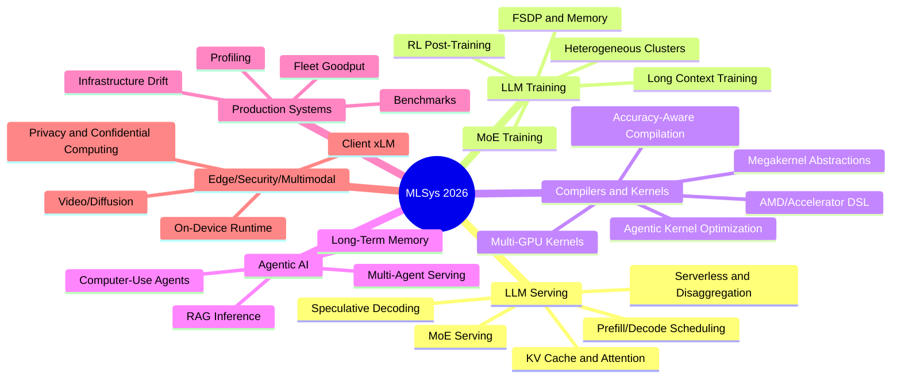

# MLSys 2026 知识地图

## 数据来源与覆盖

- 目标页面：[MLSys 2026 reading notes](https://paper.lingyunyang.com/reading-notes/conference/mlsys-2026)
- 官方主页：[MLSys 2026](https://mlsys.org/Conferences/2026)
- 官方论文页：[MLSys 2026 Papers](https://mlsys.org/virtual/2026/papers.html?filter=titles)
- 官方事件数据：`https://mlsys.org/static/virtual/data/mlsys-2026-orals-posters.json`
- 官方摘要数据：`https://mlsys.org/static/virtual/data/mlsys-2026-abstracts.json`

覆盖说明：官方 JSON 中有 308 条 oral/poster/event 记录，按 `uid` 去重后约 136 个唯一条目；目标页面记录的接收率为 135 / 504 = 26.8%。这份地图按 LLM systems、训练、推理、编译器、agentic AI、benchmark/observability 等方向做选择性策展，不镜像完整 accepted list。

## 总览

MLSys 2026 的系统主线非常集中：LLM 推理服务是最大主题，训练系统继续围绕长上下文、异构硬件、RL post-training 和 MoE 展开；编译器/内核方向明显向 agentic kernel generation、跨 GPU/跨厂商 DSL、megakernel 抽象演进；agentic AI 带来了新的系统负载，包括 long-term memory、RAG latency、multi-agent prefill overlap 和 computer-use agent benchmark。

| 方向 | 主要问题 | 代表主题 |
|---|---|---|
| LLM Serving | 低 TTFT、高吞吐、SLO、动态负载 | prefill/decode 调度、KV cache、MoE serving、serverless、disaggregation |
| LLM Training | 长上下文、异构资源、RL rollout、内存压力 | context parallelism、attention disaggregation、FSDP、MoE training、geo-distributed training |
| Compilers & Kernels | 新硬件适配和 kernel 生产力 | agentic kernel optimization、multi-GPU kernels、AMD DSL、MLIR、FlashAttention |
| Agentic AI / RAG | agent 工作流延迟、记忆、检索和批处理 | lookahead retrieval、long-term memory、multi-agent prefill overlap、computer-use benchmark |
| Benchmarks & Observability | 生产 ML 系统可观测性 | fleet goodput、infrastructure drift、profiling、standardized traces |
| Multimodal / Edge / Security | 端侧、视频生成、隐私安全 | on-device PyTorch、VLM client inference、GPU confidential computing、secure aggregation |

## 阅读路线

1. 先读 Best Paper Session，建立 MLSys 2026 的尺度：端侧 runtime、长上下文注意力稀疏、向量索引、视频生成系统。
2. 然后读 LLM Serving 1-5：从 prefill/decode 调度进入 KV cache，再到 MoE serving 和 speculative decoding。
3. 再读 LLM Training 1-4：重点看长上下文训练、RL post-training、异构集群和 MoE/FSDP。
4. 接着读 Compilers & Kernels：看 kernel 生产力如何从手写 DSL 走向 agentic optimization。
5. 最后读 Benchmarks/Observability 和 Agentic AI：理解真实生产系统里新的负载、指标和可观测性问题。

## Start Here: Best Paper Session

- [ExecuTorch - A Unified PyTorch Solution to Run ML Models On-Device](https://mlsys.org/virtual/2026/oral/3768)  
  面向端侧部署的 PyTorch-native runtime，目标是减少模型转换和硬件碎片化带来的部署成本。

- [BLASST: Dynamic BLocked Attention Sparsity via Softmax Thresholding](https://mlsys.org/virtual/2026/oral/3854)  
  用 softmax threshold 动态跳过 attention block，为长上下文 LLM 推理降低注意力计算和内存压力。

- [LEANN: A Low-Storage Overhead Vector Index](https://mlsys.org/virtual/2026/oral/3786)  
  面向 RAG/推荐等向量检索场景，降低高维 embedding index 的存储开销。

- [StreamDiffusionV2: A Streaming System for Dynamic and Interactive Video Generation](https://mlsys.org/virtual/2026/oral/3750)  
  将 streaming 思路扩展到视频 diffusion，面向动态交互式视频生成的低延迟系统。

## Large Language Models (LLMs)

### LLM Serving: Prefill/Decode 与调度

- [TokenWeave: Efficient Compute-Communication Overlap for Distributed LLM Inference](https://mlsys.org/virtual/2026/oral/3744)  
  针对 tensor parallel LLM 推理通信开销，围绕 compute-communication overlap 改善多 GPU 推理效率。

- [From Tokens to Layers: Redefining Stall-Free Scheduling for MoE Serving with Layered Prefill](https://mlsys.org/virtual/2026/oral/3732)  
  将 MoE serving 的 stall-free scheduling 从 token 维度推进到 layer/prefill 维度，以兼顾 TTFT、TBT 和吞吐。

- [PLA-Serve: A Prefill-Length-Aware LLM Serving System](https://mlsys.org/virtual/2026/oral/3787)  
  根据 prompt/prefill 长度差异拆分和调度请求，降低混合负载下的 TTFT。

- [Stream2LLM: Overlap Context Streaming and Prefill for Reduced Time-to-First-Token](https://mlsys.org/virtual/2026/oral/3842)  
  将外部上下文 streaming 与 prefill 重叠，解决 RAG 场景等待完整检索结果导致 TTFT 变差的问题。

- [MorphServe: Efficient and Workload-Aware LLM Serving via Runtime Quantized Layer Swapping and KV Cache Resizing](https://mlsys.org/virtual/2026/oral/3816)  
  在运行时按负载切换量化层并调整 KV cache 容量，在 SLO、TTFT 和生成质量之间做动态权衡。

- [FaaScale: Unlocking Fast LLM Scaling for Serverless Inference](https://mlsys.org/virtual/2026/oral/3769)  
  面向 serverless LLM 推理的快速扩缩容，核心是降低模型/状态迁移带来的数据传输成本。

### KV Cache 与 Attention

- [OPKV: A High-Throughput Plugin-Driven Framework for Recallable Sparsity in Paged KV Cache Systems](https://mlsys.org/virtual/2026/oral/3844)  
  将 recallable sparsity 插件化接入 paged KV cache 框架，缓解长上下文推理中的 GPU memory bottleneck。

- [FlexiCache: Leveraging Temporal Stability of Attention Heads for Efficient KV Cache Management](https://mlsys.org/virtual/2026/oral/3838)  
  利用 attention head 的 temporal stability 管理 KV cache，面向长上下文场景减少缓存占用。

- [Kitty: Accurate and Efficient 2-bit KV Cache Quantization with Dynamic Channel-wise Precision Boost](https://mlsys.org/virtual/2026/oral/3746)  
  通过 dynamic channel-wise precision boost 让 2-bit KV cache quantization 在长上下文 reasoning 中更稳。

- [SkipKV: Selective Skipping of KV Generation and Storage for Efficient Inference with Large Reasoning Models](https://mlsys.org/virtual/2026/oral/3864)  
  针对 reasoning model 的冗长 CoT，选择性跳过部分 KV 生成与存储以降低内存和吞吐瓶颈。

- [BLASST: Dynamic BLocked Attention Sparsity via Softmax Thresholding](https://mlsys.org/virtual/2026/oral/3854)  
  适合作为 attention sparsity 主线入口，关注长上下文推理中的动态 block 级稀疏。

### MoE Serving 与 Disaggregation

- [Demystifying the Mixture of Experts Serving Tax](https://mlsys.org/virtual/2026/oral/3764)  
  系统拆解 MoE 相比 dense model 的 serving tax，并区分 prefill/decode 阶段的不同瓶颈。

- [Beyond the Buzz: A Pragmatic Take on Inference Disaggregation](https://mlsys.org/virtual/2026/oral/3819)  
  从工业实践角度评估 prefill-decode disaggregation 的收益、复杂度和规模化部署障碍。

- [SHIP: SRAM-Based Huge Inference Pipelines for Fast LLM Serving](https://mlsys.org/virtual/2026/oral/3834)  
  总结 Groq SRAM-based LLM serving pipeline，重点在低延迟、高吞吐和大规模 pipeline 设计。

### Speculative Decoding

- [Accelerating Large-Scale Reasoning Model Inference with Sparse Self-Speculative Decoding](https://mlsys.org/virtual/2026/oral/3733)  
  面向 reasoning model 的长 CoT 推理，用 sparse self-speculative decoding 缓解 memory-bound 解码。

- [Speculative Decoding: Performance or Illusion?](https://mlsys.org/virtual/2026/oral/3782)  
  基于生产级推理系统重新评估 speculative decoding 的真实收益，适合校准相关工作的 benchmark 假设。

- [PRISM: Parametrically Refactor Inference for Speculative Decoding Draft Models](https://mlsys.org/virtual/2026/oral/3789)  
  关注 draft model 参数化重构，目标是在 draft 质量和推理成本之间取得更好平衡。

- [SpecDiff-2: Scaling Diffusion Drafter Alignment For Faster Speculative Decoding](https://mlsys.org/virtual/2026/oral/3755)  
  用 diffusion drafter alignment 改进 speculative decoding，属于 draft/verify 路线的系统优化。

### LLM Training 与 Post-Training

- [Unleashing Scalable Context Parallelism for Foundation Models Pre-Training via FCP](https://mlsys.org/virtual/2026/oral/3822)  
  处理训练数据 sequence length 变化导致的 context parallelism 低效问题，面向 foundation model pretraining。

- [Efficient Long-Context Language Model Training by Core Attention Disaggregation](https://mlsys.org/virtual/2026/oral/3754)  
  将 core attention 计算拆到独立资源池，解决长上下文训练中 attention 计算与其他组件 co-location 的低效。

- [ProTrain: Efficient LLM Training via Automatic Memory Management](https://mlsys.org/virtual/2026/oral/3800)  
  通过自动内存管理减少训练系统手工调参负担，面向资源受限环境下的 LLM training。

- [MTraining: Distributed Dynamic Sparse Attention for Efficient Ultra-Long Context Training](https://mlsys.org/virtual/2026/oral/3775)  
  将 dynamic sparse attention 扩展到分布式超长上下文训练，降低训练计算成本。

- [HetRL: Efficient Reinforcement Learning for LLMs in Heterogeneous Environments](https://mlsys.org/virtual/2026/oral/3825)  
  面向异构 GPU/网络环境优化 LLM RL training 调度，提高 post-training 资源利用率。

- [Beat the long tail: Distribution-Aware Speculative Decoding for RL Training](https://mlsys.org/virtual/2026/oral/3766)  
  利用 rollout 长度分布和历史 rollout 模式，加速 RL post-training 中的长尾生成阶段。

- [HexiScale: Facilitating Large Language Model Training over Heterogeneous Hardware](https://mlsys.org/virtual/2026/oral/3828)  
  探索在异构 GPU 上训练 LLM，核心问题是资源灵活性与训练效率。

- [DreamDDP: Accelerating Low-Bandwidth Geo-Distributed LLM Training with Layer-wise Partial Synchronization](https://mlsys.org/virtual/2026/oral/3790)  
  面向低带宽跨地域训练，用 layer-wise partial synchronization 降低通信瓶颈。

- [MoEBlaze: Breaking the Memory Wall for Efficient MoE Training on Modern GPUs](https://mlsys.org/virtual/2026/oral/3826)  
  针对 MoE training 的 activation memory 和 routing buffer 开销，优化现代 GPU 上的 MoE 训练。

- [veScale-FSDP: Flexible and High-Performance FSDP at Scale](https://mlsys.org/virtual/2026/oral/3860)  
  改进 FSDP/ZeRO 在块结构计算下的分片表达和通信效率，面向大规模训练。

## Compilers, Kernels, and Accelerators

- [AccelOpt: A Self-Improving LLM Agentic System for AI Accelerator Kernel Optimization](https://mlsys.org/virtual/2026/oral/3808)  
  用 agentic LLM 系统自动优化新型 AI accelerator kernel，并通过 optimization memory 累积经验。

- [ParallelKittens: Systematic and Practical Simplification of Multi-GPU AI Kernels](https://mlsys.org/virtual/2026/oral/3845)  
  面向多 GPU AI kernel，简化 compute-communication overlap 的表达与实现。

- [HipKittens: Fast and Furious AMD Kernels](https://mlsys.org/virtual/2026/oral/3735)  
  将 ThunderKittens 类 DSL 思路扩展到 AMD GPU，降低高性能 AMD kernel 编写门槛。

- [Event Tensor: A Unified Abstraction for Compiling Dynamic Megakernel](https://mlsys.org/virtual/2026/oral/3815)  
  提出 event tensor 抽象来表达动态 megakernel，减少 launch overhead 并提升 inter-kernel parallelism。

- [ApproxMLIR: Accuracy-Aware Compiler for Compound ML System](https://mlsys.org/virtual/2026/oral/3757)  
  用 MLIR 表达和搜索 compound AI system 中的近似计算选择，在质量和性能之间做端到端权衡。

- [FlashAttention-4: Algorithm and Kernel Pipelining Co-Design for Asymmetric Hardware Scaling](https://mlsys.org/virtual/2026/oral/3759)  
  针对 Blackwell 等新硬件的异步执行和 pipeline 特性，重新设计 attention kernel。

- [Wave: A Symbolic Python DSL And Compiler for High-Performance Machine Learning](https://mlsys.org/virtual/2026/oral/3778)  
  用 Python-embedded symbolic DSL 降低矩阵核心和复杂寻址模型下的 kernel authoring 难度。

## Agentic AI and RAG Systems

- [Optimizing PyTorch Inference with LLM-Based Multi-Agent Systems](https://mlsys.org/virtual/2026/oral/3823)  
  用多 agent LLM 系统优化 PyTorch inference，实现自动代码/算子调优。

- [OSWorld-Human: Benchmarking the Efficiency of Computer-Use Agents](https://mlsys.org/virtual/2026/oral/3865)  
  将 computer-use agent 的评价从准确率扩展到效率，关注真实交互任务中过高端到端延迟。

- [TeleRAG: Efficient Retrieval-Augmented Generation Inference with Lookahead Retrieval](https://mlsys.org/virtual/2026/oral/3796)  
  通过 lookahead retrieval 改善 RAG inference 中检索延迟和 GPU memory 限制带来的吞吐/延迟问题。

- [Ontology-Guided Long-Term Agent Memory for Conversational RAG](https://mlsys.org/virtual/2026/oral/3738)  
  用 ontology-guided memory 解决多轮对话 RAG 中缺少词面重叠时的长期记忆召回失败。

- [Hippocampus: An Efficient and Scalable Memory Module for Agentic AI](https://mlsys.org/virtual/2026/oral/3863)  
  为 agentic AI 设计可扩展记忆模块，目标是降低 dense vector/graph memory 的检索延迟和存储成本。

- [FlashAgents: Accelerating Multi-Agent LLM Systems via Streaming Prefill Overlap](https://mlsys.org/virtual/2026/oral/3760)  
  将 streaming prefill overlap 用到多 agent 串行交互，减少下游 agent 等待上游完整输出的空闲时间。

- [BatchLLM: Optimizing Large Batched LLM Inference with Global Prefix Sharing and Throughput-oriented Token Batching](https://mlsys.org/virtual/2026/oral/3833)  
  面向工业离线/批处理 LLM 任务，用全局 prefix sharing 和 token batching 提高吞吐。

## Multimodal, Generative, and Client ML

- [db-SP: Accelerating Sparse Attention for Visual Generative Models with Dual-Balanced Sequence Parallelism](https://mlsys.org/virtual/2026/oral/3798)  
  针对视觉生成模型中 block-wise sparse attention 的负载不均，优化 sequence parallelism。

- [SwiftGS: Algorithm and System Co-Optimization for Fast 3D Gaussian Splatting on GPUs](https://mlsys.org/virtual/2026/oral/3773)  
  从算法和系统协同优化 3D Gaussian Splatting，在 GPU 上加速新视角合成。

- [TriInfer: Hybrid EPD Disaggregation for Efficient Multimodal Large Language Model Inference](https://mlsys.org/virtual/2026/oral/3756)  
  针对 MLLM 图像处理和语言处理阶段异构需求，设计 hybrid EPD disaggregation 提升资源利用率。

- [Efficient, VRAM-Constrained xLM Inference on Clients](https://mlsys.org/virtual/2026/oral/3802)  
  面向 client 侧 LLM/VLM，结合 CPU-GPU hybrid scheduling、sharding 和 offloading 适配 VRAM 约束。

- [ExecuTorch - A Unified PyTorch Solution to Run ML Models On-Device](https://mlsys.org/virtual/2026/oral/3768)  
  端侧 AI runtime 主线论文，适合作为 on-device ML 系统方向入口。

## Benchmarks, Profiling, and Production Observability

- [Machine Learning Fleet Efficiency: Improving TPU Systems at Scale with ML Productivity Goodput](https://mlsys.org/virtual/2026/oral/3734)  
  基于 Google TPU fleet 提出 ML Productivity Goodput，将效率拆到 scheduling、runtime、program 层。

- [DriftBench: Measuring and Predicting Infrastructure Drift in LLM Serving Systems](https://mlsys.org/virtual/2026/oral/3799)  
  测量基础设施配置变化对 LLM serving 输出一致性的影响，并提出 portability risk 视角。

- [FlashInfer-Bench: Building the Virtuous Cycle for AI-driven LLM Systems](https://mlsys.org/virtual/2026/oral/3832)  
  连接 kernel generation、benchmarking 和 deployment，给 AI-generated kernels 提供闭环评测框架。

- [MLCommons Chakra: Advancing Performance Benchmarking and Co-design using Standardized Execution Traces](https://mlsys.org/virtual/2026/oral/3742)  
  用标准化 execution traces 支持分布式 ML 工作负载复现、benchmark 和软硬件协同设计。

- [ProfInfer: An eBPF-based Fine-Grained LLM Inference Profiler](https://mlsys.org/virtual/2026/oral/3740)  
  用 eBPF 提供 LLM inference engine 的细粒度运行时可观测性，补足 operator-level visibility。

- [XProf: An Open, Scalable, and Extensible Profiling System for the Modern ML Stack](https://mlsys.org/virtual/2026/oral/3827)  
  面向 OpenXLA 生态的大规模 profiler，提供性能诊断和优化建议。

## Security, Privacy, and Federated Learning

- [Blueprint, Bootstrap, and Bridge: A Security Look at NVIDIA GPU Confidential Computing](https://mlsys.org/virtual/2026/oral/3741)  
  从系统安全角度分析 NVIDIA GPU confidential computing 的可信启动、桥接和可审计性问题。

- [ZK-APEX: ZERO-KNOWLEDGE APPROXIMATE PERSONALIZED UNLEARNING WITH EXECUTABLE PROOFS](https://mlsys.org/virtual/2026/oral/3793)  
  用 zero-knowledge executable proofs 支持个性化模型上的可验证 approximate unlearning。

- [DisAgg: Distributed Aggregators for Efficient Secure Aggregation](https://mlsys.org/virtual/2026/oral/3837)  
  在 federated learning 中引入 aggregator committee，降低 secure aggregation 的轮次和加密计算开销。

- [G-HEMP: FAST MULTI-GPU PRIVATE INFERENCE FOR LARGE-SCALE GCNS WITH HOMOMORPHIC ENCRYPTION](https://mlsys.org/virtual/2026/oral/3811)  
  面向大规模 GCN 的同态加密 private inference，重点是多 GPU 下的隐私计算加速。

## Edge, Mobile, and Resource-Constrained ML

- [EarthSight: A Distributed Framework for Low-Latency Satellite Intelligence](https://mlsys.org/virtual/2026/oral/3792)  
  将卫星图像分析建模为轨道和地面之间的分布式决策问题，降低灾害响应等场景的端到端延迟。

- [IntAttention: A Fully Integer Attention Pipeline for Efficient Edge Inference](https://mlsys.org/virtual/2026/oral/3848)  
  将 attention pipeline 中 softmax 相关路径整数化，解决 edge Transformer 推理中 dequantize/softmax/requantize 的瓶颈。

- [Efficient, VRAM-Constrained xLM Inference on Clients](https://mlsys.org/virtual/2026/oral/3802)  
  client AI 方向的重点工业论文，适合和 ExecuTorch 一起阅读。

## 可补到 reading-notes 页面的 Watchlist

- 关键词：`prefill-decode disaggregation`, `KV cache`, `MoE serving tax`, `speculative decoding`, `context parallelism`, `agentic memory`, `AI-generated kernels`, `ML fleet goodput`
- 系统/项目：`ExecuTorch`, `Stream2LLM`, `MorphServe`, `FaaScale`, `FlashInfer-Bench`, `XProf`, `Chakra`, `ParallelKittens`, `HipKittens`
- 研究种子：Tri Dao / Together AI 相关 speculative decoding 与 kernel 论文、UC Berkeley RAG/vector 系统、UW/Meta MoE serving、ByteDance/veScale training stack、Google TPU fleet/profiling stack。

## 后续补全建议

1. 如果目标是维护 `reading-notes/conference/mlsys-2026.md`，先加入 `## Papers` 和上述一级/二级分类。
2. 每个条目先保留标题、官方链接、机构和一句中文摘要；不要在没有读完整论文时写过细贡献 bullet。
3. 对 LLM Serving 和 LLM Training 两个大类，可以后续再拆成专题页并交叉链接到 `paper-list/systems-for-ml/llm.md`。
4. 对 Best Paper、industry oral、benchmark/profiling 论文加显式标记，方便后续复盘“研究原型 vs 生产系统”。
