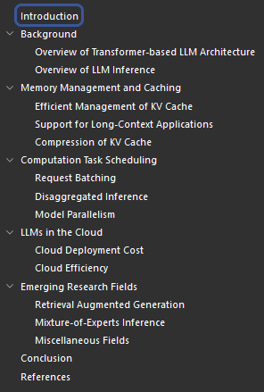

# LLM Inference Serving: Survey of Recent  Advances and Opportunities

- date: 17 July 2024
- Northeastern University, MIT

## Abstract

- This survey offers a comprehensive overview of recent advancements in Large Language Model (LLM) serving systems,
- focusing on research since the year 2023.
- We specifically examine system-level enhancements that improve performance and efficiency without altering the core LLM decoding mechanisms.
- By selecting and reviewing high-quality papers from prestigious ML and system venues,
  - we highlight key innovations and practical considerations for deploying
  - and scaling LLMs in real-world production environments.
- This survey serves as a valuable resource for LLM practitioners seeking to stay abreast of the latest developments in this rapidly evolving field.

## 1 Introduction

Three sections for system level enhancements

- KV cache and memory management
  - Efficient Management of KV Cache
    - PagedAttention
      - advantage: significantly reduces the memory waste on pre-allocation and fragmentation
      - TGI/vLLM/TensorRT-LLM supported
      - drawback!!! requires rewriting attention kernels
    - vAttention: “vattention: Dynamic memory management for serving llms without pagedattention,” arXiv preprint arXiv:2405.04437, 2024
  - Support for Long-Context Applications
  - Compression of KV Cache
- LLM computation optimization
- Cloud LLM deployment.

## 2 Background

## 3 Memroy Management and Caching

## 4 Computation Task Scheduling

## 5 LLMs in the Cloud

## 6 Emerging Reasearch Fields

## 7 Conclusion

## Reference

- [4] X. Miao, G. Oliaro, Z. Zhang, X. Cheng, H. Jin, T. Chen, and Z. Jia, “Towards efficient generative large language model serving: A survey from algorithms to systems,” arXiv preprint arXiv:2312.15234, 2023.
- [5] Z. Yuan, Y. Shang, Y. Zhou, Z. Dong, C. Xue, B. Wu, Z. Li, Q. Gu, Y. J. Lee, Y. Yan et al., “Llm inference unveiled: Survey and roofline model insights,” arXiv preprint arXiv:2402.16363, 2024.
- [6] Z. Zhou, X. Ning, K. Hong, T. Fu, J. Xu, S. Li, Y. Lou, L. Wang, Z. Yuan, X. Li et al., “A survey on efficient inference for large language models,” arXiv preprint arXiv:2404.14294, 2024
