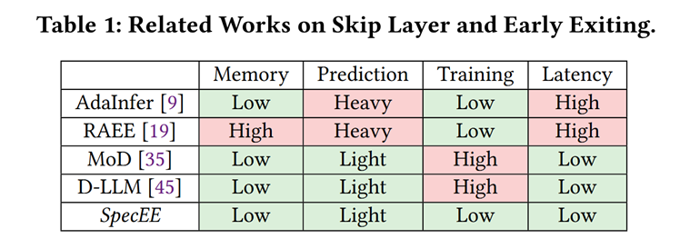
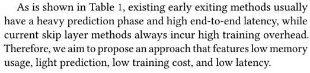

# SpecEE：基于推测的Early Exiting 机制，让 AI PC 推理速度起飞

•官方知乎：https://zhuanlan.zhihu.com/p/1899766212109510455

•开源仓库：https://github.com/infinigence/SpecEE

•论文地址：https://arxiv.org/abs/2504.08850

## Abstract

we identify that the LLM vocabulary serves as the runtime search space of the early exiting predictor and significantly influences the predictor workload (e.g., ∼ 20% overall inference latency with ∼ 3 × 104 vocabulary size in Llama2)

Three Challenges:
(1) Time-consuming predictor with high computational complexity
(2) Under-utilization of layer-wise predictor deployment.
(3) Exponential mapping complexity of predictor in speculative decoding.

Solution SpecEE (LLM inference Engine):
(1) At the algorithm level,

- speculation-based lightweight predictor
  - design by exploiting the probabilistic correlation between the speculative tokens and the correct results and high parallelism of GPUs.

(2) At the system level

- the two-level heuristic predictor scheduling engine
  - not all layers need a predictor
  - based on skewed distribution and contextual similarity.

(3) At the mapping level,
we point out that different decoding methods share the same essential characteristics

- propose the context-aware merged mapping for predictor with efficient GPU implementations to support speculative decoding
- form a framework for various existing orthogonal acceleration techniques (e.g., quantization and sparse activation) on cloud and personal computer (PC) scenarios
  - successfully pushing the Pareto frontier of accuracy and speedup.
  - 和模型相关？

SpecEE achieves 2.25× and 2.43× speedup with Llama2-7B on cloud and PC scenarios respectively

## 1 Introduction

## 2 Background

## 3 Motivation

## 4 Speculation-based Lightweight Predictor

## 5 Tow-level Heuristic Scheduling Egngine

## 6 Context-aware Merged Mapping for Predictor

## 7 Evaluation

## 8 Conclusion

## Reference
