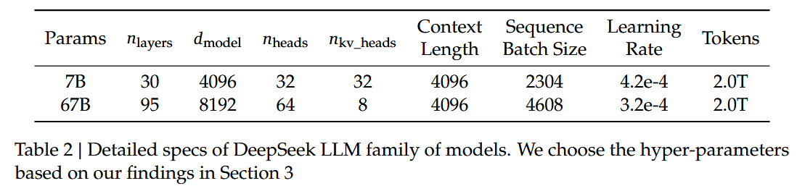
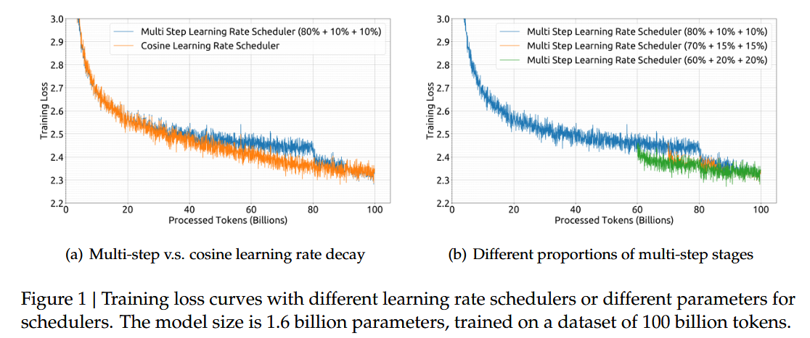
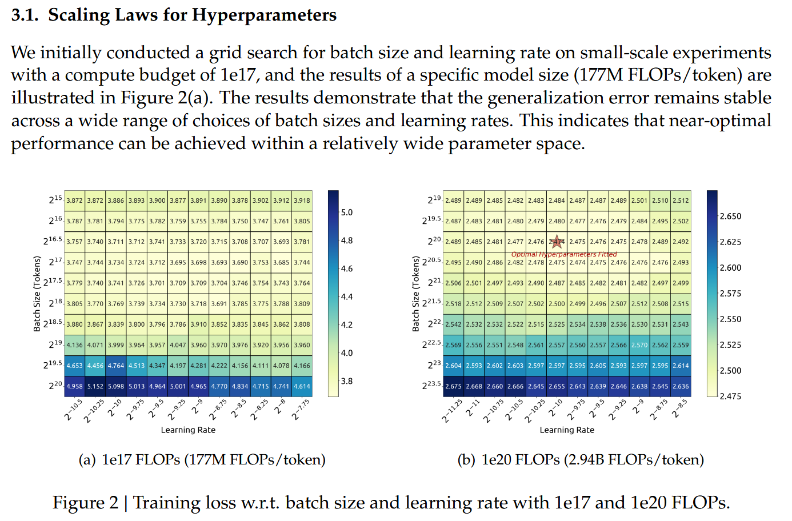
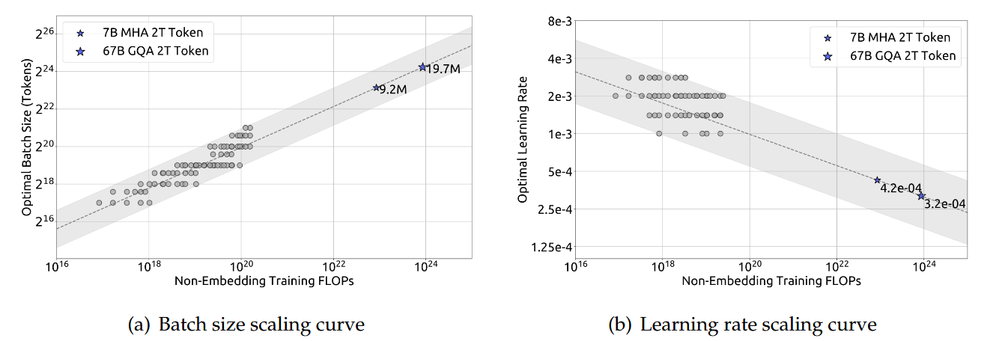
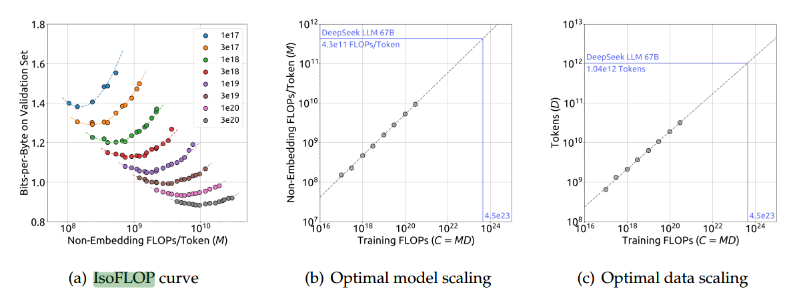

# DeepSeek LLM Scaling Open-Source Language Models with Longtermism

Date: 5 Jan 2024

## Abstract

- The scaling laws described in previous literature presents varying conclusions
- Opensource configurations: 7B and 67B.
- Introduce DeepSeek LLM
- Developed a dataset: 2T tokens
- Conduct supervised fine-tuning (SFT) & direct preference optimization (DPO)
- Trained DeepSeek Chat
- DeepSeek LLM 67B performance surpasses LLaMA2-70B

## 1 Introduction

- Dataset
  - Choice of dataset will remarkably affects the scaling behavior
  - Used 2T tokens for pretrain, in Chinese and English
  - Collected over 1M instances for SFT
- Model (train method)
  - architecture of LLaMA
  - change "cosine learning rate scheduler" to "multi-step learning rate scheduler", maintaining performance
  - Ultilize DPO to improve conversational performance
  - 🤔 ??? This paper shares our experiences with different SFT strategies and findings in data ablation techniques.
- Evaluation
  - surpasses LLaMA-2 70B
  - outperforms GPT3.5

## 2 Pre-Training

- Data

  - Preprocess (cleaning for diversity and density)
    - Deduplication
    - Filtering: linguistic and semantic evaluations
    - Remixing: data imbalances
  - Tokenizer: Byte-level Byte-Pair Encoding (BBPE) - introduced by HuggingFace
    - 100000 tokens + 15 special tokens, round to 102400 with reserve space
    - trained on multilingual corpus, 24G
- Architecture
  

  - Pre-Norm structure with RMSNorm
  - SwiGLU
  - Rotary Embedding
  - GroupedQuery Attention (GQA)
- Hyperparameters (skipped)
  multi-step learning rate performs as well as cosine

  
- Infrastructure

  - HAI-LLM: training framework
    - Distributed Methods
      - Data parallelism, tensor parallelism, sequence parallelism, 1F1B pipeline parallelism
    - Algo/Op/Kernel optimization: FlashAttention
    - Memory Efficient: ZeRO-1
    - Other Optimization
      - Overlap Compute and Communication
        - backward procedure of the last micro-batch, reduce-scatter operation in ZeRO-1
        - GEMM computation and all-gather/reduce-scatter in sequence parallel
      - Layer/operation fusion
        - LayerNorm, GEMM, Adam updates
        - percision: model in bf16, gradients in fp32 precision
          - convert bf16 logits to fp32 precision on the fly
        - In-place cross-entropy
    - Elastic Training Strategy
      - Checkpoints
        - Model weights and optimizer states are saved every 5 minutes asynchronously, in case of hardware/ network failures
        - cleared up regularly, avoid storage waste
      - Resume Training
        - support resuming training from a different 3D parallel configuration, cope with dynamic changes of cluster load

## 3 Scaling Laws

```
Scaling Laws: 
- Model performance can be predictably improved with increases in compute budget C, model scale N, and data scale D.
- When model scale N is represented by model parameters and data scale D by the number of tokens, C can be approximated as C = 6ND.

Budget could be a restriction!
```

### 3.1 Scaling Laws and Hyperparameter choosing

```
OPTIMIZE TARGET:
SAME COST, BEST RESULT
batchsize & iterations are adjustable
```

- We established the scaling laws for hyperparameters, providing an empirical framework for determining the optimal hyperparameters.
- Instead of model parameters N, we adopt non-embedding FLOPs/token M to represent the model scale, leading to a more accurate optimal model/data scaling-up allocation strategy and a better prediction of generalization loss for large-scale models.
- The quality of pre-training data impacts the optimal model/data scaling-up allocation strategy. The higher the data quality, the more the increased compute budget should be allocated to model scaling.
  



- based on previous experiments, when scaling up, there shall be a optimum batch-size/lr pair
- assume the team found this pattern, the plot indicates the best choice for hyperparameter settings

### 3.2 Optimal Model and Data Scaling

```
Given fixed amount of data, the best model size could be estimated
```



## 4 Eval (skip)

## 5 Discussion (skip)

## Conclusion

- In this paper, we provide an in-depth explanation of hyper-parameters selection, scaling laws, as well as the various fine-tuning attempts we made.
- We calibrate the scaling laws in the previous work and propose a new optimal model/data scaling-up allocation strategy.
- In addition, we present a method to predict the near-optimal batch size and learning rate with given compute budget.
- We further conclude that the scaling laws is related to the data quality, which might be the root cause of varying scaling behavior in different works.
- Guided by the scaling laws, we conduct pre-training with the best hyper-parameter and provide a comprehensive evaluation.
