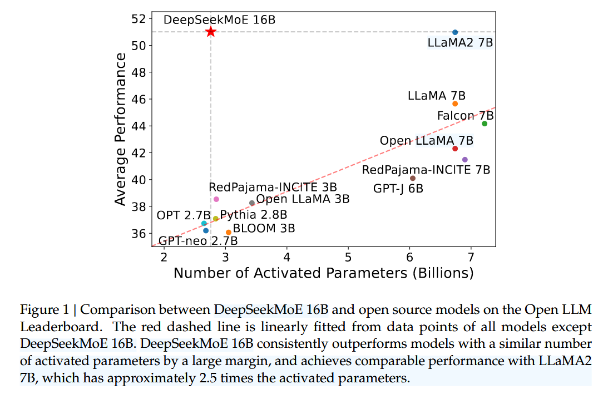
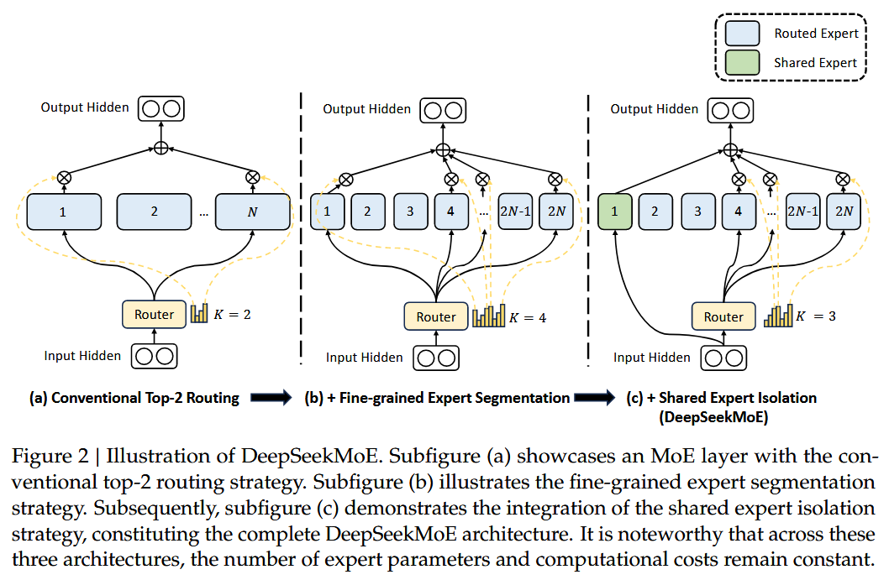

# DeepSeekMoE: Towards Ultimate Expert Specialization in Mixture-of-Experts Language Models

## Abstract

- MoE is promising, GShard is good but not perfect
- Propose DeepSeekMoE (architecture), with two main principal strategies:
  - (1) finely segmenting the experts into mN ones and activating mK from them, allowing for a more flexible combination of activated experts
  - (2) isolating Ks experts as shared ones, aiming at capturing common knowledge and mitigating redundancy in routed experts.
- Starting from a modest scale with 2B parameters
  - DeepSeekMoE 2B achieves comparable performance with GShard 2.9B, which has 1.5× expert parameters and computation.
- scale up DeepSeekMoE to 16B
  - achieves comparable performance with LLaMA2 7B, with only about 40% of computations
- scale up DeepSeekMoE to 145B

## 1 Introduction (skip)

- MoE issues
  - (1) Knowledge Hybridity: expert not fine-grand enough, cover diverse knowledge
  - (2) Knowledge Redundancy: common knowledge is required for all experts

## 2 MoE Architecture (skip)

## 3 DeepSeekMoE Architecture

### 3.1 Fine-Grained Expert Segmentation

(shown as figure 2)

### 3.2 Shared Expert Isolation 

(shown as figure 2)

### 3.3 Load Balance Consideration

- Expert-Level Balance Loss
- Device-Level Balance Loss

## 4 Validation

- Training Data: self-collected datasets,
- Tokenization: byte pair encoding (BPE), 8K
- Infrastructure
  - platform: HAI-LLM
  - optimize: GPU kernels with CUDA and Triton
  - hardware: A100/ H800 + Nvlink + infinitband
- Hyperparameters
- performance (skip)

## 5 MoE 16B (skip)
## 6 alignment (skip)
## 7 MoE 145B (skip)
## 8 Related Work

## 9 Conclusion
- Through fine-grained expert segmentation and shared expert isolation, DeepSeekMoE achieves significantly higher expert specialization and performance compared with prevailing MoE architectures.
- We find that DeepSeekMoE 145B still keeps substantial advantages over the GShard architecture, and demonstrates comparable performance with DeepSeek 67B, using only 28.5% (maybe even 18.2%) of computations.

## Appendix (skip)
