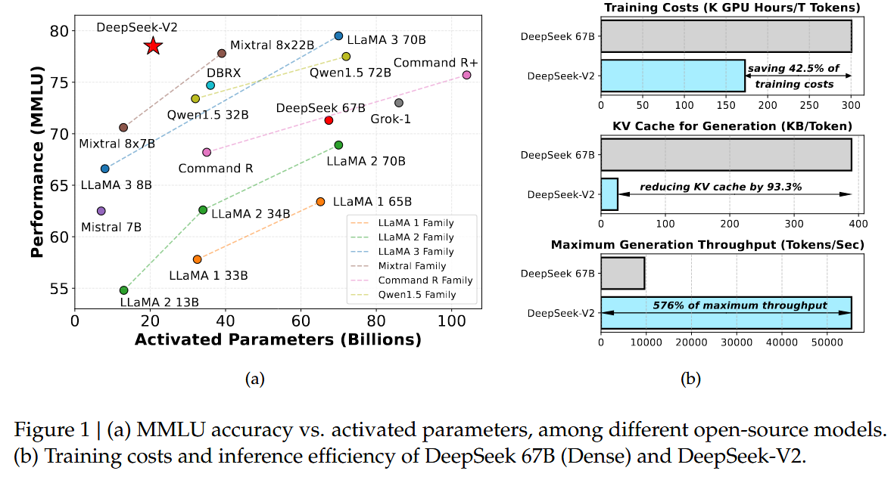
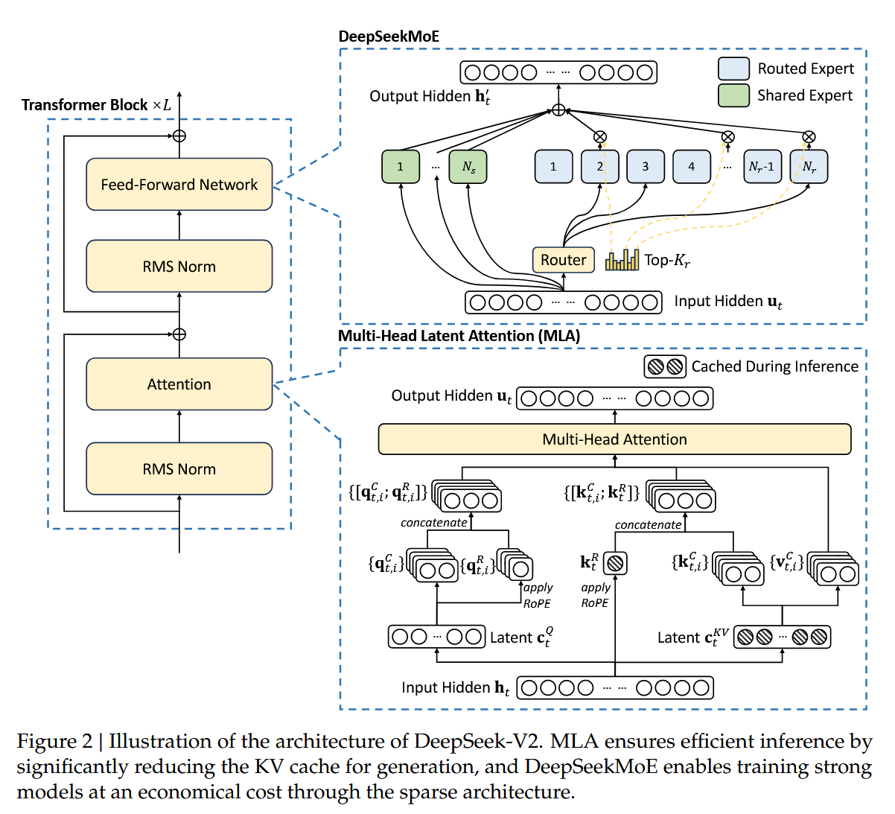
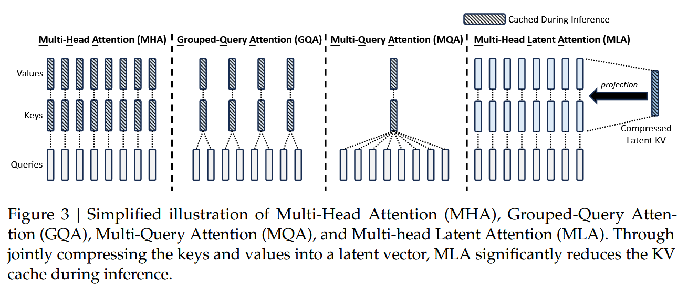
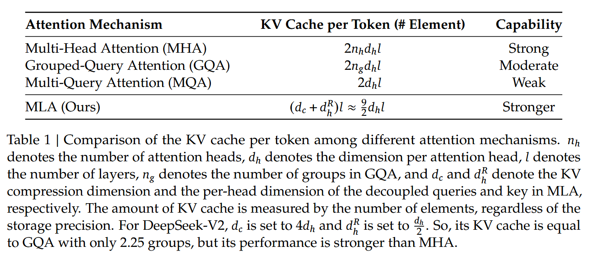
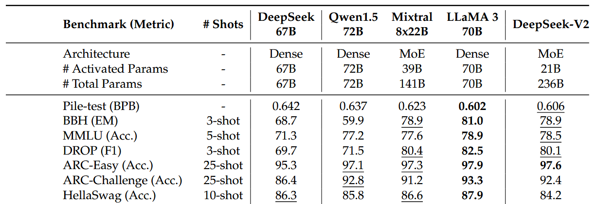
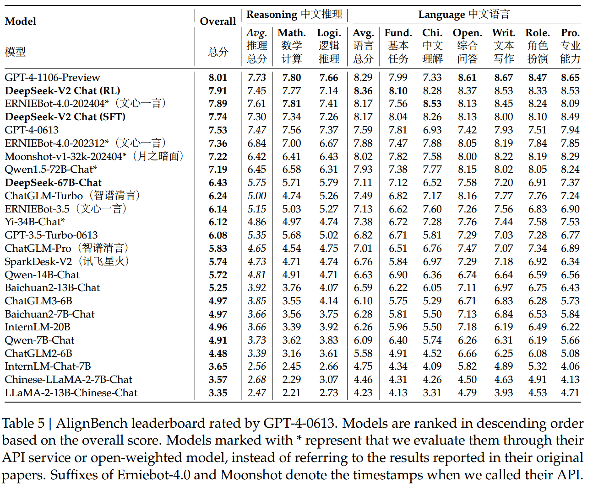

# DeepSeek-V2: A Strong, Economical, and Efficient Mixture-of-Experts Language Model

## Abstract

- DeepSeek-V2, MoE structure, 236B in total, 21B activate
- support 128K tokens
- Propose Multi-head Latent Attention (MLA)
- Achievements
  - Compared with DeepSeek 67B, DeepSeek-V2 achieves significantly stronger performance,
  - and meanwhile saves 42.5% of training costs,
  - reduces the KV cache by 93.3%,
  - and boosts the maximum generation throughput to 5.76 times
- Pretrain: 8.1T tokens
- Alignment with: SFT + GRPO + RL

## 1 Introduction (skip)

## 2 Architecture

- Background
  - Multi-Head Attention (MHA) is common used but heavy with KV-cache (bottle neck)
  - Multi-Query Attention (MQA) & Grouped-Query Attention (GQA) are introduced to reduce KV cache
    - faster, but with poor result
  - so that, MLA is introduced
- Achievement
  - Equipped with low-rank key-value joint compression, MLA achieves better performance than MHA, but requires a significantly smaller amount of KV cache.
- ⭐ MLA - Methods
  - Low-Rank Key-Value Joint Compression
  - Decoupled Rotary Position Embedding
- Model Architecture
  - Basic DeepSeek MoE
  - Device-Limited Routing
    - reduce cross-device communication
  - Auxiliary Loss for Load Balance (same as MoE)
    - Expert-Level Balance Loss
    - Device-Level Balance Loss
    - Communication Balance Loss
  - 🤔🤔 **Token-Dropping Strategy** (TODO!!)

## 3 Pre-Training

- Experiment Setups
  - Dataset
    - same as DeepSeek 67B + internet data
    - better cleaning process, recover some mistakenly deleted data
  - Tokenizer: Byte-level Byte-Pair Encoding BBPE (100K vocab, over 8.1T tokens)
  - Hyper-Parameters
    - 236B params, 21B activated for each token
    - 1536 experts
    - additional RMS Norm layers after the compressed latent vectors
  - Infrasturcture
    - HAI-LLM framework
      - 🤔 16-way zero-bubble pipeline parallelism
      - 🤔 8-way expert parallelism
      - ⭐ a portion of the operators are recomputed to save activation memory, it can be trained without the necessity of tensor parallelism
      - ⭐ we overlap the computation of shared experts with the expert parallel all-to-all communication
      - ⭐ customize faster CUDA kernels for communications, routing algorithms, and fused linear computations across different experts
      - ⭐ MLA is also optimized based on an improved version of FlashAttention-2
    - Hardware: H800 GPUs + NvLink + NvSwitch + infiniBand
- Evaluations (in table)
- Training and Inference Efficiency
  - Training Costs
    - (During our practical training on the H800 cluster, for training on each trillion tokens)
      - DeepSeek 67B requires 300.6K GPU hours,
      - while DeepSeek-V2 needs only 172.8K GPU hours,
    - ⭐ i.e., sparse DeepSeek-V2 can save 42.5% training costs compared with dense DeepSeek 67B.
  - Inference Efficiency
    - FP8
    - KV cache quantization (compress each element in its KV cache into 6 bits on average)
    - ⭐ Performance on 8xH800 node
      - generation throughput: 50K tokens per second
      - prompt input throughput: 100K tokens per second
      - 5.76 times the maximum generation throughput of DeepSeek 67B

## 4 Alignment

- SFT
- ⭐RL: Group Relative Policy Optimization (GRPO)
- ⭐Optimizations for Training Efficiency
  - 1) we propose a hybrid engine that adopts different parallel strategies for training and inference respectively to achieve higher GPU utilization
  - 2) we leverage vLLM with large batch sizes as our inference backend to accelerate the inference speed
  - 3) we carefully design a scheduling strategy for offloading models to CPUs and loading models back to GPUs, which achieves a near-optimal balance between the training speed and memory consumption

- Performance (skip)
- Discussion
  - ⭐Amount of SFT Data
    - Our observation underscores the critical need for sufficient data to equip an LLM with desired capabilities.
    - quality of SFT data is also crucial
  - ⭐Alignment Tax of Reinforcement Learning
    - Observed: Alignment process can negatively impact the performance on some standard benchmarks such as BBH
  - Online Reinforcement Learning
    - we find that the online approach significantly outperforms the offline approach

## 5 Conclusion, limiations and future work
- Economical training and efficient inference, benefit from MLA & DeepSeekMoE architecture
- Stronger but cheaper
  - achieves significantly stronger performance, 
  - and meanwhile saves 42.5% of training costs, 
  - reduces the KV cache by 93.3%, 
  - and boosts the maximum generation throughput to 5.76 times.
- Future work
  - scale up
  - better alignment
  - multi-model

## Appendix (skip)

