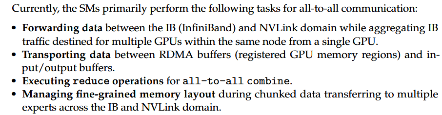
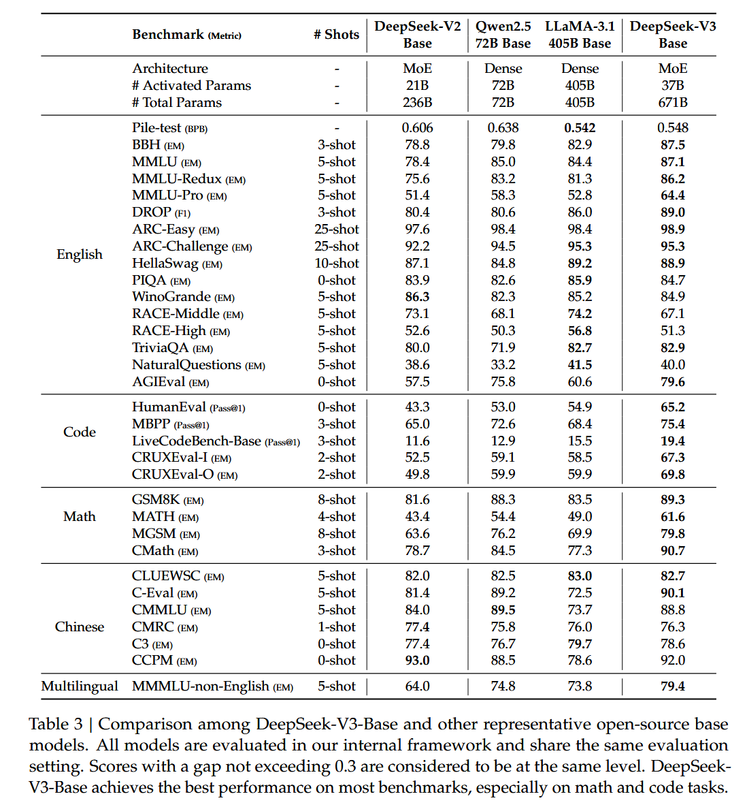
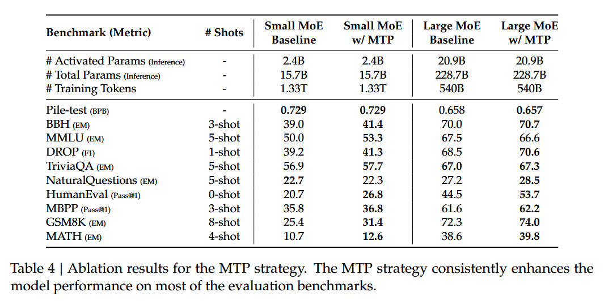
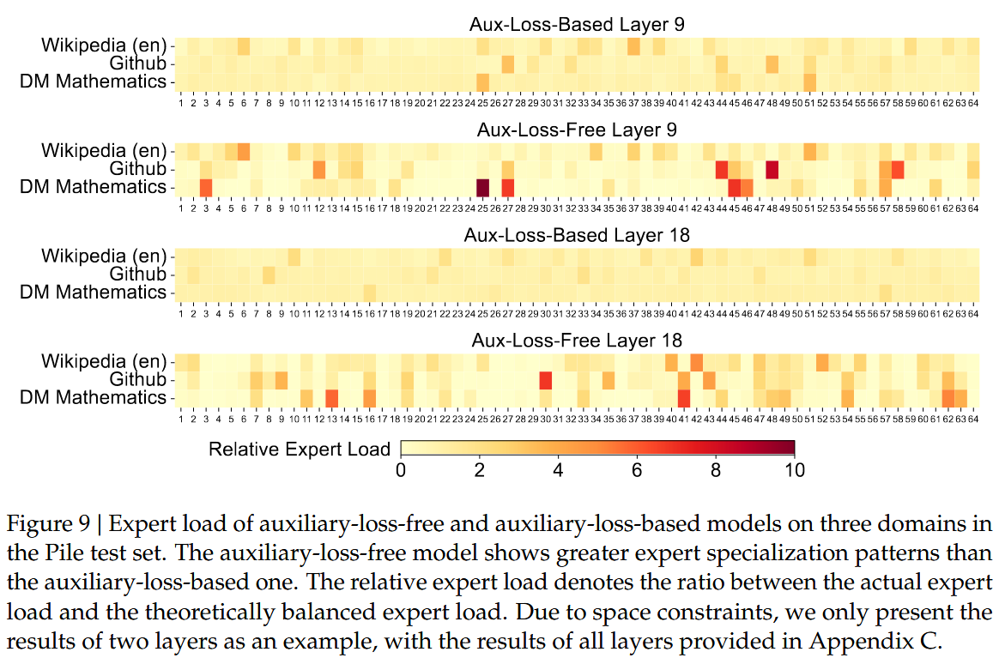
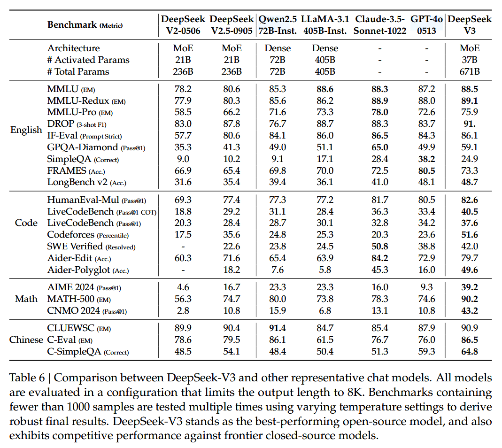

# DeepSeek-V3 Technical Report

date: 20241227

## Abstract & 1 Introduction

- 671B params, 37B activate
- DeepSeek-V3 arch:

  - MLA + MoE (same as V2)
  - ⭐Auxiliary-loss-free strategy: load balancing, minimizing the adverse impact on model performance
  - ⭐Multi-token prediction training objective: enhanced overall performance
- Training Experiments

  - Methods
    - ``Dataset``: pre-train 14.8T tokens
    - ``Alignment``: SFT + RL
    - ⭐ ``Low-precision`` training: FP8 mixed precision training
      - accelerate training
      - reduce memory usage
    - ``Training Framework``
      - ⭐DualPipe algorithm
        - support fine-grained experts across nodes
        - while achieving a near-zero all-to-all communication overhead
      - ⭐custom kernels: cross-node all-to-all communication kernels
        - fully utilize InfiniBand (IB) and NVLink bandwidths
    - other comprehensive optimizations
      - optimize the memory footprint: train without using costly tensor parallelism.
  - Training Process
    - ``Pretrain``
    - Two-stage ``context length extension``
      - First stage, extend to 32K context length
      - Second stage, 128K context length
    - ``Post-Train``: SFT + RL
      - ⭐Distill the reasoning capability from the DeepSeekR1 series of models
        - balance between model accuracy and generation length
  - Result
    - Good Performance
    - ⭐Cheap (Table 1),

      - Time used
        - Each trillion tokens requires only 180K H800 GPU hours
        - ``Pre-train`` costs 2664K GPU hours, less than two months and
          - 3.7 days on our cluster with 2048 H800 GPUs.
          - (14.8T tokens in total, ~=55 days for all tokens)
        - ``Context length extension`` cost 119K GPU hours
        - ``Post-train`` cost 5K GPU hours
        - In all, 2.788M H800 GPU hours for full training
      - Pricing
        - Assuming the rental price of the H800 GPU is $2 per GPU hour
        - ``Total training costs amount to only $5.576M.``

      ```
      Aforementioned, costs include only the official training of DeepSeek-V3, excluding the costs associated with prior research and ablation experiments on architectures, algorithms, or data.
      ```
    - Stable training process
- Opensource: https://github.com/deepseek-ai/DeepSeek-V3
  

## 2 Architecture

- Basic Architecture
  - (Figure 2) MoE + MLA
    - almost same as V2, add sigmoid for affinity score, apply normalization among selected scores
  - ❓Auxiliary-Loss-Free Load Balancing
  - ❓Complementary Sequence-Wise Auxiliary Loss.
  - Node-Limited Routing
  - No Token-Dropping
- ⭐Multi-Token Prediction
  - (TODO)

## 3 Infrastructures

- Compute Cluster
  - 2048 H800 GPUs, 8 per node, with NVlink + NVSwitch + Infiniband
- ⭐ Framework: HAI-LLM framework
  - Distributed Strategies
    - basic setups
      - ``16-way Pipeline Parallelism`` (PP)
      - ``64-way Expert Parallelism`` (EP)
      - ``ZeRO-1 Data Parallelism`` (DP)
      - ⭐``NO TP``
        - optimize the memory footprint during training, thereby enabling us to train DeepSeek-V3 without using costly Tensor Parallelism (TP).
    - ❓``custom kernels``: cross-node all-to-all communication kernels
    - ⭐``DualPipe algorithm`` (Figure 4/5)
      - Purpose
        - overlap the computation and communication within a pair of individual forward and backward chunks.
      - Methods
        - pipeline components
          - 2 main Chunks: `forward` and `backward`
          - 4 main Compute Components: `attention`, `all-to-all dispatch`, `MLP`, `all-to-all combine`
          - In `backward` chunk, `attention` and `MLP` are further split into `backward for input` and `backward for weights`
          - PP communication component
        - rearrange components (manually)
          - adjust the ratio of GPU SMs dedicated to communication versus computation.
      - Performance
        - we can ensure that both all-to-all and PP communication can be fully hidden during execution.
  - memory saving
    - recompute
      - Recomputation of RMSNorm and MLA Up-Projection
    - cpu cooperate
      - Exponential Moving Average in CPU
    - Shared Embedding and Output Head for Multi-Token Prediction
  - ⭐FP8 Training
    - basic concept: figure 6
    - Fine-Grained Quantization: figure 7
      - Fine-Grained Quantization: different component with different quant method
      - Increasing Accumulation Precision: prevent percision underflow
      - Mantissa over Exponents
      - Online Quantization
    - Low-Precision Storage and Communication
  - Inference and Deployment
    - Prefill
      - ⭐resource: 4 nodes x 8GPUs
      - `attention` part
        - attention part employs 4-way Tensor Parallelism (TP4)
          - TP size of 4 limits the overhead of TP communication
        - with Sequence Parallelism (SP)
        - combined with 8-way Data Parallelism (DP8).
      - `MoE` part
        - we use 32-way Expert Parallelism (EP32),
        - which ensures that each expert processes a sufficiently large batch size,
        - thereby enhancing computational efficiency.
      - `MoE all-to-all communication`
        - first transferring tokens across nodes via IB,
        - and then forwarding among the intra-node GPUs via NVLink.
      - ⭐`redundant experts`
        - purpose
          - To achieve load balancing among different experts in the MoE part,
          - we need to ensure that each GPU processes approximately the same number of tokens.
        - method
          - duplicates high-load experts and deploys them redundantly
          - The high-load experts are detected based on statistics collected during the online deployment and are adjusted periodically (e.g., every 10 minutes).
          - rearrange experts among GPUs within a node based on the observed loads, striving to balance the load across GPUs as much as possible without increasing the cross-node all-to-all communication overhead.
      - micro-batch
        - purpose: hide overhead of all-to-all and TP communication
        - method: use 2 micro-batchs, overlap `attention` and `moe` with `dispatch` and `combine`
    - Decode
      - ⭐ resource: The minimum deployment unit of the decoding stage consists of 40 nodes with 320 GPUs.
      - we treat the shared expert as a routed one. From this perspective, each token will select 9 experts during routing
      - All-to-all communication of the dispatch and combine parts is performed via direct point-to-point transfers over IB to achieve low latency
      - Additionally, we leverage the IBGDA (NVIDIA, 2022) technology to further minimize latency and enhance communication efficiency.
  - ❓Suggestions on Hardware Design
    - Communication Hardware
      - 
    - Compute Hardware
      - Higher FP8 GEMM Accumulation Precision in Tensor Cores
      - Support for Tile- and Block-Wise Quantization
      - Support for Online Quantization
      - Support for Transposed GEMM Operations

## 4 Pre-Training

- Data Construction
  - 14.8T high-quality and diverse tokens in our tokenizer
- Hyper-Parameters
  - Model Hyper-Parameters
  - Training Hyper-Parameters
- Long Context Extension
- Evaluation (table 3/4)
  - ❓Discussion
    - Ablation Studies for Multi-Token Prediction
    - Ablation Studies for the Auxiliary-Loss-Free Balancing Strategy
    - Batch-Wise Load Balance VS. Sequence-Wise Load Balance (fig 9)

## 5 Post-Training

- SFT
  - Reasoning Data
    - the first couples the problem with its original response in the format of `<problem, original response>`
    - ⭐the second incorporates a system prompt alongside the problem and the R1 response in the format of `<system prompt, problem, R1 response>`
  - None Reasoning Data
    - such as creative writing, role-play, and simple question answering, we utilize DeepSeek-V2.5 to generate responses and enlist human annotators to verify the accuracy and correctness of the data
  - SFT Settings: Cosine Decay Learning Rate
- Reinforcement Learning
  - Rule-Based RM
  - Model-Based RM
    - To enhance its reliability, we construct preference data that not only provides the final reward but also includes the chain-of-thought leading to the reward.
    - GRPO
- Evaluation (table 6)
  - https://github.com/openai/simple-evals
- Discussion
  - Distillation from DeepSeek-R1: performs good
  - Self-Rewarding
  - Multi-Token Prediction Evaluation
    - accelerate the decoding speed of the model

## 6 Conclusion, Limitation & Future-work

- Model: `DeepSeek-V3`
  - Basic Info
    - a large MoE language model with `671B total parameters` and `37B activated parameters`, `trained on 14.8T tokens`
    - the `MLA` and `DeepSeekMoE` architectures, it also pioneers an `auxiliary-loss-free strategy` for load balancing and sets a `multi-token prediction training objective` for stronger performance.
  - Pre-Train: `FP8 training` and meticulous `engineering optimizations`.
  - Post-Train: `Distilling` the reasoning capability from the DeepSeek-R1 series of models
  - Cheap: It requires only `2.788M H800 GPU hours` for its full training, including pre-training, context length extension, and post-training.
- Future direction
  - Refine our model architectures, aiming to further improve both the training and inference `efficiency`, striving to approach efficient support for `infinite context length`.
  - improve data quality
  - deep thinking capabilities

## Appendix






