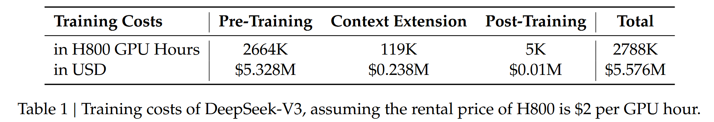
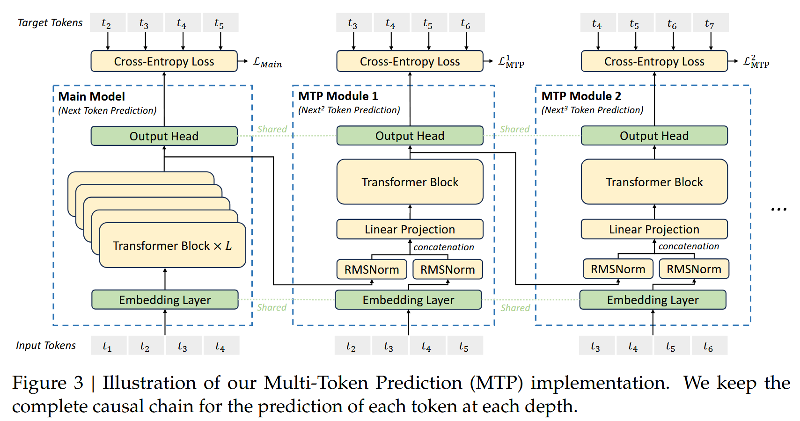
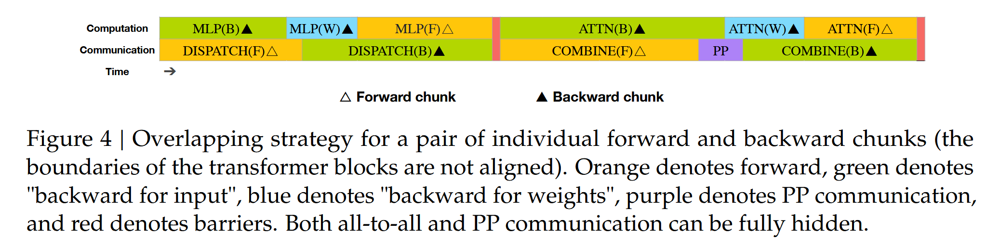
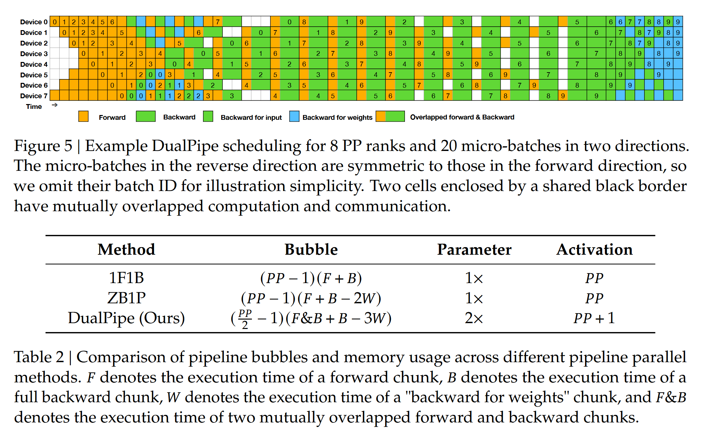
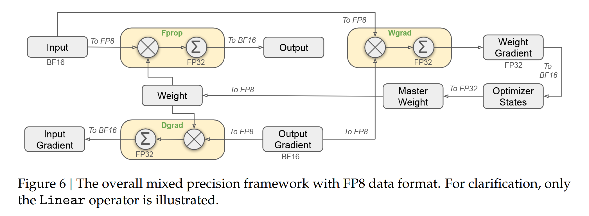
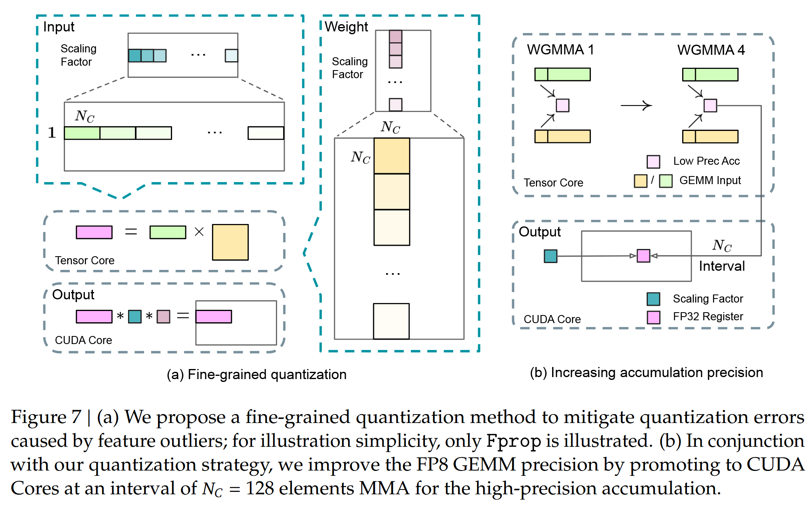
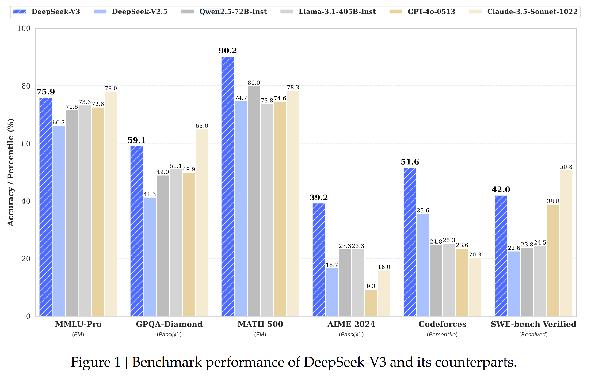
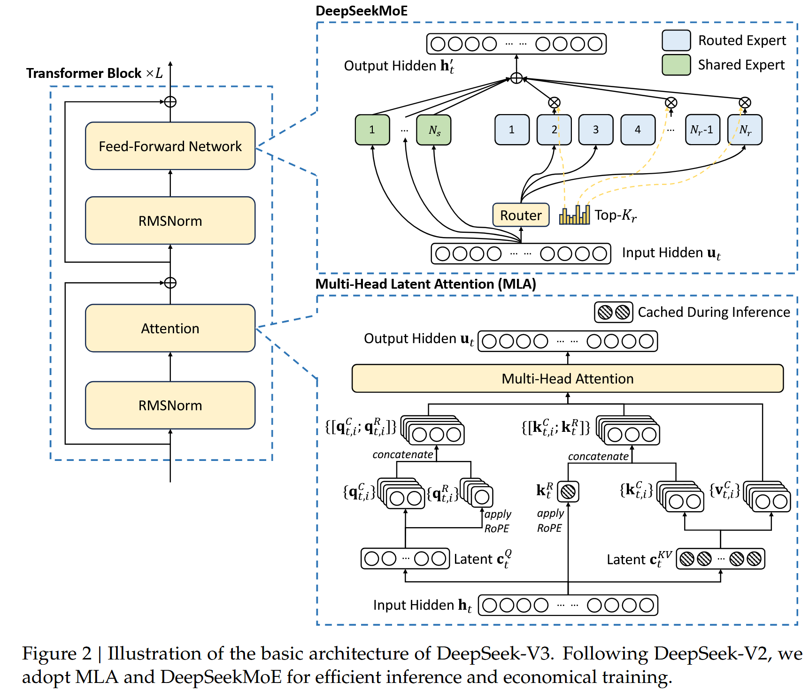

# DeepSeek-V3 Technical Report

date: 20241227

## Abstract & 1 Introduction

- 671B params, 37B activate
- DeepSeek-V3 arch:

  - MLA + MoE (same as V2)
  - ⭐Auxiliary-loss-free strategy: load balancing, minimizing the adverse impact on model performance
  - ⭐Multi-token prediction training objective: enhanced overall performance
- Training Experiments

  - Methods
    - ``Dataset``: pre-train 14.8T tokens
    - ``Alignment``: SFT + RL
    - ⭐ ``Low-precision`` training: FP8 mixed precision training
      - accelerate training
      - reduce memory usage
    - ``Training Framework``
      - ⭐DualPipe algorithm
        - support fine-grained experts across nodes
        - while achieving a near-zero all-to-all communication overhead
      - ⭐custom kernels: cross-node all-to-all communication kernels
        - fully utilize InfiniBand (IB) and NVLink bandwidths
    - other comprehensive optimizations
      - optimize the memory footprint: train without using costly tensor parallelism.
  - Training Process
    - ``Pretrain``
    - Two-stage ``context length extension``
      - First stage, extend to 32K context length
      - Second stage, 128K context length
    - ``Post-Train``: SFT + RL
      - ⭐Distill the reasoning capability from the DeepSeekR1 series of models
        - balance between model accuracy and generation length
  - Result
    - Good Performance
    - ⭐Cheap (Table 1),

      - Time used
        - Each trillion tokens requires only 180K H800 GPU hours
        - ``Pre-train`` costs 2664K GPU hours, less than two months and
          - 3.7 days on our cluster with 2048 H800 GPUs.
          - (14.8T tokens in total, ~=55 days for all tokens)
        - ``Context length extension`` cost 119K GPU hours
        - ``Post-train`` cost 5K GPU hours
        - In all, 2.788M H800 GPU hours for full training
      - Pricing
        - Assuming the rental price of the H800 GPU is $2 per GPU hour
        - ``Total training costs amount to only $5.576M.``

      ```
      Aforementioned, costs include only the official training of DeepSeek-V3, excluding the costs associated with prior research and ablation experiments on architectures, algorithms, or data.
      ```
    - Stable training process
- Opensource: https://github.com/deepseek-ai/DeepSeek-V3
  

## 2 Architecture

- Basic Architecture
  - (Figure 2) MoE + MLA
    - almost same as V2, add sigmoid for affinity score, apply normalization among selected scores
  - ❓Auxiliary-Loss-Free Load Balancing
  - ❓Complementary Sequence-Wise Auxiliary Loss.
  - Node-Limited Routing
  - No Token-Dropping
- ⭐Multi-Token Prediction
  - (TODO)


## 3 Infrastructures
- Compute Cluster
  - 2048 H800 GPUs, 8 per node, with NVlink + NVSwitch + Infiniband
- ⭐ Framework: HAI-LLM framework
  - Distributed Strategies
    - basic setups
      - ```16-way Pipeline Parallelism``` (PP)
      - ```64-way Expert Parallelism``` (EP)
      - ```ZeRO-1 Data Parallelism``` (DP)
      - ⭐```NO TP```
        - optimize the memory footprint during training, thereby enabling us to train DeepSeek-V3 without using costly Tensor Parallelism (TP).
    - ❓```custom kernels```: cross-node all-to-all communication kernels
    - ⭐```DualPipe algorithm``` (Figure 4/5)
      - Purpose
        - overlap the computation and communication within a pair of individual forward and backward chunks.
      - Methods
        - pipeline components
          - 2 main Chunks: `forward` and `backward`
          - 4 main Compute Components: `attention`, `all-to-all dispatch`, `MLP`, `all-to-all combine`
          - In `backward` chunk, `attention` and `MLP` are further split into `backward for input` and `backward for weights`
          - PP communication component
        - rearrange components (manually)
          - adjust the ratio of GPU SMs dedicated to communication versus computation.
      - Performance
        - we can ensure that both all-to-all and PP communication can be fully hidden during execution.
  - memory saving
    - recompute
      - Recomputation of RMSNorm and MLA Up-Projection
    - cpu cooperate
      - Exponential Moving Average in CPU
    - Shared Embedding and Output Head for Multi-Token Prediction
  - FP8 Training 
    - basic concept: figure 6
    - fine-grained quant: figure 7






## 4 Pre-Training

## 5 Post-Training

## 6 Conclusion, Limitation & Future-work

## Appendix



