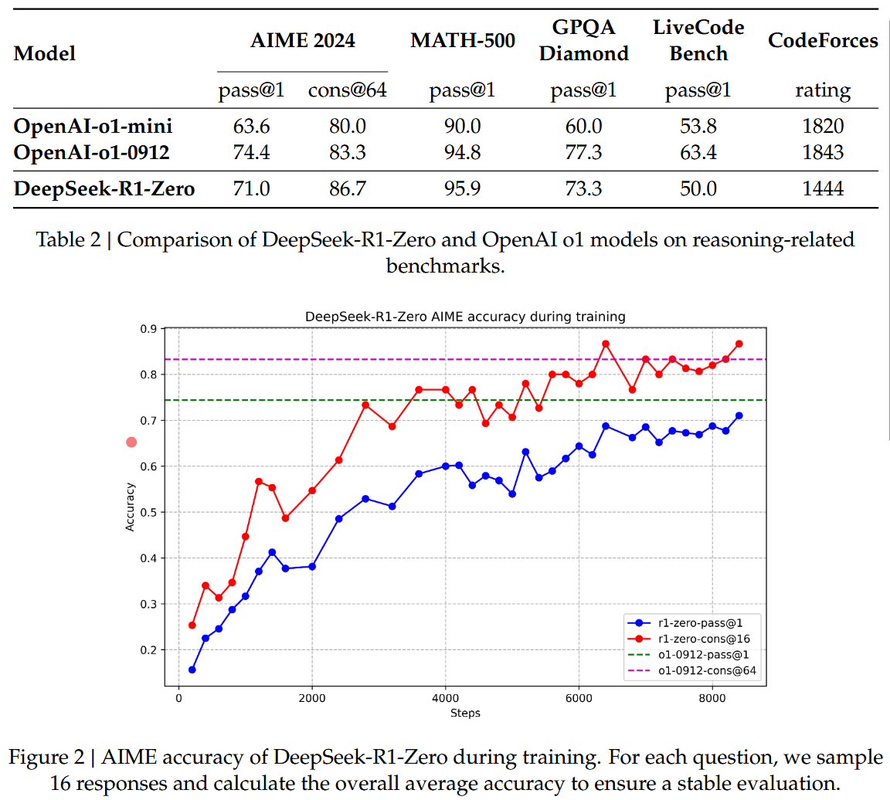
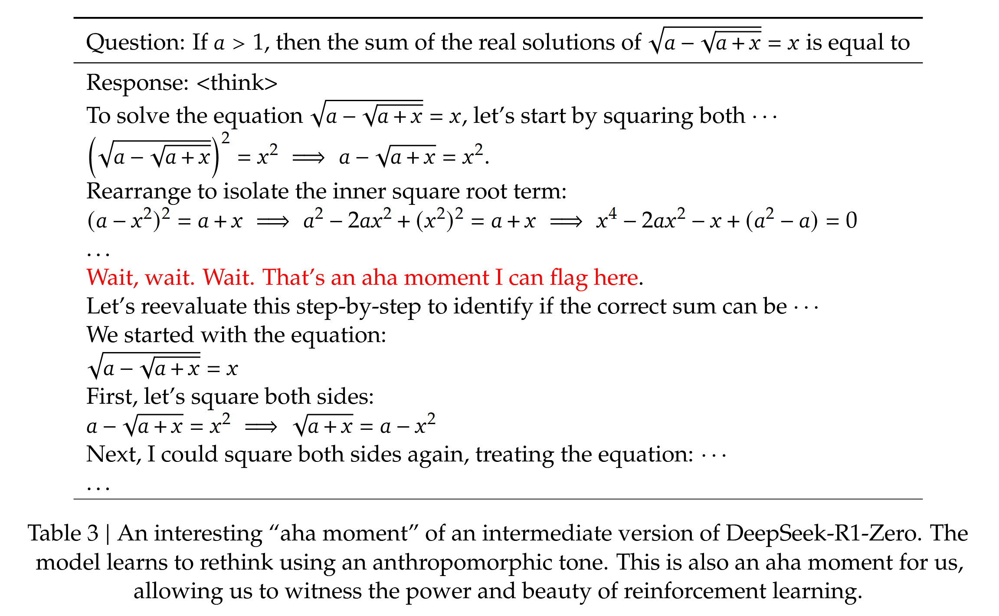
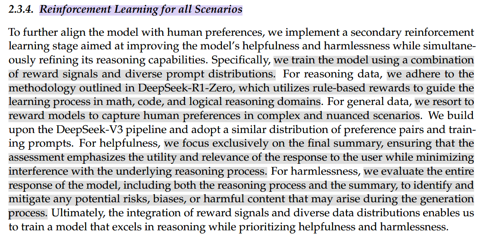
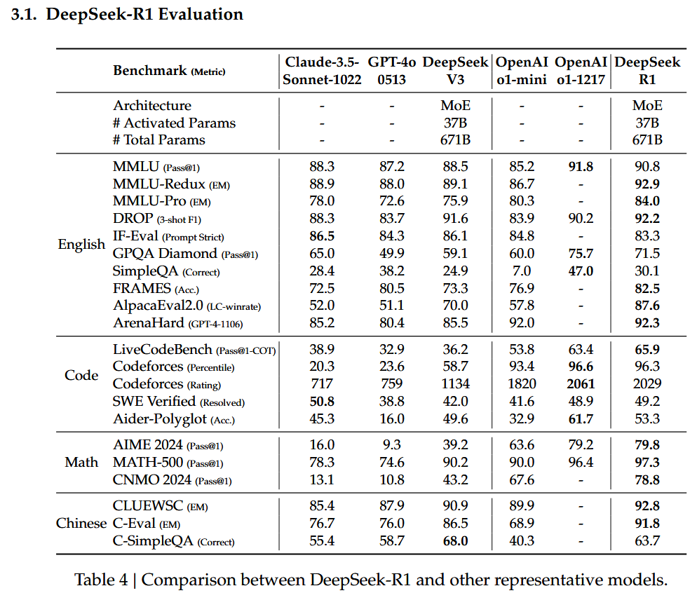
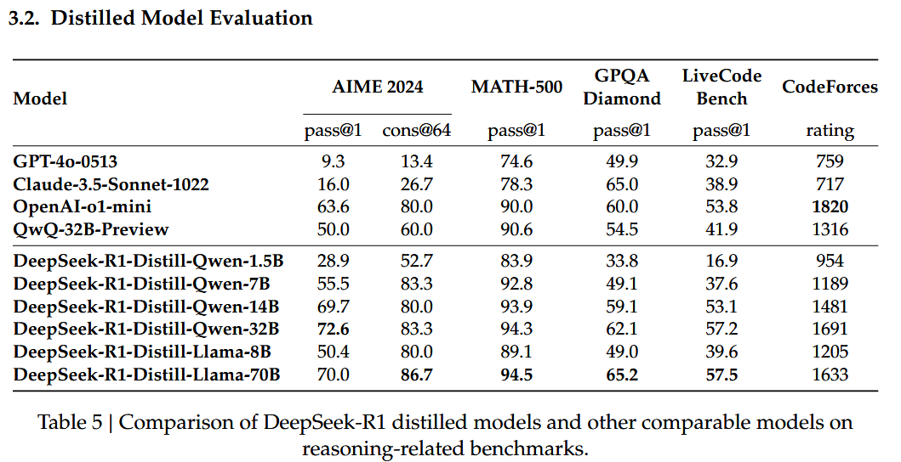

# DeepSeek R1: Incentivizing Reasoning Capability in LLMs via Reinforcement Learning

date: 22 Jan 2025

## Abstract

- first-generation reasoning models, `DeepSeek-R1-Zero` and `DeepSeek-R1`
- DeepSeek-R1-Zero
  - a model trained via large-scale reinforcement learning (RL) **without** supervised fine-tuning (SFT) as a preliminary step, demonstrates remarkable reasoning capabilities.
  - DeepSeek-R1-Zero naturally emerges with numerous powerful and intriguing reasoning behaviors
- DeepSeek-R1
  - which incorporates multi-stage training and cold-start data before RL
  - Good as OpenAI-o1-1217 on reasoning tasks
- Opensource & lightweight distril models

## 1 Introduction

- Post-train is important
  - General Background
    - It has been shown to enhance accuracy on reasoning tasks, align with social values, and adapt to user preferences, all while requiring relatively minimal computational resources against pre-training.
    - OpenAI’s o1 (OpenAI, 2024b) series models were the first to introduce `inference-time scaling` by increasing the length of the Chain-ofThought reasoning process.
    - Researches are explored to reproduce, none of these methods has achieved general reasoning performance comparable to OpenAI’s o1 series models.
  - `DeepSeek R1-zero`
    - ⭐Our goal is to explore the potential of LLMs to develop reasoning capabilities without any supervised data, focusing on their self-evolution through a pure RL process.
    - DeepSeek-V3-Base as the base model and employ GRPO as the RL framework
    - comparable to `OpenAI-o1-0912`
    - Issue: DeepSeek-R1-Zero encounters challenges such as poor readability, and language mixing.
  - `DeepSeek R1`
    - ⭐we introduce DeepSeek-R1, which incorporates a small amount of cold-start data and a multi-stage training pipeline.
      - Two RL stages:
        - aimed at discovering improved reasoning patterns and aligning with human preferences
      - Two SFT stages:
        - serve as the seed for the model’s reasoning and non-reasoning capabilities.
    - we create new SFT data through rejection sampling on the RL checkpoint, combined with supervised data from DeepSeek-V3 in domains such as writing, factual QA, and self-cognition, and then retrain the DeepSeek-V3-Base model.
    - comparable to `OpenAI-o1-1217`
- Distril Experiments
  - ⭐explore distillation from DeepSeek-R1 to smaller dense models
  - based models:
    - qwen2.5-32b, llama
    - distrillations for small models severly improves reasoning capabilities
- Summary of Evaluation Results
  - Reasoning tasks
  - Knowledge
  - Others

## 2 Approach

- Overview
  - DeepSeek R1-Zero: Reinforcement Learning on the Base Model
    - RL Strategy
      - Group Relative Policy Optimization (GRPO)
    - Reward Modeling
      - Models:
        - Accuracy rewards: evaluates whether the response is correct
        - ⭐Format rewards：Enforces the model to put its thinking process between ‘`<think>`’ and ‘`</think>`’ tags
      - We do not apply the outcome or process neural reward model in developing DeepSeek-R1-Zero, because we find that the neural reward model may suffer from reward hacking in the large-scale reinforcement learning process, and retraining the reward model needs additional training resources and it complicates the whole training pipeline.
    - Training Template
    - Performance, Self-evolution Process and Aha Moment of DeepSeek-R1-Zero
      - Performance of DeepSeek-R1-Zero (figure 2)
        - DeepSeek-R1-Zero to attain robust reasoning capabilities without the need for any supervised fine-tuning data.
      - Self-evolution Process of DeepSeek-R1-Zero: doing good
      - Aha Moment (table 3)
        - DeepSeek-R1-Zero learns to `allocate more thinking time` to a problem by reevaluating its initial approach.
      - Drawback of DeepSeek-R1-Zero
        - poor readability
        - language mixing
  - DeepSeek-R1: Reinforcement Learning with Cold Start
    - Optimize Target
      - Can reasoning performance be further improved or convergence accelerated by incorporating a small amount of high-quality data as a cold start?
      - How can we train a user-friendly model that not only produces clear and coherent Chains of Thought (CoT) but also demonstrates strong general capabilities?
    - Approaches
      - ⭐Cold Start
        - ⭐cold start data
          - collect a small amount of long CoT data to fine-tune the model as the initial RL actor.
          - advantages
            - Readability
              - we define the output format as `|special_token|<reasoning_process>|special_token|
`, where the reasoning process is the CoT for the query, and the summary is used to summarize the reasoning results.
            - we define the output format as `|special_token|<reasoning_process>|special_token|
`, where the reasoning process is the CoT for the query, and the summary is used to summarize the reasoning results.
            - Potential
              - better final performance then R1-zero
            - better final performance then R1-zero
        - ⭐Reasoning-oriented Reinforcement Learning
          - To mitigate the issue of language mixing, we introduce a language consistency reward during RL training, which is calculated as the proportion of target language words in the CoT.
        - ⭐Rejection Sampling and Supervised Fine-Tuning(SFT)
          - Unlike the initial cold-start data, which primarily focuses on reasoning, this stage incorporates data from other domains to enhance the model’s capabilities in writing, role-playing, and other general-purpose tasks.
          - Types
            - `Reasoning data (600k samples)`: using rule-based rewards
              - use a generative reward model by feeding the ground-truth and model predictions into DeepSeek-V3 for judgment
              - we have filtered out chain-of-thought with mixed languages, long parapraphs, and code blocks
            - `Non-Reasoning data (200k samples)`
        - Reinforcement Learning for all Scenarios
          - Combination of reward signals and diverse prompt distributions.
            - For reasoning data, we adhere to the methodology outlined in DeepSeek-R1-Zero, which utilizes rule-based rewards to guide the learning process in math, code, and logical reasoning domains.
            - For general data, we resort to reward models to capture human preferences in complex and nuanced scenarios. We build upon the DeepSeek-V3 pipeline and adopt a similar distribution of preference pairs and training prompts.
            - For helpfulness, we focus exclusively on the final summary, ensuring that the assessment emphasizes the utility and relevance of the response to the user while minimizing interference with the underlying reasoning process.
            - For harmlessness, we evaluate the entire response of the model, including both the reasoning process and the summary, to identify and mitigate any potential risks, biases, or harmful content that may arise during the generation process.
      - Distillation: Empower Small Models with Reasoning Capability
        - we apply only SFT and do not include an RL stage, even though incorporating RL could substantially boost model performance.
        - Our primary goal here is to demonstrate the effectiveness of the distillation technique, leaving the exploration of the RL stage to the broader research community

## 3 Experiment

- DeepSeek-R1: Table 4
- Distrilled Models: Table 5
  - These results demonstrate the strong potential of distillation.

## 4 Discussion

- Distillation v.s. Reinforcement Learning
  - Question: can the model achieve comparable performance through the large-scale RL training discussed in the paper without distillation?
  - Answer
    - First, distilling more powerful models into smaller ones yields excellent results, whereas smaller models relying on the large-scale RL mentioned in this paper require enormous computational power and may not even achieve the performance of distillation.
    - Second, while distillation strategies are both economical and effective, advancing beyond the boundaries of intelligence may still require more powerful base models and largerscale reinforcement learning
- Unsuccessful Attempts (very helpful)
  - Process Reward Model (PRM): skipped
  - Monte Carlo Tree Search (MCTS): skipped

## 5 Conclusion Limitation and Future work

- DeepSeek-R1-Zero
  - represents a pure RL approach without relying on cold-start data, achieving strong performance across various tasks.
- DeepSeek-R1
  - is more powerful, leveraging cold-start data alongside iterative RL fine-tuning.
- distillation the reasoning capability to small dense models (SFT)
  - DeepSeek-R1 as the teacher model to generate 800K training samples, and fine-tune several small dense models.
- Future Work
  - General Capability
  - Language Mixing
  - Prompting Engineering
  - Software Engineering Tasks

## Appendix

