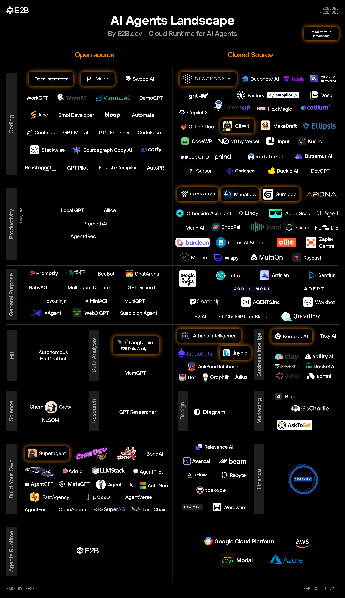

| name                                                                                                                                     | keyword | notes |
| ---------------------------------------------------------------------------------------------------------------------------------------- | ------- | ----- |
| [A Framework For Intelligent Multi-Agent System Based Neural Networks](https://arxiv.org/pdf/0910.2029)                                     |         |       |
| [A Survey on Context-Aware Multi-Agent Systems](https://arxiv.org/abs/2402.01968)                                                           |         |       |
| [Visibility into AI Agents](https://arxiv.org/abs/2401.13138)                                                                               |         |       |
| [LLM Multi-Agent Systems - Challenges and Open Problems](https://arxiv.org/abs/2402.03578)                                                 |         |       |
| [The Rise and Potential of Large Language Model Based Agents](https://arxiv.org/abs/2309.07864)                                             |         |       |
| [Agent AI: Surveying the Horizons of Multimodal Interaction](https://arxiv.org/abs/2401.03568)                                              |         |       |
| [Multi-agent Reinforcement Learning: A Comprehensive Survey](https://arxiv.org/abs/2312.10256)                                              |         |       |
| [A Survey of Progress on Cooperative Multi-agent Reinforcement Learning in Open Environment](https://arxiv.org/abs/2312.01058)              |         |       |
| [Large Language Model based Multi-Agents](https://arxiv.org/abs/2402.01680)                                                                 |         |       |
| [Mathematics of multi-agent learning systems at the interface of game theory and artificial intelligence](https://arxiv.org/abs/2403.07017) |         |       |

https://qianfan.cloud.baidu.com/appbuilder/
