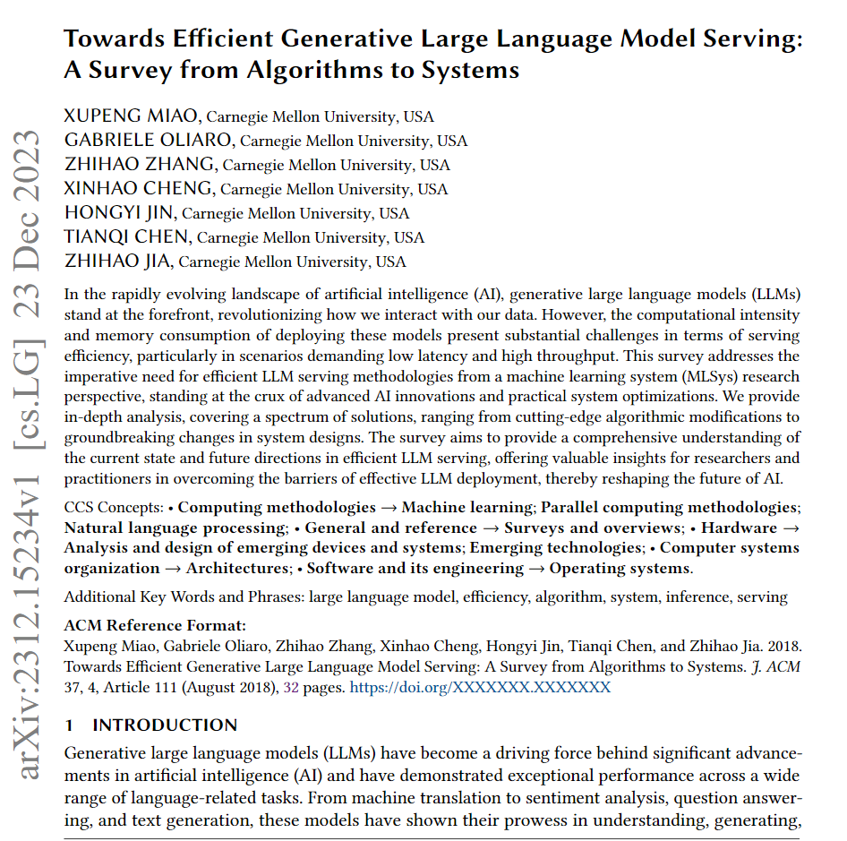
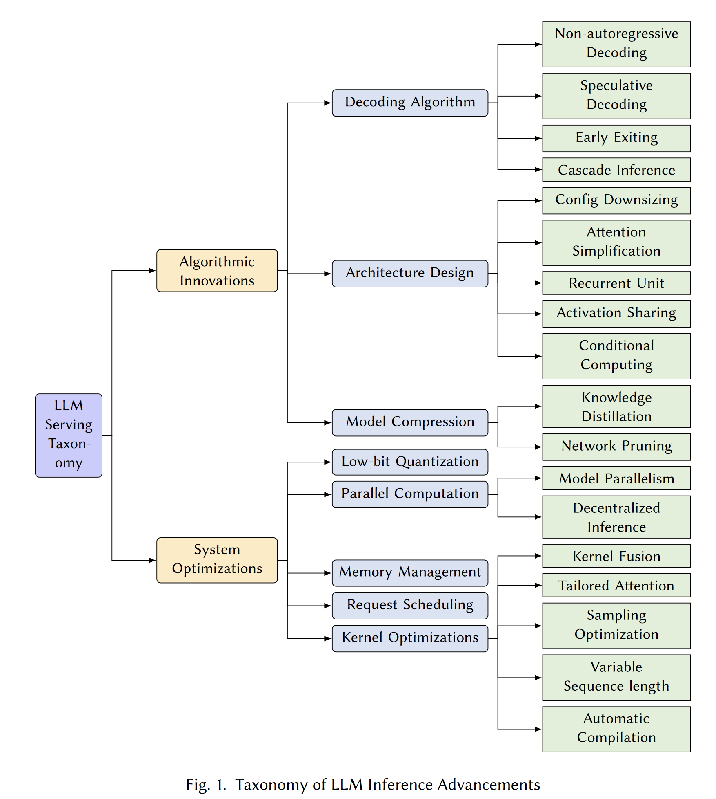
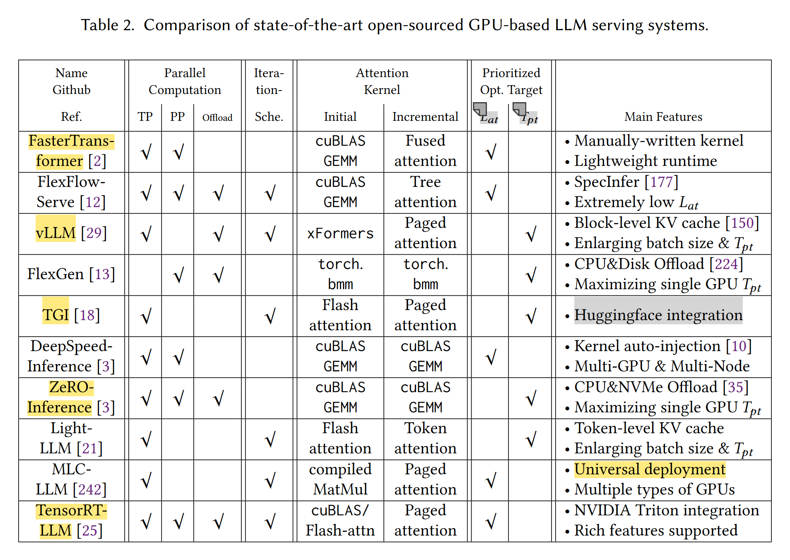

Towards Efficient Generative Large Language Model Serving A Survey from Algorithms to Systems

[https://arxiv.org/abs/2312.15234](https://arxiv.org/abs/2312.15234)

* [paper mindmap](doc/Towards_Efficient_Generative_Large_Language_Model_Serving_A_Survey_from_Algorithms_to_Systems.httpsarxiv.orgabs2312.15234.pdf)

* origin paper

