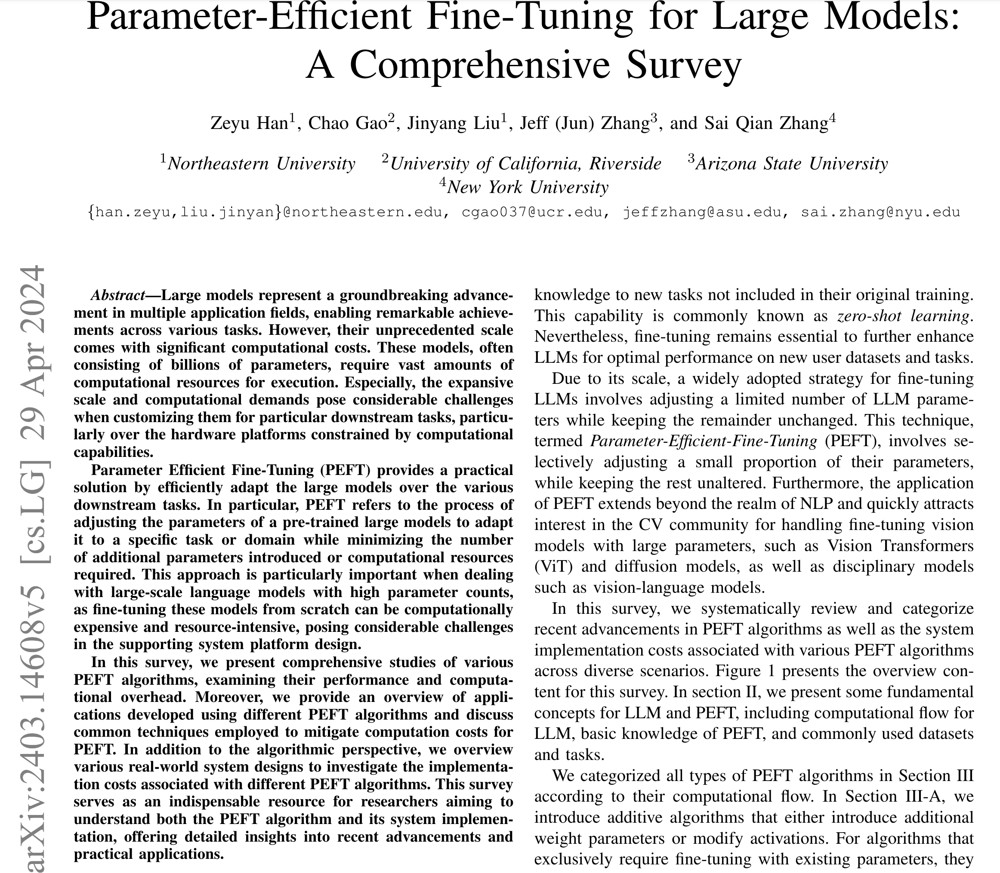
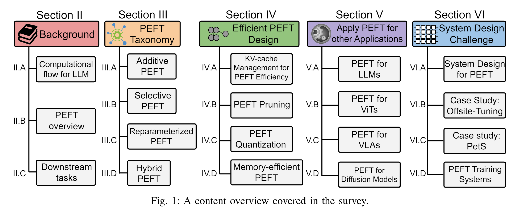
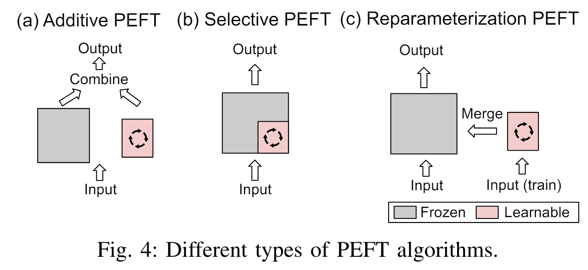
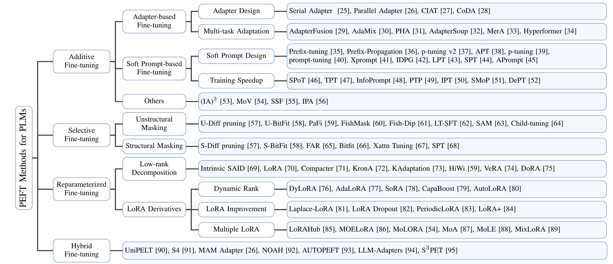
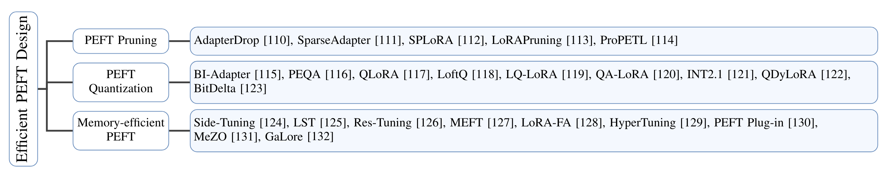
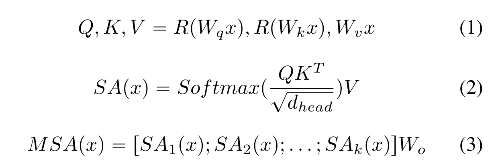
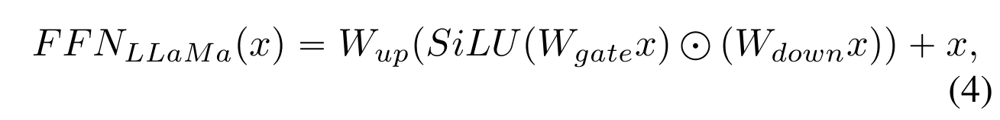
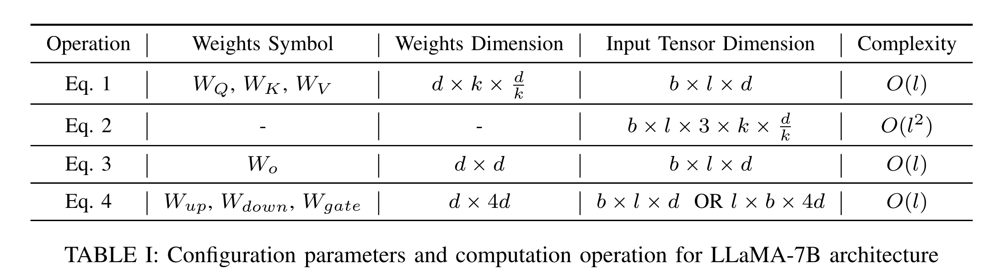

# [PEFT] Parameter-Efficient Fine-Tuning for Large Models: A Comprehensive Survey

* PEFT -> Parameter Efficient Fine-Tuning
* source: https://arxiv.org/pdf/2403.14608
* other readings: https://huggingface.co/collections/PEFT/peft-papers-6573a1a95da75f987fb873ad

